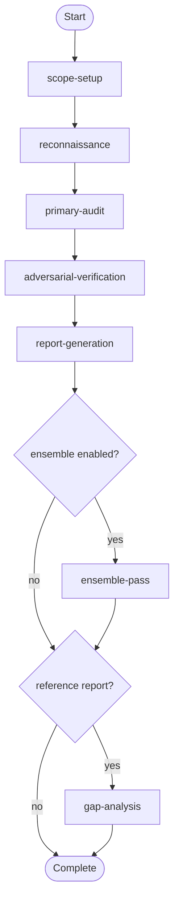
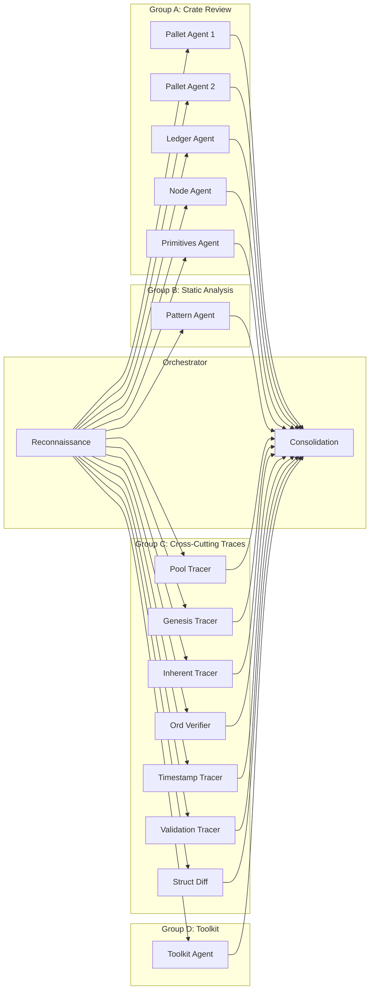

# Security Audit Workflow

> Multi-phase AI security audit for Substrate-based blockchain node codebases. Orchestrates reconnaissance, multi-agent deep review, adversarial verification, severity-calibrated reporting, optional ensemble passes, and gap analysis against professional audit reports.

## Overview

This workflow guides the complete lifecycle of a security audit:

1. **Scope Setup** — Confirm target, checkout at commit, run dependency scanning, create planning folder
2. **Reconnaissance** — Map architecture, identify crates, trust boundaries, consensus paths, build function registry
3. **Primary Audit** — Multi-agent dispatch: crate-level deep review, static analysis, cross-cutting traces, toolkit review
4. **Adversarial Verification** — Decompose and independently verify every PASS item from audit scratchpads
5. **Report Generation** — Consolidate, deduplicate, apply severity scoring, verify coverage gate, produce report
6. **Ensemble Pass** (optional) — Second-model run on priority-1/2 components, union-merge with primary results
7. **Gap Analysis** (optional) — Compare against a professional audit report for benchmarking and improvement

**Key characteristics:**
- Sequential flow with optional branches for ensemble and gap analysis
- Multi-agent execution with 4 agent groups (crate review, static analysis, cross-cutting traces, toolkit)
- Mandatory adversarial verification phase targeting false PASSes
- Impact x Feasibility severity scoring rubric
- Based on the Substrate Node Security Audit Template v2

---

## Getting Started

**To start an audit, say:** `"start security audit"` or `"audit midnight-node at commit abc123"`

### Required Inputs

| Input | Description | Example |
|-------|-------------|---------|
| **Target submodule** | Which submodule to audit | `midnight-node` |
| **Target commit** | Git commit hash (defaults to HEAD if not specified) | `d204679fea653a34fa6dccd0e6792c34a2e9937b` |

### Optional Inputs

| Input | Description | When to Use |
|-------|-------------|-------------|
| **Reference report** | Path to a professional audit report (PDF or MD) | When you want gap analysis comparing AI findings against a professional benchmark |
| **Ensemble pass** | Enable a second-model run on priority-1/2 components | When maximum coverage is needed and compute cost is acceptable |

Both optional inputs can be provided at the setup checkpoint — you don't need to specify them upfront.

### Prerequisites

- Read and follow `AGENTS.md` in the project root
- The target submodule must exist in the repository (see `.gitmodules`)

---

## Workflow Flow

---

## Primary Audit — Agent Groups

---

## Activities

### 1. Scope Setup

**Purpose:** Confirm target submodule and commit, checkout codebase, run dependency scanning, create planning folder.

**Primary Skill:** `audit-execution`
**Supporting Skill:** `artifact-management`

**Checkpoints:**
1. Target Confirmation: "Audit target: {submodule} @ {commit}. Proceed?"
2. Setup Complete: "Planning folder created, dependency scan {status}. Proceed to reconnaissance?"

**Artifacts:** `START-HERE.md`

---

### 2. Reconnaissance

**Purpose:** Map the codebase architecture, identify all crates, trust boundaries, consensus paths, and build the function registry (template §1.2).

**Primary Skill:** `audit-execution`

**Checkpoint:** "Architecture mapped: {N} crates, {M} functions in registry. Proceed to primary audit?"

**Artifacts:** `README.md` (scope and architecture summary)

---

### 3. Primary Audit

**Purpose:** Execute the multi-agent audit. Dispatches Group A (crate-level deep review), Group B (static analysis), Group C (cross-cutting traces), and Group D (toolkit review) in parallel.

**Primary Skill:** `audit-execution`

**Agent Groups:**

| Group | Agents | Scope | Checklist |
|-------|--------|-------|-----------|
| A | 1 per priority-1/2 crate | Full crate file read + §3 checklist + invariant extraction | Template §3 + §5.15 |
| B | 1 | All §2 grep patterns across full in-scope dirs | Template §2 |
| C | 5-7 trace agents | Cross-boundary issues (pools, genesis, inherents, ordering, timestamps, validation, struct diffs) | Template §3.4, §3.5, §3.10 |
| D | 1 | ledger/helpers/ + util/toolkit/ | Toolkit minimum checklist (resource 03) |

**Checkpoint:** "Primary audit complete. {N} findings, {M} PASS items pending verification. Proceed?"

---

### 4. Adversarial Verification

**Purpose:** Verify every High/Medium PASS item from audit scratchpads by decomposing each claim into constituent properties and independently verifying each one. The agent's role is to **refute**, not confirm.

**Primary Skill:** `audit-execution`

**Steps:**
1. Extract PASS items from all scratchpads (§3.1-§3.4, §3.6, §3.10)
2. Decompose each PASS into constituent properties
3. Verify each property independently against source code
4. Output: CONFIRMED / REFUTED / INSUFFICIENT

**Checkpoint:** "{N} confirmed, {M} refuted, {K} insufficient. Proceed to report?"

---

### 5. Report Generation

**Purpose:** Consolidate all findings, apply severity scoring rubric, verify coverage gate, produce final report.

**Primary Skill:** `audit-execution`
**Supporting Skill:** `severity-scoring`

**Steps:**
1. Merge primary + adversarial findings
2. Deduplicate by root cause
3. Apply Impact x Feasibility severity scoring (resource 02)
4. Verify coverage gate (§5.14)
5. Verify scratchpad elevation (§5.12)
6. Write `01-audit-report.md`

**Checkpoint:** "Report generated: {N} findings. Coverage: {status}. Finalize?"

**Artifacts:** `01-audit-report.md`

---

### 6. Ensemble Pass (Optional)

**Purpose:** Run the template a second time with a different model configuration on priority-1/2 components. Union-merge with primary results.

**Condition:** `ensemble_enabled == true`

**Merge Strategy:**
- Finding in both runs: high confidence, median severity
- Finding in one run only: include, flag as single-source
- PASS in primary but FAIL in ensemble: escalate as new finding

---

### 7. Gap Analysis (Optional)

**Purpose:** Compare the AI audit report against a professional reference report. Produce finding-by-finding mapping, identify gaps, analyze severity calibration, and provide root cause analysis.

**Condition:** `has_reference_report == true`

**Artifacts:** `02-gap-analysis.md`

---

## Skills

| Skill | Capability | Used By |
|-------|------------|---------|
| `audit-execution` | Core audit execution patterns, agent dispatch, tool usage | All activities |
| `severity-scoring` | Impact x Feasibility severity rubric with calibration examples | report-generation, ensemble-pass |

---

## Resources

| Resource | Purpose |
|----------|---------|
| `00-start-here.md` | Quick start guide and workflow overview |
| `01-audit-template-reference.md` | Pointer to the audit prompt template with section summary |
| `02-severity-rubric.md` | Detailed severity scoring guide with calibration examples |
| `03-toolkit-checklist.md` | Mandatory 7-item toolkit minimum checklist |

---

## Variables

| Variable | Type | Description |
|----------|------|-------------|
| `target_submodule` | string | Path to the submodule being audited |
| `target_commit` | string | Git commit hash to audit |
| `planning_folder_path` | string | Path to planning artifacts folder |
| `template_path` | string | Path to the audit prompt template |
| `reference_report_path` | string | Path to professional audit report (optional) |
| `ensemble_enabled` | boolean | Whether to run ensemble pass (default: false) |
| `has_reference_report` | boolean | Whether gap analysis is available (default: false) |
| `cargo_audit_available` | boolean | Whether cargo audit ran successfully |
| `reconnaissance_complete` | boolean | Phase 1a gate |
| `primary_audit_complete` | boolean | Phase 1b gate |
| `adversarial_complete` | boolean | Phase 2 gate |
| `report_complete` | boolean | Phase 3 gate |

---

## Expected Artifacts

| Phase | Artifact | Description |
|-------|----------|-------------|
| Setup | `START-HERE.md` | Session overview and navigation |
| Reconnaissance | `README.md` | Scope, methodology, crate inventory |
| Report | `01-audit-report.md` | Full audit report with numbered findings |
| Gap Analysis | `02-gap-analysis.md` | Comparison against reference report |
| Setup | `cargo-audit-output.txt` | Dependency scan results (if tools available) |
| Setup | `file-inventory.txt` | Source files sorted by line count |
