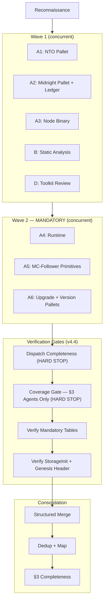
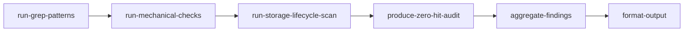
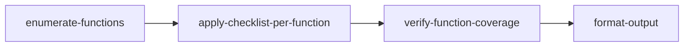
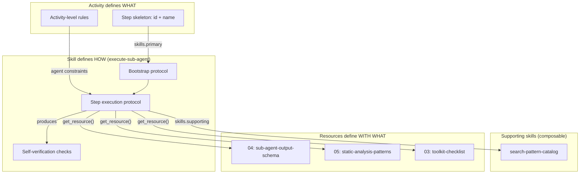

# Security Audit Workflow

> Multi-phase AI security audit for Substrate-based blockchain node codebases. Orchestrates reconnaissance, wave-based workflow-directed multi-agent deep review, adversarial verification, severity-calibrated reporting, optional ensemble passes, and gap analysis against professional audit reports.

**Version:** 4.4.0

## Overview

This workflow guides the complete lifecycle of a security audit:

1. **Scope Setup** — Confirm target, checkout at commit, run dependency scanning, create planning folder
2. **Reconnaissance** — Map architecture, identify crates, trust boundaries, consensus paths, build function registry, assign agent groups
3. **Primary Audit** — Wave-based concurrent dispatch: Group A (one crate-level deep review agent per priority-1/2 crate), Group B (static analysis and mechanical checks), Group D (toolkit review). Each sub-agent follows a dedicated workflow activity via the workflow-server MCP. Includes hard-gate coverage verification before consolidation.
4. **Adversarial Verification** — Decompose and independently verify every PASS item from agent scratchpads
5. **Report Generation** — Consolidate all phases, apply severity scoring with calibration cross-check, verify coverage gate (blocking), produce report
6. **Ensemble Pass** (optional) — Second-model run on priority-1/2 components, union-merge with primary results
7. **Gap Analysis** (optional) — Compare against a professional audit report for benchmarking and improvement

**Key characteristics:**
- Fully automated sequential flow — no user checkpoints (phase gates via exitActions)
- **Goal → Activity → Skill → Tools** ontology: activities define step skeletons with activity-level rules; skills define tool orchestration and protocols; resources contain detailed reference content (progressive disclosure)
- Workflow-directed sub-agents: each sub-agent bootstraps the workflow-server MCP, loads its assigned activity and the `execute-sub-agent` skill, which follows activity steps sequentially with verifiable outputs
- **Composable skill architecture** — 15 single-responsibility skills: orchestrator skills (`execute-audit`, `dispatch-sub-agents`, `verify-sub-agent-output`, `merge-findings`), analysis skills (`apply-checklist`, `build-function-registry`, `extract-invariants`, `scan-storage-lifecycle`, `decompose-safety-claims`, `map-codebase`), and sub-agent skills (`execute-sub-agent`, `search-pattern-catalog`)
- **Wave-based dispatch with mandatory completion** — agents dispatched in waves of 3–5 when the platform limits concurrency. Wave 1 includes highest-priority Group A agents, Group B, AND Group D (v4.4: Group D moved to Wave 1). Wave 2 includes remaining Group A agents and is MANDATORY — skipping Wave 2 is a hard stop violation.
- **Dispatch completeness gate (v4.4)** — every crate assigned to a Group A agent during reconnaissance must have a corresponding dispatched sub-agent. Reconnaissance reads do not substitute for §3-applying agents. Validated: skipping this gate caused 11–19pp coverage regression in two sessions.
- **Coverage gate hard stop** — report generation blocked until every >200-line file in priority-1/2 crates is confirmed read by a **§3-applying Group A sub-agent** (not a reconnaissance agent, not the orchestrator)
- **Mandatory output verification** — orchestrator validates that each Group A agent produced required tables (§3.3 per-field trace + struct diff, §3.5 StorageInit + genesis header construction, cross-function invariant comparison) before consolidation
- **Orchestrator role discipline** — the orchestrator coordinates and dispatches but does not perform crate-level review itself
- **Mechanical pattern coverage** — Group B checks must cover ledger internal API files; zero hits on serialization checks in the ledger directory is a possible false negative
- **Ensemble execution verification (v4.4)** — when ensemble is enabled, the pass must produce a verifiable `second-pass-findings` artifact; declaring completion without execution violates the workflow
- Impact x Feasibility severity scoring via `score-severity` skill with resource-backed calibration examples
- Contamination prevention — reference report quarantined until gap-analysis phase
- Structured merge table with mandatory elevation verification
- §3 checklist completeness verification with gap-filling follow-up
- Based on the Substrate Node Security Audit Template

---

## Getting Started

**To start an audit, say:** `"start security audit"` or `"audit midnight-node at commit abc123"`

### Required Inputs

| Input | Description | Example |
|-------|-------------|---------|
| **Target submodule** | Which submodule to audit | `midnight-node` |
| **Target commit** | Git commit hash (defaults to HEAD if not specified) | `abc1234...` |

### Optional Inputs

| Input | Description | When to Use |
|-------|-------------|-------------|
| **Ensemble pass** | Enable a second-model run on priority-1/2 components | When maximum coverage is needed and compute cost is acceptable |
| **Reference report** | Path to a professional audit report (PDF or MD) | When you want gap analysis comparing AI findings against a professional benchmark |

The ensemble option can be enabled at the setup checkpoint. The reference report is requested **only after the report is finalized** (Phase 5) — it is never loaded during the audit itself to avoid contaminating the results with known issues.

### Prerequisites

- Read and follow `AGENTS.md` in the project root
- The target submodule must exist in the repository (see `.gitmodules`)

---

## Workflow Flow

---

## Primary Audit — Wave-Based Agent Dispatch

When the platform limits concurrent sub-agents (e.g., max 5), agents are dispatched in waves. Wave 2 dispatch is **mandatory** — skipping it is a hard stop violation (validated: S12 and S14 regressions).

> **v4.4 changes:** Group D moved to Wave 1 to ensure toolkit review is never deferred. Wave 2 covers remaining Group A crates and is explicitly mandatory. The dispatch completeness gate verifies every assigned agent was dispatched before allowing consolidation. The coverage gate now requires files to be read by §3-applying Group A agents — reconnaissance reads do not count.

### Verification Gates (v4.4)

Between agent collection and consolidation, the orchestrator runs four verification gates. These are hard stops — the audit does not proceed to structured merge with failures.

| Gate | What It Checks | Failure Action |
|------|---------------|----------------|
| **Dispatch Completeness** (v4.4) | Every agent assigned during reconnaissance was dispatched and returned structured output. `agents_dispatched == agents_assigned`. | HARD STOP — dispatch missing agents before proceeding |
| **Coverage Gate** (v4.4: §3-agent distinction) | Every `.rs` file >200 lines in priority-1/2 crates was read by a **§3-applying Group A sub-agent**. Files read only during reconnaissance do not satisfy this gate. | Dispatch targeted Group A follow-up agents for RECON-ONLY files |
| **Mandatory Tables** | Each Group A agent produced: §3 checklist table, per-field event trace table AND struct diff table (§3.3 if applicable), cross-function invariant table. Group D produced: function enumeration table, per-function checklist matrix, coverage attestation. | Dispatch targeted follow-up for missing tables |
| **StorageInit + Genesis Header** (v4.4: expanded) | The node agent (A3) enumerated every `StorageInit` construction site covering both online and offline subcommand paths, AND checked genesis header construction for feature-gated digest items | Dispatch targeted follow-up for §3.5 |

These gates are hard stops — skipping them risks significant coverage regression. Validated: S12 (93%→82%) and S14 (93%→74%) regressions were directly caused by proceeding with failed or bypassed gates.

### Sub-Agent Activity Flows

Each sub-agent bootstraps the workflow-server, loads its assigned activity and the `execute-sub-agent` skill. The skill defines the bootstrap protocol and step execution — sub-agents follow activity steps sequentially with verifiable outputs.

#### `sub-crate-review` (Group A — one per crate)

#### `sub-static-analysis` (Group B — single agent)

Uses the `search-pattern-catalog` supporting skill for catalog-based pattern execution. Mechanical checks include preallocation mismatch, mock data source toggle, SmallRng/block-hash-derived randomness search. Ledger internal API coverage is required for serialization checks.

#### `sub-toolkit-review` (Group D — single agent, mandatory)

The orchestrator rejects prose summaries lacking the three required structured tables (function enumeration, checklist matrix, coverage attestation). Includes function count cross-verification and mandatory subdirectory coverage.

### Sub-Agent Ontology: Activity → Skill → Resources

| Group | Activity | Primary Skill | Supporting Skills | Resources Loaded | Key Outputs |
|-------|----------|--------------|-------------------|-----------------|-------------|
| A (per crate) | `sub-crate-review` | `execute-sub-agent` | — | `04` (output schema) | Findings, checklist coverage, mandatory tables |
| B (1 agent) | `sub-static-analysis` | `execute-sub-agent` | `search-pattern-catalog` | `04` (output schema), `05` (static analysis patterns) | Pattern hits, storage pairing, zero-hit audit |
| D (1 agent) | `sub-toolkit-review` | `execute-sub-agent` | — | `03` (toolkit checklist), `04` (output schema) | Function x checklist matrix, coverage attestation |

---

## Activities

### 1. Scope Setup

**Purpose:** Confirm target submodule and commit, checkout codebase, run dependency scanning, create planning folder.

**Primary Skill:** `execute-audit`
**Supporting Skill:** `artifact-management`

**Steps (8):** confirm-target → confirm-commit → record-reference → checkout-submodule → run-cargo-audit → create-file-inventory → create-planning-folder → load-template

**Artifacts:** `START-HERE.md`

---

### 2. Reconnaissance

**Purpose:** Map the codebase architecture, identify all crates, trust boundaries, consensus paths, and build the function registry (template §1.2). Assign crates to sub-agent groups with cross-crate supplement mappings.

**Primary Skill:** `execute-audit`

**Steps (9):** identify-crates → map-architecture → identify-trust-boundaries → identify-consensus-paths → identify-pallet-hooks → map-data-flows → check-send-sync → build-function-registry → assign-agent-groups

**Artifacts:** `README.md` (scope and architecture summary)

---

### 3. Primary Audit

**Purpose:** Execute the multi-agent audit via wave-based dispatch. Includes hard-gate verification steps before consolidation.

**Primary Skill:** `execute-audit`

**Agent Groups:**

| Group | Agents | Activity | Scope |
|-------|--------|----------|-------|
| A | 1 per priority-1/2 crate (~6 agents) | `sub-crate-review` | Full crate file read + §3 checklist + invariant extraction + cross-function comparison. Cross-crate checks via supplementary files. |
| B | 1 | `sub-static-analysis` | All §2 grep patterns + mechanical checks (incl. preallocation mismatch, mock toggle, SmallRng) + storage lifecycle pairing |
| D | 1 (MANDATORY) | `sub-toolkit-review` | ledger/helpers/ and util/toolkit/ with 7-item mandatory checklist applied per-function. Must produce structured tables. |

**Steps (10):**
1. `dispatch-wave-1` — Highest-priority Group A agents (NTO, midnight+ledger, node) + Group B + **Group D** (v4.4: moved to Wave 1)
2. `dispatch-wave-2` — Remaining Group A agents (runtime, mc-follower, upgrade). **MANDATORY** — skipping is a hard stop violation.
3. `verify-dispatch-completeness` — **HARD STOP (v4.4)**: confirm `agents_dispatched == agents_assigned`
4. `collect-all` — Wait for all sub-agents from both waves
5. `verify-coverage-gate` — **HARD STOP**: confirm every >200-line file was read by §3-applying agents
6. `verify-mandatory-tables` — Confirm Group A produced required tables (incl. struct diff); Group D produced function matrix
7. `verify-storageinit-trace` — Confirm node agent traced StorageInit sites + genesis header construction
8. `structured-merge` — Flat table of all findings
9. `dedup-and-map` — Assign report finding numbers
10. `verify-checklist-completeness` — §3 coverage matrix with gap-filling follow-up

**Consolidation:** Steps 3 and 5–7 are verification gates that run between agent dispatch and the structured merge. Any failure triggers targeted follow-up agent dispatch before proceeding.

---

### 4. Adversarial Verification

**Purpose:** Verify every High/Medium PASS item from audit scratchpads by decomposing each claim into constituent properties and independently verifying each one. The agent's role is to **refute**, not confirm.

**Primary Skill:** `execute-audit`

**Steps (5):**
1. Extract PASS items from all scratchpads (§3.1-§3.4, §3.6, §3.10, §3.14)
2. Decompose each PASS into constituent properties
3. Enumerate multi-site properties (per-field for events, per-layer for pagination/timestamps)
4. Verify each property independently — output CONFIRMED / REFUTED / INSUFFICIENT
5. Compile verification results

---

### 5. Report Generation

**Purpose:** Consolidate all findings from primary audit and adversarial verification. Apply severity scoring with calibration cross-check. Verify coverage gate (blocking). Produce final report.

**Primary Skill:** `execute-audit`
**Supporting Skill:** `score-severity`

**Blocking entry condition:** This activity must not begin unless the coverage gate passed during primary-audit. If `coverage_report` shows any unread files, return to primary-audit and dispatch follow-up agents first.

**Steps (6):**
1. Integrate adversarial results into structured merge table
2. Apply Impact × Feasibility severity scoring (resource 02)
3. Run severity calibration cross-check against calibration examples
4. **Verify coverage gate (BLOCKING)**: every >200-line file read — do not proceed to write-report if any file was missed
5. Verify elevation completeness via structured merge table
6. Write `01-audit-report.md`

**Artifacts:** `01-audit-report.md`

---

### 6. Ensemble Pass (Optional)

**Purpose:** Run the template a second time with a different model configuration on priority-1/2 components. Union-merge with primary results.

**Condition:** `ensemble_enabled == true`

**Execution verification (v4.4):** The ensemble must actually dispatch sub-agents and produce a `second-pass-findings.md` artifact in the planning folder. Declaring completion without execution violates the workflow. If context constraints prevent a full second pass, a reduced-scope pass (top 3–5 files) is always preferable to skipping entirely.

**Merge Strategy:**
- Finding in both runs: high confidence, median severity
- Finding in one run only: include, flag as single-source
- PASS in primary but FAIL in ensemble: escalate as new finding

**Artifacts:** `second-pass-findings.md`

---

### 7. Gap Analysis (Optional)

**Purpose:** Compare the AI audit report against a professional reference report. Produce finding-by-finding mapping, identify gaps, analyze severity calibration, and provide root cause analysis.

**Condition:** `has_reference_report == true`

**Artifacts:** `02-gap-analysis.md`

---

### Sub-Agent Activities

These activities are dispatched by the orchestrator during the primary-audit phase. They do not appear in the main workflow transition graph.

| Activity | Used By | Description |
|----------|---------|-------------|
| `sub-crate-review` | Group A | 8-step structured crate review: file reading → function registry → invariant extraction → §3 checklist → mandatory tables → cross-function comparison → completeness verification → structured output |
| `sub-static-analysis` | Group B | 6-step structured static analysis with catalog-based pattern execution via `search-pattern-catalog` skill, zero-hit auditing, storage lifecycle pairing, and mechanical checks (preallocation mismatch, mock toggle, SmallRng). Requires ledger internal API coverage. |
| `sub-toolkit-review` | Group D | Per-function 7-item checklist application across all toolkit files with function × checklist matrix. Output format strictly enforced — prose without structured tables is rejected. |

---

## Skills

Skills define tool orchestration, protocols, and composable capabilities. They are organized into three tiers: orchestrator skills (used by main activities), analysis skills (composable capabilities invoked during execution), and sub-agent skills (used by dispatched agents).

### Orchestrator Skills

| Skill | Capability | Used By |
|-------|------------|---------|
| `execute-audit` | Orchestrator-level audit execution: 5-phase execution pattern, agent dispatch coordination, tool usage, consolidation | All orchestrator activities (scope-setup through gap-analysis) |
| `score-severity` | Impact × Feasibility severity scoring with calibration examples and bias correction | report-generation, ensemble-pass |
| `dispatch-sub-agents` | Compose sub-agent Task prompts with workflow-server bootstrap instructions, context variables, and supplementary files; dispatch concurrently within platform limits; **verify dispatch completeness** (v4.4) | primary-audit (wave dispatch) |
| `verify-sub-agent-output` | Validate sub-agent results against structural completeness requirements, check **dispatch completeness** and **§3-agent coverage gates** (v4.4), verify mandatory tables, flag or re-dispatch on failure | primary-audit (verification gates) |
| `merge-findings` | Concatenate finding lists from multiple sources into a canonical flat table, deduplicate by root cause, assign report finding numbers, verify elevation completeness | primary-audit (consolidation), ensemble-pass (union-merge) |
| `compare-finding-sets` | Finding-by-finding mapping between two finding sets, classify matches/partials/gaps, analyze severity calibration differences, root cause analysis | gap-analysis |

### Analysis Skills (Composable)

| Skill | Capability | Used By |
|-------|------------|---------|
| `apply-checklist` | Iterate items against checklist entries, produce verdict matrix, verify completeness. Handles §3 checklist and toolkit checklist. | primary-audit, sub-crate-review, sub-toolkit-review |
| `build-function-registry` | Enumerate all functions by type (hooks, extrinsics, public fns, storage, events) and assign priority classifications | reconnaissance, sub-crate-review |
| `extract-invariants` | Enumerate preconditions, postconditions, cross-function invariants, and data source invariants for priority functions | sub-crate-review |
| `scan-storage-lifecycle` | Find all storage map insert/remove sites, verify pairing, check capacity enforcement, optional invariant consistency | sub-static-analysis |
| `decompose-safety-claims` | Decompose PASS verdicts into constituent properties, enumerate all instances, produce decomposition table for independent verification | adversarial-verification |
| `map-codebase` | Enumerate, classify, and trace components to build a structured architectural map (component inventory, trust boundaries, critical paths, data flows) | reconnaissance |
| `setup-audit-target` | Extract and validate target codebase at a specific revision, run dependency scanning, generate file inventory | scope-setup |
| `search-pattern-catalog` | Execute every pattern in a catalog section against a codebase scope, apply per-pattern triage, classify zero-hit patterns | sub-static-analysis (supporting skill) |

### Sub-Agent Skills

| Skill | Capability | Used By |
|-------|------------|---------|
| `execute-sub-agent` | Bootstrap workflow-server, load assigned activity, follow steps sequentially, return structured output with self-verification | All sub-agent activities (sub-crate-review, sub-static-analysis, sub-toolkit-review) |

> **Note:** There is a duplicate skill file `03-pattern-catalog-search.toon` alongside `03-search-pattern-catalog.toon`. Both have identical content. The canonical name is `search-pattern-catalog`.

---

## Resources

Resources contain detailed reference content loaded on demand by skills. Activities never reference resources directly — skills determine which resources to load.

| Index | Resource | Content | Loaded By |
|-------|----------|---------|-----------|
| `00` | `start-here.md` | Quick start guide and workflow overview | Orchestrator bootstrap |
| `01` | `audit-template-reference.md` | Pointer to the audit prompt template with section summary | Orchestrator setup |
| `02` | `severity-rubric.md` | Impact/Feasibility scales, severity mapping table | `score-severity` skill |
| `03` | `toolkit-checklist.md` | Mandatory 7-item toolkit minimum checklist | `execute-sub-agent` skill (for `sub-toolkit-review`) |
| `04` | `sub-agent-output-schema.md` | Structured JSON output schema with per-group field requirements and validation rules | `execute-sub-agent` skill (all activities) |
| `05` | `static-analysis-patterns.md` | §2 grep patterns, mechanical checks, and storage lifecycle patterns | `search-pattern-catalog` skill (for `sub-static-analysis`) |

---

## Variables

| Variable | Type | Description |
|----------|------|-------------|
| `target_submodule` | string | Path to the submodule being audited |
| `target_commit` | string | Git commit hash to audit |
| `in_scope` | string | Space-separated list of crate/module paths to audit |
| `out_of_scope` | string | Space-separated list of exclusions |
| `planning_folder_path` | string | Path to planning artifacts folder |
| `template_path` | string | Path to the audit prompt template |
| `reference_report_path` | string | Path to professional audit report (optional) |
| `ensemble_enabled` | boolean | Whether to run ensemble pass (default: false) |
| `has_reference_report` | boolean | Whether gap analysis is available (default: false) |
| `cargo_audit_available` | boolean | Whether cargo audit ran successfully |
| `reconnaissance_complete` | boolean | Phase 1a gate |
| `primary_audit_complete` | boolean | Phase 1b gate |
| `panic_sweep_complete` | boolean | Phase 1.5 gate |
| `adversarial_complete` | boolean | Phase 2 gate |
| `report_complete` | boolean | Phase 3 gate |
| `agents_assigned` | number | Count of agents assigned during reconnaissance (v4.4) |
| `agents_dispatched` | number | Count of agents actually dispatched across all waves (v4.4) |
| `dispatch_complete` | boolean | All assigned agents dispatched and returned (v4.4) |

---

## Expected Artifacts

| Phase | Artifact | Description |
|-------|----------|-------------|
| Setup | `START-HERE.md` | Session overview and navigation |
| Setup | `cargo-audit-output.txt` | Dependency scan results (if tools available) |
| Setup | `file-inventory.txt` | Source files sorted by line count |
| Reconnaissance | `README.md` | Scope, methodology, crate inventory |
| Report | `01-audit-report.md` | Full audit report with numbered findings |
| Ensemble | `second-pass-findings.md` | Raw findings from second-pass run (v4.4: required artifact when ensemble enabled) |
| Gap Analysis | `02-gap-analysis.md` | Comparison against reference report |

See [CHANGELOG.md](CHANGELOG.md) for version history.
