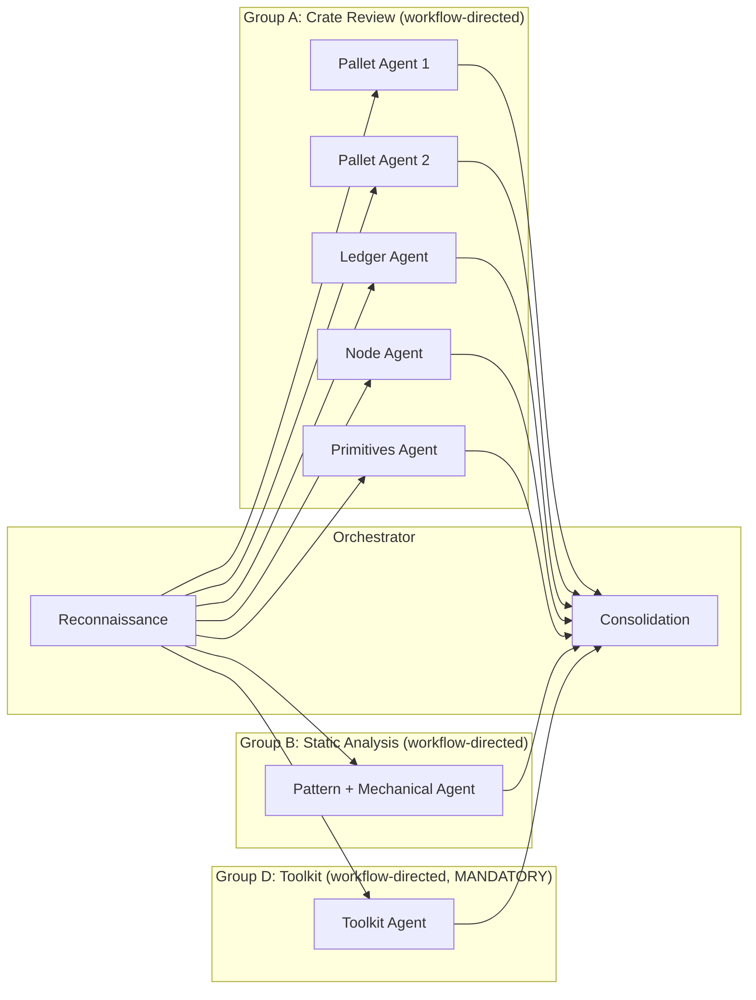

# Security Audit Workflow

> Multi-phase AI security audit for Substrate-based blockchain node codebases. Orchestrates reconnaissance, workflow-directed multi-agent deep review, adversarial verification, severity-calibrated reporting, optional ensemble passes, and gap analysis against professional audit reports.

## Overview

This workflow guides the complete lifecycle of a security audit:

1. **Scope Setup** — Confirm target, checkout at commit, run dependency scanning, create planning folder
2. **Reconnaissance** — Map architecture, identify crates, trust boundaries, consensus paths, build function registry, assign agent groups
3. **Primary Audit** — Concurrent workflow-directed multi-agent dispatch: crate-level deep review (Group A), static analysis and mechanical checks (Group B), toolkit review (Group D). Each sub-agent follows a dedicated workflow activity via the workflow-server MCP.
4. **Adversarial Verification** — Decompose and independently verify every PASS item from agent scratchpads
5. **Report Generation** — Consolidate all phases, apply severity scoring with calibration cross-check, verify coverage gate, produce report
6. **Ensemble Pass** (optional) — Second-model run on priority-1/2 components, union-merge with primary results
7. **Gap Analysis** (optional) — Compare against a professional audit report for benchmarking and improvement

**Key characteristics:**
- Fully automated sequential flow — no user checkpoints (phase gates via exitActions)
- **Goal → Activity → Skill → Tools** ontology: activities define step skeletons, skills define tool orchestration and resource loading, resources contain detailed content (progressive disclosure)
- Workflow-directed sub-agents: each sub-agent bootstraps the workflow-server MCP, loads its assigned activity and the `sub-agent-execution` skill, which maps activity steps to resources loaded on demand
- 3 concurrent agent groups (A, B, D) dispatched in parallel
- Impact x Feasibility severity scoring via `severity-scoring` skill with resource-backed calibration examples
- Contamination prevention — reference report quarantined until gap-analysis phase
- Structured merge table with mandatory elevation verification
- §3 checklist completeness verification with gap-filling follow-up
- Based on the Substrate Node Security Audit Template

---

## Getting Started

**To start an audit, say:** `"start security audit"` or `"audit midnight-node at commit abc123"`

### Required Inputs

| Input | Description | Example |
|-------|-------------|---------|
| **Target submodule** | Which submodule to audit | `midnight-node` |
| **Target commit** | Git commit hash (defaults to HEAD if not specified) | `abc1234...` |

### Optional Inputs

| Input | Description | When to Use |
|-------|-------------|-------------|
| **Ensemble pass** | Enable a second-model run on priority-1/2 components | When maximum coverage is needed and compute cost is acceptable |
| **Reference report** | Path to a professional audit report (PDF or MD) | When you want gap analysis comparing AI findings against a professional benchmark |

The ensemble option can be enabled at the setup checkpoint. The reference report is requested **only after the report is finalized** (Phase 5) — it is never loaded during the audit itself to avoid contaminating the results with known issues.

### Prerequisites

- Read and follow `AGENTS.md` in the project root
- The target submodule must exist in the repository (see `.gitmodules`)

---

## Workflow Flow

---

## Primary Audit — Agent Groups

> All groups dispatch concurrently. Each sub-agent follows a dedicated workflow activity via the workflow-server MCP and returns structured output conforming to the sub-agent output schema.

### Workflow-Directed Sub-Agent Dispatch

Each sub-agent is instructed to bootstrap the workflow-server, load its assigned activity and the `sub-agent-execution` skill. The skill's `resource_map` directs which resources to load for each activity's steps — sub-agents never need to know resource indices directly.

| Group | Activity | Skill | Steps | Key Outputs |
|-------|----------|-------|-------|-------------|
| A (per crate) | `sub-crate-review` | `sub-agent-execution` | 8 steps: read files → function registry → invariant extraction → §3 checklist → mandatory tables → cross-function comparison → completeness → output | Findings, checklist coverage, mandatory tables |
| B (1 agent) | `sub-static-analysis` | `sub-agent-execution` | 6 steps: §2 patterns → mechanical checks → storage lifecycle → zero-hit audit → aggregation → output | Pattern hits, storage pairing table, zero-hit patterns |
| D (1 agent) | `sub-toolkit-review` | `sub-agent-execution` | 4 steps: enumerate functions → per-function checklist → coverage verification → output | Function × checklist matrix, coverage attestation |

---

## Activities

### 1. Scope Setup

**Purpose:** Confirm target submodule and commit, checkout codebase, run dependency scanning, create planning folder.

**Primary Skill:** `audit-execution`
**Supporting Skill:** `artifact-management`

**Artifacts:** `START-HERE.md`, `file-inventory.txt`, `cargo-audit-output.txt`

---

### 2. Reconnaissance

**Purpose:** Map the codebase architecture, identify all crates, trust boundaries, consensus paths, and build the function registry (template §1.2). Assign crates to sub-agent groups with cross-crate supplement mappings.

**Primary Skill:** `audit-execution`

**Artifacts:** `README.md` (scope and architecture summary)

---

### 3. Primary Audit

**Purpose:** Execute the multi-agent audit. Dispatches 3 agent groups concurrently with workflow-directed execution. Each sub-agent follows its assigned workflow activity.

**Primary Skill:** `audit-execution`

**Agent Groups:**

| Group | Agents | Activity | Scope |
|-------|--------|----------|-------|
| A | 1 per priority-1/2 crate | `sub-crate-review` | Full crate file read + §3 checklist + invariant extraction + cross-function comparison. Cross-crate checks via supplementary files. |
| B | 1 | `sub-static-analysis` | All §2 grep patterns + mechanical checks + storage lifecycle pairing across full in-scope dirs |
| D | 1 (MANDATORY) | `sub-toolkit-review` | ledger/helpers/ and util/toolkit/ with 7-item mandatory checklist applied per-function |

**Consolidation:** After all agents return, the orchestrator performs structured merge (flat table of all findings), dedup-and-map (assign report finding numbers), and §3 checklist completeness verification.

---

### 4. Adversarial Verification

**Purpose:** Verify every High/Medium PASS item from audit scratchpads by decomposing each claim into constituent properties and independently verifying each one. The agent's role is to **refute**, not confirm.

**Primary Skill:** `audit-execution`

**Steps:**
1. Extract PASS items from all scratchpads (§3.1-§3.4, §3.6, §3.10, §3.14)
2. Decompose each PASS into constituent properties
3. Enumerate multi-site properties (per-field for events, per-layer for pagination/timestamps)
4. Verify each property independently — output CONFIRMED / REFUTED / INSUFFICIENT

---

### 5. Report Generation

**Purpose:** Consolidate all findings from primary audit and adversarial verification. Apply severity scoring with calibration cross-check. Verify coverage gate. Produce final report.

**Primary Skill:** `audit-execution`
**Supporting Skill:** `severity-scoring`

**Steps:**
1. Integrate adversarial results into structured merge table
2. Apply Impact × Feasibility severity scoring (resource 02)
3. Run severity calibration cross-check against calibration examples
4. Verify coverage gate (§5.14): every >200-line file read, all IN_SCOPE files assigned
5. Verify elevation completeness via structured merge table
6. Write `01-audit-report.md`

**Artifacts:** `01-audit-report.md`

---

### 6. Ensemble Pass (Optional)

**Purpose:** Run the template a second time with a different model configuration on priority-1/2 components. Union-merge with primary results.

**Condition:** `ensemble_enabled == true`

**Merge Strategy:**
- Finding in both runs: high confidence, median severity
- Finding in one run only: include, flag as single-source
- PASS in primary but FAIL in ensemble: escalate as new finding

---

### 7. Gap Analysis (Optional)

**Purpose:** Compare the AI audit report against a professional reference report. Produce finding-by-finding mapping, identify gaps, analyze severity calibration, and provide root cause analysis.

**Condition:** `has_reference_report == true`

**Artifacts:** `02-gap-analysis.md`

---

### Sub-Agent Activities

These activities are dispatched by the orchestrator during the primary-audit phase. They do not appear in the main workflow transition graph.

| Activity | Used By | Description |
|----------|---------|-------------|
| `sub-crate-review` | Group A | 8-step structured crate review: file reading → function registry → invariant extraction → §3 checklist → mandatory tables → cross-function comparison → completeness verification → structured output |
| `sub-static-analysis` | Group B | Step-by-step §2 pattern execution with zero-hit auditing and storage lifecycle pairing |
| `sub-toolkit-review` | Group D | Per-function 7-item checklist application across all toolkit files with function × checklist matrix |

---

## Skills

Skills define tool orchestration, state management, and resource loading strategies. They reference resources for detailed content (progressive disclosure).

| Skill | Capability | Resources Used | Used By |
|-------|------------|----------------|---------|
| `audit-execution` | Orchestrator-level audit execution: agent dispatch, tool usage, consolidation | `05` (agent-dispatch-config), `06` (merge-table-schema) | All orchestrator activities |
| `severity-scoring` | Impact × Feasibility severity scoring procedure with bias correction | `02` (severity-rubric), `13` (calibration-examples) | report-generation, ensemble-pass |
| `sub-agent-execution` | Sub-agent workflow bootstrap, step-by-step execution with resource loading, structured output | `04` (output-schema) + activity-specific resources via `resource_map` | Sub-agent activities |

### Sub-Agent Execution — Resource Map

The `sub-agent-execution` skill owns a `resource_map` that defines which resources each sub-agent activity needs. Activities define *what* to produce; the skill defines *which resources to load*; resources contain *the content*.

| Activity | Resources Loaded by Skill |
|----------|--------------------------|
| `sub-crate-review` | `04` (output schema), `07` (table formats), `08` (invariant guide), `09` (analysis tables) |
| `sub-static-analysis` | `04` (output schema), `10` (storage lifecycle guide), `11` (static analysis patterns) |
| `sub-toolkit-review` | `03` (toolkit checklist), `04` (output schema) |

---

## Resources

Resources contain detailed reference content loaded on demand by skills. Activities never reference resources directly.

| Index | Resource | Content | Loaded By |
|-------|----------|---------|-----------|
| `00` | `start-here.md` | Quick start guide and workflow overview | Orchestrator bootstrap |
| `01` | `audit-template-reference.md` | Pointer to the audit prompt template with section summary | Orchestrator setup |
| `02` | `severity-rubric.md` | Impact/Feasibility scales, severity mapping table | `severity-scoring` skill |
| `03` | `toolkit-checklist.md` | Mandatory 7-item toolkit minimum checklist | `sub-agent-execution` skill (for `sub-toolkit-review`) |
| `04` | `sub-agent-output-schema.md` | Structured JSON output schema with per-group field requirements and validation rules | `sub-agent-execution` skill (all activities) |

---

## Variables

| Variable | Type | Description |
|----------|------|-------------|
| `target_submodule` | string | Path to the submodule being audited |
| `target_commit` | string | Git commit hash to audit |
| `planning_folder_path` | string | Path to planning artifacts folder |
| `template_path` | string | Path to the audit prompt template |
| `reference_report_path` | string | Path to professional audit report (optional) |
| `ensemble_enabled` | boolean | Whether to run ensemble pass (default: false) |
| `has_reference_report` | boolean | Whether gap analysis is available (default: false) |
| `cargo_audit_available` | boolean | Whether cargo audit ran successfully |
| `reconnaissance_complete` | boolean | Phase 1a gate |
| `primary_audit_complete` | boolean | Phase 1b gate |
| `panic_sweep_complete` | boolean | Phase 1.5 gate |
| `adversarial_complete` | boolean | Phase 2 gate |
| `report_complete` | boolean | Phase 3 gate |

---

## Expected Artifacts

| Phase | Artifact | Description |
|-------|----------|-------------|
| Setup | `START-HERE.md` | Session overview and navigation |
| Setup | `cargo-audit-output.txt` | Dependency scan results (if tools available) |
| Setup | `file-inventory.txt` | Source files sorted by line count |
| Reconnaissance | `README.md` | Scope, methodology, crate inventory |
| Report | `01-audit-report.md` | Full audit report with numbered findings |
| Gap Analysis | `02-gap-analysis.md` | Comparison against reference report |
