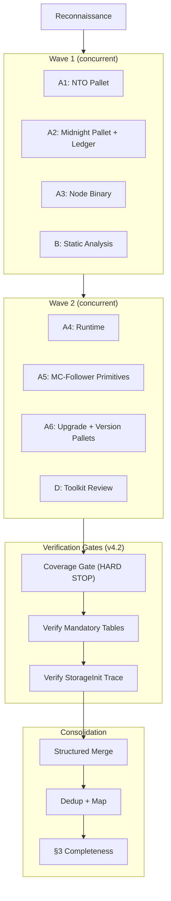
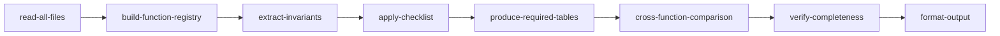
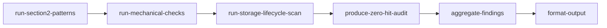
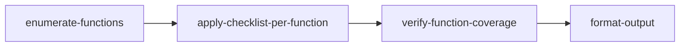
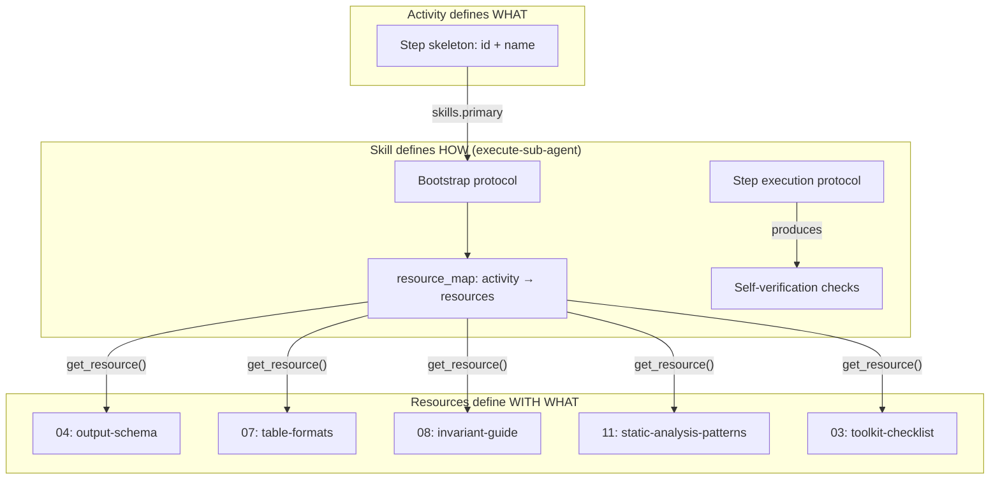

# Security Audit Workflow

> Multi-phase AI security audit for Substrate-based blockchain node codebases. Orchestrates reconnaissance, wave-based workflow-directed multi-agent deep review, adversarial verification, severity-calibrated reporting, optional ensemble passes, and gap analysis against professional audit reports.

**Version:** 4.2.0

## Overview

This workflow guides the complete lifecycle of a security audit:

1. **Scope Setup** — Confirm target, checkout at commit, run dependency scanning, create planning folder
2. **Reconnaissance** — Map architecture, identify crates, trust boundaries, consensus paths, build function registry, assign agent groups
3. **Primary Audit** — Wave-based concurrent dispatch: Group A (one crate-level deep review agent per priority-1/2 crate), Group B (static analysis and mechanical checks), Group D (toolkit review). Each sub-agent follows a dedicated workflow activity via the workflow-server MCP. Includes hard-gate coverage verification before consolidation.
4. **Adversarial Verification** — Decompose and independently verify every PASS item from agent scratchpads
5. **Report Generation** — Consolidate all phases, apply severity scoring with calibration cross-check, verify coverage gate (blocking), produce report
6. **Ensemble Pass** (optional) — Second-model run on priority-1/2 components, union-merge with primary results
7. **Gap Analysis** (optional) — Compare against a professional audit report for benchmarking and improvement

**Key characteristics:**
- Fully automated sequential flow — no user checkpoints (phase gates via exitActions)
- **Goal → Activity → Skill → Tools** ontology: activities define step skeletons, skills define tool orchestration and resource loading, resources contain detailed content (progressive disclosure)
- Workflow-directed sub-agents: each sub-agent bootstraps the workflow-server MCP, loads its assigned activity and the `execute-sub-agent` skill, which maps activity steps to resources loaded on demand
- **Wave-based Group A dispatch** — agents dispatched in waves of 3–4 when the platform limits concurrency; each wave includes at least one Group A crate-level agent (v4.2)
- **Coverage gate hard stop** — report generation blocked until every >200-line file in priority-1/2 crates is confirmed read by at least one sub-agent (v4.2)
- **Mandatory output verification** — orchestrator validates that each Group A agent produced required tables (§3.3 per-field trace, §3.5 StorageInit enumeration, cross-function invariant comparison) before consolidation (v4.2)
- **Orchestrator role discipline** — the orchestrator coordinates and dispatches but does not perform crate-level review itself (v4.2)
- Impact x Feasibility severity scoring via `score-severity` skill with resource-backed calibration examples
- Contamination prevention — reference report quarantined until gap-analysis phase
- Structured merge table with mandatory elevation verification
- §3 checklist completeness verification with gap-filling follow-up
- Based on the Substrate Node Security Audit Template

### Validated Performance

| Session | Version | Agents | LA Overlap | Critical Coverage |
|---------|---------|--------|-----------|-------------------|
| S06 | v4.0 | 8 (6A+1B+1D) | 55% | 1/3 (33%) |
| S08 | v4.0 | 8 | ~65% | 2/3 (67%) |
| S11 | v4.0 | 8 (6A+1B+1D) | **93%** | 3/3 (100%) |
| S12 | v4.1 | 3 (0A+1B+1D) | 82% | 3/3 (100%) |

The v4.2 changes address the S12 regression (0 Group A agents caused an 11pp drop). S11's 93% overlap with the Least Authority professional audit represents the current validated ceiling.

---

## Getting Started

**To start an audit, say:** `"start security audit"` or `"audit midnight-node at commit abc123"`

### Required Inputs

| Input | Description | Example |
|-------|-------------|---------|
| **Target submodule** | Which submodule to audit | `midnight-node` |
| **Target commit** | Git commit hash (defaults to HEAD if not specified) | `abc1234...` |

### Optional Inputs

| Input | Description | When to Use |
|-------|-------------|-------------|
| **Ensemble pass** | Enable a second-model run on priority-1/2 components | When maximum coverage is needed and compute cost is acceptable |
| **Reference report** | Path to a professional audit report (PDF or MD) | When you want gap analysis comparing AI findings against a professional benchmark |

The ensemble option can be enabled at the setup checkpoint. The reference report is requested **only after the report is finalized** (Phase 5) — it is never loaded during the audit itself to avoid contaminating the results with known issues.

### Prerequisites

- Read and follow `AGENTS.md` in the project root
- The target submodule must exist in the repository (see `.gitmodules`)

---

## Workflow Flow

---

## Primary Audit — Wave-Based Agent Dispatch

When the platform limits concurrent sub-agents (e.g., max 4), agents are dispatched in waves. Each wave must include at least one Group A crate-level agent — dispatching only Groups B and D without any Group A agents violates the workflow architecture.

> Wave 1 covers the 3 highest-priority crates plus static analysis. Wave 2 covers remaining crates plus toolkit. The orchestrator waits for each wave to return before dispatching the next. All sub-agents follow dedicated workflow activities via the workflow-server MCP using the `execute-sub-agent` skill.

### Verification Gates (v4.2)

Between agent collection and consolidation, the orchestrator runs three verification gates. These are hard stops — the audit does not proceed to structured merge with failures.

| Gate | What It Checks | Failure Action |
|------|---------------|----------------|
| **Coverage Gate** | Every `.rs` file >200 lines in priority-1/2 crates was read by at least one agent | Dispatch targeted follow-up agents for unread files |
| **Mandatory Tables** | Each Group A agent produced: §3 checklist table, per-field event trace table (§3.3 if applicable), cross-function invariant table. Group D produced: function enumeration table, per-function checklist matrix, coverage attestation. | Dispatch targeted follow-up for missing tables |
| **StorageInit Trace** | The node agent (A3) enumerated every `StorageInit` construction site covering both online and offline subcommand paths | Dispatch targeted follow-up for §3.5 |

These gates were added in v4.2 after validated regression analysis showed that skipping them caused an 11pp coverage drop (Session 12: 82% vs Session 11: 93%).

### Sub-Agent Activity Flows

Each sub-agent bootstraps the workflow-server, loads its assigned activity and the `execute-sub-agent` skill. The skill's `resource_map` directs which resources to load — sub-agents never reference resource indices directly.

#### `sub-crate-review` (Group A — one per crate)

#### `sub-static-analysis` (Group B — single agent, v1.1.0)

v1.1.0 adds 3 new mechanical checks to step 2: preallocation mismatch (`serialized_size` vs `tagged_serialized_size`), mock data source toggle detection (`MOCK` env var patterns), and SmallRng/block-hash-derived randomness search.

#### `sub-toolkit-review` (Group D — single agent, mandatory, v1.1.0)

v1.1.0 strengthens output requirements: the orchestrator rejects prose summaries lacking the three required structured tables (function enumeration, checklist matrix, coverage attestation). Includes function count cross-verification and mandatory subdirectory coverage.

### Sub-Agent Ontology: Activity → Skill → Resources

| Group | Activity | Skill | Resources Loaded | Key Outputs |
|-------|----------|-------|-----------------|-------------|
| A (per crate) | `sub-crate-review` | `execute-sub-agent` | 04, 07, 08, 09 | Findings, checklist coverage, mandatory tables |
| B (1 agent) | `sub-static-analysis` | `execute-sub-agent` | 04, 10, 11 | Pattern hits, storage pairing, zero-hit audit |
| D (1 agent) | `sub-toolkit-review` | `execute-sub-agent` | 03, 04 | Function x checklist matrix, coverage attestation |

---

## Activities

### 1. Scope Setup

**Purpose:** Confirm target submodule and commit, checkout codebase, run dependency scanning, create planning folder.

**Primary Skill:** `execute-audit`
**Supporting Skill:** `artifact-management`

**Artifacts:** `START-HERE.md`, `file-inventory.txt`, `cargo-audit-output.txt`

---

### 2. Reconnaissance

**Purpose:** Map the codebase architecture, identify all crates, trust boundaries, consensus paths, and build the function registry (template §1.2). Assign crates to sub-agent groups with cross-crate supplement mappings.

**Primary Skill:** `execute-audit`

**Artifacts:** `README.md` (scope and architecture summary)

---

### 3. Primary Audit (v4.0.0)

**Purpose:** Execute the multi-agent audit via wave-based dispatch. Includes hard-gate verification steps before consolidation.

**Primary Skill:** `execute-audit`

**Agent Groups:**

| Group | Agents | Activity | Scope |
|-------|--------|----------|-------|
| A | 1 per priority-1/2 crate (~6 agents) | `sub-crate-review` | Full crate file read + §3 checklist + invariant extraction + cross-function comparison. Cross-crate checks via supplementary files. |
| B | 1 | `sub-static-analysis` | All §2 grep patterns + mechanical checks (incl. preallocation mismatch, mock toggle, SmallRng) + storage lifecycle pairing |
| D | 1 (MANDATORY) | `sub-toolkit-review` | ledger/helpers/ and util/toolkit/ with 7-item mandatory checklist applied per-function. Must produce structured tables. |

**Steps (9):**
1. `dispatch-wave-1` — Highest-priority Group A agents (NTO, midnight+ledger, node) + Group B
2. `dispatch-wave-2` — Remaining Group A agents (runtime, mc-follower, upgrade) + Group D
3. `collect-all` — Wait for all sub-agents from both waves
4. `verify-coverage-gate` — **HARD STOP**: confirm every >200-line file was read
5. `verify-mandatory-tables` — Confirm Group A produced required tables; Group D produced function matrix
6. `verify-storageinit-trace` — Confirm node agent traced all StorageInit construction sites
7. `structured-merge` — Flat table of all findings
8. `dedup-and-map` — Assign report finding numbers
9. `verify-checklist-completeness` — §3 coverage matrix with gap-filling follow-up

**Consolidation:** Steps 4–6 are verification gates added in v4.2. They run between agent collection and the structured merge. Any failure triggers targeted follow-up agent dispatch before proceeding.

---

### 4. Adversarial Verification

**Purpose:** Verify every High/Medium PASS item from audit scratchpads by decomposing each claim into constituent properties and independently verifying each one. The agent's role is to **refute**, not confirm.

**Primary Skill:** `execute-audit`

**Steps:**
1. Extract PASS items from all scratchpads (§3.1-§3.4, §3.6, §3.10, §3.14)
2. Decompose each PASS into constituent properties
3. Enumerate multi-site properties (per-field for events, per-layer for pagination/timestamps)
4. Verify each property independently — output CONFIRMED / REFUTED / INSUFFICIENT

---

### 5. Report Generation (v3.1.0)

**Purpose:** Consolidate all findings from primary audit and adversarial verification. Apply severity scoring with calibration cross-check. Verify coverage gate (blocking). Produce final report.

**Primary Skill:** `execute-audit`
**Supporting Skill:** `score-severity`

**Blocking entry condition (v4.2):** This activity must not begin unless the coverage gate passed during primary-audit. If `coverage_report` shows any unread files, return to primary-audit and dispatch follow-up agents first.

**Steps:**
1. Integrate adversarial results into structured merge table
2. Apply Impact × Feasibility severity scoring (resource 02)
3. Run severity calibration cross-check against calibration examples
4. **Verify coverage gate (BLOCKING)**: every >200-line file read — do not proceed to write-report if any file was missed
5. Verify elevation completeness via structured merge table
6. Write `01-audit-report.md`

**Artifacts:** `01-audit-report.md`

---

### 6. Ensemble Pass (Optional)

**Purpose:** Run the template a second time with a different model configuration on priority-1/2 components. Union-merge with primary results.

**Condition:** `ensemble_enabled == true`

**Merge Strategy:**
- Finding in both runs: high confidence, median severity
- Finding in one run only: include, flag as single-source
- PASS in primary but FAIL in ensemble: escalate as new finding

---

### 7. Gap Analysis (Optional)

**Purpose:** Compare the AI audit report against a professional reference report. Produce finding-by-finding mapping, identify gaps, analyze severity calibration, and provide root cause analysis.

**Condition:** `has_reference_report == true`

**Artifacts:** `02-gap-analysis.md`

---

### Sub-Agent Activities

These activities are dispatched by the orchestrator during the primary-audit phase. They do not appear in the main workflow transition graph.

| Activity | Version | Used By | Description |
|----------|---------|---------|-------------|
| `sub-crate-review` | 1.0.0 | Group A | 8-step structured crate review: file reading → function registry → invariant extraction → §3 checklist → mandatory tables → cross-function comparison → completeness verification → structured output |
| `sub-static-analysis` | 1.1.0 | Group B | Step-by-step §2 pattern execution with zero-hit auditing, storage lifecycle pairing, and 3 new mechanical checks (preallocation mismatch, mock toggle, SmallRng) |
| `sub-toolkit-review` | 1.1.0 | Group D | Per-function 7-item checklist application across all toolkit files with function × checklist matrix. Output format strictly enforced — prose without structured tables is rejected (v1.1.0) |

---

## Skills

Skills define tool orchestration, state management, and resource loading strategies. They reference resources for detailed content (progressive disclosure).

| Skill | Capability | Resources Used | Used By |
|-------|------------|----------------|---------|
| `execute-audit` | Orchestrator-level audit execution: agent dispatch, tool usage, consolidation | `05` (agent-dispatch-config), `06` (merge-table-schema) | All orchestrator activities |
| `score-severity` | Impact × Feasibility severity scoring procedure with bias correction | `02` (severity-rubric), `13` (calibration-examples) | report-generation, ensemble-pass |
| `execute-sub-agent` | Sub-agent workflow bootstrap, step-by-step execution with resource loading, structured output | `04` (output-schema) + activity-specific resources via `resource_map` | Sub-agent activities |

### Sub-Agent Execution — Resource Map

The `execute-sub-agent` skill owns a `resource_map` that defines which resources each sub-agent activity needs. Activities define *what* to produce; the skill defines *which resources to load*; resources contain *the content*.

| Activity | Resources Loaded by Skill |
|----------|--------------------------|
| `sub-crate-review` | `04` (output schema), `07` (table formats), `08` (invariant guide), `09` (analysis tables) |
| `sub-static-analysis` | `04` (output schema), `10` (storage lifecycle guide), `11` (static analysis patterns) |
| `sub-toolkit-review` | `03` (toolkit checklist), `04` (output schema) |

---

## Resources

Resources contain detailed reference content loaded on demand by skills. Activities never reference resources directly.

| Index | Resource | Content | Loaded By |
|-------|----------|---------|-----------|
| `00` | `start-here.md` | Quick start guide and workflow overview | Orchestrator bootstrap |
| `01` | `audit-template-reference.md` | Pointer to the audit prompt template with section summary | Orchestrator setup |
| `02` | `severity-rubric.md` | Impact/Feasibility scales, severity mapping table | `score-severity` skill |
| `03` | `toolkit-checklist.md` | Mandatory 7-item toolkit minimum checklist | `execute-sub-agent` skill (for `sub-toolkit-review`) |
| `04` | `sub-agent-output-schema.md` | Structured JSON output schema with per-group field requirements and validation rules | `execute-sub-agent` skill (all activities) |

---

## Variables

| Variable | Type | Description |
|----------|------|-------------|
| `target_submodule` | string | Path to the submodule being audited |
| `target_commit` | string | Git commit hash to audit |
| `planning_folder_path` | string | Path to planning artifacts folder |
| `template_path` | string | Path to the audit prompt template |
| `reference_report_path` | string | Path to professional audit report (optional) |
| `ensemble_enabled` | boolean | Whether to run ensemble pass (default: false) |
| `has_reference_report` | boolean | Whether gap analysis is available (default: false) |
| `cargo_audit_available` | boolean | Whether cargo audit ran successfully |
| `reconnaissance_complete` | boolean | Phase 1a gate |
| `primary_audit_complete` | boolean | Phase 1b gate |
| `panic_sweep_complete` | boolean | Phase 1.5 gate |
| `adversarial_complete` | boolean | Phase 2 gate |
| `report_complete` | boolean | Phase 3 gate |

---

## Expected Artifacts

| Phase | Artifact | Description |
|-------|----------|-------------|
| Setup | `START-HERE.md` | Session overview and navigation |
| Setup | `cargo-audit-output.txt` | Dependency scan results (if tools available) |
| Setup | `file-inventory.txt` | Source files sorted by line count |
| Reconnaissance | `README.md` | Scope, methodology, crate inventory |
| Report | `01-audit-report.md` | Full audit report with numbered findings |
| Gap Analysis | `02-gap-analysis.md` | Comparison against reference report |

---

## Changelog

### v4.2.0 (2026-02-09) — Regression Countermeasures

Addresses the 11pp coverage regression identified in Session 12 vs Session 11 (82% → 93% overlap with Least Authority reference report). Root cause: Session 12 dispatched 0 Group A agents, the orchestrator performed crate-level review itself, and the coverage gate was not enforced.

**New workflow rules (4):**
- Orchestrator role discipline — orchestrator coordinates, does not perform crate-level review
- Coverage gate hard stop — report generation blocked until all >200-line files confirmed read
- Wave-based Group A dispatch — agents dispatched in waves when platform limits concurrency
- Mandatory output verification — structured tables required from all Group A and D agents

**Primary audit restructured (3.0.0 → 4.0.0):**
- Wave dispatch replaces single concurrent dispatch (dispatch-wave-1 + dispatch-wave-2)
- 3 new verification gate steps between collection and merge (coverage, tables, StorageInit)
- 5 new notes documenting each gate's validation requirements and failure actions

**Report generation (3.0.0 → 3.1.0):**
- Blocking entry condition — coverage gate must pass before report begins
- Mandatory table verification added

**Sub-static-analysis (1.0.0 → 1.1.0):**
- +3 mechanical checks: preallocation mismatch, mock data source toggle, SmallRng/block-hash RNG

**Sub-toolkit-review (1.0.0 → 1.1.0):**
- Output format strictly enforced — prose without tables rejected
- Function count cross-verification via grep
- Subdirectory inclusion requirement

**Audit prompt template:**
- +§2.10 Serialization Pre-Allocation Mismatch (mechanical search)
- +§2.11 Mock Data Source Toggle Detection (mechanical search)
- §3.3 hard-gate annotation (per-field trace table verified by orchestrator)
- §3.5 hard-gate annotation (StorageInit construction site enumeration table)

### v4.1.0 (2026-02-09) — Sub-Agent Workflow Activities

Added dedicated workflow activities for sub-agents (sub-crate-review, sub-static-analysis, sub-toolkit-review) with step-by-step execution, required outputs, and structured output schema.

### v4.0.0 (2026-02-08) — Multi-Agent Orchestration

Initial multi-agent architecture with Groups A, B, D. Structured merge table, severity calibration, contamination prevention.
