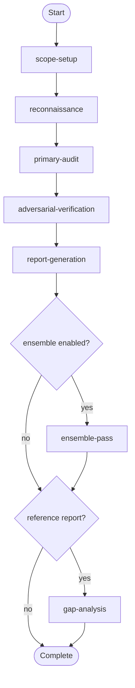
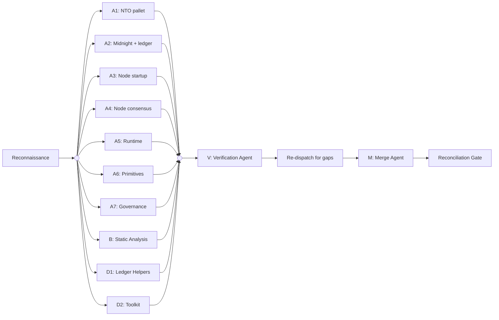
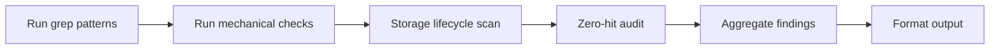
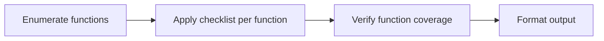

# Security Audit Workflow

> v4.16.0 — Fully automated multi-phase AI security audit for Substrate-based blockchain node codebases. Orchestrates reconnaissance, concurrent multi-agent deep review with dedicated output verification, adversarial verification informed by gap analysis, severity-calibrated reporting, optional ensemble passes, and gap analysis against professional audit reports.

## Overview

This workflow guides the complete lifecycle of a security audit:

1. **Scope Setup** — Confirm target, checkout at commit, run dependency scanning, create planning folder
2. **Reconnaissance** — Map architecture, identify crates, trust boundaries, consensus paths, build function registry, assign agent groups
3. **Primary Audit** — Concurrent dispatch of all specialized agent groups, verification sub-agent validates output completeness, finding consolidation
4. **Adversarial Verification** — Decompose and independently verify every PASS item from agent scratchpads
5. **Report Generation** — Consolidate all phases, apply severity scoring with calibration cross-check, produce report
6. **Ensemble Pass** (optional) — Second-model run on priority-1/2 components, union-merge with primary results
7. **Gap Analysis** (optional) — Compare against a professional audit report for benchmarking

**Design principles:**
- Fully automated sequential flow with phase gates
- Single-batch concurrent dispatch of all primary agents (A1-A7, B, D1, D2)
- Dedicated verification sub-agent (V) validates output completeness in a fresh context window before finding merge
- Dedicated merge sub-agent (M) performs structured merge, deduplication, severity scoring, and reconciliation in a fresh context window
- The orchestrator coordinates and dispatches — sub-agents perform deep crate-level review
- Node binary scope split (A3 startup/config + A4 consensus/network) to prevent prompt saturation on the largest single-agent scope
- Impact × Feasibility severity scoring with target-profile-backed calibration examples
- Contamination prevention — reference report quarantined until gap-analysis phase
- The [target profile](./resources/target-profile.md) separates target-specific configuration from core workflow rules

---

## Getting Started

**To start an audit, say:** `"start security audit"` or `"audit midnight-node at commit abc123"`

### Required Inputs

| Input | Description | Example |
|-------|-------------|---------|
| **Target submodule** | Which submodule to audit | `midnight-node` |
| **Target commit** | Git commit hash (defaults to HEAD if not specified) | `abc1234...` |

### Optional Inputs

| Input | Description | When to Use |
|-------|-------------|-------------|
| **Ensemble pass** | Enable a second-model run on priority-1/2 components | When maximum coverage is needed and compute cost is acceptable |
| **Reference report** | Path to a professional audit report (PDF or MD) | When you want gap analysis comparing AI findings against a professional benchmark |

The reference report is loaded only after the report is finalized — never during the audit itself.

### Prerequisites

- Read and follow `AGENTS.md` in the project root
- The target submodule must exist in the repository (see `.gitmodules`)

---

## Workflow Flow

```mermaid
graph TD
    Start([Start]) --> SS[scope-setup]
    SS --> REC[reconnaissance]
    REC --> PA[primary-audit]
    PA --> AV[adversarial-verification]
    AV --> RG[report-generation]
    RG --> DEC1{ensemble enabled?}
    DEC1 -->|yes| EP[ensemble-pass]
    DEC1 -->|no| DEC2{reference report?}
    EP --> DEC2
    DEC2 -->|yes| GA[gap-analysis]
    DEC2 -->|no| Done([Complete])
    GA --> Done
```

---

## Primary Audit — Concurrent Agent Dispatch

The primary audit dispatches all specialized agent groups concurrently in a single batch, collects their structured output, runs a dedicated verification sub-agent (V), acts on the gap report, then dispatches a dedicated merge sub-agent (M) to perform structured merge and reconciliation.

### Agent Groups

| Group | Agents | Activity | Scope |
|-------|--------|----------|-------|
| A | 1 per priority-1/2 scope (~7 agents: A1-A7) | [`sub-crate-review`](./activities/10-sub-crate-review.yaml) | Deep crate-level review of priority-1/2 crates. Node binary is split into A3 (startup/config) and A4 (consensus/network); runtime and governance are split into A5 (runtime) and A7 (governance pallets) to prevent prompt saturation. |
| B | 1 | [`sub-static-analysis`](./activities/11-sub-static-analysis.yaml) | Pattern-based and mechanical static analysis across the whole in-scope surface. |
| D | 2 (D1, D2) | [`sub-toolkit-review`](./activities/12-sub-toolkit-review.yaml) | D1: ledger helpers (wallet, transaction, context). D2: toolkit, upgrader, aiken crates. |
| V | 1 | [`sub-output-verification`](./activities/14-sub-output-verification.yaml) | Mechanical validation of all agent outputs in a fresh context window. Dispatched after collection, before merge. |
| M | 1 | [`sub-structured-merge`](./activities/15-sub-structured-merge.yaml) | Finding-lossless merge, deduplication, severity scoring, and reconciliation in a fresh context window after V. |

### Dispatch and Consolidation

```mermaid
graph LR
    REC[Reconnaissance] --> FORK(( ))

    FORK --> A1["A1: NTO pallet"]
    FORK --> A2["A2: Midnight + ledger"]
    FORK --> A3["A3: Node startup"]
    FORK --> A4["A4: Node consensus"]
    FORK --> A5["A5: Runtime"]
    FORK --> A6["A6: Primitives"]
    FORK --> A7["A7: Governance"]
    FORK --> B["B: Static Analysis"]
    FORK --> D1["D1: Ledger Helpers"]
    FORK --> D2["D2: Toolkit"]

    A1 --> JOIN(( ))
    A2 --> JOIN
    A3 --> JOIN
    A4 --> JOIN
    A5 --> JOIN
    A6 --> JOIN
    A7 --> JOIN
    B --> JOIN
    D1 --> JOIN
    D2 --> JOIN

    JOIN --> V["V: Verification Agent"]
    V --> REDISPATCH["Re-dispatch for gaps"]
    REDISPATCH --> M["M: Merge Agent"]
    M --> RECONCILE["Reconciliation Gate"]
```

All 10 primary agents (A1-A7, B, D1, D2) dispatch concurrently. After all agents return and persist their output files, the verification sub-agent (V) mechanically validates output completeness and produces a gap report. The orchestrator re-dispatches targeted follow-up agents for any gaps. The merge sub-agent (M) then performs structured merge, deduplication, severity scoring, and reconciliation into the final finding set.

### Verification Gates

After agent collection, a dedicated verification sub-agent (V) runs all verification checks in a fresh context window. Any failure triggers targeted follow-up agent dispatch before proceeding. The authoritative gate set lives in the [`verify-sub-agent-output`](./techniques/verify-sub-agent-output.md) technique and [`sub-output-verification`](./activities/14-sub-output-verification.yaml) activity.

Each sub-agent bootstraps the workflow-server, loads its assigned activity and the [`execute-sub-agent`](./techniques/execute-sub-agent.md) technique, then follows its steps sequentially with verifiable outputs. The structured sub-agent flows are defined in [`sub-crate-review`](./activities/10-sub-crate-review.yaml), [`sub-static-analysis`](./activities/11-sub-static-analysis.yaml), and [`sub-toolkit-review`](./activities/12-sub-toolkit-review.yaml).

### Sub-Agent Activity Flows

#### [`sub-crate-review`](./activities/10-sub-crate-review.yaml) (Group A — one per crate)

```mermaid
graph LR
    CR1[Read all files] --> CR2[Build function registry]
    CR2 --> CR3[Extract invariants]
    CR3 --> CR4[Apply checklist]
    CR4 --> CR5[Produce analysis tables]
    CR5 --> CR6[Cross-function comparison]
    CR6 --> CR7[Verify completeness]
    CR7 --> CR8[Format output]
```

#### [`sub-static-analysis`](./activities/11-sub-static-analysis.yaml) (Group B)

```mermaid
graph LR
    SA1[Run grep patterns] --> SA2[Run mechanical checks]
    SA2 --> SA3[Storage lifecycle scan]
    SA3 --> SA4[Zero-hit audit]
    SA4 --> SA5[Aggregate findings]
    SA5 --> SA6[Format output]
```

#### [`sub-toolkit-review`](./activities/12-sub-toolkit-review.yaml) (Group D)

```mermaid
graph LR
    TK1[Enumerate functions] --> TK2[Apply checklist per function]
    TK2 --> TK3[Verify function coverage]
    TK3 --> TK4[Format output]
```

---

## Activities

The cross-cutting [`variable-binding`](../meta/techniques/variable-binding.md) technique governs how steps read and write workflow variables across every activity.

### 1. [Scope Setup](./activities/01-scope-setup.yaml)

Pins the audit to a single confirmed, reproducible target at an exact commit, surfaces known-vulnerable dependencies before code review begins, and establishes the planning folder every later phase reads and writes. Any reference report is quarantined out of scope until gap analysis.

**Artifacts:** `START-HERE.md`, `cargo-audit-output.txt`, `file-inventory.txt`

---

### 2. [Reconnaissance](./activities/02-reconnaissance.yaml)

Classifies the in-scope surface by crate priority, maps trust boundaries and consensus-critical paths, builds the function registry, and produces a security model of the system, so every in-scope area is bound to a responsible agent with complete, non-overlapping coverage.

**Artifacts:** `r-crate-map.json`, `r-function-registry.json`, `r-reconnaissance-data.json`, `s-architectural-analysis.json`, `README.md` (scope and architecture summary)

---

### 3. [Primary Audit](./activities/03-primary-audit.yaml)

Evaluates every priority-1/2 crate against the full [§3 checklist](./resources/audit-prompt-template.md#3-systematic-manual-review-strategies) in dedicated context windows via concurrent multi-agent dispatch, then validates output completeness with a fresh-context verification agent (V) and consolidates with a fresh-context merge agent (M) before proceeding.

**Artifacts:** per-agent finding files, verification gap report, structured merge and reconciliation table

---

### 4. [Adversarial Verification](./activities/04-adversarial-verification.yaml)

Re-checks every high-stakes PASS verdict at the property level to recover findings primary agents missed as false PASSes, so first-positive-signal bias can no longer hide a real finding behind a premature PASS. The agent's role is to refute, not confirm.

**Artifacts:** PASS-item decomposition and CONFIRMED/REFUTED/INSUFFICIENT verdicts

---

### 5. [Report Generation](./activities/05-report-generation.yaml)

Consolidates findings from primary audit and adversarial verification into a single audit report where every finding carries a defensible, cross-checked severity and both coverage and finding-completeness are attested.

**Artifacts:** `01-audit-report.md`

---

### 6. [Ensemble Pass](./activities/06-ensemble-pass.yaml) (Optional)

Runs the audit a second time with a different model configuration on priority-1/2 components and union-merges with primary results, so findings any single run misses non-deterministically are recovered. Runs only when an ensemble pass was requested.

**Artifacts:** `second-pass-findings.md`

---

### 7. [Gap Analysis](./activities/07-gap-analysis.yaml) (Optional)

Compares the finalized AI audit report against a professional reference report so its coverage and severity calibration are measurable against a benchmark, with root-cause analysis for any structural blind spots. Runs only when a reference report is supplied.

**Artifacts:** `02-gap-analysis.md`

---

### Sub-Agent Activities

These activities are dispatched by the orchestrator during reconnaissance or primary-audit. They do not appear in the main workflow transition graph.

| Activity | Used By | Phase | Role |
|----------|---------|-------|------|
| [`sub-reconnaissance`](./activities/16-sub-reconnaissance.yaml) | R | Reconnaissance | Classifies the in-scope surface and builds the function registry agents drive coverage from |
| [`sub-architectural-analysis`](./activities/13-sub-architectural-analysis.yaml) | S | Reconnaissance | Security-oriented architectural decomposition surfacing vulnerability domains beyond the [§3 checklist](./resources/audit-prompt-template.md#3-systematic-manual-review-strategies) |
| [`sub-crate-review`](./activities/10-sub-crate-review.yaml) | Group A | Primary Audit | Deep, evidence-backed [§3 review](./resources/audit-prompt-template.md#3-systematic-manual-review-strategies) of an entire priority crate |
| [`sub-static-analysis`](./activities/11-sub-static-analysis.yaml) | Group B | Primary Audit | Pattern-based and mechanical analysis across the whole scope, with zero-hit cases verified rather than assumed clean |
| [`sub-toolkit-review`](./activities/12-sub-toolkit-review.yaml) | Group D | Primary Audit | Per-function toolkit review so benign-looking helpers can no longer be skimmed past |
| [`sub-output-verification`](./activities/14-sub-output-verification.yaml) | V | Primary Audit | Fresh-context validation that every required agent ran and every mandatory table is present, stabilizing finding counts across runs |
| [`sub-structured-merge`](./activities/15-sub-structured-merge.yaml) | M | Primary Audit | Fresh-context, provably-lossless merge into a single canonical, deduplicated, severity-scored finding set |

---

## Techniques

Techniques define tool orchestration, protocols, and composable capabilities.

### Orchestrator Techniques

| Technique | Capability |
|-----------|------------|
| [`score-severity`](./techniques/score-severity.md) | Impact × Feasibility severity scoring with calibration examples |
| [`dispatch-sub-agents`](./techniques/dispatch-sub-agents.md) | Compose sub-agent prompts, dispatch concurrently, verify dispatch completeness |
| [`verify-sub-agent-output`](./techniques/verify-sub-agent-output.md) | Validate structural completeness, file coverage, output tables |
| [`merge-findings`](./techniques/merge-findings.md) | Concatenate finding lists, deduplicate by root cause, assign finding numbers |
| [`write-report`](./techniques/write-report.md) | Structure and format the final audit report |
| [`write-gap-analysis`](./techniques/write-gap-analysis.md) | Structure and format the gap analysis report |
| [`map-vulnerability-domains`](./techniques/map-vulnerability-domains.md) | Bind architectural analysis to [§3 verification procedures](./resources/audit-prompt-template.md#3-systematic-manual-review-strategies), partitioned by crate |
| [`execute-ensemble-pass`](./techniques/execute-ensemble-pass.md) | Scope and run a second-model audit pass with blind-spot verification |

### Analysis Techniques

| Technique | Capability |
|-----------|------------|
| [`apply-checklist`](./techniques/apply-checklist.md) | Iterate items against checklist entries, produce verdict matrix |
| [`build-function-registry`](./techniques/build-function-registry.md) | Enumerate functions by type and priority |
| [`extract-invariants`](./techniques/extract-invariants.md) | Enumerate pre/post conditions and cross-function invariants |
| [`scan-storage-lifecycle`](./techniques/scan-storage-lifecycle.md) | Find storage map insert/remove sites, verify pairing |
| [`decompose-safety-claims`](./techniques/decompose-safety-claims.md) | Decompose PASS verdicts into independently verifiable properties |
| [`map-codebase`](./techniques/map-codebase.md) | Build structured architectural map from component inventory |
| [`analyze-architecture`](./techniques/analyze-architecture.md) | Security-oriented architectural decomposition: interaction model, privilege map, candidate points, emergent domains |
| [`setup-audit-target`](./techniques/setup-audit-target.md) | Validate target codebase, run dependency scanning, file inventory |
| [`search-pattern-catalog`](./techniques/search-pattern-catalog.md) | Execute catalog patterns against codebase scope, triage results |

### Sub-Agent Techniques

| Technique | Capability |
|-----------|------------|
| [`execute-sub-agent`](./techniques/execute-sub-agent.md) | Bootstrap workflow-server, load assigned activity, follow steps, return structured output |

---

## Resources

Resources contain detailed reference content loaded on demand by techniques.

| Index | Resource | Content |
|-------|----------|---------|
| `00` | [`start-here.md`](./resources/start-here.md) | Quick start guide and workflow overview |
| `01` | [`audit-template-reference.md`](./resources/audit-template-reference.md) | Audit prompt template summary |
| `02` | [`severity-rubric.md`](./resources/severity-rubric.md) | Impact/Feasibility scales and severity mapping |
| `03` | [`toolkit-checklist.md`](./resources/toolkit-checklist.md) | 8-item toolkit minimum checklist |
| `04` | [`sub-agent-output-schema.md`](./resources/sub-agent-output-schema.md) | Structured output schema with per-group requirements |
| `05` | [`static-analysis-patterns.md`](./resources/static-analysis-patterns.md) | Grep patterns, mechanical checks, storage lifecycle patterns |
| `06` | [`target-profile.md`](./resources/target-profile.md) | Target-specific crate assignments, file paths, node agent scope split, verification agent spec, calibration data, ensemble blind-spots |
| `07` | [`vulnerability-pattern-vocabulary.md`](./resources/vulnerability-pattern-vocabulary.md) | Known cross-project vulnerability patterns for architectural analysis |
| `08` | [`severity-calibration.md`](./resources/severity-calibration.md) | Calibration examples for severity scoring |
| `09` | [`audit-prompt-template.md`](./resources/audit-prompt-template.md) | Full audit prompt template — authoritative §1–§5 checklist taxonomy referenced throughout the workflow |
| `10` | [`gap-analysis-template.md`](./resources/gap-analysis-template.md) | Document skeleton for the gap-analysis report |
