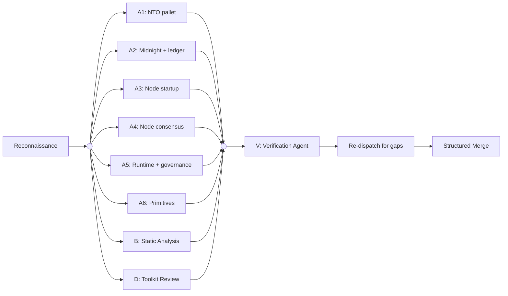

# Security Audit Workflow

> Multi-phase AI security audit for Substrate-based blockchain node codebases. Orchestrates reconnaissance, concurrent multi-agent deep review with dedicated output verification, adversarial verification informed by gap analysis, severity-calibrated reporting, optional ensemble passes, and gap analysis against professional audit reports.

## Overview

This workflow guides the complete lifecycle of a security audit:

1. **Scope Setup** — Confirm target, checkout at commit, run dependency scanning, create planning folder
2. **Reconnaissance** — Map architecture, identify crates, trust boundaries, consensus paths, build function registry, assign agent groups
3. **Primary Audit** — Concurrent dispatch of all specialized agent groups, verification sub-agent validates output completeness, finding consolidation
4. **Adversarial Verification** — Decompose and independently verify every PASS item from agent scratchpads
5. **Report Generation** — Consolidate all phases, apply severity scoring with calibration cross-check, produce report
6. **Ensemble Pass** (optional) — Second-model run on priority-1/2 components, union-merge with primary results
7. **Gap Analysis** (optional) — Compare against a professional audit report for benchmarking

**Design principles:**
- Fully automated sequential flow with phase gates
- **Goal → Activity → Skill → Tools** ontology with progressive disclosure
- Workflow-directed sub-agents that bootstrap the workflow-server, load assigned activities, and follow steps sequentially with verifiable outputs
- Composable skill architecture — 18 single-responsibility skills across orchestrator, analysis, and sub-agent tiers
- Single-batch concurrent dispatch of all primary agents (A1-A6, B, D)
- Dedicated verification sub-agent (V) validates output completeness in a fresh context window before finding merge
- The orchestrator coordinates and dispatches — sub-agents perform deep crate-level review
- Node binary scope split (A3 startup/config + A4 consensus/network) to prevent prompt saturation on the largest single-agent scope
- Impact × Feasibility severity scoring with target-profile-backed calibration examples
- Contamination prevention — reference report quarantined until gap-analysis phase
- Target profile (resource 06) separates target-specific configuration from core workflow rules

---

## Getting Started

**To start an audit, say:** `"start security audit"` or `"audit midnight-node at commit abc123"`

### Required Inputs

| Input | Description | Example |
|-------|-------------|---------|
| **Target submodule** | Which submodule to audit | `midnight-node` |
| **Target commit** | Git commit hash (defaults to HEAD if not specified) | `abc1234...` |

### Optional Inputs

| Input | Description | When to Use |
|-------|-------------|-------------|
| **Ensemble pass** | Enable a second-model run on priority-1/2 components | When maximum coverage is needed and compute cost is acceptable |
| **Reference report** | Path to a professional audit report (PDF or MD) | When you want gap analysis comparing AI findings against a professional benchmark |

The reference report is loaded only after the report is finalized — never during the audit itself.

### Prerequisites

- Read and follow `AGENTS.md` in the project root
- The target submodule must exist in the repository (see `.gitmodules`)

---

## Workflow Flow

---

## Primary Audit — Concurrent Agent Dispatch

The primary audit dispatches all specialized agent groups concurrently in a single batch, collects their structured output, runs a dedicated verification sub-agent, and consolidates findings.

### Agent Groups

| Group | Agents | Activity | Scope |
|-------|--------|----------|-------|
| A | 1 per priority-1/2 scope (~6 agents) | `sub-crate-review` | Full crate file read, §3 checklist, invariant extraction, cross-function comparison. Node binary is split into A3 (startup/config) and A4 (consensus/network) to avoid prompt saturation. |
| B | 1 | `sub-static-analysis` | All §2 grep patterns, mechanical checks, storage lifecycle pairing |
| D | 1 | `sub-toolkit-review` | Toolkit crates (see target profile) with 8-item checklist applied per-function |
| V | 1 | `sub-output-verification` | Mechanical validation of all agent outputs against target profile, coverage gates, and mandatory table requirements. Dispatched after collection, before merge. |

### Dispatch and Consolidation

All 8 primary agents dispatch concurrently. After all agents return, the verification sub-agent (V) mechanically validates output completeness and produces a gap report. The orchestrator re-dispatches targeted follow-up agents for any gaps before proceeding to structured merge.

### Verification Gates

After agent collection, a dedicated verification sub-agent (V) runs all verification checks in a fresh context window. This prevents the orchestrator's context saturation from causing shallow verification — the primary source of cross-run inconsistency. Any failure triggers targeted follow-up agent dispatch before proceeding.

| Gate | What It Checks | On Failure |
|------|---------------|------------|
| **Dispatch Completeness** | Every crate assigned during reconnaissance has a corresponding dispatched agent | Dispatch missing agents |
| **File Coverage** | Every `.rs` file >200 lines in priority-1/2 crates was read by a checklist-applying Group A agent | Dispatch targeted follow-up agents |
| **Output Tables** | Each Group A agent produced required analysis tables; Group D produced function x checklist matrix | Re-dispatch with explicit format instructions |
| **Target Profile Obligations** | Every config struct, domain hint, and check assignment in the target profile appears in at least one agent's output | Dispatch targeted follow-up |
| **Error-Path Persistence** | Every StorageMap::insert site has an error-path assessment in the reviewing agent's output | Flag for follow-up |
| **Table-Derived Findings** | Mechanical scan of all mandatory tables for FAIL/DIFF/Missing/No cells | Auto-extract as findings |

### Sub-Agent Activity Flows

Each sub-agent bootstraps the workflow-server, loads its assigned activity and the `execute-sub-agent` skill, then follows steps sequentially with verifiable outputs.

#### `sub-crate-review` (Group A — one per crate)

#### `sub-static-analysis` (Group B)

Uses the `search-pattern-catalog` supporting skill for catalog-based pattern execution. Mechanical checks include preallocation mismatch, mock data source toggle, and SmallRng security-context triage.

#### `sub-toolkit-review` (Group D)

Produces three structured tables: function enumeration, function × checklist matrix, and coverage attestation.

### Sub-Agent Ontology

| Group | Activity | Primary Skill | Supporting Skills | Resources | Key Outputs |
|-------|----------|--------------|-------------------|-----------|-------------|
| A | `sub-crate-review` | `execute-sub-agent` | — | Output schema | Findings, checklist coverage, analysis tables |
| B | `sub-static-analysis` | `execute-sub-agent` | `search-pattern-catalog` | Output schema, static analysis patterns | Pattern hits, storage pairing, zero-hit audit |
| D | `sub-toolkit-review` | `execute-sub-agent` | — | Toolkit checklist, output schema | Function x checklist matrix, coverage attestation |
| V | `sub-output-verification` | `verify-sub-agent-output` | — | Target profile, output schema | Gap report, table-derived findings, coverage attestation |

---

## Activities

### 1. Scope Setup

Confirm target submodule and commit, checkout codebase, run dependency scanning, create planning folder.

**Skills:** `execute-audit`, `artifact-management`

**Steps:** confirm-target → confirm-commit → record-reference → checkout-submodule → run-cargo-audit → create-file-inventory → create-planning-folder → load-template

**Artifacts:** `START-HERE.md`

---

### 2. Reconnaissance

Map the codebase architecture, identify all crates, trust boundaries, consensus paths, and build the function registry. Assign crates to sub-agent groups with cross-crate supplement mappings.

**Skill:** `execute-audit`

**Steps:** identify-crates -> map-architecture -> identify-trust-boundaries -> identify-consensus-paths -> identify-config-structs -> identify-pallet-hooks -> map-data-flows -> check-send-sync -> build-function-registry -> dispatch-architectural-analysis -> map-vulnerability-domains -> assign-agent-groups -> route-reconnaissance-leads

**Artifacts:** `README.md` (scope and architecture summary)

---

### 3. Primary Audit

Dispatch all primary agents concurrently. After collecting results, dispatch a dedicated verification sub-agent (V) to mechanically validate output completeness. Act on the gap report before consolidating findings.

**Skill:** `execute-audit`

**Steps:** dispatch-all-agents -> verify-checklist-prompt-coverage -> verify-dispatch-completeness -> collect-all -> **dispatch-verification-agent** -> **act-on-gap-report** -> extract-table-derived-findings -> structured-merge -> dedup-and-map -> verify-checklist-completeness -> preserve-verification-report

---

### 4. Adversarial Verification

Verify every High/Medium PASS item from audit scratchpads by decomposing each claim into constituent properties and independently verifying each one. PASS item selection is informed by the verification agent's gap report — areas flagged as potentially incomplete are automatically elevated to the adversarial queue. The agent's role is to refute, not confirm.

**Skill:** `execute-audit`

**Steps:** **seed-from-verification-report** -> extract-pass-items -> decompose-claims -> field-enumeration -> verify-properties -> compile-results

---

### 5. Report Generation

Consolidate all findings from primary audit and adversarial verification. Apply severity scoring with calibration cross-check. Produce the deliverable report.

**Skills:** `execute-audit`, `score-severity`

**Steps:** integrate-adversarial-results → apply-severity → severity-crosscheck → coverage-gate → verify-elevation-completeness → write-report

**Artifacts:** `01-audit-report.md`

---

### 6. Ensemble Pass (Optional)

Run the audit template a second time with a different model configuration on priority-1/2 components. Union-merge with primary results. If context constraints prevent a full second pass, a reduced-scope pass is preferable to skipping.

**Condition:** `ensemble_enabled == true`

**Merge strategy:**
- Finding in both runs → high confidence, median severity
- Finding in one run only → include, flag as single-source
- PASS in primary but FAIL in ensemble → escalate as new finding

**Artifacts:** `second-pass-findings.md`

---

### 7. Gap Analysis (Optional)

Compare the AI audit report against a professional reference report. Produce finding-by-finding mapping, identify gaps, analyze severity calibration, and provide root cause analysis.

**Condition:** `has_reference_report == true`

**Artifacts:** `02-gap-analysis.md`

---

### Sub-Agent Activities

These activities are dispatched by the orchestrator during the primary-audit phase. They do not appear in the main workflow transition graph.

| Activity | Used By | Description |
|----------|---------|-------------|
| `sub-crate-review` | Group A | 8-step structured crate review: file reading -> function registry -> invariant extraction -> §3 checklist -> analysis tables -> cross-function comparison -> completeness verification -> structured output |
| `sub-static-analysis` | Group B | 6-step structured static analysis with catalog-based pattern execution, zero-hit auditing, storage lifecycle pairing, and mechanical checks |
| `sub-toolkit-review` | Group D | Per-function 8-item checklist application across all toolkit files with function x checklist matrix |
| `sub-output-verification` | V | 8-step mechanical output validation: dispatch completeness -> coverage gate -> mandatory tables -> target profile obligations -> table-derived findings -> error-path persistence -> gap report -> format output |

---

## Skills

Skills define tool orchestration, protocols, and composable capabilities.

### Orchestrator Skills

| Skill | Capability | Used By |
|-------|------------|---------|
| `execute-audit` | Orchestrator-level audit execution, agent dispatch coordination, consolidation | All orchestrator activities |
| `score-severity` | Impact × Feasibility severity scoring with calibration examples | report-generation, ensemble-pass |
| `dispatch-sub-agents` | Compose sub-agent prompts, dispatch concurrently, verify dispatch completeness | primary-audit |
| `verify-sub-agent-output` | Validate structural completeness, file coverage, output tables | primary-audit |
| `merge-findings` | Concatenate finding lists, deduplicate by root cause, assign finding numbers | primary-audit, ensemble-pass |
| `compare-finding-sets` | Finding-by-finding mapping, classify matches/gaps, severity calibration analysis | gap-analysis |
| `write-report` | Structure and format the final audit report | report-generation |
| `write-gap-analysis` | Structure and format the gap analysis report | gap-analysis |
| `map-vulnerability-domains` | Bind architectural analysis to §3 verification procedures, partitioned by crate | reconnaissance |

### Analysis Skills

| Skill | Capability | Used By |
|-------|------------|---------|
| `apply-checklist` | Iterate items against checklist entries, produce verdict matrix | primary-audit, sub-crate-review, sub-toolkit-review |
| `build-function-registry` | Enumerate functions by type and priority | reconnaissance, sub-crate-review |
| `extract-invariants` | Enumerate pre/post conditions and cross-function invariants | sub-crate-review |
| `scan-storage-lifecycle` | Find storage map insert/remove sites, verify pairing | sub-static-analysis |
| `decompose-safety-claims` | Decompose PASS verdicts into independently verifiable properties | adversarial-verification |
| `map-codebase` | Build structured architectural map from component inventory | reconnaissance |
| `setup-audit-target` | Validate target codebase, run dependency scanning, file inventory | scope-setup |
| `search-pattern-catalog` | Execute catalog patterns against codebase scope, triage results | sub-static-analysis |

### Sub-Agent Skills

| Skill | Capability | Used By |
|-------|------------|---------|
| `execute-sub-agent` | Bootstrap workflow-server, load assigned activity, follow steps, return structured output | All sub-agent activities |

---

## Resources

Resources contain detailed reference content loaded on demand by skills.

| Index | Resource | Content | Loaded By |
|-------|----------|---------|-----------|
| `00` | `start-here.md` | Quick start guide and workflow overview | Orchestrator bootstrap |
| `01` | `audit-template-reference.md` | Audit prompt template summary | Orchestrator setup |
| `02` | `severity-rubric.md` | Impact/Feasibility scales and severity mapping | `score-severity` skill |
| `03` | `toolkit-checklist.md` | 8-item toolkit minimum checklist | `execute-sub-agent` (toolkit review) |
| `04` | `sub-agent-output-schema.md` | Structured output schema with per-group requirements | `execute-sub-agent` (all) |
| `05` | `static-analysis-patterns.md` | Grep patterns, mechanical checks, storage lifecycle patterns | `search-pattern-catalog` |
| `06` | `target-profile.md` | Target-specific crate assignments, file paths, node agent scope split, verification agent spec, calibration data, ensemble blind-spots | Orchestrator setup, `score-severity`, ensemble, `sub-output-verification` |
| `07` | `vulnerability-pattern-vocabulary.md` | Known cross-project vulnerability patterns for architectural analysis | `sub-architectural-analysis` |
| `08` | `severity-calibration.md` | Calibration examples for severity scoring | `score-severity` |

---

## Variables

| Variable | Type | Description |
|----------|------|-------------|
| `target_submodule` | string | Path to the submodule being audited |
| `target_commit` | string | Git commit hash to audit |
| `in_scope` | string | Crate/module paths to audit |
| `out_of_scope` | string | Exclusions |
| `planning_folder_path` | string | Path to planning artifacts folder |
| `template_path` | string | Path to the audit prompt template |
| `reference_report_path` | string | Path to professional audit report (optional) |
| `ensemble_enabled` | boolean | Whether to run ensemble pass |
| `has_reference_report` | boolean | Whether gap analysis is available |
| `cargo_audit_available` | boolean | Whether cargo audit ran successfully |
| `reconnaissance_complete` | boolean | Phase 1a gate |
| `primary_audit_complete` | boolean | Phase 1b gate |
| `adversarial_complete` | boolean | Phase 2 gate |
| `report_complete` | boolean | Phase 3 gate |
| `agents_assigned` | number | Agents assigned during reconnaissance |
| `agents_dispatched` | number | Agents actually dispatched |
| `dispatch_complete` | boolean | All assigned agents dispatched and returned |
| `verification_complete` | boolean | Verification sub-agent dispatched and gap report processed |

---

## Expected Artifacts

| Phase | Artifact | Description |
|-------|----------|-------------|
| Setup | `START-HERE.md` | Session overview and navigation |
| Setup | `cargo-audit-output.txt` | Dependency scan results (if tools available) |
| Setup | `file-inventory.txt` | Source files sorted by line count |
| Reconnaissance | `README.md` | Scope, methodology, crate inventory |
| Report | `01-audit-report.md` | Full audit report with numbered findings |
| Ensemble | `second-pass-findings.md` | Raw findings from second-pass run |
| Gap Analysis | `02-gap-analysis.md` | Comparison against reference report |

See [CHANGELOG.md](CHANGELOG.md) for version history.
