# Work Package Implementation Workflow

> Defines how to plan and implement ONE work package from inception to merged PR. A work package is a discrete unit of work such as a feature, bug-fix, enhancement, refactoring, or any other deliverable change. **Supports review mode** for conducting structured reviews of existing PRs.

## Overview

This workflow guides the complete lifecycle of a single work package:
1. **Issue Management** → Verify/create issue, set up branch and PR
2. **Design Philosophy** → Classify problem, determine workflow path
3. **Requirements Elicitation** (optional) → Clarify requirements
4. **Research** (optional) → Gather best practices
5. **Implementation Analysis** → Understand current state
6. **Plan & Prepare** → Create implementation and test plans
7. **Implement** → Execute tasks with review cycles
7b. **Post-Implementation Review** → Manual diff review, code review, test review  
9. **Validate** → Run tests and verify build
10. **Strategic Review** → Ensure minimal, focused changes
11. **Finalize** → Complete documentation
12. **Update PR** → Push and mark ready for review
13. **Post-Implementation** → Handle reviews and retrospective

**Key characteristics:**
- Sequential flow with conditional branches
- Multiple feedback loops for quality gates
- 22 checkpoints across all activities
- Task implementation loop with reviews
- Manual diff review with interview-based finding collection
- **Review mode** for reviewing existing PRs (see [Review Mode](#review-mode) section)

---

## Review Mode

This workflow supports **review mode** for reviewing existing PRs rather than implementing new code. When activated, the workflow adapts its behavior using the formal `modes` and `modeOverrides` schema constructs.

**See [REVIEW-MODE.md](REVIEW-MODE.md) for complete documentation.**

Quick summary:
- Detected from user intent (e.g., "start review work package", "review PR #123")
- Skips elicitation and implementation phases
- Analyzes pre-change baseline from base branch
- Documents findings rather than applying fixes
- Generates structured PR review comments

## Workflow Flow

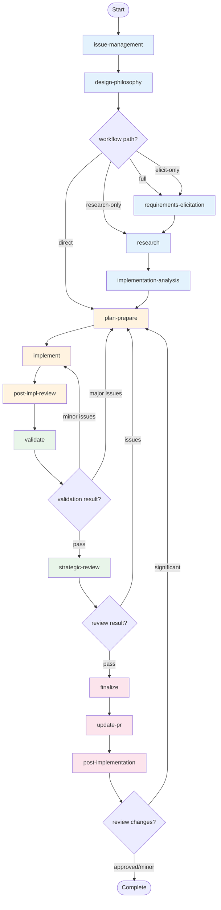

---

## Activities

### 1. Issue Management

**Purpose:** Verify or create an issue, then create feature branch and PR. Issues define the problem space and provide traceability from requirements through implementation. **In review mode:** Detects review requests, captures PR reference, and extracts associated Jira ticket.

**Primary Skill:** `issue-management`  
**Supporting Skills:** `git-workflow`, `pr-creation`, `artifact-management`

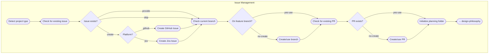

**Checkpoints:**
1. Issue Verification: "I didn't find an issue. Which option?"
2. Platform Selection: "Which platform should I create this issue in?"
3. Jira Project Selection: "Which Jira project?" (conditional - Jira only)
4. Issue Type: "What type of issue is this?"
5. Issue Review: "Here's the drafted issue. Does this look correct?"
6. Branch Check: "You're on branch X. Use existing or create new?"
7. PR Check: "Found existing PR #N. Use existing or create new?"
8. PR Creation: "Proceed to create feature branch and draft PR?"

---

### 2. Design Philosophy

**Purpose:** Classify the problem, assess complexity, and determine which optional activities are needed. **In review mode:** Assesses ticket completeness and always skips elicitation (requirements come from the ticket).

**Primary Skill:** `design-framework`

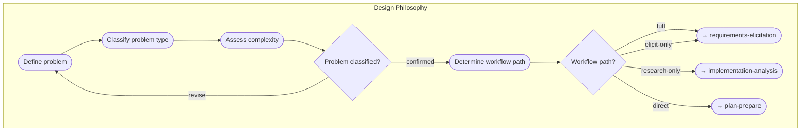

**Checkpoints:**
1. Problem Classification: "This appears to be a {type} with {complexity} complexity. Correct?"
2. Workflow Path: "Given the complexity, which path would you like?"

---

### 3. Requirements Elicitation (Optional)

**Purpose:** Discover and clarify what the work package should accomplish through stakeholder discussion and structured conversation.

**Primary Skill:** `requirements-elicitation`  
**Supporting Skill:** `artifact-management`

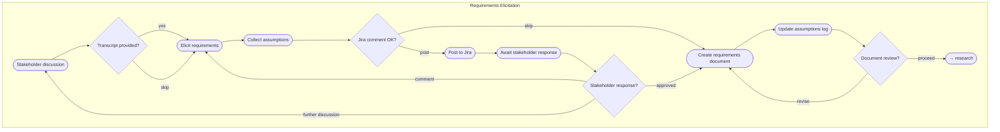

**Checkpoints:**
1. Stakeholder Discussion: "Please discuss with key stakeholders and provide the transcript"
2. Jira Comment Review: "Review the comment before posting to Jira" (Jira issues only)
3. Stakeholder Response: "Provide stakeholder feedback after they review the Jira comment"
4. Document Review: "Ready to proceed to Research?"

---

### 4. Research (Optional)

**Purpose:** Research knowledge base and external sources to discover best practices and patterns.

**Primary Skill:** `knowledge-research`

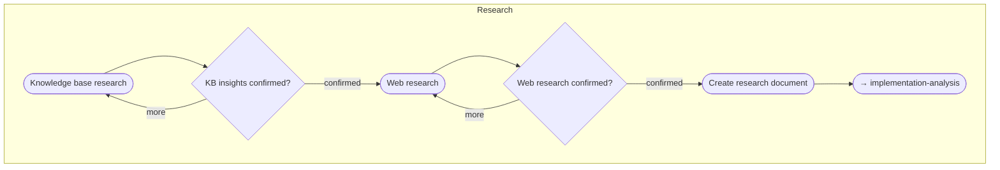

**Checkpoints:**
1. "Knowledge insights confirmed?"
2. "Web research findings confirmed?"

---

### 5. Implementation Analysis

**Purpose:** Analyze current implementation to understand effectiveness, establish baselines, identify opportunities. **In review mode:** Checks out base branch to analyze pre-change state, documents expected changes based on requirements.

**Primary Skill:** `implementation-analysis`  
**Supporting Skill:** `artifact-management`

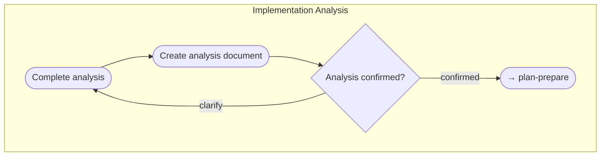

**Checkpoint:** "Implementation analysis complete. Ready to proceed to planning?"

---

### 6. Plan & Prepare

**Purpose:** Create the work package plan and prepare for implementation.

**Primary Skill:** `planning`  
**Supporting Skill:** `test-planning`

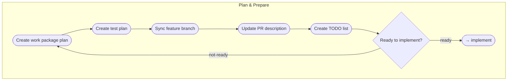

**Checkpoints:**
1. "Approach confirmed?"
2. "Ready to implement?"

---

### 7. Implement Tasks

**Purpose:** Execute the implementation plan task by task with review cycles. **In review mode:** This activity is SKIPPED entirely—implementation already exists in the PR.

**Primary Skill:** `implementation`  
**Supporting Skill:** `assumptions-review`

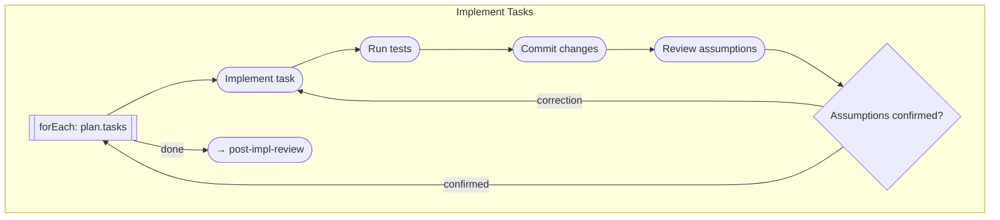

**Checkpoints:**
1. Task Progress: "Review assumptions. Are they confirmed?"

---

### 7b. Post-Implementation Review

**Purpose:** Review implementation quality regardless of whether code was newly written or adopted. Ensures manual diff review, code review, test suite review, and architecture summary are completed before validation.

**Primary Skill:** `manual-diff-review`  
**Supporting Skills:** `code-review`, `test-review`, `architecture-summary`

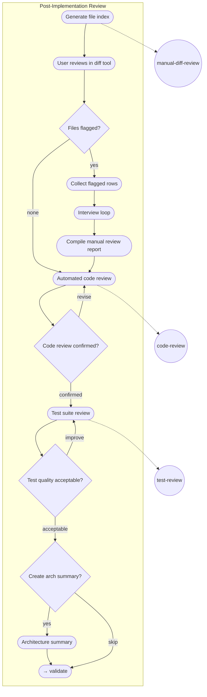

**Artifacts:**
- `{NN}-change-block-index.md` - File index for cross-reference during manual review
- `{NN}-manual-diff-review.md` - Manual diff review findings
- `{NN}-code-review.md` - Automated code review report
- `{NN}-test-suite-review.md` - Test suite quality assessment
- `{NN}-architecture-summary.md` - C4 diagrams for stakeholders (optional)

**Checkpoints:**
1. File Index: "Review in your diff tool, then provide row numbers with issues"
2. Block Interview: "What's the issue with this change?" (repeats for each flagged row)
3. Code Review: "Code review findings confirmed?"
4. Test Quality: "Test quality acceptable?"
5. Architecture Summary: "Create architecture summary for stakeholders?"

---

### 8. Validate

**Purpose:** Validate implementation through comprehensive testing. All tests must pass. **In review mode:** Documents failures as review findings rather than fixing them.

**Primary Skill:** `validation`

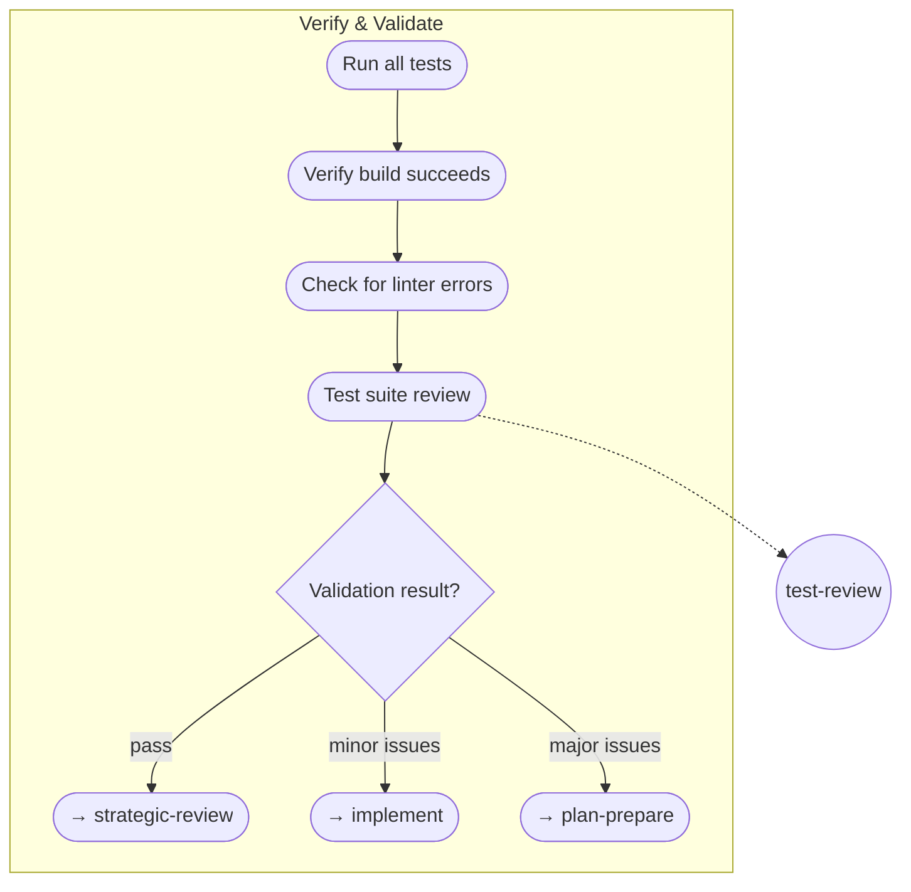

**Decision:** Pass → strategic-review | Minor issues → implement | Major issues → plan-prepare

---

### 9. Strategic Review

**Purpose:** Ensure changes are minimal and focused. Validate the PR contains only required changes. **In review mode:** Documents cleanup recommendations rather than applying them.

**Primary Skill:** `strategic-review`

**Checkpoint:** "Review findings confirmed?"

**Decision:** Pass → finalize | Issues found → plan-prepare

---

### 10. Finalize

**Purpose:** Finalize documentation after implementation is complete.

**Primary Skill:** `documentation`

**No checkpoints** - proceeds directly to update-pr.

---

### 11. Update PR

**Purpose:** Update PR with final implementation details and mark ready for review. **In review mode:** Generates consolidated review summary and posts PR review comments.

**Primary Skill:** `pr-management`

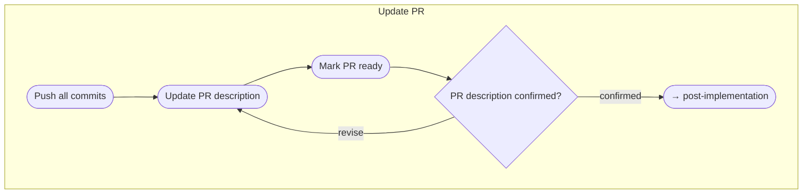

**Checkpoint:** "PR description confirmed?"

---

### 12. Post-Implementation

**Purpose:** Complete post-implementation tasks including automatic ADR creation for moderate/complex implementations and handling PR review feedback.

**Primary Skill:** `retrospective`  
**Supporting Skill:** `pr-review-response`

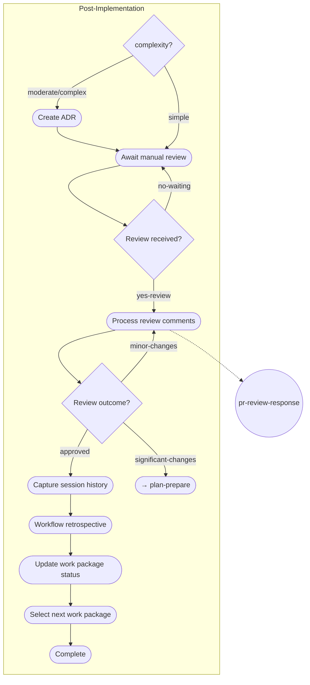

**Steps:**
1. Create ADR (automatic, if complexity is moderate or complex based on design-philosophy assessment)
2. Await manual review
3. Process review comments
4. Capture session history
5. Workflow retrospective
6. Update work package status
7. Select next work package

**Checkpoints:**
1. "Has the PR received manual review feedback?"
2. "What is the outcome of processing review comments?"

---

## Skills Summary

| Skill | Capability | Used By |
|-------|------------|---------|
| `manual-diff-review` | Manual diff review with file index and interview loop (see `22-manual-diff-review.md`) | post-impl-review |
| `code-review` | Code review (see `16-rust-substrate-code-review.md` for Rust/Substrate) | post-impl-review, implement |
| `test-review` | Test suite quality review (see `17-test-suite-review.md`) | post-impl-review, validate |
| `pr-review-response` | Respond to PR review feedback | post-implementation |

## Schema Extensions

This workflow uses schema extensions for mode support:

| Schema | Extension | Purpose |
|--------|-----------|---------|
| `workflow.schema.json` | `modes[]` | Define workflow execution modes with activation, recognition, skip lists |
| `activity.schema.json` | `modeOverrides{}` | Define activity-level behavior for each mode |

See `../../schemas/workflow.schema.json` and `../../schemas/activity.schema.json` for full definitions.

---

## Resources

| Resource | Purpose |
|----------|---------|
| `24-review-mode.md` | Complete guide for review mode behavior and PR review comment formats |
| `16-rust-substrate-code-review.md` | Rust/Substrate code review criteria |
| `17-test-suite-review.md` | Test suite quality assessment |
| `22-manual-diff-review.md` | Manual diff review with interview loop |

---

## Variables

| Variable | Type | Description |
|----------|------|-------------|
| `issue_number` | string | GitHub or Jira issue number |
| `issue_platform` | string | Issue tracking platform (github/jira) |
| `pr_number` | string | Pull request number |
| `branch_name` | string | Feature branch name |
| `needs_elicitation` | boolean | Whether requirements elicitation is needed |
| `needs_research` | boolean | Whether research activity is needed |
| `complexity` | string | Problem complexity (simple/moderate/complex) - drives ADR creation |
| `validation_passed` | boolean | Whether validation activity passed |
| `review_passed` | boolean | Whether strategic review passed |
| `is_review_mode` | boolean | Whether this is a review of existing implementation |
| `review_pr_url` | string | URL of PR being reviewed (review mode only) |

---

## Feedback Loops

The workflow includes several feedback loops for quality assurance:

| From | To | Condition |
|------|----|-----------|
| validate | implement | Minor issues found |
| validate | plan-prepare | Major issues found |
| strategic-review | plan-prepare | Significant issues found |
| post-implementation | plan-prepare | Significant changes required |
