# Work Package Implementation Workflow

> v3.1.0 — Defines how to plan and implement ONE work package from inception to merged PR. A work package is a discrete unit of work such as a feature, bug-fix, enhancement, refactoring, or any other deliverable change. **Supports review mode** for conducting structured reviews of existing PRs.

---

## Overview

This workflow guides the complete lifecycle of a single work package through twelve activities, each with defined skills, checkpoints, and transitions. Activities may be conditional (skipped based on complexity), looped (repeated on failure), or overridden (adapted for review mode).

| # | Activity | Required | Description |
|---|----------|----------|-------------|
| 01 | **Start Work Package** | yes | Verify/create issue, set up branch, PR, and planning folder |
| 02 | **Design Philosophy** | yes | Classify problem, assess complexity, determine workflow path |
| 03 | **Requirements Elicitation** | optional | Clarify requirements through stakeholder conversation |
| 04 | **Research** | optional | Gather best practices from knowledge base and web |
| 05 | **Implementation Analysis** | yes | Understand current state, establish baselines |
| 06 | **Plan & Prepare** | yes | Create implementation and test plans |
| 07 | **Implement** | yes | Execute tasks with implement-test-commit cycles |
| 08 | **Post-Implementation Review** | yes | Manual diff review, code review, test review, architecture summary |
| 09 | **Validate** | yes | Run tests, build, and lint checks |
| 10 | **Strategic Review** | yes | Ensure minimal, focused changes |
| 11 | **Submit for Review** | yes | Push PR, mark ready, handle reviewer feedback |
| 12 | **Complete** | yes | Finalize documentation, create ADR, conduct retrospective |

**Key statistics:**

| Metric | Count |
|--------|-------|
| Activities | 12 |
| Skills | 22 |
| Checkpoints | 40 |
| Variables | 49 |
| Loops | 4 |
| Feedback loops | 4 |

---

## Review Mode

This workflow supports **review mode** for reviewing existing PRs rather than implementing new code. When activated, the workflow adapts its behavior using the formal `modes` and `modeOverrides` schema constructs.

**Activation:** Detected from user intent patterns such as "start review work package", "review PR #123", or "review existing implementation". Sets `is_review_mode = true`.

**Skipped activities:** Requirements Elicitation (03) and Implement (07) are always skipped in review mode. Elicitation is unnecessary because requirements come solely from the associated ticket. Implementation is skipped because the code already exists.

**Behavioral overrides per activity:**

| Activity | Override |
|----------|----------|
| Start Work Package | Captures PR reference, extracts Jira ticket, skips branch/PR creation |
| Design Philosophy | Assesses ticket completeness, forces `needs_elicitation = false` |
| Implementation Analysis | Checks out base branch for pre-change baseline analysis |
| Validate | Documents failures as review findings instead of fixing them |
| Strategic Review | Documents cleanup recommendations instead of applying them |
| Submit for Review | Consolidates all findings, posts structured PR review comment |

**Review mode flow:**

```
start-work-package → design-philosophy → [research →] implementation-analysis
→ plan-prepare → post-impl-review → validate → strategic-review
→ submit-for-review → END
```

See the `24-review-mode.md` resource for complete documentation on review mode behavior and PR review comment formats.

---

## Workflow Flow

The following diagram shows the full workflow flow including all conditional branches and feedback loops.

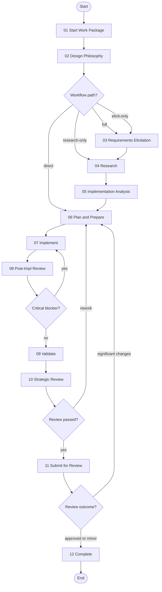

---

## Activities

Each activity section below includes its purpose, skills, steps, checkpoints, transitions, and a mermaid diagram showing its internal flow.

---

### 01. Start Work Package

**Purpose:** Initialize the work package — verify or create an issue, set up feature branch and draft PR, create planning folder. In review mode: captures PR reference and extracts associated Jira ticket.

**Skills:**

| Role | Skill ID |
|------|----------|
| primary | `create-issue` |
| supporting | `manage-git` |
| supporting | `manage-artifacts` |

**Steps:**

1. **detect-project-type** — Auto-detect project type from `Cargo.toml` (Substrate dependencies: `sp-*`, `frame-*`, `pallet-*`). Set `project_type` to `rust-substrate` if found, otherwise `other`.
2. **check-issue** — Verify whether an issue has been specified by user or in context.
3. **create-issue** — If needed, create issue in selected platform (GitHub or Jira) via platform-selection checkpoint.
4. **check-branch** — Check if already on a feature branch (not `main`/`master`).
5. **create-branch** — Create feature branch: `type/issue-number-short-description`.
6. **check-pr** — Check if PR already exists for current branch via `gh pr list --head <branch>`.
7. **create-pr** — Create draft PR linked to issue.
8. **initialize-planning-folder** — Create planning folder at `.engineering/artifacts/planning/YYYY-MM-DD-{initiative-name}/`.
9. **determine-next-activity** — Based on issue details, determine if requirements elicitation is needed.

**Checkpoints (8):**

| Checkpoint | Purpose | Blocking |
|------------|---------|----------|
| `issue-verification` | Confirm issue exists or choose to create/skip | yes |
| `branch-check` | Use existing branch or create new one | yes |
| `pr-check` | Use existing PR or create new one | yes |
| `platform-selection` | Choose GitHub or Jira for issue creation | yes |
| `jira-project-selection` | Select Jira project (if Jira chosen) | yes |
| `issue-type-selection` | Choose issue type: Feature, Bug, Task, Enhancement, Epic | yes |
| `issue-review` | Confirm drafted issue before creation | yes |
| `pr-creation` | Confirm branch and PR creation | yes |

**Transitions:** Default transition to `design-philosophy`.

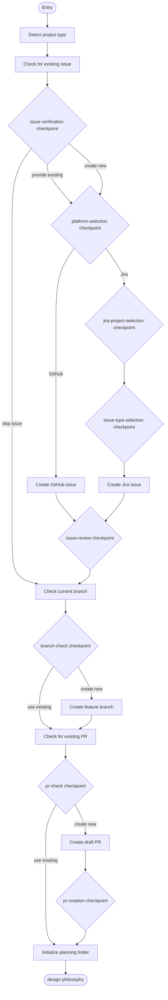

---

### 02. Design Philosophy

**Purpose:** Apply structured design framework to classify the problem, determine complexity, and decide which optional activities are needed. Sets the `complexity` variable (simple / moderate / complex) which drives ADR creation in the Complete activity. In review mode: assesses ticket completeness using the Jira Issue Creation Guide checklist.

**Skills:**

| Role | Skill ID |
|------|----------|
| primary | `classify-problem` |
| supporting | `review-assumptions` |

**Steps:**

1. **define-problem** — Create clear problem statement with system understanding, impact assessment, success criteria, and constraints.
2. **classify-problem** — Determine if this is a specific problem (cause known/unknown) or an inventive goal (improvement/prevention). Assess complexity.
3. **determine-path** — Based on problem complexity and clarity, determine which optional activities are needed.
4. **document-philosophy** — Create `design-philosophy.md` with problem statement, classification, complexity assessment, workflow path rationale, and constraints.
5. **collect-assumptions** — Identify assumptions made during problem classification and path selection.
6. **create-assumptions-log** — Create the assumptions log with initial assumptions from this activity.

**Checkpoints (4):**

| Checkpoint | Purpose | Blocking |
|------------|---------|----------|
| `problem-classified` | Confirm problem type and complexity assessment | yes |
| `workflow-path` | Select workflow path: full, elicit-only, research-only, or direct | yes |
| `design-philosophy-doc` | Confirm design philosophy document is accurate | yes |
| `assumptions-review` | Review assumptions from classification and path selection | yes |

**Transitions:**

| Condition | Target |
|-----------|--------|
| `needs_elicitation == true` | requirements-elicitation |
| `needs_elicitation == false AND needs_research == true` | research |
| `skip_to_planning == true` (default) | plan-prepare |

**Artifacts:** `design-philosophy.md`, `assumptions-log.md` (both in planning folder).

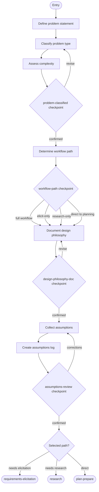

---

### 03. Requirements Elicitation (optional)

**Purpose:** Discover and clarify what the work package should accomplish through structured sequential conversation. Elicitation discovers what the user needs before planning how to implement it. Includes a stakeholder discussion phase, sequential question-domain iteration, Jira comment posting for stakeholder review, and awaiting stakeholder response.

**Skills:**

| Role | Skill ID |
|------|----------|
| primary | `elicit-requirements` |
| supporting | `manage-artifacts` |
| supporting | `review-assumptions` |

**Steps:**

1. **stakeholder-discussion** — Prompt user to initiate discussion with key stakeholders. User provides transcript or summary.
2. **elicit-requirements** — Iterate through question domains, asking one question at a time. Use stakeholder transcript as context.
3. **collect-assumptions** — Identify assumptions made when interpreting user responses.
4. **post-assumptions-to-jira** — Prepare assumptions as Jira comment, get user approval, then post to ticket (if `issue_platform` is Jira).
5. **await-stakeholder-response** — Wait for stakeholders to review the Jira comment. User returns with feedback.
6. **create-document** — Create requirements document using elicitation output template.
7. **update-assumptions-log** — Add requirements-phase assumptions to the assumptions log.

**Checkpoints (5):**

| Checkpoint | Purpose | Blocking |
|------------|---------|----------|
| `stakeholder-transcript` | Provide or skip stakeholder discussion transcript | yes |
| `domain-complete` | Continue to next domain, revisit, or finish early | yes |
| `jira-comment-review` | Review and approve Jira comment before posting | yes |
| `stakeholder-response` | Provide stakeholder feedback or confirm approval | yes |
| `document-review` | Confirm requirements document, proceed to research | yes |

**Loops:** `domain-iteration` — forEach over `question_domains` (max 5 iterations). Each iteration asks one question and records the response.

**Transitions:**

| Condition | Target |
|-----------|--------|
| `requirements_confirmed == true` (default) | research |
| `requirements_confirmed == false` | requirements-elicitation (self-loop) |

**Artifacts:** `requirements-elicitation.md` (in planning folder).

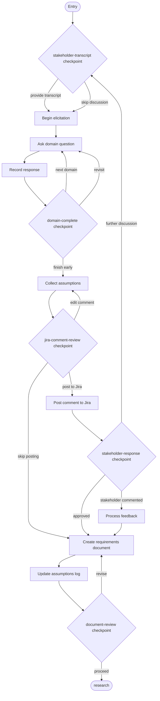

---

### 04. Research (optional)

**Purpose:** Research the knowledge base and external sources to discover best practices, patterns, and resources to inform the plan-prepare activity.

**Skills:**

| Role | Skill ID |
|------|----------|
| primary | `research-knowledge-base` |
| supporting | `review-assumptions` |

**Steps:**

1. **kb-research** — Call `get_guidance` before making concept-rag MCP tool calls. Search for relevant patterns and practices.
2. **web-research** — Search web for current information, documentation, and best practices.
3. **synthesize** — Connect findings to requirements: which patterns apply, what modifications needed, risks, success metrics.
4. **collect-assumptions** — Identify assumptions made during research synthesis.
5. **document** — Create knowledge base research document.
6. **update-assumptions-log** — Add research-phase assumptions to the assumptions log.

**Checkpoints (4):**

| Checkpoint | Purpose | Blocking |
|------------|---------|----------|
| `kb-insights` | Confirm knowledge base findings are relevant | yes |
| `web-research-confirmed` | Confirm web research is complete | yes |
| `assumptions-review` | Review pattern applicability and synthesis assumptions | yes |
| `research-complete` | Confirm research is sufficient, proceed to analysis | yes |

**Transitions:** Default to `implementation-analysis`.

**Artifacts:** `kb-research.md` (in planning folder).

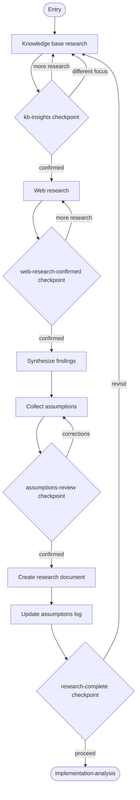

---

### 05. Implementation Analysis

**Purpose:** Analyze the current implementation to understand effectiveness, establish baselines, and identify opportunities for improvement. In review mode: checks out the base branch to analyze the pre-change state, documents expected changes, then returns to the PR branch.

**Skills:**

| Role | Skill ID |
|------|----------|
| primary | `analyze-implementation` |
| supporting | `manage-artifacts` |
| supporting | `review-assumptions` |

**Steps:**

1. **review-implementation** — Understand where and how the feature/component is used: location, usage, dependencies, architecture.
2. **evaluate-effectiveness** — Gather evidence of existing performance: logs, metrics, tests, issues, comments.
3. **establish-baselines** — Establish quantitative measurements: performance, quality, usage, reliability.
4. **collect-assumptions** — Identify assumptions made during analysis.
5. **document** — Create implementation analysis document.
6. **update-assumptions-log** — Add analysis-phase assumptions to the assumptions log.

**Checkpoints (2):**

| Checkpoint | Purpose | Blocking |
|------------|---------|----------|
| `analysis-confirmed` | Confirm analysis findings are correct | yes |
| `assumptions-review` | Review assumptions about current behavior and gaps | yes |

**Transitions:** Default to `plan-prepare`.

**Artifacts:** `implementation-analysis.md` (in planning folder).

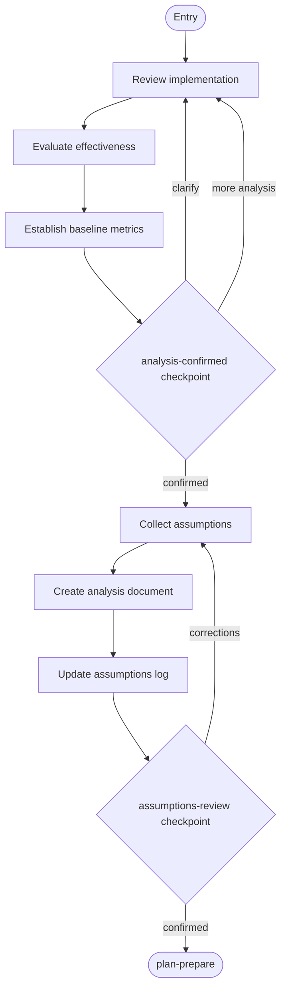

---

### 06. Plan & Prepare

**Purpose:** Design the approach, create the work package plan (task breakdown), create the test plan, and prepare for implementation. This is the convergence point for all optional paths.

**Skills:**

| Role | Skill ID |
|------|----------|
| primary | `create-plan` |
| supporting | `classify-problem` |
| supporting | `review-assumptions` |
| supporting | `create-test-plan` |

**Steps:**

1. **apply-design** — Use design framework skill to structure the approach.
2. **create-plan** — Create work package plan document with task breakdown.
3. **create-test-plan** — Create test plan document.
4. **collect-assumptions** — Identify assumptions made during planning.
5. **update-assumptions-log** — Add planning-phase assumptions to the assumptions log.
6. **sync-branch** — Ensure feature branch is up to date with `main`.
7. **update-pr** — Update PR with planning information.
8. **create-todos** — Break down plan into actionable TODO tasks.

**Checkpoints (4):**

| Checkpoint | Purpose | Blocking |
|------------|---------|----------|
| `approach-confirmed` | Confirm implementation approach | yes |
| `assumptions-review` | Review planning assumptions | yes |
| `ready-implement` | Confirm readiness to implement | yes |
| `assumptions-log-final` | Final review of accumulated assumptions before implementation | yes |

**Transitions:** Default to `implement`.

**Artifacts:** `work-package-plan.md`, `test-plan.md` (both in planning folder).

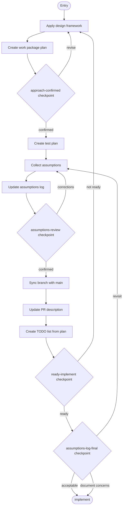

---

### 07. Implement

**Purpose:** Execute the implementation plan task by task. Each task follows a cycle of implement, test, commit, review assumptions, checkpoint. Contains two nested loops: the task implementation cycle and the assumption review cycle within each task.

**Skills:**

| Role | Skill ID |
|------|----------|
| primary | `implement-task` |
| supporting | `review-assumptions` |
| supporting | `validate-build` |
| supporting | `manage-git` |

**Entry action:** Verify on correct feature branch before any code changes.

**Loops:**

| Loop | Type | Iterates over | Max |
|------|------|---------------|-----|
| `task-cycle` | forEach | `plan.tasks` | 100 |
| `assumption-review-cycle` | forEach | `task_assumptions` | 100 |

**Task cycle steps (per task):**

1. **implement-task** — Write code for the current task.
2. **run-tests** — Execute tests to verify implementation.
3. **commit** — Commit changes.
4. **collect-assumptions** — Identify all assumptions made during this task.
5. **update-assumptions-log** — Record outcomes in assumptions log after review.

**Checkpoints (2):**

| Checkpoint | Purpose | Blocking |
|------------|---------|----------|
| `task-complete` | Confirm task implementation, proceed to assumption review | yes |
| `assumption-review` | Review each individual assumption | yes |

**Transitions:** Default to `post-impl-review`.

**Artifacts:** `assumptions-log.md` (continues from earlier phases).

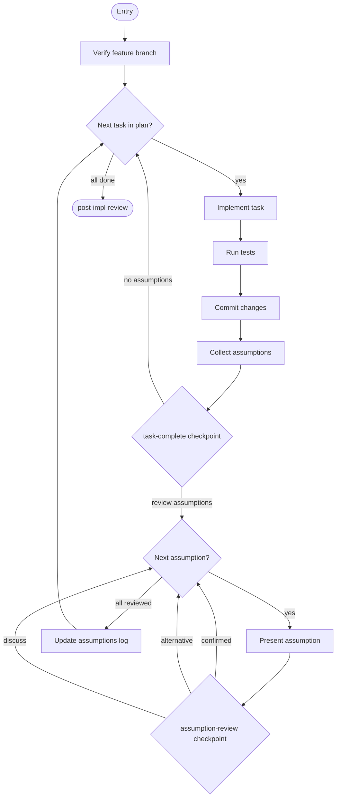

---

### 08. Post-Implementation Review

**Purpose:** Review implementation quality through manual diff review, code review, test suite review, and architecture summary. Includes a blocker gate: if a critical blocker is found, transitions back to implement for remediation.

**Artifact prefix:** `08`

**Skills:**

| Role | Skill ID |
|------|----------|
| primary | `review-diff` |
| supporting | `review-code` |
| supporting | `review-test-suite` |
| supporting | `summarize-architecture` |

**Review stages:**

1. **Manual diff review** — Pull and diff, create change-block index, present file table to user, collect flagged blocks, interview each flagged block, write report.
2. **Code review** — Comprehensive code review using Rust/Substrate criteria (if applicable).
3. **Test suite review** — Assess test quality, coverage, and anti-patterns.
4. **Architecture summary** — Create high-level architecture summary with diagrams.

**Checkpoints (5):**

| Checkpoint | Purpose | Blocking |
|------------|---------|----------|
| `file-index-table` | Present file/block index for user to flag items | yes |
| `block-interview` | Interview user on each flagged block | yes |
| `code-review` | Present code review findings | yes |
| `test-quality` | Present test suite review findings | yes |
| `architecture-summary` | Present architecture summary for confirmation | yes |

**Decision:** `blocker-gate` — If `has_critical_blocker == true`, transition back to `implement`. Otherwise proceed to `validate`.

**Artifacts (prefixed with `08-`):**

| Artifact | Description |
|----------|-------------|
| `08-change-block-index.md` | Indexed table of all changed blocks in the diff |
| `08-manual-diff-review.md` | Manual diff review findings from interview process |
| `08-code-review.md` | Comprehensive code review document |
| `08-test-suite-review.md` | Test suite quality assessment |
| `08-architecture-summary.md` | High-level architecture summary with diagrams |

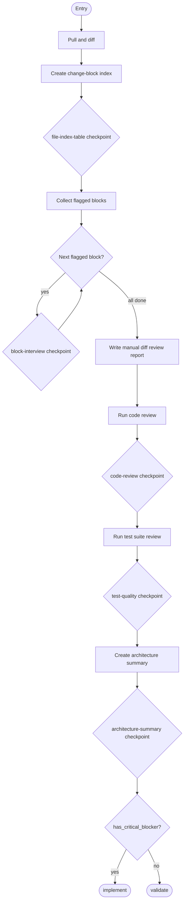

---

### 09. Validate

**Purpose:** Validate the implementation through testing, build verification, and lint checking. If failures are found, analyze root cause, fix, and re-run until all pass. In review mode: documents failures as review findings and does not attempt fixes.

**Skills:**

| Role | Skill ID |
|------|----------|
| primary | `validate-build` |

**Steps:**

1. **run-tests** — Execute unit, integration, and e2e tests. Observe and record results.
2. **verify-build** — Run build. Observe and record result.
3. **check-lint** — Run linter. Observe and record results.
4. **fix-failures** — If tests/build/lint fail, analyze root cause, fix, and re-run. Repeat until all pass. (Skipped in review mode.)

**Checkpoints (0):** This activity has no checkpoints. Test/build/lint results are observable and do not require user confirmation.

**Transitions:** Default to `strategic-review`.

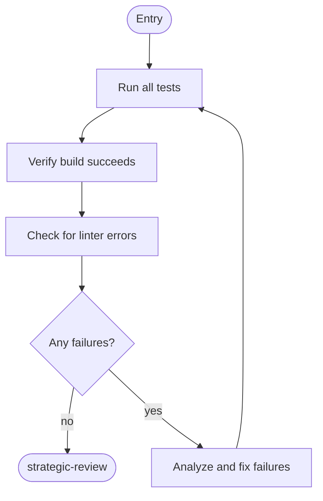

---

### 10. Strategic Review

**Purpose:** Review the implementation to ensure changes are minimal and focused. Validates that the final PR contains only the changes required for the solution. Creates strategic review document and architecture summary. In review mode: documents cleanup recommendations without applying them.

**Artifact prefix:** `10`

**Skills:**

| Role | Skill ID |
|------|----------|
| primary | `review-strategy` |

**Steps:**

1. **diff-review** — Examine all changes in the PR for scope and relevance.
2. **identify-artifacts** — Find investigation artifacts, over-engineering, orphaned infrastructure.
3. **document-findings** — Create `10-strategic-review-{n}.md` with items that should be removed or simplified.
4. **apply-cleanup** — If cleanup needed, remove identified artifacts and update review document. (Skipped in review mode.)
5. **create-architecture-summary** — Create `10-architecture-summary.md` using the architecture summary resource template.

**Checkpoints (2):**

| Checkpoint | Purpose | Blocking |
|------------|---------|----------|
| `review-findings` | Confirm strategic review findings | yes |
| `review-result` | Determine outcome: pass, cleanup, or rework | yes |

**Decision:** `review-result` — If `review_passed == true`, transition to `submit-for-review`. Otherwise loop back to `plan-prepare`.

**Artifacts (prefixed with `10-`):**

| Artifact | Description |
|----------|-------------|
| `10-strategic-review-{n}.md` | Review findings, identified artifacts, cleanup actions. `{n}` increments on successive reviews. |
| `10-architecture-summary.md` | High-level architecture summary with UML-style diagrams |

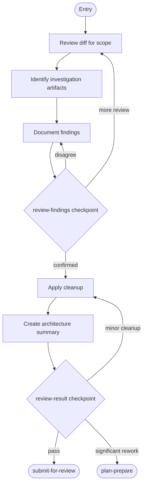

---

### 11. Submit for Review

**Purpose:** Push PR, update description with implementation details, mark ready for review, then await reviewer feedback. If significant changes are requested, loop back to plan-prepare. In review mode: consolidates all review findings and posts structured PR review comments, then ends the workflow.

**Skills:**

| Role | Skill ID |
|------|----------|
| primary | `update-pr` |
| supporting | `respond-to-pr-review` |

**Steps (standard mode):**

1. **push-commits** — Push all commits to remote.
2. **update-description** — Update PR description with final implementation details.
3. **mark-ready** — Mark PR as ready for review.
4. **await-review** — Wait for PR to receive manual review.
5. **process-review-comments** — Analyze and respond to review feedback using `respond-to-pr-review` skill.

**Checkpoints (3):**

| Checkpoint | Purpose | Blocking |
|------------|---------|----------|
| `pr-description` | Confirm PR description is accurate | yes |
| `review-received` | Confirm that review comments have been received | yes |
| `review-outcome` | Determine outcome: approved, minor changes, or significant changes | yes |

**Transitions:**

| Condition | Target |
|-----------|--------|
| `review_requires_changes == true` | plan-prepare |
| default | complete |

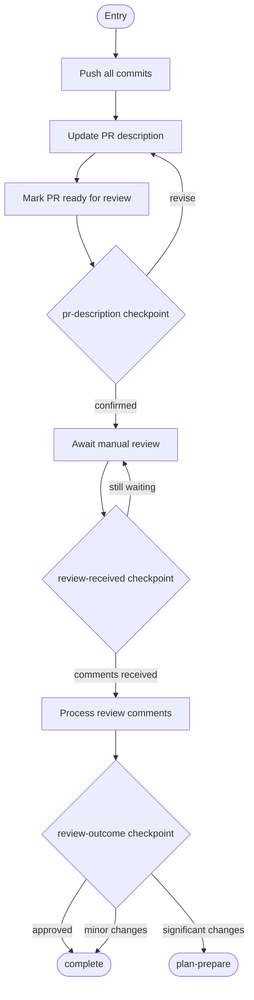

---

### 12. Complete

**Purpose:** Final activity — create Architecture Decision Record (if moderate or complex implementation), finalize documentation, conduct retrospective, capture session history, update status, and select next work package. In review mode: ends after retrospective.

**Artifact prefix:** `12`

**Skills:**

| Role | Skill ID |
|------|----------|
| primary | `finalize-documentation` |
| supporting | `create-adr` |
| supporting | `conduct-retrospective` |

**Steps:**

1. **create-adr** — Automatically create ADR based on design philosophy complexity assessment (triggered for moderate or complex implementations).
2. **update-adr-status** — If ADR exists, update status to Accepted.
3. **finalize-test-plan** — Add hyperlinks to test source locations.
4. **create-complete-doc** — Create `COMPLETE.md` completion document.
5. **ensure-docs** — Verify public APIs have inline documentation.
6. **capture-history** — If metadata repository exists (private, never committed).
7. **retrospective** — Workflow retrospective (skip if trivial session).
8. **update-status** — Update work package plan status after PR merge.
9. **select-next** — Select next work package.

**Checkpoints (1):**

| Checkpoint | Purpose | Blocking |
|------------|---------|----------|
| `retrospective-review` | Review received, confirm PR feedback has been addressed | yes |

**Transitions:** None — this is the terminal activity.

**Artifacts:**

| Artifact | Location | Description |
|----------|----------|-------------|
| `COMPLETE.md` | planning | Completion document |
| `workflow-retrospective.md` | planning | Retrospective notes |
| `NNNN-{decision-title}.md` | `.engineering/artifacts/adr` | ADR for moderate/complex implementations |
| `{YYYY-MM-DD}-pr{N}-review-analysis.md` | `.engineering/artifacts/reviews` | PR review analysis |

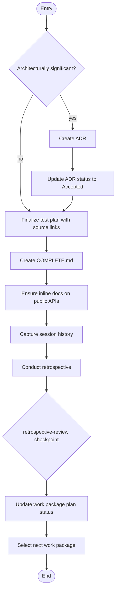

---

## Skills (22)

The workflow uses 22 skills organized by capability. Skills are referenced by activities through `primary` and `supporting` roles. The primary skill defines the main competency for the activity; supporting skills provide supplementary capabilities invoked within the activity flow.

| # | Skill ID | Capability | Used By |
|---|----------|------------|---------|
| 00 | `review-code` | Comprehensive Rust/Substrate code review with severity ratings | Post-Implementation Review |
| 01 | `review-test-suite` | Test suite quality, coverage gaps, and anti-pattern detection | Post-Implementation Review |
| 02 | `respond-to-pr-review` | Analyze and respond to PR review comments systematically | Submit for Review |
| 03 | `create-issue` | Create GitHub or Jira issues with platform-specific type mapping | Start Work Package |
| 04 | `classify-problem` | Problem classification, complexity assessment, and workflow path selection | Design Philosophy, Plan and Prepare |
| 05 | `elicit-requirements` | Requirements discovery through sequential domain-based conversation | Requirements Elicitation |
| 06 | `research-knowledge-base` | Knowledge base search and web research with synthesis | Research |
| 07 | `analyze-implementation` | Implementation analysis, baseline establishment, gap identification | Implementation Analysis |
| 08 | `create-plan` | Work package plan with task breakdown and dependencies | Plan and Prepare |
| 09 | `create-test-plan` | Test strategy, acceptance criteria, and test case definition | Plan and Prepare |
| 10 | `implement-task` | Single task code implementation with test and commit cycle | Implement |
| 11 | `review-diff` | Manual diff review with indexed block references and interview loop | Post-Implementation Review |
| 12 | `review-strategy` | Strategic review ensuring minimal and focused changes | Strategic Review |
| 13 | `review-assumptions` | Assumption collection, classification, and structured review | All planning and implementation activities |
| 14 | `manage-artifacts` | Planning folder creation and artifact numbering management | Start Work Package, Requirements Elicitation, Implementation Analysis |
| 15 | `manage-git` | Git branching, PR lifecycle, branch sync operations | Start Work Package, Implement |
| 16 | `validate-build` | Test execution, build verification, lint checking | Validate, Implement |
| 17 | `finalize-documentation` | ADR updates, test plan finalization, COMPLETE.md creation | Complete |
| 18 | `update-pr` | PR description update, push commits, mark ready for review | Submit for Review |
| 19 | `conduct-retrospective` | Workflow retrospective and lessons learned capture | Complete |
| 20 | `summarize-architecture` | Architecture summary with UML-style diagrams for stakeholders | Post-Implementation Review, Strategic Review |
| 21 | `create-adr` | Architecture Decision Record creation for significant decisions | Complete |

---

### Skill Protocol: `review-code` (00)

Comprehensive code review following Rust/Substrate-specific criteria. Loads review guidance resource, reviews each changed file, documents findings with severity, and presents a summary.

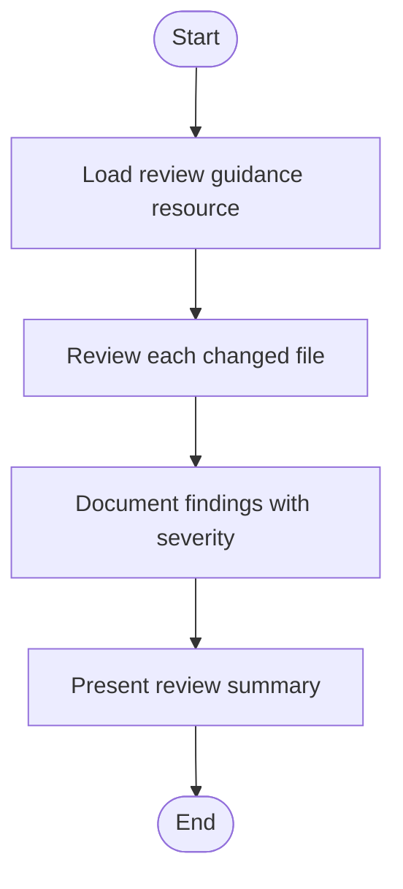

**Protocol steps:**

| Step Key | Action |
|----------|--------|
| `load-guidance` | Load `16-rust-substrate-code-review.md` resource for criteria |
| `review-files` | Iterate over changed files, assess against criteria |
| `document-findings` | Record each finding: file, line, severity, description |
| `present-summary` | Aggregate findings by severity, present to user |

---

### Skill Protocol: `create-issue` (03)

Creates issues in either GitHub or Jira based on the `issue_platform` variable. Each platform follows a distinct protocol path.

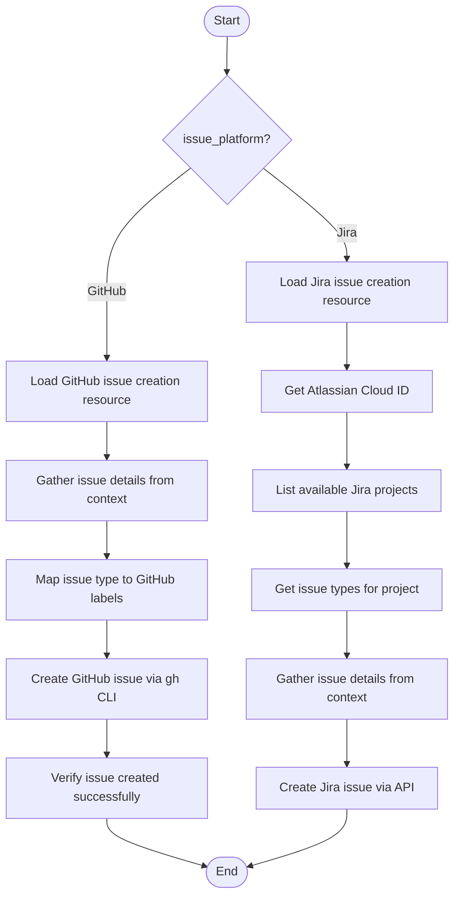

**GitHub protocol:**

| Step Key | Action |
|----------|--------|
| `load-resource` | Load `03-github-issue-creation.md` resource |
| `gather-details` | Extract title, description, acceptance criteria from context |
| `map-labels` | Map issue type (feature, bug, task, enhancement) to GitHub labels |
| `create` | Run `gh issue create` with title, body, labels |
| `verify` | Confirm issue was created and capture issue number |

**Jira protocol:**

| Step Key | Action |
|----------|--------|
| `load-resource` | Load `04-jira-issue-creation.md` resource |
| `get-cloud-id` | Call `getAccessibleAtlassianResources` for Cloud ID |
| `list-projects` | Call `getVisibleJiraProjects` to enumerate available projects |
| `get-types` | Call `getJiraProjectIssueTypesMetadata` for the selected project |
| `gather-details` | Map issue type to Jira issue type, gather fields |
| `create` | Call `createJiraIssue` with mapped fields |

---

### Skill Protocol: `implement-task` (10)

Implements a single task from the work package plan following a three-phase approach: understand context, write code, verify locally.

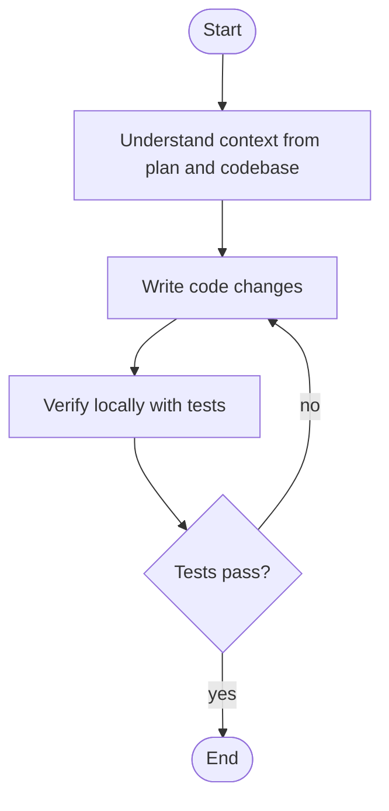

**Protocol steps:**

| Step Key | Action |
|----------|--------|
| `understand-context` | Read task description from plan, examine relevant source files, understand dependencies |
| `write-code` | Implement the task following existing code patterns and conventions |
| `verify-locally` | Run relevant tests, check for compilation errors, verify behavior |

---

### Skill Protocol: `review-diff` (11)

Manual diff review with indexed block references. Creates a structured change-block index, presents it to the user for flagging, then conducts an interview for each flagged block. Produces a comprehensive review report.

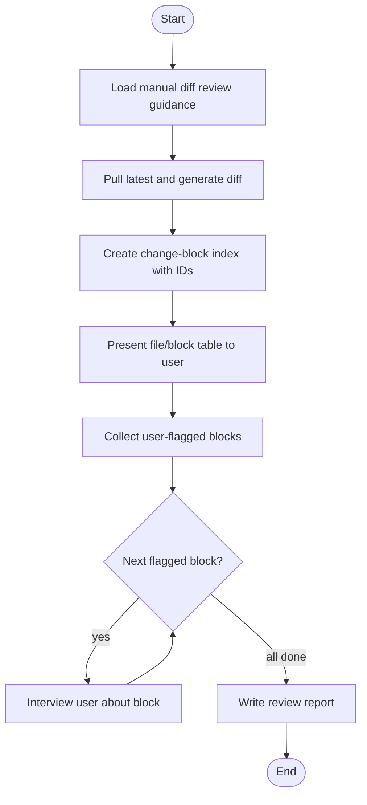

**Protocol steps:**

| Step Key | Action |
|----------|--------|
| `load-guidance` | Load `22-manual-diff-review.md` resource for format and criteria |
| `pull-and-diff` | Generate diff between feature branch and base |
| `create-index` | Parse diff into numbered change blocks with file, line range, and description |
| `present-to-user` | Display indexed table for user to flag items of concern |
| `collect-flagged` | Record which blocks the user wants to discuss |
| `interview-each` | For each flagged block, ask targeted questions and record responses |
| `write-report` | Compile all findings into `08-manual-diff-review.md` |

---

## Artifact Prefixing

Each review and documentation activity declares an `artifactPrefix` matching its activity number. Skills produce bare artifact names (e.g., `code-review.md`) and the activity's prefix is prepended at write time.

**Convention:**

```
{artifactPrefix}-{artifact-name}.md
```

**Examples:**

| Activity | Prefix | Bare Name | Final Name |
|----------|--------|-----------|------------|
| Post-Implementation Review | `08` | `code-review.md` | `08-code-review.md` |
| Post-Implementation Review | `08` | `test-suite-review.md` | `08-test-suite-review.md` |
| Strategic Review | `10` | `strategic-review-1.md` | `10-strategic-review-1.md` |
| Strategic Review | `10` | `architecture-summary.md` | `10-architecture-summary.md` |
| Complete | `12` | `COMPLETE.md` | `12-COMPLETE.md` |

This convention ensures artifacts are naturally sorted by workflow phase when listed in the planning folder.

---

## Feedback Loops

The workflow contains four feedback loops that enable iterative quality improvement. Each loop is triggered by a checkpoint or decision gate.

| From | To | Condition | Purpose |
|------|----|-----------|---------|
| Post-Implementation Review (08) | Implement (07) | `has_critical_blocker == true` | Critical blocker found during review requires code fix before proceeding |
| Strategic Review (10) | Plan and Prepare (06) | `review_passed == false` | Significant rework needed — changes are not minimal or focused |
| Submit for Review (11) | Plan and Prepare (06) | `review_requires_changes == true` | Reviewer requested significant changes requiring re-planning |
| Requirements Elicitation (03) | Requirements Elicitation (03) | `requirements_confirmed == false` | Elicitation incomplete — self-loop for further stakeholder discussion |

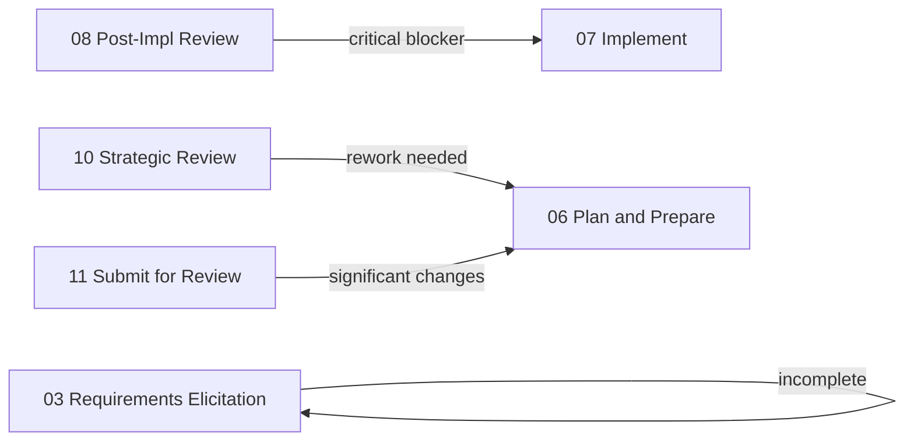

---

## Variables (49)

The workflow declares 49 variables that drive control flow, store checkpoint state, and track progress. Variables are grouped by function below.

### Core Identifiers

| Variable | Type | Description |
|----------|------|-------------|
| `planning_folder_path` | string | Path to planning folder: `.engineering/artifacts/planning/YYYY-MM-DD-{name}` |
| `issue_number` | string | GitHub issue number (#N) or Jira issue key (PROJ-N) |
| `issue_platform` | string | Issue tracking platform: `github` or `jira` |
| `issue_type` | string | Type of issue: feature, bug, task, enhancement, epic |
| `issue_url` | string | Full URL to the issue |
| `pr_number` | string | Pull request number |
| `pr_url` | string | Full URL to the pull request |
| `branch_name` | string | Feature branch name |
| `project_type` | string | Detected project type: `rust-substrate` or `other` |

### Mode Variables

| Variable | Type | Description |
|----------|------|-------------|
| `is_review_mode` | boolean | Whether review mode is active (default: `false`) |
| `review_pr_url` | string | URL of the PR being reviewed (review mode only) |
| `review_pr_captured` | boolean | Whether PR reference has been captured in review mode |
| `review_base_branch` | string | Base branch of the PR being reviewed |

### Control Flow

| Variable | Type | Description |
|----------|------|-------------|
| `needs_elicitation` | boolean | Whether requirements elicitation is needed (default: `false`) |
| `needs_research` | boolean | Whether research activity is needed (default: `false`) |
| `skip_to_planning` | boolean | Whether to skip directly to plan-prepare |
| `is_architecturally_significant` | boolean | Whether ADR is needed (default: `false`) |
| `validation_passed` | boolean | Whether validation phase passed |
| `review_passed` | boolean | Whether strategic review passed |
| `has_critical_blocker` | boolean | Whether a critical blocker was found in post-impl review |
| `has_failures` | boolean | Whether validation detected failures |
| `review_requires_changes` | boolean | Whether PR review requires returning to planning |
| `needs_cleanup` | boolean | Whether strategic review identified cleanup items |
| `findings_confirmed` | boolean | Whether strategic review findings were confirmed |

### Checkpoint State

| Variable | Type | Description |
|----------|------|-------------|
| `needs_issue_creation` | boolean | Set when user chooses to create a new issue |
| `issue_skipped` | boolean | Set when user chooses to skip issue creation |
| `issue_approved` | boolean | Set when drafted issue is approved for creation |
| `issue_cancelled` | boolean | Set when issue creation is cancelled |
| `on_feature_branch` | boolean | Whether already on a feature branch |
| `use_existing_branch` | boolean | Whether to use the existing branch |
| `pr_exists` | boolean | Whether a PR already exists for the branch |
| `use_existing_pr` | boolean | Whether to use the existing PR |
| `pr_skipped` | boolean | Set when PR creation is skipped |
| `has_stakeholder_input` | boolean | Whether stakeholder discussion was provided |
| `elicitation_complete` | boolean | Whether elicitation has been completed |
| `post_jira_comment` | boolean | Whether to post assumptions to Jira |
| `has_stakeholder_comment` | boolean | Whether stakeholder provided feedback |
| `stakeholder_review_complete` | boolean | Whether stakeholder review is complete |
| `needs_further_discussion` | boolean | Whether further stakeholder discussion is needed |
| `requirements_confirmed` | boolean | Whether requirements have been confirmed |
| `skip_assumption_review` | boolean | Whether to skip assumption review for current task |
| `ticket_refactor_needed` | boolean | Whether Jira ticket needs refactoring (review mode) |

### Loop Variables

| Variable | Type | Description |
|----------|------|-------------|
| `current_task` | dynamic | Current task in the task implementation cycle |
| `current_assumption` | dynamic | Current assumption in the assumption review cycle |
| `current_domain` | dynamic | Current domain in the question domain iteration |
| `question_domains` | array | List of question domains for elicitation |
| `plan.tasks` | array | List of tasks from the work package plan |
| `task_assumptions` | array | Assumptions collected from the current task |

### Contextual Data

| Variable | Type | Description |
|----------|------|-------------|
| `problem_statement` | string | Clear problem definition from design philosophy |
| `problem_type` | string | Specific problem or inventive goal |
| `complexity` | string | Problem complexity: simple, moderate, or complex |
| `design_philosophy_doc` | string | Path to design philosophy artifact |

See `workflow.toon` for the complete list of all 49 declared variables with their default values and requirements.

---

## Resources

The workflow includes 25 resources that provide templates, guidance, and reference material for skills and activities.

| # | Resource ID | Title | Purpose |
|---|-------------|-------|---------|
| 00 | `start-here` | Start Here | Entry point instructions for the workflow |
| 02 | `readme` | Readme | This document |
| 03 | `github-issue-creation` | GitHub Issue Creation | Guide for creating well-structured GitHub issues |
| 04 | `jira-issue-creation` | Jira Issue Creation | Guide for creating Jira issues with proper field mapping |
| 05 | `requirements-elicitation` | Requirements Elicitation | Question domains and elicitation output template |
| 06 | `implementation-analysis` | Implementation Analysis | Analysis framework and document template |
| 07 | `knowledge-base-research` | Knowledge Base Research | Research methodology and concept-rag usage guide |
| 08 | `web-research` | Web Research | Web research methodology and synthesis template |
| 09 | `design-framework` | Design Framework | Structured design framework for problem classification |
| 10 | `wp-plan` | Work Package Plan | Plan document template with task breakdown format |
| 11 | `test-plan` | Test Plan | Test strategy and acceptance criteria template |
| 12 | `pr-description` | PR Description | PR description template with required sections |
| 13 | `assumptions-review` | Assumptions Review | Assumption collection, classification, and review protocol |
| 14 | `task-completion-review` | Task Completion Review | Post-task review checklist |
| 15 | `architecture-review` | Architecture Review | Architecture review criteria and checklist |
| 16 | `rust-substrate-code-review` | Rust Substrate Code Review | Rust/Substrate-specific code review criteria |
| 17 | `test-suite-review` | Test Suite Review | Test suite quality assessment framework |
| 18 | `strategic-review` | Strategic Review | Strategic review criteria for minimal focused changes |
| 19 | `architecture-summary` | Architecture Summary | Architecture summary template with UML diagram guidance |
| 19 | `pr-review-response` | PR Review Response | Guide for analyzing and responding to PR review comments |
| 20 | `workflow-retrospective` | Workflow Retrospective | Retrospective template and facilitation guide |
| 21 | `complete-wp` | Complete Work Package | Completion document template |
| 22 | `manual-diff-review` | Manual Diff Review | Manual diff review protocol with interview loop format |
| 23 | `tdd-concepts-rust` | TDD Concepts Rust | TDD best practices for Rust: Red-Green-Refactor, FIRST principles |
| 24 | `review-mode` | Review Mode | Complete guide for review mode behavior and PR review formats |

---

## Appendix: Workflow Rules

The following rules are declared at the workflow level and apply to all activities:

1. **PREREQUISITE:** Agents MUST read and follow `AGENTS.md` before starting any work.
2. Agents must NOT proceed past checkpoints without user confirmation.
3. Ask, don't assume — Clarify requirements before acting.
4. Summarize, then proceed — Provide brief status before asking to continue.
5. One task at a time — Complete current work before starting new work.
6. Explicit approval — Get clear "yes" or "proceed" before major actions.
7. Decision points require user choice — When issues are found, user decides whether to proceed or loop back.
8. Never reference gitignored artifacts in PRs, issues, or ADRs — planning artifacts are local-only.
9. Artifacts in `planning` and `reviews` locations are gitignored.

---

## Appendix: Artifact Locations

| Location Key | Path | Gitignored | Purpose |
|--------------|------|------------|---------|
| `planning` | `{planning_folder_path}` | no | Work package planning documents and review artifacts |
| `reviews` | `.engineering/artifacts/reviews` | no | PR review analysis documents |
| `adr` | `.engineering/artifacts/adr` | no | Architecture Decision Records |

---

## Appendix: Estimated Time Per Activity

| Activity | Estimated Time |
|----------|---------------|
| 01 Start Work Package | 10-20 min |
| 02 Design Philosophy | 10-20 min |
| 03 Requirements Elicitation | 15-30 min |
| 04 Research | 20-45 min |
| 05 Implementation Analysis | 10-20 min |
| 06 Plan and Prepare | 20-45 min |
| 07 Implement | 1-4 hours |
| 08 Post-Implementation Review | 15-30 min |
| 09 Validate | 15-30 min |
| 10 Strategic Review | 15-30 min |
| 11 Submit for Review | 10-15 min |
| 12 Complete | 30-60 min |
| **Total (full workflow)** | **~4-9 hours** |
