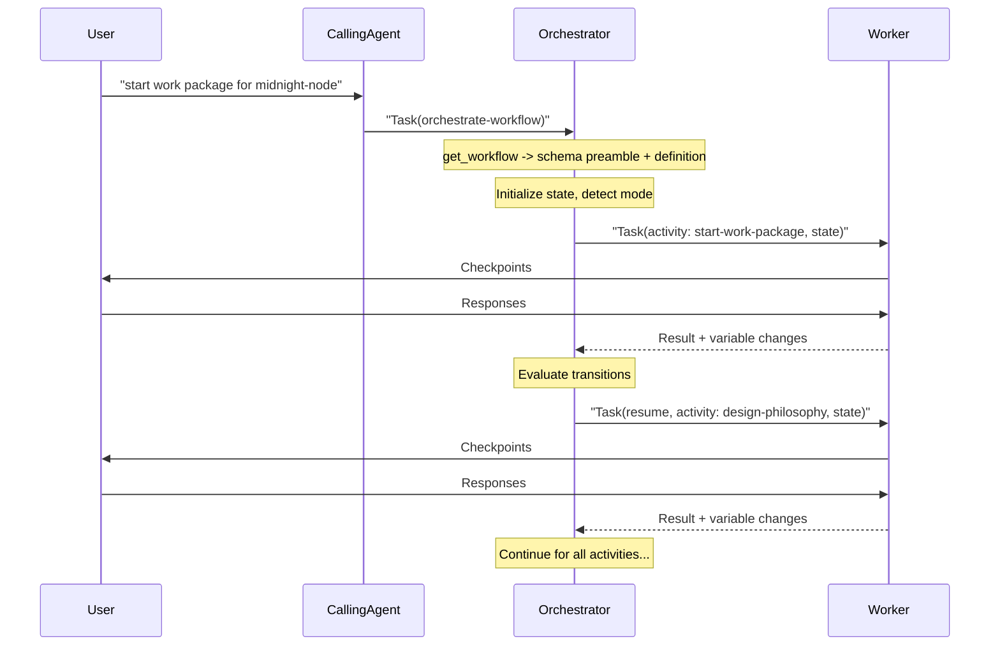
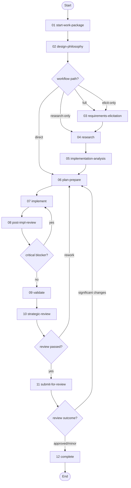
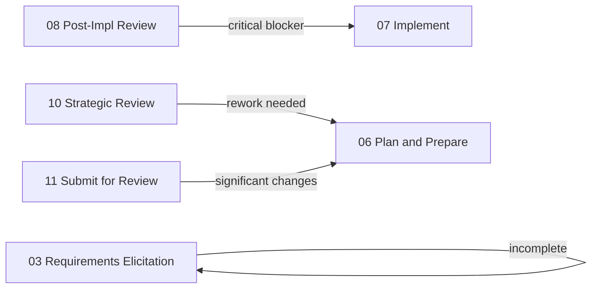

# Work Package Implementation Workflow

> v3.2.0 — Defines how to plan and implement ONE work package from inception to merged PR. A work package is a discrete unit of work such as a feature, bug-fix, enhancement, refactoring, or any other deliverable change. **Supports review mode** for conducting structured reviews of existing PRs.

---

## Overview

This workflow guides the complete lifecycle of a single work package through twelve activities, each with defined skills, checkpoints, and transitions. Activities may be conditional (skipped based on complexity), looped (repeated on failure), or overridden (adapted for review mode).

| # | Activity | Required | Description |
|---|----------|----------|-------------|
| 01 | **Start Work Package** | yes | Verify/create issue, set up branch, PR, and planning folder |
| 02 | **Design Philosophy** | yes | Classify problem, assess complexity, determine workflow path |
| 03 | **Requirements Elicitation** | optional | Clarify requirements through stakeholder conversation |
| 04 | **Research** | optional | Gather best practices from knowledge base and web |
| 05 | **Implementation Analysis** | yes | Understand current state, establish baselines |
| 06 | **Plan & Prepare** | yes | Create implementation and test plans |
| 07 | **Implement** | yes | Execute tasks with implement-test-commit cycles |
| 08 | **Post-Implementation Review** | yes | Manual diff review, code review, test review, architecture summary |
| 09 | **Validate** | yes | Run tests, build, and lint checks |
| 10 | **Strategic Review** | yes | Ensure minimal, focused changes |
| 11 | **Submit for Review** | yes | Push PR, mark ready, handle reviewer feedback |
| 12 | **Complete** | yes | Finalize documentation, create ADR, conduct retrospective |

**Detailed documentation:**

- **Activities:** See [activities/README.md](activities/README.md) for detailed per-activity documentation including mermaid diagrams, steps, checkpoints, artifacts, and transitions.
- **Skills:** See [skills/README.md](skills/README.md) for the full skill inventory (24 skills) and protocol flow diagrams.
- **Resources:** See [resources/README.md](resources/README.md) for the resource index (25 resources).

---

## Execution Model

This workflow uses an **orchestrator/worker two-agent pattern**, following the approach established by the `substrate-node-security-audit` workflow.



**Orchestrator** (skill: `orchestrate-workflow`):
- Loads the workflow definition via `get_workflow` (receives schema preamble with all five JSON Schemas)
- Initializes state variables, detects mode
- Dispatches activities to the worker one at a time
- Evaluates transition conditions between activities
- Manages rework loops (transitions back to earlier activities)
- MUST NOT execute steps, write code, or produce artifacts

**Worker** (skill: `execute-activity`):
- Self-bootstraps from `get_workflow_activity` and `get_skill`
- Executes activity steps sequentially using the skill protocol
- Handles all checkpoints and user interaction directly
- Produces artifacts with `artifactPrefix` convention
- Reports structured results (variable changes, checkpoints, artifacts, steps completed)
- **Persists across activities** via Task `resume` — preserves codebase understanding, file locations, and implementation decisions

This separation prevents context saturation in the orchestrator (which stays lean managing flow) while the worker accumulates rich domain context across the entire workflow.

---

## Review Mode

This workflow supports **review mode** for reviewing existing PRs rather than implementing new code. When activated, the workflow adapts its behavior using the formal `modes` and `modeOverrides` schema constructs.

**Activation:** Detected from user intent patterns such as "start review work package", "review PR #123", or "review existing implementation". Sets `is_review_mode = true`.

**Skipped activities:** Requirements Elicitation (03) and Implement (07) are always skipped in review mode. Elicitation is unnecessary because requirements come solely from the associated ticket. Implementation is skipped because the code already exists.

**Behavioral overrides per activity:**

| Activity | Override |
|----------|----------|
| Start Work Package (01) | Skip branch/PR creation; capture existing PR reference and Jira ticket |
| Design Philosophy (02) | Assess ticket completeness; always skip elicitation |
| Implementation Analysis (05) | Checkout base branch to analyze pre-change state; document expected changes |
| Post-Implementation Review (08) | Compare PR changes against expected changes from analysis |
| Validate (09) | Document failures as findings; do not fix |
| Strategic Review (10) | Document cleanup recommendations; do not apply. Override transition to submit-for-review |
| Submit for Review (11) | Consolidate all review findings; post PR review comments. Override transition to workflow-end |
| Complete (12) | Skip ADR and documentation steps; retrospective only |

**Review mode flow:**

```
start-work-package → design-philosophy → [research →] implementation-analysis → plan-prepare → post-impl-review → validate → strategic-review → submit-for-review → END
```

**See [REVIEW-MODE.md](REVIEW-MODE.md) for complete documentation.**

---

## Workflow Flow



---

## Activities Summary

| # | Activity | Primary Skill | Supporting Skills | Checkpoints | artifactPrefix |
|---|----------|--------------|-------------------|-------------|----------------|
| 01 | Start Work Package | `create-issue` | `manage-git`, `manage-artifacts` | 8 | — |
| 02 | Design Philosophy | `classify-problem` | `review-assumptions` | 4 | `02` |
| 03 | Requirements Elicitation | `elicit-requirements` | `manage-artifacts`, `review-assumptions` | 5 | `03` |
| 04 | Research | `research-knowledge-base` | `review-assumptions` | 4 | `04` |
| 05 | Implementation Analysis | `analyze-implementation` | `manage-artifacts`, `review-assumptions` | 2 | `05` |
| 06 | Plan & Prepare | `create-plan` | `classify-problem`, `review-assumptions`, `create-test-plan` | 4 | `06` |
| 07 | Implement | `implement-task` | `review-assumptions`, `validate-build`, `manage-git` | 2 | `07` |
| 08 | Post-Impl Review | `review-diff` | `review-code`, `review-test-suite`, `summarize-architecture` | 5 | `08` |
| 09 | Validate | `validate-build` | — | 0 | — |
| 10 | Strategic Review | `review-strategy` | — | 2 | `10` |
| 11 | Submit for Review | `update-pr` | `respond-to-pr-review` | 3 | — |
| 12 | Complete | `finalize-documentation` | `create-adr`, `conduct-retrospective` | 1 | `12` |

See [activities/README.md](activities/README.md) for detailed per-activity documentation with mermaid diagrams, step descriptions, checkpoint tables, artifact lists, and transition conditions.

---

## Artifact Prefixing

Each review and documentation activity declares an `artifactPrefix` matching its activity number. Skills produce bare artifact names (e.g., `code-review.md`) and the activity's prefix is prepended at write time.

**Convention:**

```
{artifactPrefix}-{artifact-name}.md
```

**Examples:**

| Activity | Prefix | Bare Name | Final Name |
|----------|--------|-----------|------------|
| Post-Implementation Review | `08` | `code-review.md` | `08-code-review.md` |
| Post-Implementation Review | `08` | `test-suite-review.md` | `08-test-suite-review.md` |
| Strategic Review | `10` | `strategic-review-1.md` | `10-strategic-review-1.md` |
| Strategic Review | `10` | `architecture-summary.md` | `10-architecture-summary.md` |
| Complete | `12` | `COMPLETE.md` | `12-COMPLETE.md` |

This convention ensures artifacts are naturally sorted by workflow phase when listed in the planning folder.

---

## Feedback Loops

The workflow contains four feedback loops that enable iterative quality improvement. Each loop is triggered by a checkpoint or decision gate.

| From | To | Condition | Purpose |
|------|----|-----------|---------|
| Post-Implementation Review (08) | Implement (07) | `has_critical_blocker == true` | Critical blocker found during review requires code fix before proceeding |
| Strategic Review (10) | Plan and Prepare (06) | `review_passed == false` | Significant rework needed — changes are not minimal or focused |
| Submit for Review (11) | Plan and Prepare (06) | `review_requires_changes == true` | Reviewer requested significant changes requiring re-planning |
| Requirements Elicitation (03) | Requirements Elicitation (03) | `elicitation_complete == false` | Elicitation incomplete — self-loop for further stakeholder discussion |



---

## Variables (49)

The workflow declares 49 variables that drive control flow, store checkpoint state, and track progress. Variables are grouped by function below.

### Core Identifiers

| Variable | Type | Description |
|----------|------|-------------|
| `planning_folder_path` | string | Path to planning folder: `.engineering/artifacts/planning/YYYY-MM-DD-{name}` |
| `issue_number` | string | GitHub issue number (#N) or Jira issue key (PROJ-N) |
| `issue_platform` | string | Issue tracking platform: `github` or `jira` |
| `issue_type` | string | Type of issue: feature, bug, task, enhancement, epic |
| `pr_number` | string | Pull request number |
| `branch_name` | string | Feature branch name |
| `project_type` | string | Detected project type: `rust-substrate` or `other` |

### Mode Variables

| Variable | Type | Description |
|----------|------|-------------|
| `is_review_mode` | boolean | Whether review mode is active (default: `false`) |
| `review_pr_url` | string | URL of the PR being reviewed (review mode only) |
| `review_pr_captured` | boolean | Whether PR reference has been captured in review mode |

### Control Flow

| Variable | Type | Description |
|----------|------|-------------|
| `complexity` | string | Problem complexity: simple, moderate, or complex. Drives ADR creation. |
| `needs_elicitation` | boolean | Whether requirements elicitation is needed (default: `false`) |
| `needs_research` | boolean | Whether research activity is needed (default: `false`) |
| `skip_to_planning` | boolean | Whether to skip directly to plan-prepare (default: `false`) |
| `elicitation_complete` | boolean | Whether elicitation is finished (default: `false`) |
| `validation_passed` | boolean | Whether validation phase passed (default: `false`) |
| `has_failures` | boolean | Whether validation detected failures (default: `false`) |
| `review_passed` | boolean | Whether strategic review passed (default: `false`) |
| `has_critical_blocker` | boolean | Whether a critical blocker was found (default: `false`) |
| `review_requires_changes` | boolean | Whether PR review requires returning to planning (default: `false`) |
| `needs_code_fixes` | boolean | Whether code review findings require fixes (default: `false`) |
| `needs_test_improvements` | boolean | Whether test suite needs improvements (default: `false`) |

### Checkpoint State

| Variable | Type | Description |
|----------|------|-------------|
| `needs_issue_creation` | boolean | Set when user chooses to create a new issue |
| `issue_skipped` | boolean | Set when user chooses to skip issue creation |
| `issue_approved` | boolean | Set when drafted issue is approved for creation |
| `issue_cancelled` | boolean | Set when issue creation is cancelled |
| `on_feature_branch` | boolean | Whether already on a feature branch |
| `pr_exists` | boolean | Whether a PR already exists for the branch |
| `use_existing_branch` | boolean | Whether to use the existing branch |
| `use_existing_pr` | boolean | Whether to use the existing PR |
| `pr_skipped` | boolean | Set when PR creation is skipped |
| `has_stakeholder_input` | boolean | Whether stakeholder discussion was provided |
| `post_jira_comment` | boolean | Whether to post assumptions to Jira |
| `has_stakeholder_comment` | boolean | Whether stakeholder provided feedback |
| `stakeholder_review_complete` | boolean | Whether stakeholder review is complete |
| `needs_further_discussion` | boolean | Whether further stakeholder discussion is needed |
| `ticket_refactor_needed` | boolean | Whether Jira ticket needs refactoring (review mode) |
| `skip_assumption_review` | boolean | Whether to skip assumption review for current task |
| `has_flagged_blocks` | boolean | Whether user flagged change blocks in diff review |
| `skip_architecture_summary` | boolean | Whether to skip architecture summary creation |
| `needs_strategic_fixes` | boolean | Whether strategic review findings require fixes |
| `needs_cleanup` | boolean | Whether minor cleanup is needed from strategic review |
| `review_posted` | boolean | Whether review summary was posted to PR (review mode) |

### Loop Variables

| Variable | Type | Description |
|----------|------|-------------|
| `current_task` | object | Current task during implementation loop (from plan.tasks) |
| `current_assumption` | object | Current assumption during assumption review loop |
| `current_domain` | string | Current question domain during elicitation loop |
| `question_domains` | array | Question domains for requirements elicitation iteration |
| `task_assumptions` | array | Assumptions collected during current task |
| `flagged_block_indices` | array | Change block indices flagged by user during diff review |

See `workflow.toon` for the complete variable declarations with default values.

---

## Appendix: Workflow Rules

The following rules are declared at the workflow level and apply to all activities:

1. **PREREQUISITE:** Agents MUST read and follow `AGENTS.md` before starting any work.
2. Agents must NOT proceed past checkpoints without user confirmation.
3. Ask, don't assume — Clarify requirements before acting.
4. Summarize, then proceed — Provide brief status before asking to continue.
5. One task at a time — Complete current work before starting new work.
6. Explicit approval — Get clear "yes" or "proceed" before major actions.
7. Decision points require user choice — When issues are found, user decides whether to proceed or loop back.
8. Never reference gitignored artifacts in PRs, issues, or ADRs — planning artifacts are local-only.
9. Artifacts in `planning` and `reviews` locations are gitignored.

---

## Appendix: Artifact Locations

| Location Key | Path | Gitignored | Purpose |
|--------------|------|------------|---------|
| `planning` | `{planning_folder_path}` | yes | Work package planning documents and review artifacts |
| `reviews` | `.engineering/artifacts/reviews` | yes | PR review analysis documents |
| `adr` | `.engineering/artifacts/adr` | no | Architecture Decision Records |

---

## Appendix: Estimated Time Per Activity

| Activity | Estimated Time |
|----------|---------------|
| 01 Start Work Package | 10-20 min |
| 02 Design Philosophy | 10-20 min |
| 03 Requirements Elicitation | 15-30 min |
| 04 Research | 20-45 min |
| 05 Implementation Analysis | 10-20 min |
| 06 Plan and Prepare | 20-45 min |
| 07 Implement | 1-4 hours |
| 08 Post-Implementation Review | 15-30 min |
| 09 Validate | 15-30 min |
| 10 Strategic Review | 15-30 min |
| 11 Submit for Review | 10-15 min |
| 12 Complete | 30-60 min |
| **Total (full workflow)** | **~4-9 hours** |
