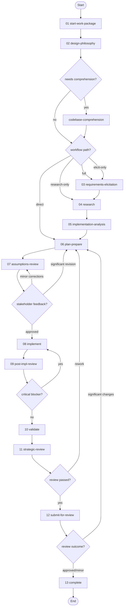
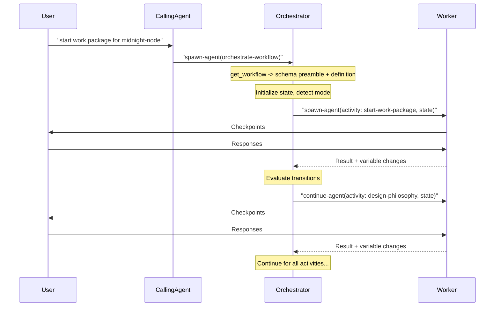
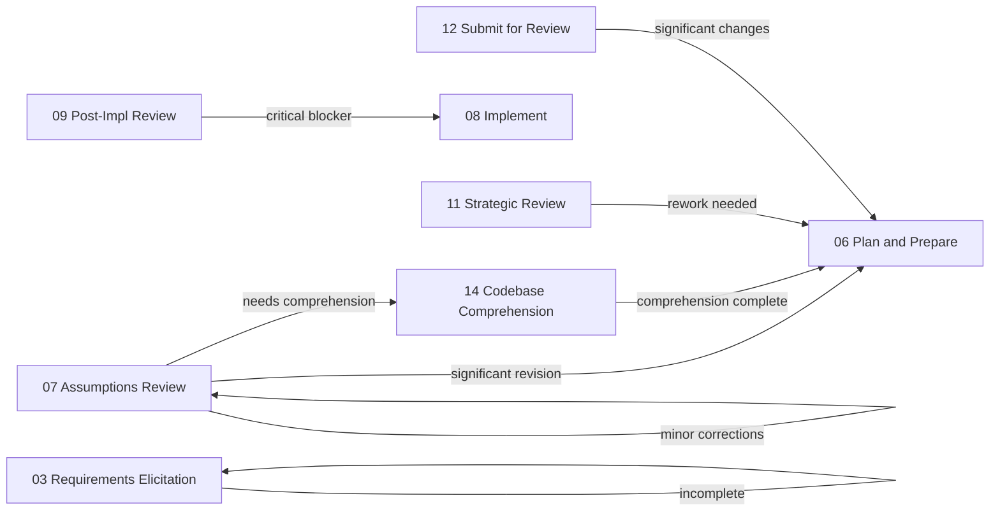

# Work Package Implementation Workflow

> v3.13.0 — Defines how to plan and implement ONE work package from inception to merged PR. A work package is a discrete unit of work such as a feature, bug-fix, enhancement, refactoring, or any other deliverable change. **Supports review mode** for conducting structured reviews of existing PRs.

---

## Overview

This workflow guides the complete lifecycle of a single work package through 14 activities total — 13 main activities plus 1 sub-flow (codebase comprehension, entered from design-philosophy or assumptions-review). Each activity has defined techniques, checkpoints, and transitions. Activities may be conditional (skipped based on complexity), looped (repeated on failure), or overridden (adapted for review mode).

| # | Activity | Required | Description |
|---|----------|----------|-------------|
| 01 | [**Start Work Package**](./activities/README.md#01-start-work-package) | yes | Verify/create issue, set up branch, PR, and planning folder |
| 02 | [**Design Philosophy**](./activities/README.md#02-design-philosophy) | yes | Classify problem, assess complexity, determine workflow path |
| 14 | [**Codebase Comprehension**](./activities/README.md#codebase-comprehension) | no | Build/augment mental model of codebase via persistent knowledge artifacts |
| 03 | [**Requirements Elicitation**](./activities/README.md#03-requirements-elicitation-optional) | optional | Clarify requirements through stakeholder conversation |
| 04 | [**Research**](./activities/README.md#04-research-optional) | optional | Gather best practices from knowledge base and web |
| 05 | [**Implementation Analysis**](./activities/README.md#05-implementation-analysis) | conditional | Understand current state, establish baselines |
| 06 | [**Plan & Prepare**](./activities/README.md#06-plan--prepare) | yes | Create implementation and test plans |
| 07 | [**Assumptions Review**](./activities/README.md#07-assumptions-review) | yes | Post plan summary and assumptions to issue tracker for stakeholder review |
| 08 | [**Implement**](./activities/README.md#08-implement) | yes | Execute tasks with implement-test-commit cycles |
| 09 | [**Post-Implementation Review**](./activities/README.md#09-post-implementation-review) | yes | Manual diff review, code review, test review, architecture summary |
| 10 | [**Validate**](./activities/README.md#10-validate) | yes | Run tests, build, and lint checks |
| 11 | [**Strategic Review**](./activities/README.md#11-strategic-review) | yes | Ensure minimal, focused changes |
| 12 | [**Submit for Review**](./activities/README.md#12-submit-for-review) | yes | Push PR, mark ready, handle reviewer feedback |
| 13 | [**Complete**](./activities/README.md#13-complete) | yes | Finalize documentation, create ADR, conduct retrospective |

**Detailed documentation:**

- **Activities:** See [activities/README.md](./activities/README.md) for detailed per-activity documentation including mermaid diagrams, steps, checkpoints, artifacts, and transitions.
- **Techniques:** See [techniques/](./techniques/) for the technique inventory and protocol flows.
- **Resources:** See [resources/README.md](./resources/README.md) for the resource index (27 resources).

Each activity binds its step operations through `step.technique`. The activity's `techniques` block no longer names a single `primary` — every step carries its own operation binding. The block lists only a `supporting[]` set of strategy techniques, supplied by the universal `meta` techniques [`variable-binding`](../meta/techniques/variable-binding.md) (present on every activity, governing how steps read and write workflow variables) and [`scatter-gather`](../meta/techniques/scatter-gather.md) (present on activities that aggregate per-item outputs across `forEach` iteration loops). Steps reference operation techniques either by bare id (e.g. `create-test-plan`) or by namespaced id (e.g. `cargo-operations::run-suite`, `design-philosophy::classify`).

---

## Workflow Flow


```mermaid
graph TD
    startNode(["Start"]) --> SWP["01 start-work-package"]
    SWP --> DP["02 design-philosophy"]

    DP --> COMP_CHK{"needs comprehension?"}
    COMP_CHK -->|"yes"| CC["codebase-comprehension"]
    COMP_CHK -->|"no"| PATH

    CC --> PATH{"workflow path?"}
    PATH -->|"full"| REL["03 requirements-elicitation"]
    PATH -->|"elicit-only"| REL
    PATH -->|"research-only"| RS
    PATH -->|"direct"| PP

    REL --> RS["04 research"]
    RS --> IA["05 implementation-analysis"]
    IA --> PP["06 plan-prepare"]

    PP --> AR["07 assumptions-review"]
    AR --> ARD{"stakeholder feedback?"}
    ARD -->|"approved"| IMP["08 implement"]
    ARD -->|"minor corrections"| AR
    ARD -->|"significant revision"| PP
    IMP --> PIR["09 post-impl-review"]
    PIR --> BLK{"critical blocker?"}
    BLK -->|"yes"| IMP
    BLK -->|"no"| VAL["10 validate"]

    VAL --> SR["11 strategic-review"]

    SR --> SRD{"review passed?"}
    SRD -->|"yes"| SFR["12 submit-for-review"]
    SRD -->|"rework"| PP

    SFR --> RVD{"review outcome?"}
    RVD -->|"approved/minor"| COMP["13 complete"]
    RVD -->|"significant changes"| PP

    COMP --> doneNode(["End"])
```

---

## Activities Summary

Under the bound-step model no activity declares a primary technique — each step carries its own `step.technique` binding, so the only technique an activity declares at the block level is its `techniques.supporting[]`. The **Supporting Techniques** column lists those strategy meta techniques: `variable-binding` is present on every activity, and `scatter-gather` is added on activities that aggregate per-item outputs across `forEach` loops. The **Prefix** column shows the server-assigned `artifactPrefix` (matching the activity number) prepended to bare artifact names at write time; activities that produce no prefixed artifacts show `—`.

| # | Activity | Supporting Techniques | Checkpoints | Prefix |
|---|----------|-------------------|-------------|--------|
| 01 | [Start Work Package](./activities/README.md#01-start-work-package) | `variable-binding` | 10 | — |
| 02 | [Design Philosophy](./activities/README.md#02-design-philosophy) | `variable-binding` | 3 | `02` |
| 14 | [Codebase Comprehension](./activities/README.md#codebase-comprehension-optional) | `variable-binding` | 1 | — |
| 03 | [Requirements Elicitation](./activities/README.md#03-requirements-elicitation-optional) | `variable-binding` | 2 | `03` |
| 04 | [Research](./activities/README.md#04-research-optional) | `variable-binding` | 4 | `04` |
| 05 | [Implementation Analysis](./activities/README.md#05-implementation-analysis) | `variable-binding`, `scatter-gather` | 2 | `05` |
| 06 | [Plan & Prepare](./activities/README.md#06-plan--prepare) | `variable-binding` | 1 | `06` |
| 07 | [Assumptions Review](./activities/README.md#07-assumptions-review) | `variable-binding`, `scatter-gather` | 2 | `07` |
| 08 | [Implement](./activities/README.md#08-implement) | `variable-binding`, `scatter-gather` | 4 | `08` |
| 09 | [Post-Impl Review](./activities/README.md#09-post-implementation-review) | `variable-binding` | 3 | `09` |
| 10 | [Validate](./activities/README.md#10-validate) | `variable-binding` | 0 | — |
| 11 | [Strategic Review](./activities/README.md#11-strategic-review) | `variable-binding` | 1 | `11` |
| 12 | [Submit for Review](./activities/README.md#12-submit-for-review) | `variable-binding` | 6 | — |
| 13 | [Complete](./activities/README.md#13-complete) | `variable-binding` | 0 | `13` |

See [activities/README.md](./activities/README.md) for detailed per-activity documentation with mermaid diagrams, step descriptions, checkpoint tables, artifact lists, and transition conditions.

---
## Orchestration Model

This workflow uses an **orchestrator/worker two-agent pattern**.


```mermaid
sequenceDiagram
    participant User
    participant Caller as CallingAgent
    participant Orch as Orchestrator
    participant Worker as Worker

    User->>Caller: "start work package for midnight-node"
    Caller->>Orch: "spawn-agent(orchestrate-workflow)"

    Note over Orch: get_workflow -> schema preamble + definition
    Note over Orch: Initialize state, detect mode

    Orch->>Worker: "spawn-agent(activity: start-work-package, state)"
    Worker->>User: Checkpoints
    User->>Worker: Responses
    Worker-->>Orch: Result + variable changes

    Note over Orch: Evaluate transitions

    Orch->>Worker: "continue-agent(activity: design-philosophy, state)"
    Worker->>User: Checkpoints
    User->>Worker: Responses
    Worker-->>Orch: Result + variable changes

    Note over Orch: Continue for all activities...
```

**Orchestrator** (role: `workflow-orchestrator`):
- Loads the workflow definition via `get_workflow` (receives schema preamble with all five JSON Schemas)
- Initializes state variables, detects mode
- Dispatches activities to the worker one at a time
- Evaluates transition conditions between activities
- Manages rework loops (transitions back to earlier activities)

**Worker** (role: `activity-worker`):
- Self-bootstraps from `next_activity` and `get_technique`
- Executes activity steps sequentially using the technique protocol
- Handles all checkpoints and user interaction directly
- Produces artifacts with `artifactPrefix` convention
- Reports structured results (variable changes, checkpoints, artifacts, steps completed)
- **Persists across activities** via harness-compat::continue-agent — preserves codebase understanding, file locations, and implementation decisions

This separation prevents context saturation in the orchestrator (which stays lean managing flow) while the worker accumulates rich domain context across the entire workflow.

---

## Review Mode

This workflow supports **review mode** for reviewing existing PRs rather than implementing new code. When activated, the workflow adapts its behavior using the formal `modes` schema construct and conditional steps/checkpoints/transitions.

**Activation:** Detected from user intent patterns such as "start review work package", "review PR #123", or "review existing implementation". Sets `is_review_mode = true`.

**Skipped activities:** Requirements Elicitation (03) and Implement (08) are always skipped in review mode. Elicitation is unnecessary because requirements come solely from the associated ticket. Implementation is skipped because the code already exists.

**Behavioral overrides per activity:**

| Activity | Override |
|----------|----------|
| [Start Work Package](./activities/README.md#01-start-work-package) (01) | Skip branch/PR creation; capture existing PR reference and Jira ticket |
| [Design Philosophy](./activities/README.md#02-design-philosophy) (02) | Assess ticket completeness; always skip elicitation |
| [Implementation Analysis](./activities/README.md#05-implementation-analysis) (05) | Checkout base branch to analyze pre-change state; document expected changes |
| [Post-Implementation Review](./activities/README.md#09-post-implementation-review) (09) | Compare PR changes against expected changes from analysis |
| [Validate](./activities/README.md#10-validate) (10) | Document failures as findings; do not fix |
| [Strategic Review](./activities/README.md#11-strategic-review) (11) | Document cleanup recommendations; do not apply. Override transition to submit-for-review |
| [Submit for Review](./activities/README.md#12-submit-for-review) (12) | Consolidate all review findings; post PR review comments. Override transition to workflow-end |
| [Complete](./activities/README.md#13-complete) (13) | Skip ADR and documentation steps; retrospective only |

**Review mode flow:**

```
start-work-package → design-philosophy → [research →] implementation-analysis → plan-prepare → assumptions-review → post-impl-review → validate → strategic-review → submit-for-review → END
```

**See [REVIEW-MODE.md](./REVIEW-MODE.md) for complete documentation.**

---

## Artifact Prefixing

Each review and documentation activity is assigned a server-computed `artifactPrefix` matching its activity number. Techniques produce bare artifact names (e.g., `code-review.md`) and the prefix is prepended at write time.

**Convention:**

```
{artifactPrefix}-{artifact-name}.md
```

**Examples:**

| Activity | Prefix | Bare Name | Final Name |
|----------|--------|-----------|------------|
| [Post-Implementation Review](./activities/README.md#09-post-implementation-review) | `09` | `code-review.md` | `09-code-review.md` |
| [Post-Implementation Review](./activities/README.md#09-post-implementation-review) | `09` | `test-suite-review.md` | `09-test-suite-review.md` |
| [Strategic Review](./activities/README.md#11-strategic-review) | `11` | `strategic-review-1.md` | `11-strategic-review-1.md` |
| [Strategic Review](./activities/README.md#11-strategic-review) | `11` | `architecture-summary.md` | `11-architecture-summary.md` |
| [Complete](./activities/README.md#13-complete) | `13` | `COMPLETE.md` | `13-COMPLETE.md` |

This convention ensures artifacts are naturally sorted by workflow phase when listed in the planning folder.

---

## Feedback Loops

The workflow contains seven feedback loops that enable iterative quality improvement. Each loop is triggered by a checkpoint or decision gate.

| From | To | Condition | Purpose |
|------|----|-----------|---------|
| [Assumptions Review](./activities/README.md#07-assumptions-review) (07) | [Assumptions Review](./activities/README.md#07-assumptions-review) (07) | `needs_further_discussion == true` | Minor corrections — re-prepare and re-post plan and assumptions comment |
| [Assumptions Review](./activities/README.md#07-assumptions-review) (07) | [Codebase Comprehension](./activities/README.md#codebase-comprehension-optional) (14) | `needs_comprehension == true` | Stakeholder feedback reveals codebase understanding gaps — deepen comprehension before revising plan |
| [Assumptions Review](./activities/README.md#07-assumptions-review) (07) | [Plan & Prepare](./activities/README.md#06-plan--prepare) (06) | `needs_plan_revision == true` | Stakeholder feedback requires significant approach revision |
| [Post-Implementation Review](./activities/README.md#09-post-implementation-review) (09) | [Implement](./activities/README.md#08-implement) (08) | `has_critical_blocker == true` | Critical blocker found during review requires code fix before proceeding |
| [Strategic Review](./activities/README.md#11-strategic-review) (11) | [Plan & Prepare](./activities/README.md#06-plan--prepare) (06) | `review_passed == false` | Significant rework needed — changes are not minimal or focused |
| [Submit for Review](./activities/README.md#12-submit-for-review) (12) | [Plan & Prepare](./activities/README.md#06-plan--prepare) (06) | `review_requires_changes == true` | Reviewer requested significant changes requiring re-planning |
| [Requirements Elicitation](./activities/README.md#03-requirements-elicitation-optional) (03) | [Requirements Elicitation](./activities/README.md#03-requirements-elicitation-optional) (03) | `elicitation_complete == false` | Elicitation incomplete — self-loop for further stakeholder discussion |


```mermaid
graph LR
    assumptionsReview["07 Assumptions Review"] -->|"minor corrections"| assumptionsReview
    assumptionsReview -->|"needs comprehension"| codebaseComprehension["14 Codebase Comprehension"]
    assumptionsReview -->|"significant revision"| planPrepare["06 Plan and Prepare"]
    codebaseComprehension -->|"comprehension complete"| planPrepare
    postImplReview["09 Post-Impl Review"] -->|"critical blocker"| implement["08 Implement"]
    strategicReview["11 Strategic Review"] -->|"rework needed"| planPrepare
    submitReview["12 Submit for Review"] -->|"significant changes"| planPrepare
    reqElicit["03 Requirements Elicitation"] -->|"incomplete"| reqElicit
```

---

## Variables (95)

The workflow declares 95 variables that drive control flow, store checkpoint state, and track progress. Variables are grouped by function below.

### Paths & Workspace

| Variable | Type | Description |
|----------|------|-------------|
| `target_path` | string | Working directory where edits, branch creation, builds, and PR operations occur — a dedicated git worktree of the component repo at the canonical path `~/projects/work/{component_name}/{wp-slug}/`. Set by `start-work-package` once the work-package slug is known; all downstream activities operate on this path. |
| `reference_path` | string | Reference checkout used for codebase comprehension, GitNexus indexing, and code-resolvable assumption analysis. The monorepo root when the component is a submodule, or the component's primary checkout when it is standalone. Not used for edits. |
| `component_name` | string | Basename of the component being worked on (e.g. `midnight-node`); used in the canonical worktree path formula. |
| `discovered_path` | string | Path the user originally pointed at; resolved by reference-resolution into `reference_path` / `component_name`. |
| `worktree_created` | boolean | True once `start-work-package` has created (or reused) a worktree at `target_path`. Drives the worktree cleanup gate in complete (default: `false`). |
| `planning_folder_path` | string | Path to planning folder: `.engineering/artifacts/planning/YYYY-MM-DD-{work-package-name}` |
| `provenance_log_path` | string | Absolute path to the AI-assistance provenance log (`provenance-log.md`), created under the planning folder during implementation. Read by the submit-for-review DCO checkpoint to show the log location (default: `""`). |

### Issue & PR Identifiers

| Variable | Type | Description |
|----------|------|-------------|
| `issue_number` | string | GitHub or Jira issue number |
| `issue_platform` | string | Issue tracking platform: `github` or `jira` |
| `issue_type` | string | Type of issue: feature, bug, task, enhancement, epic |
| `issue_title` | string | Tracker issue/ticket title; used by naming-conventions to derive the branch name. |
| `jira_issue_key` | string | Jira issue key in `PROJ-NNN` form, captured during issue verification when `issue_platform == 'jira'` (default: `""`). |
| `github_issue_found` | boolean | Whether a GitHub issue linked to the Jira ticket was found in the target repo (default: `false`). |
| `github_issue_number` | string | GitHub issue number linked to the Jira ticket (found via search or freshly created). |
| `pr_number` | string | Pull request number |
| `pr_url` | string | URL of the pull request created during `start-work-package` (default: `""`). |
| `existing_pr_number` | string | PR number returned by `gh pr list` when an existing draft PR is detected; empty string means none found (default: `""`). |
| `branch_name` | string | Feature branch name |
| `current_branch` | string | Active git branch in the target repo at the moment a step is executing (default: `""`). |
| `squash_merge_supported` | boolean | True when the target repo allows squash merges. Drives the DCO merge strategy (default: `false`). |

### Mode Variables

| Variable | Type | Description |
|----------|------|-------------|
| `review_pr_url` | string | URL of the PR being reviewed (review mode only) |
| `review_pr_captured` | boolean | Whether the PR reference has been captured in review mode (default: `false`). |
| `ticket_refactor_needed` | boolean | Whether the Jira ticket needs refactoring based on completeness assessment (default: `false`). |
| `ticket_gaps_documented` | boolean | Whether ticket completeness gaps were documented during review-mode design-philosophy (default: `false`). |
| `review_posted` | boolean | Whether the review summary was posted to the PR (review mode) (default: `false`). |

### Path Selection & Complexity

| Variable | Type | Description |
|----------|------|-------------|
| `problem_complexity` | string | Problem complexity assessed during design-philosophy: simple, moderate, or complex. Drives ADR creation. |
| `project_type` | string | Detected project type (e.g. `rust-substrate`); produced by project-type-detection and gates rust-substrate-specific validation steps. |
| `path_gating_complexity` | string | Path-gating mirror of `problem_complexity`, used by design-philosophy's skip-optional effect (default: `""`). |
| `problem_type` | string | Problem or inventive-goal classification set during design-philosophy (e.g. defect, inventive-improvement). |
| `needs_comprehension` | boolean | Whether codebase comprehension is needed; always true after design-philosophy, may be re-set by assumptions-review (default: `true`). |
| `needs_elicitation` | boolean | Whether requirements elicitation is needed (default: `false`). |
| `needs_research` | boolean | Whether research phase is needed (default: `false`). |
| `needs_further_research` | boolean | Whether additional research focus areas were identified during research (default: `false`). |
| `skip_optional_activities` | boolean | Whether to skip optional discovery activities — elicitation and research (default: `false`). |
| `elicitation_complete` | boolean | Whether requirements elicitation is finished (default: `false`). |
| `context_scope` | string | Provenance scope of AI-generated code: `repo-only`, `web-retrieval`, or `mixed` (default: `repo-only`). |
| `gitnexus_indexed` | boolean | Whether `reference_path` has a usable GitNexus index; gates GitNexus-dependent steps and phases (default: `false`). |

### Validation & Review Gates

| Variable | Type | Description |
|----------|------|-------------|
| `validation_passed` | boolean | Whether the validation phase passed (default: `false`). |
| `validation_results` | object | Aggregate validation envelope emitted by `cargo-operations::run-suite`: `{ check_status, clippy_status, test_status, fmt_status, validation_passed }`. The validate activity reads its fields by dotted path (e.g. `validation_results.validation_passed`) to drive the fix-revalidate loop. |
| `review_passed` | boolean | Whether strategic review passed (default: `false`). |
| `needs_code_fixes` | boolean | Whether code review findings require fixes before proceeding (default: `false`). |
| `needs_test_improvements` | boolean | Whether the test suite needs improvements before proceeding (default: `false`). |
| `needs_strategic_fixes` | boolean | Whether strategic review findings require fixes (default: `false`). |
| `needs_cleanup` | boolean | Whether minor cleanup is needed from strategic review (default: `false`). |
| `recommended_strategic_option` | string | Agent-recommended action after strategic review: `fix-findings` or `acceptable`. |
| `recommended_outcome` | string | Agent-recommended PR review outcome: `approved`, `minor-changes`, or `significant-changes`. |
| `review_requires_changes` | boolean | Whether PR review feedback requires returning to planning (default: `false`). |
| `strategic_findings_summary` | string | Concise summary of strategic-review findings interpolated into the review-findings checkpoint (default: `""`). |
| `review_comments_summary` | string | Concise summary of reviewer comments captured during submit-for-review (default: `""`). |

### Issue / PR Checkpoint State

| Variable | Type | Description |
|----------|------|-------------|
| `needs_issue_creation` | boolean | Whether a new issue needs to be created (default: `false`). |
| `needs_github_issue_creation` | boolean | Whether a GitHub issue should be created to mirror the Jira ticket (default: `false`). |
| `issue_skipped` | boolean | Whether issue creation was skipped by the user (default: `false`). |
| `issue_approved` | boolean | Whether the drafted issue was approved for creation (default: `false`). |
| `issue_cancelled` | boolean | Whether issue creation was cancelled by the user (default: `false`). |
| `pr_exists` | boolean | Whether a PR already exists for the current branch (default: `false`). |
| `use_existing_pr` | boolean | Whether to use an existing PR instead of creating a new one (default: `false`). |
| `pr_skipped` | boolean | Whether PR creation was skipped by the user (default: `false`). |

### Stakeholder & Assumption State

| Variable | Type | Description |
|----------|------|-------------|
| `has_stakeholder_input` | boolean | Whether a stakeholder discussion transcript was provided (default: `false`). |
| `post_jira_comment` | boolean | Whether to post the assumptions comment to Jira (default: `false`). |
| `has_stakeholder_comment` | boolean | Whether the stakeholder provided feedback on the Jira comment (default: `false`). |
| `stakeholder_review_complete` | boolean | Whether stakeholder review of assumptions is complete (default: `false`). |
| `needs_further_discussion` | boolean | Whether further stakeholder discussion is needed (default: `false`). |
| `needs_plan_revision` | boolean | Whether stakeholder feedback requires returning to plan-prepare (default: `false`). |
| `skip_assumption_review` | boolean | Whether to skip assumption review after task completion (default: `false`). |
| `has_resolvable_assumptions` | boolean | Whether code-resolvable assumptions exist that can be validated through targeted analysis (default: `false`). |
| `has_open_questions` | boolean | Whether unresolved open questions remain after the comprehension deep-dive (default: `false`). |
| `has_open_assumptions` | boolean | Whether unresolved assumptions remain after reconciliation that require stakeholder input (default: `false`). |
| `has_deferred_assumptions` | boolean | Whether any assumptions were deferred during review (triggers issue-tracker posting) (default: `false`). |
| `assumption_resolved_inline` | boolean | Whether the current assumption was resolved inline during the interview checkpoint (default: `false`). |
| `assumption_deferred` | boolean | Whether the current assumption was deferred during the interview checkpoint (default: `false`). |

### Review & Diff State

| Variable | Type | Description |
|----------|------|-------------|
| `has_flagged_blocks` | boolean | Whether the user flagged any change blocks during manual diff review (default: `false`). |
| `rationale_confirmed` | boolean | Whether the user confirmed rationale on the file-index-table checkpoint; drives the rationale-amendment prompt (default: `false`). |
| `has_critical_blocker` | boolean | Whether any flagged block is a critical blocker (default: `false`). |
| `skip_architecture_summary` | boolean | Whether to skip architecture summary creation (default: `false`). |
| `prism_artifact_paths` | array | Paths to prism structural-analysis artifacts produced during post-impl-review. |
| `comprehension_artifact` | string | Absolute path to the comprehension artifact for the current codebase area (default: `""`). |
| `artifact_name` | string | Filename of the comprehension artifact (basename only) used in user-facing messages (default: `""`). |
| `change_block_index` | string | Absolute path to the index file mapping change-block IDs to their per-block artifacts (default: `""`). |

### PR Body Conformance

| Variable | Type | Description |
|----------|------|-------------|
| `body_conforms` | boolean | True once the rendered PR body has passed every `update-pr::rules.pr-body-conformance` rule (default: `false`). |
| `body_findings` | array | List of pr-body-conformance violations; each entry is `{ rule_id, detail }` (default: `[]`). |
| `body_override_recorded` | boolean | True when proceed-with-override was selected on body-non-conformant (default: `false`). |
| `submission_aborted` | boolean | True when abort was selected on body-non-conformant (default: `false`). |

### Implementation Self-Review State

| Variable | Type | Description |
|----------|------|-------------|
| `has_uncertain_symbols` | boolean | True when the current implement task's self-review flagged symbols whose provenance could not be confirmed (default: `false`). |
| `uncertain_symbols` | string | Multi-line list of symbols flagged with unconfirmed provenance, interpolated into the symbol-provenance-confirmed checkpoint (default: `""`). |
| `block_path` | string | File path of the code block referenced by the current PR-review comment or implementation block (default: `""`). |
| `block_line_range` | string | Line range (e.g. `120-145`) of the current code block; pairs with `block_path` (default: `""`). |

### Plan & Loop Variables

| Variable | Type | Description |
|----------|------|-------------|
| `implementation_plan` | object | Implementation plan produced by plan-prepare: `{ task_count, tasks: [{ id, description, status }] }`. |
| `current_task` | object | Current task during the implementation loop (from `implementation_plan.tasks`). |
| `task_assumptions` | array | Assumptions collected during the current task for review iteration. |
| `current_assumption` | object | Current assumption during the assumption review loop: `{ id, statement }`. |
| `open_assumptions` | array | Open assumptions collected for `forEach` iteration during assumption interview loops. |
| `question_domains` | array | Question domains for requirements elicitation iteration. |
| `current_domain` | string | Current question domain during the elicitation loop (from `question_domains`). |
| `flagged_block_indices` | array | Change block indices flagged by the user during manual diff review. |
| `current_block_index` | number | Current block index during the manual diff review loop (default: `0`). |

See `workflow.toon` for the complete variable declarations with default values.

---

## Appendix: Workflow Rules

The following 6 rules are declared at the workflow level (`workflow.toon` `rules[]`) and apply to all activities:

1. Ask, don't assume — Clarify requirements before acting.
2. Summarize, then proceed — Provide brief status before asking to continue.
3. One task at a time — Complete current work before starting new work.
4. Explicit approval — Get clear "yes" or "proceed" before major actions (within activity checkpoints only — NOT between activities).
5. Decision points require user choice — When issues are found, user decides whether to proceed or loop back.
6. Git configuration is user-owned. Validate-action messages describe a misconfiguration but never prescribe config-changing commands; the user fixes their own environment at whatever scope (system, global, local) they prefer.

**Checkpoint discipline (applies workflow-wide):** Agents MUST NOT skip or auto-resolve blocking checkpoints (`blocking: true`) — these require explicit user selection. Advisory checkpoints (`blocking: false` with `autoAdvanceMs` and `defaultOption`) present a recommendation with a timed default; the user may override before the timer elapses. Both types are legitimate; the violation is bypassing a blocking checkpoint without user input.

**Orchestration model:** This workflow uses an orchestrator/worker pattern. The agent receiving the user request acts AS the orchestrator inline (role: `meta-orchestrator`, techniques from `meta/techniques`) — it MUST NOT be spawned as a sub-agent. The orchestrator loads the workflow, manages transitions, tracks state, and presents checkpoints to the user. A persistent worker sub-agent (role: `activity-worker`, techniques from `meta/techniques`) executes activity steps and produces artifacts. When the worker reaches a blocking checkpoint, it yields a `checkpoint_pending` result. The orchestrator presents the checkpoint to the user, then resumes the worker with the response. The worker is resumed across activities to preserve context. **CONSTRAINT:** Only ONE level of sub-agent indirection (the worker).

---

## Appendix: Artifact Locations

| Location Key | Path | Purpose |
|--------------|------|---------|
| `planning` | `{planning_folder_path}` | Work package planning documents and review artifacts |
| `reviews` | `.engineering/artifacts/reviews` | PR review analysis documents |
| `adr` | `.engineering/artifacts/adr` | Architecture Decision Records |
| `comprehension` | `.engineering/artifacts/comprehension` | Persistent codebase knowledge artifacts (cumulative across work packages) |

---

## Appendix: Estimated Time Per Activity

| Activity | Estimated Time |
|----------|---------------|
| [01 Start Work Package](./activities/README.md#01-start-work-package) | 10-20 min |
| [02 Design Philosophy](./activities/README.md#02-design-philosophy) | 10-20 min |
| [Codebase Comprehension](./activities/README.md#codebase-comprehension-optional) | 20-45 min |
| [03 Requirements Elicitation](./activities/README.md#03-requirements-elicitation-optional) | 15-30 min |
| [04 Research](./activities/README.md#04-research-optional) | 20-45 min |
| [05 Implementation Analysis](./activities/README.md#05-implementation-analysis) | 10-20 min |
| [06 Plan & Prepare](./activities/README.md#06-plan--prepare) | 20-45 min |
| [07 Assumptions Review](./activities/README.md#07-assumptions-review) | 10-20 min |
| [08 Implement](./activities/README.md#08-implement) | 1-4 hours |
| [09 Post-Implementation Review](./activities/README.md#09-post-implementation-review) | 15-30 min |
| [10 Validate](./activities/README.md#10-validate) | 15-30 min |
| [11 Strategic Review](./activities/README.md#11-strategic-review) | 15-30 min |
| [12 Submit for Review](./activities/README.md#12-submit-for-review) | 10-15 min |
| [13 Complete](./activities/README.md#13-complete) | 30-60 min |
| **Total (full workflow)** | **~4-10 hours** |
