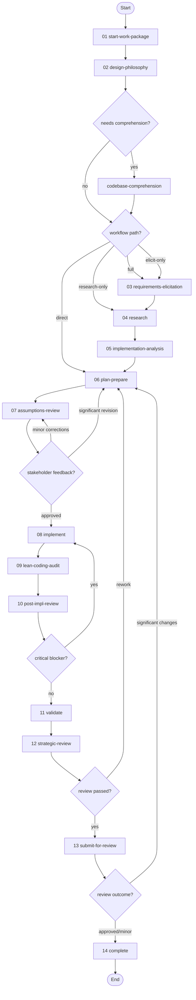
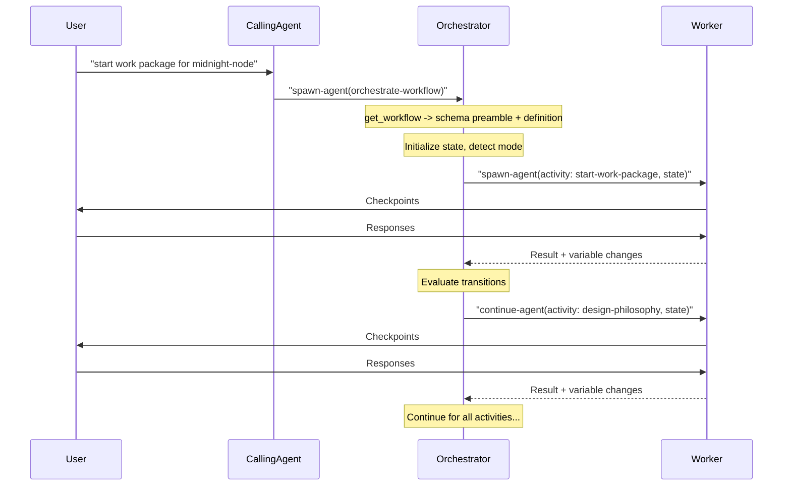
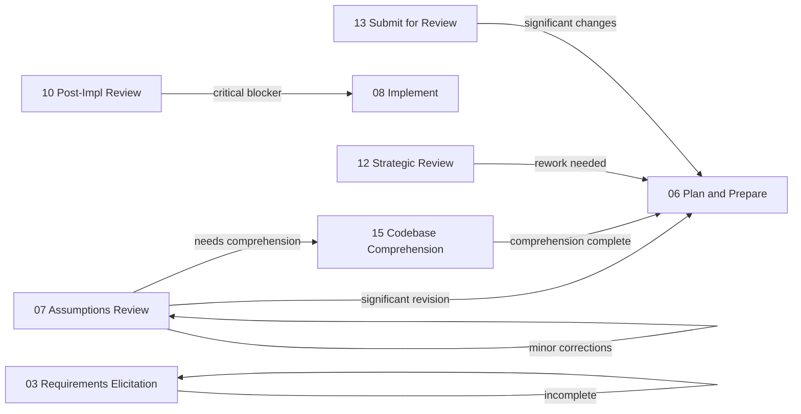

# Work Package Implementation Workflow

> v3.14.0 — Defines how to plan and implement ONE work package from inception to merged PR. A work package is a discrete unit of work such as a feature, bug-fix, enhancement, refactoring, or any other deliverable change. **Supports review mode** for conducting structured reviews of existing PRs.

---

## Overview

This workflow guides the complete lifecycle of a single work package through 15 activities total — 14 main activities plus 1 sub-flow (codebase comprehension, entered from design-philosophy or assumptions-review). Each activity has defined techniques, checkpoints, and transitions. Activities may be conditional (skipped based on complexity), looped (repeated on failure), or overridden (adapted for review mode).

| # | Activity | Required | Description |
|---|----------|----------|-------------|
| 01 | [**Start Work Package**](./activities/README.md#01-start-work-package) | yes | Verify/create issue, set up branch, PR, and planning folder |
| 02 | [**Design Philosophy**](./activities/README.md#02-design-philosophy) | yes | Classify problem, assess complexity, determine workflow path |
| 15 | [**Codebase Comprehension**](./activities/README.md#codebase-comprehension-optional) | no | Build/augment mental model of codebase via persistent knowledge artifacts |
| 03 | [**Requirements Elicitation**](./activities/README.md#03-requirements-elicitation-optional) | optional | Clarify requirements through stakeholder conversation |
| 04 | [**Research**](./activities/README.md#04-research-optional) | optional | Gather best practices from knowledge base and web |
| 05 | [**Implementation Analysis**](./activities/README.md#05-implementation-analysis-optional) | conditional | Understand current state, establish baselines |
| 06 | [**Plan & Prepare**](./activities/README.md#06-plan--prepare) | yes | Create implementation and test plans |
| 07 | [**Assumptions Review**](./activities/README.md#07-assumptions-review) | yes | Post plan summary and assumptions to issue tracker for stakeholder review |
| 08 | [**Implement**](./activities/README.md#08-implement) | yes | Execute tasks with implement-test-commit cycles |
| 09 | [**Lean-Coding Audit**](./activities/README.md#09-lean-coding-audit) | yes | Tag and score over-engineering, harvest deliberate-simplification debt, apply accepted simplifications |
| 10 | [**Post-Implementation Review**](./activities/README.md#10-post-implementation-review) | yes | Manual diff review, code review, test review, architecture summary |
| 11 | [**Validate**](./activities/README.md#11-validate) | yes | Run tests, build, and lint checks |
| 12 | [**Strategic Review**](./activities/README.md#12-strategic-review) | yes | Ensure minimal, focused changes |
| 13 | [**Submit for Review**](./activities/README.md#13-submit-for-review) | yes | Push PR, mark ready, handle reviewer feedback |
| 14 | [**Complete**](./activities/README.md#14-complete) | yes | Finalize documentation, create ADR, conduct retrospective |

**Detailed documentation:**

- **Activities:** See [activities/README.md](./activities/README.md) for per-activity orientation (purpose, role, and a flow diagram) and a link to each activity's authoritative YAML definition.
- **Techniques:** See [techniques/](./techniques/) for the technique inventory and protocol flows.
- **Resources:** See [resources/README.md](./resources/README.md) for the resource index (26 resources).

Each activity binds its step operations through `step.technique`. Every step carries its own `step.technique` operation binding. The cross-cutting [`variable-binding`](../meta/techniques/variable-binding.md) technique (governing how steps read and write workflow variables) is declared once at `workflow.techniques.activity` and inherited by every activity — injected into every `get_activity` — so it is never listed per-activity. An activity declares its own `techniques[]` block only for an activity-specific strategy technique such as [`scatter-gather`](../meta/techniques/scatter-gather.md) (present on activities that aggregate per-item outputs across `forEach` iteration loops). Steps reference operation techniques either by bare id (e.g. `create-test-plan`) or by namespaced id (e.g. `cargo-operations::run-suite`, `design-philosophy::classify`).

---

## Workflow Flow


```mermaid
graph TD
    startNode(["Start"]) --> SWP["01 start-work-package"]
    SWP --> DP["02 design-philosophy"]

    DP --> COMP_CHK{"needs comprehension?"}
    COMP_CHK -->|"yes"| CC["codebase-comprehension"]
    COMP_CHK -->|"no"| PATH

    CC --> PATH{"workflow path?"}
    PATH -->|"full"| REL["03 requirements-elicitation"]
    PATH -->|"elicit-only"| REL
    PATH -->|"research-only"| RS
    PATH -->|"direct"| PP

    REL --> RS["04 research"]
    RS --> IA["05 implementation-analysis"]
    IA --> PP["06 plan-prepare"]

    PP --> AR["07 assumptions-review"]
    AR --> ARD{"stakeholder feedback?"}
    ARD -->|"approved"| IMP["08 implement"]
    ARD -->|"minor corrections"| AR
    ARD -->|"significant revision"| PP
    IMP --> LCA["09 lean-coding-audit"]
    LCA --> PIR["10 post-impl-review"]
    PIR --> BLK{"critical blocker?"}
    BLK -->|"yes"| IMP
    BLK -->|"no"| VAL["11 validate"]

    VAL --> SR["12 strategic-review"]

    SR --> SRD{"review passed?"}
    SRD -->|"yes"| SFR["13 submit-for-review"]
    SRD -->|"rework"| PP

    SFR --> RVD{"review outcome?"}
    RVD -->|"approved/minor"| COMP["14 complete"]
    RVD -->|"significant changes"| PP

    COMP --> doneNode(["End"])
```

---

## Activities Summary

Under the bound-step model each step carries its own `step.technique` binding, so the only techniques an activity declares at the block level are its activity-specific strategy techniques in `techniques[]`. The cross-cutting `variable-binding` technique is declared once at `workflow.techniques.activity` and inherited by every activity, so it is not repeated per-activity. The **Strategy Technique** column therefore lists only the activity-specific strategy techniques: `scatter-gather` appears on activities that aggregate per-item outputs across `forEach` loops; activities with none show `—`. The **Prefix** column shows the server-assigned `artifactPrefix` (matching the activity number) prepended to bare artifact names at write time; activities that produce no prefixed artifacts show `—`.

| # | Activity | Strategy Technique | Prefix |
|---|----------|-------------------|--------|
| 01 | [Start Work Package](./activities/README.md#01-start-work-package) | — | — |
| 02 | [Design Philosophy](./activities/README.md#02-design-philosophy) | — | `02` |
| 15 | [Codebase Comprehension](./activities/README.md#codebase-comprehension-optional) | — | — |
| 03 | [Requirements Elicitation](./activities/README.md#03-requirements-elicitation-optional) | — | `03` |
| 04 | [Research](./activities/README.md#04-research-optional) | — | `04` |
| 05 | [Implementation Analysis](./activities/README.md#05-implementation-analysis-optional) | `scatter-gather` | `05` |
| 06 | [Plan & Prepare](./activities/README.md#06-plan--prepare) | — | `06` |
| 07 | [Assumptions Review](./activities/README.md#07-assumptions-review) | `scatter-gather` | `07` |
| 08 | [Implement](./activities/README.md#08-implement) | `scatter-gather` | `08` |
| 09 | [Lean-Coding Audit](./activities/README.md#09-lean-coding-audit) | — | `09` |
| 10 | [Post-Impl Review](./activities/README.md#10-post-implementation-review) | — | `10` |
| 11 | [Validate](./activities/README.md#11-validate) | — | — |
| 12 | [Strategic Review](./activities/README.md#12-strategic-review) | — | `12` |
| 13 | [Submit for Review](./activities/README.md#13-submit-for-review) | — | — |
| 14 | [Complete](./activities/README.md#14-complete) | — | `14` |

See [activities/README.md](./activities/README.md) for per-activity orientation and flow diagrams; each activity's full definition (steps, checkpoints, transitions) lives in its YAML, served by `get_activity`.

---
## Orchestration Model

This workflow uses an **orchestrator/worker two-agent pattern**.


```mermaid
sequenceDiagram
    participant User
    participant Caller as CallingAgent
    participant Orch as Orchestrator
    participant Worker as Worker

    User->>Caller: "start work package for midnight-node"
    Caller->>Orch: "spawn-agent(orchestrate-workflow)"

    Note over Orch: get_workflow -> schema preamble + definition
    Note over Orch: Initialize state, detect mode

    Orch->>Worker: "spawn-agent(activity: start-work-package, state)"
    Worker->>User: Checkpoints
    User->>Worker: Responses
    Worker-->>Orch: Result + variable changes

    Note over Orch: Evaluate transitions

    Orch->>Worker: "continue-agent(activity: design-philosophy, state)"
    Worker->>User: Checkpoints
    User->>Worker: Responses
    Worker-->>Orch: Result + variable changes

    Note over Orch: Continue for all activities...
```

**Orchestrator** (role: `workflow-orchestrator`):
- Loads the workflow definition via `get_workflow` (receives schema preamble with all five JSON Schemas)
- Initializes state variables (review mode is set by an early detection step that flips the `is_review_mode` variable)
- Dispatches activities to the worker one at a time
- Evaluates transition conditions between activities
- Manages rework loops (transitions back to earlier activities)

**Worker** (role: `activity-worker`):
- Self-bootstraps from `next_activity` and `get_technique`
- Executes activity steps sequentially using the technique protocol
- Handles all checkpoints and user interaction directly
- Produces artifacts with `artifactPrefix` convention
- Reports structured results (variable changes, checkpoints, artifacts, steps completed)
- **Persists across activities** via harness-compat::continue-agent — preserves codebase understanding, file locations, and implementation decisions

This separation prevents context saturation in the orchestrator (which stays lean managing flow) while the worker accumulates rich domain context across the entire workflow.

---

## Review Mode

This workflow supports **review mode** for reviewing existing PRs rather than implementing new code. There is no special mode schema: review mode is expressed entirely through ordinary state. A detection step early in `start-work-package` sets the boolean `is_review_mode` variable, and every mode-specific behaviour is a conditional step/checkpoint/transition gated on that variable.

**Activation:** A detection step in `start-work-package` recognizes review intent (e.g. "start review work package", "review PR #123", "review existing implementation"), confirms with the user, and sets `is_review_mode = true`.

**Skipped activities:** Requirements Elicitation (03) and Implement (08) are effectively skipped in review mode — not by a schema list, but because their steps and inbound transitions are gated `when is_review_mode != true`. Elicitation is unnecessary because requirements come solely from the associated ticket; implementation is skipped because the code already exists.

**Behavioral overrides per activity:**

| Activity | Override |
|----------|----------|
| [Start Work Package](./activities/README.md#01-start-work-package) (01) | Skip branch/PR creation; capture existing PR reference and Jira ticket |
| [Design Philosophy](./activities/README.md#02-design-philosophy) (02) | Assess ticket completeness; always skip elicitation |
| [Implementation Analysis](./activities/README.md#05-implementation-analysis-optional) (05) | Checkout base branch to analyze pre-change state; document expected changes |
| [Lean-Coding Audit](./activities/README.md#09-lean-coding-audit) (09) | Run the audit read-only — document over-engineering findings and the debt ledger; skip the apply checkpoint and simplification cycle (no code changes) |
| [Post-Implementation Review](./activities/README.md#10-post-implementation-review) (10) | Compare PR changes against expected changes from analysis |
| [Validate](./activities/README.md#11-validate) (11) | Document failures as findings; do not fix |
| [Strategic Review](./activities/README.md#12-strategic-review) (12) | Document cleanup recommendations; do not apply. Override transition to submit-for-review |
| [Submit for Review](./activities/README.md#13-submit-for-review) (13) | Consolidate all review findings; post PR review comments. Override transition to workflow-end |
| [Complete](./activities/README.md#14-complete) (14) | Skip ADR and documentation steps; retrospective only |

**Review mode flow:**

```
start-work-package → design-philosophy → implementation-analysis → plan-prepare → assumptions-review → lean-coding-audit → post-impl-review → validate → strategic-review → submit-for-review → END
```

**Headless after activation:** Once review mode is confirmed, the run is headless — every review-reachable checkpoint auto-resolves to its recommended option, is gated out, or is bypassed by an unconditional transition. The only interactive gates a review-mode run actually stops at are the two activation prompts (`review-mode-detection`, `review-pr-reference`) and the single `review-summary-approval` confirmation before the review is posted to the PR.

**See [REVIEW-MODE.md](./REVIEW-MODE.md) for complete documentation.**

---

## Artifact Prefixing

Each review and documentation activity is assigned a server-computed `artifactPrefix` matching its activity number. Techniques produce bare artifact names (e.g., `code-review.md`) and the prefix is prepended at write time.

**Convention:**

```
{artifactPrefix}-{artifact-name}.md
```

**Examples:**

| Activity | Prefix | Bare Name | Final Name |
|----------|--------|-----------|------------|
| [Lean-Coding Audit](./activities/README.md#09-lean-coding-audit) | `09` | `debt-ledger.md` | `09-debt-ledger.md` |
| [Post-Implementation Review](./activities/README.md#10-post-implementation-review) | `10` | `code-review.md` | `10-code-review.md` |
| [Post-Implementation Review](./activities/README.md#10-post-implementation-review) | `10` | `test-suite-review.md` | `10-test-suite-review.md` |
| [Strategic Review](./activities/README.md#12-strategic-review) | `12` | `strategic-review-1.md` | `12-strategic-review-1.md` |
| [Strategic Review](./activities/README.md#12-strategic-review) | `12` | `architecture-summary.md` | `12-architecture-summary.md` |
| [Complete](./activities/README.md#14-complete) | `14` | `COMPLETE.md` | `14-COMPLETE.md` |

This convention ensures artifacts are naturally sorted by workflow phase when listed in the planning folder.

---

## Feedback Loops

The workflow contains seven feedback loops that enable iterative quality improvement. Each loop is triggered by a checkpoint or decision gate.

| From | To | Purpose |
|------|----|---------|
| [Assumptions Review](./activities/README.md#07-assumptions-review) (07) | [Assumptions Review](./activities/README.md#07-assumptions-review) (07) | Minor corrections — re-prepare and re-post plan and assumptions comment |
| [Assumptions Review](./activities/README.md#07-assumptions-review) (07) | [Codebase Comprehension](./activities/README.md#codebase-comprehension-optional) (15) | Stakeholder feedback reveals codebase understanding gaps — deepen comprehension before revising plan |
| [Assumptions Review](./activities/README.md#07-assumptions-review) (07) | [Plan & Prepare](./activities/README.md#06-plan--prepare) (06) | Stakeholder feedback requires significant approach revision |
| [Post-Implementation Review](./activities/README.md#10-post-implementation-review) (10) | [Implement](./activities/README.md#08-implement) (08) | Critical blocker found during review requires code fix before proceeding |
| [Strategic Review](./activities/README.md#12-strategic-review) (12) | [Plan & Prepare](./activities/README.md#06-plan--prepare) (06) | Significant rework needed — changes are not minimal or focused |
| [Submit for Review](./activities/README.md#13-submit-for-review) (13) | [Plan & Prepare](./activities/README.md#06-plan--prepare) (06) | Reviewer requested significant changes requiring re-planning |
| [Requirements Elicitation](./activities/README.md#03-requirements-elicitation-optional) (03) | [Requirements Elicitation](./activities/README.md#03-requirements-elicitation-optional) (03) | Elicitation incomplete — self-loop for further stakeholder discussion |


```mermaid
graph LR
    assumptionsReview["07 Assumptions Review"] -->|"minor corrections"| assumptionsReview
    assumptionsReview -->|"needs comprehension"| codebaseComprehension["15 Codebase Comprehension"]
    assumptionsReview -->|"significant revision"| planPrepare["06 Plan and Prepare"]
    codebaseComprehension -->|"comprehension complete"| planPrepare
    postImplReview["10 Post-Impl Review"] -->|"critical blocker"| implement["08 Implement"]
    strategicReview["12 Strategic Review"] -->|"rework needed"| planPrepare
    submitReview["13 Submit for Review"] -->|"significant changes"| planPrepare
    reqElicit["03 Requirements Elicitation"] -->|"incomplete"| reqElicit
```

---

## Appendix: Artifact Locations

| Location | Path | Purpose |
|----------|------|---------|
| Planning | `{planning_folder_path}` | Work package planning documents and review artifacts |
| Reviews | `.engineering/artifacts/reviews` | PR review analysis documents |
| ADR | `.engineering/artifacts/adr` | Architecture Decision Records |
| Comprehension | `.engineering/artifacts/comprehension` | Persistent codebase knowledge artifacts (cumulative across work packages) |
