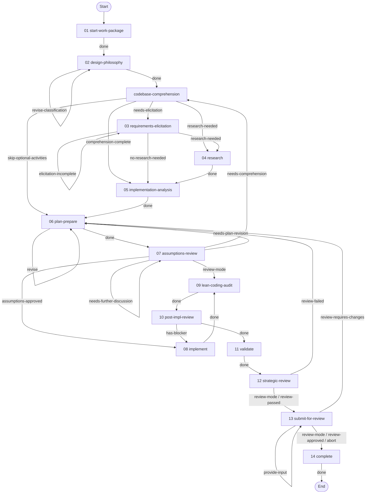

# Work Package Implementation Workflow

> Carries ONE work package to the terminal state its mode reaches — a merged pull request on the implementation path, a posted review awaiting the author's disposition on the review path.

---

## Overview

This workflow guides the complete lifecycle of a single work package through its main activities plus a codebase-comprehension sub-flow, entered from design-philosophy or assumptions-review. Each activity has defined techniques, checkpoints, and transitions. Activities may be conditional (skipped based on complexity), looped (repeated on failure), or overridden (adapted for review mode).

Assumption and comprehension stages converge agent-resolvable concerns (analyse → challenge → combine) before residual stakeholder asks.

| # | Activity | Description |
|---|----------|-------------|
| 01 | [**Start Work Package**](./activities/README.md#01-start-work-package) | Verify/create issue, set up branch, PR, and planning folder |
| 02 | [**Design Philosophy**](./activities/README.md#02-design-philosophy) | Classify problem, assess complexity, determine workflow path |
| 15 | [**Codebase Comprehension**](./activities/README.md#codebase-comprehension-optional) | Build/augment mental model of codebase via persistent knowledge artifacts |
| 03 | [**Requirements Elicitation**](./activities/README.md#03-requirements-elicitation-optional) | Clarify requirements through stakeholder conversation |
| 04 | [**Research**](./activities/README.md#04-research-optional) | Gather best practices from knowledge base and web |
| 05 | [**Implementation Analysis**](./activities/README.md#05-implementation-analysis-optional) | Understand current state, establish baselines |
| 06 | [**Plan & Prepare**](./activities/README.md#06-plan--prepare) | Create implementation and test plans |
| 07 | [**Assumptions Review**](./activities/README.md#07-assumptions-review) | Post plan summary and assumptions to issue tracker for stakeholder review |
| 08 | [**Implement**](./activities/README.md#08-implement) | Execute tasks with implement-test-commit cycles |
| 09 | [**Lean-Coding Audit**](./activities/README.md#09-lean-coding-audit) | Tag and score over-engineering, harvest deliberate-simplification debt, apply accepted simplifications |
| 10 | [**Post-Implementation Review**](./activities/README.md#10-post-implementation-review) | Manual diff review, code review, structural analysis, test review |
| 11 | [**Validate**](./activities/README.md#11-validate) | Run tests, build, and lint checks |
| 12 | [**Strategic Review**](./activities/README.md#12-strategic-review) | Ensure minimal, focused changes |
| 13 | [**Submit for Review**](./activities/README.md#13-submit-for-review) | Push PR, mark ready, handle reviewer feedback |
| 14 | [**Complete**](./activities/README.md#14-complete) | Finalize documentation, create ADR, resolve session traces, and conduct retrospective |

**Detailed documentation:**

- **Activities:** See [activities/README.md](./activities/README.md) for per-activity orientation (purpose, role, and a flow diagram) and a link to each activity's authoritative YAML definition.
- **Techniques:** See [techniques/README.md](./techniques/README.md) for the technique inventory orientation; per-technique protocols live in the technique files.
- **Resources:** See [resources/README.md](./resources/README.md) for the resource index.

The cross-cutting [`variable-binding`](../meta/techniques/variable-binding.md) technique applies to every activity. An activity declares its own `techniques[]` block only for an activity-specific strategy technique such as [`scatter-gather`](../meta/techniques/scatter-gather.md), on activities that aggregate per-item outputs across iteration.

---

## Workflow Flow

```mermaid
graph TD
    startNode(["Start"]) --> SWP["01 start-work-package"]
    SWP -->|"done"| DP["02 design-philosophy"]

    DP -->|"revise-classification"| DP
    DP -->|"done"| CC["codebase-comprehension"]

    CC -->|"needs-elicitation"| REL["03 requirements-elicitation"]
    CC -->|"research-needed"| RS["04 research"]
    CC -->|"skip-optional-activities"| PP["06 plan-prepare"]
    CC -->|"comprehension-complete"| IA["05 implementation-analysis"]

    REL -->|"elicitation-incomplete"| REL
    REL -->|"research-needed"| RS
    REL -->|"no-research-needed"| IA
    RS -->|"done"| IA
    IA -->|"done"| PP

    PP -->|"revise"| PP
    PP -->|"done"| AR["07 assumptions-review"]

    AR -->|"needs-further-discussion"| AR
    AR -->|"needs-comprehension"| CC
    AR -->|"needs-plan-revision"| PP
    AR -->|"review-mode"| LCA["09 lean-coding-audit"]
    AR -->|"assumptions-approved"| IMP["08 implement"]

    IMP -->|"done"| LCA
    LCA -->|"done"| PIR["10 post-impl-review"]
    PIR -->|"has-blocker"| IMP
    PIR -->|"done"| VAL["11 validate"]
    VAL -->|"done"| SR["12 strategic-review"]

    SR -->|"review-failed"| PP
    SR -->|"review-mode / review-passed"| SFR["13 submit-for-review"]

    SFR -->|"provide-input"| SFR
    SFR -->|"review-requires-changes"| PP
    SFR -->|"review-mode / review-approved / abort"| COMP["14 complete"]

    COMP -->|"done"| doneNode(["End"])
```

---
## Orchestration Model

Inherits the meta orchestrator/worker pattern — [workflow-orchestrator](../meta/techniques/workflow-engine/workflow-orchestrator.md) / [activity-worker](../meta/techniques/workflow-engine/activity-worker.md) via [dispatch-activity](../meta/techniques/workflow-engine/dispatch-activity.md). Work-package-specific mode behaviour is below.

---

## Review Mode

The workflow carries a work package over an existing pull request as well as over a new implementation. Review mode is ordinary state — a boolean `is_review_mode` variable, with every mode-specific behaviour expressed as a condition on a step, a checkpoint, or an exit predicate.

[REVIEW-MODE.md](./REVIEW-MODE.md) is where review mode is documented: how it activates, what it changes, and where a review run still stops for a person.

---

## Appendix: Artifact Locations

| Location | Path | Purpose |
|----------|------|---------|
| Planning | `{planning_folder_path}` | Work package planning documents and review artifacts |
| Session trace | `{planning_folder_path}/session-trace.md` | Lean mechanical close-out summary (tool counts, durations, errors, validation-warning clusters) when opaque handoff tokens resolve |
| Reviews | `.engineering/artifacts/reviews` | PR review analysis documents |
| ADR | `.engineering/artifacts/adr` | Architecture Decision Records |
| Comprehension | `{comprehension_dir}` | Persistent codebase knowledge artifacts (cumulative across work packages) |
