# Work Package Implementation Workflow

> Defines how to plan and implement ONE work package from inception to merged PR. A work package is a discrete unit of work such as a feature, bug-fix, enhancement, refactoring, or any other deliverable change.

## Overview

This workflow guides the complete lifecycle of a single work package:
1. **Issue Management** → Verify/create issue, set up branch and PR
2. **Requirements Elicitation** (optional) → Clarify requirements
3. **Implementation Analysis** → Understand current state
4. **Research** (optional) → Gather best practices
5. **Plan & Prepare** → Design approach and create plan
6. **Implement** → Execute tasks with review cycles
7. **Validate** → Run tests and verify build
8. **Strategic Review** → Ensure minimal, focused changes
9. **Finalize** → Complete documentation
10. **Update PR** → Push and mark ready for review
11. **Post-Implementation** → Handle reviews and retrospective

**Key characteristics:**
- Sequential flow with conditional branches
- Multiple feedback loops for quality gates
- 17 checkpoints across all activities
- Task implementation loop with reviews

## Workflow Flow

**Legend:** 🔵 Setup | 🟠 Development | 🟢 Validation | 🔴 Finalization

---

## Activities

### 1. Issue Management

**Purpose:** Verify or create an issue, then create feature branch and PR. Issues define the problem space and provide traceability from requirements through implementation.

**Primary Skill:** `issue-management`  
**Supporting Skills:** `git-workflow`, `pr-creation`, `artifact-management`

```mermaid
graph TD
    subgraph issue-management[Issue Management]
        s1([Detect project type])
        s2([Check for existing issue])
        s3([Create issue if needed])
        s4([Create feature branch])
        s5([Create draft PR])
        s6([Initialize planning folder])
        s7([Determine next phase])
        
        cp1{Issue exists?}
        cp2{Platform?}
        cp3{PR created?}
        cp4{Elicitation needed?}
        
        s1 --> s2 --> cp1
        cp1 -->|provide| s4
        cp1 -->|create| cp2
        cp1 -->|skip| s4
        
        cp2 -->|github| CreateGH([Create GitHub Issue])
        cp2 -->|jira| CreateJira([Create Jira Issue])
        
        CreateGH --> s4
        CreateJira --> s4
        
        s4 --> s5 --> s6 --> s7 --> cp4
        
        cp4 -->|yes| Next1([→ requirements-elicitation])
        cp4 -->|no| Next2([→ implementation-analysis])
    end
```

**Checkpoints:**
1. Issue Verification: "I didn't find an issue. Which option?"
2. Platform Selection: "Which platform should I create this issue in?"
3. Issue Type: "What type of issue is this?"
4. Issue Review: "Here's the drafted issue. Does this look correct?"
5. PR Creation: "Proceed to create feature branch and draft PR?"
6. Next Phase: "Do you need requirements elicitation?"

---

### 2. Requirements Elicitation (Optional)

**Purpose:** Discover and clarify what the work package should accomplish through structured conversation.

**Primary Skill:** `requirements-elicitation`  
**Supporting Skill:** `artifact-management`

```mermaid
graph TD
    subgraph requirements-elicitation[Requirements Elicitation]
        r1([Explore problem space])
        r2([Identify stakeholders])
        r3([Define scope boundaries])
        r4([Establish success criteria])
        r5([Create requirements document])
        cp1{Requirements confirmed?}
        
        r1 --> r2 --> r3 --> r4 --> r5 --> cp1
        cp1 -->|confirmed| Next([→ implementation-analysis])
        cp1 -->|clarify| r1
    end
```

**Checkpoint:** "Have I understood the requirements correctly?"

---

### 3. Implementation Analysis

**Purpose:** Analyze current implementation to understand effectiveness, establish baselines, identify opportunities.

**Primary Skill:** `implementation-analysis`  
**Supporting Skill:** `artifact-management`

```mermaid
graph TD
    subgraph implementation-analysis[Implementation Analysis]
        a1([Complete analysis])
        a2([Create analysis document])
        cp1{Research needed?}
        
        a1 --> a2 --> cp1
        cp1 -->|yes-research| Next1([→ research])
        cp1 -->|no-skip| Next2([→ plan-prepare])
    end
```

**Checkpoint:** "Implementation analysis complete. Would you like to perform research?"

---

### 4. Research (Optional)

**Purpose:** Research knowledge base and external sources to discover best practices and patterns.

**Primary Skill:** `knowledge-research`

```mermaid
graph TD
    subgraph research[Research]
        rs1([Knowledge base research])
        rs2([Web research])
        rs3([Create research document])
        cp1{KB insights confirmed?}
        cp2{Web research confirmed?}
        
        rs1 --> cp1
        cp1 -->|confirmed| rs2
        cp1 -->|more| rs1
        rs2 --> cp2
        cp2 -->|confirmed| rs3
        cp2 -->|more| rs2
        rs3 --> Next([→ plan-prepare])
    end
```

**Checkpoints:**
1. "Knowledge insights confirmed?"
2. "Web research findings confirmed?"

---

### 5. Plan & Prepare

**Purpose:** Design the approach, create the work package plan, and prepare for implementation.

**Primary Skill:** `planning`  
**Supporting Skills:** `design-framework`, `test-planning`

**Checkpoints:**
1. "Approach confirmed?"
2. "Ready to implement?"

---

### 6. Implement Tasks

**Purpose:** Execute the implementation plan task by task with review cycles.

**Primary Skill:** `implementation`  
**Supporting Skills:** `assumptions-review`, `task-review`, `architecture-review`

**Checkpoints:**
1. Task Progress: "Review assumptions. Are they confirmed?"
2. Code Review: "Review findings confirmed?"
3. Architectural Significance: "Significance assessment confirmed?"
4. ADR: "ADR confirmed?" (if significant)

---

### 7. Validate

**Purpose:** Validate implementation through comprehensive testing. All tests must pass.

**Primary Skill:** `validation`

**Decision:** Pass → strategic-review | Minor issues → implement | Major issues → plan-prepare

---

### 8. Strategic Review

**Purpose:** Ensure changes are minimal and focused. Validate the PR contains only required changes.

**Primary Skill:** `strategic-review`

```mermaid
graph TD
    subgraph strategic-review[Strategic Review]
        sr1([Complete strategic review])
        cp1{Review findings confirmed?}
        dec{Review result?}
        
        sr1 --> cp1
        cp1 -->|confirmed| dec
        cp1 -->|needs-cleanup| sr1
        
        dec -->|pass| Next1([→ finalize])
        dec -->|issues| Next2([→ plan-prepare])
    end
```

**Checkpoint:** "Review findings confirmed?"

**Decision:** Pass → finalize | Issues found → plan-prepare

---

### 9. Finalize

**Purpose:** Finalize documentation after implementation is complete.

**Primary Skill:** `documentation`

```mermaid
graph TD
    subgraph finalize[Finalize]
        f1([Update ADR status])
        f2([Finalize test plan])
        f3([Create COMPLETE.md])
        f4([Ensure inline docs])
        
        f1 --> f2 --> f3 --> f4 --> Next([→ update-pr])
    end
```

**No checkpoints** - proceeds directly to update-pr.

---

### 10. Update PR

**Purpose:** Update PR with final implementation details and mark ready for review.

**Primary Skill:** `pr-management`

```mermaid
graph TD
    subgraph update-pr[Update PR]
        u1([Push all commits])
        u2([Update PR description])
        u3([Mark PR ready])
        cp1{PR description confirmed?}
        
        u1 --> u2 --> u3 --> cp1
        cp1 -->|confirmed| Next([→ post-implementation])
        cp1 -->|revise| u2
    end
```

**Checkpoint:** "PR description confirmed?"

---

### 11. Post-Implementation

**Purpose:** Complete post-implementation tasks including handling PR review feedback.

**Primary Skill:** `retrospective`  
**Supporting Skill:** `pr-review-response`

```mermaid
graph TD
    subgraph post-implementation[Post-Implementation]
        pi1([Await manual review])
        pi2([Process review comments])
        pi3([Capture session history])
        pi4([Workflow retrospective])
        pi5([Update work package status])
        pi6([Select next work package])
        
        cp1{Review received?}
        cp2{Review outcome?}
        
        pi1 --> cp1
        cp1 -->|yes-review| pi2
        cp1 -->|no-waiting| pi1
        
        pi2 --> cp2
        cp2 -->|approved| pi3
        cp2 -->|minor-changes| pi2
        cp2 -->|significant-changes| Back([→ plan-prepare])
        
        pi3 --> pi4 --> pi5 --> pi6 --> Done([Complete])
    end
    
    skill((pr-review-response))
    pi2 -.-> skill
```

**Checkpoints:**
1. "Has the PR received manual review feedback?"
2. "What is the outcome of processing review comments?"

---

## Skills Summary

| Skill | Capability | Used By |
|-------|------------|---------|
| `code-review` | Code review (see `15-rust-substrate-code-review.md` for Rust/Substrate) | implement |
| `test-review` | Test suite quality review (see `16-test-suite-review.md`) | validate |
| `pr-review-response` | Respond to PR review feedback | post-implementation |

---

## Variables

| Variable | Type | Description |
|----------|------|-------------|
| `issue_number` | string | GitHub or Jira issue number |
| `issue_platform` | string | Issue tracking platform (github/jira) |
| `pr_number` | string | Pull request number |
| `branch_name` | string | Feature branch name |
| `needs_elicitation` | boolean | Whether requirements elicitation is needed |
| `needs_research` | boolean | Whether research phase is needed |
| `is_architecturally_significant` | boolean | Whether ADR is needed |
| `validation_passed` | boolean | Whether validation phase passed |
| `review_passed` | boolean | Whether strategic review passed |

---

## Feedback Loops

The workflow includes several feedback loops for quality assurance:

| From | To | Condition |
|------|----|-----------|
| validate | implement | Minor issues found |
| validate | plan-prepare | Major issues found |
| strategic-review | plan-prepare | Significant issues found |
| post-implementation | plan-prepare | Significant changes required |
