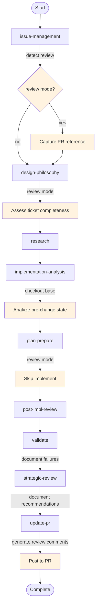

# Review Mode

Review mode adapts the work-package workflow for **reviewing existing implementations** rather than creating new ones. It is formally defined in the workflow schema using the `modes` and `modeOverrides` constructs.

---

## Overview

When activated, review mode:

- Skips requirements elicitation (requirements come from the ticket)
- Analyzes the **pre-change baseline** state from the base branch
- Skips the implement phase (code already exists)
- **Documents findings** rather than applying fixes
- Generates structured **PR review comments**

---

## Schema Definition

### Workflow-Level Mode

Review mode is defined in `workflow.toon` under the `modes` section:

```
modes[1]:
  - id: review
    name: Review Mode
    activationVariable: is_review_mode
    skipActivities: [requirements-elicitation, implement]
    defaults: { needs_elicitation: false }
    resource: resources/24-review-mode.md
```

| Property | Purpose |
|----------|---------|
| `id` | Unique identifier for the mode |
| `activationVariable` | Variable that activates the mode when true |
| `recognition` | Patterns to detect mode from user intent |
| `skipActivities` | Activities to skip entirely in this mode |
| `defaults` | Default variable values when mode is active |
| `resource` | Link to detailed guide document |

### Activity-Level Overrides

Each activity can define mode-specific behavior using `modeOverrides`:

```
modeOverrides:
  review:
    description: "Mode-specific activity description"
    notes: [...]
    steps: [...]
    skipSteps: [...]
    checkpoints: [...]
    transitionOverride: target-activity
    context_to_preserve: [...]
```

| Property | Purpose |
|----------|---------|
| `description` | Mode-specific description |
| `notes` | Mode-specific guidance notes |
| `steps` | Additional steps for this mode |
| `skipSteps` | Step IDs to skip in this mode |
| `checkpoints` | Additional checkpoints for this mode |
| `transitionOverride` | Override default transition target |
| `context_to_preserve` | Additional context for this mode |

---

## Activating Review Mode

Review mode is detected from user request patterns defined in `modes[].recognition`:

| Pattern | Example |
|---------|---------|
| "start review work package" | `Start a review work package for PR #123` |
| "review pr" | `Review PR #456` |
| "review existing implementation" | `Review the existing implementation` |

When detected, you'll be asked to confirm:

```
This appears to be a review of an existing PR. Is that correct?

- [Yes, review existing PR] - Review mode activated
- [No, new implementation] - Standard workflow
```

---

## Review Mode Flow



---

## Key Differences from Standard Mode

| Phase | Standard Mode | Review Mode |
|-------|---------------|-------------|
| **Issue Management** | Create branch + PR | Extract ticket from existing PR |
| **Design Philosophy** | Full classification | + Ticket completeness assessment |
| **Elicitation** | Interactive gathering | **SKIPPED** |
| **Implementation Analysis** | Analyze current state | Analyze **pre-change** baseline |
| **Implement** | Execute tasks | **SKIPPED** |
| **Validate** | Fix failures | **Document** failures as findings |
| **Strategic Review** | Apply cleanup | **Document** recommendations |
| **Update PR** | Push and mark ready | **Generate and post review comments** |

---

## Activity Overrides Summary

| Activity | Mode Override |
|----------|---------------|
| `issue-management` | Detect mode, capture PR reference, skip branch/PR creation |
| `design-philosophy` | Assess ticket completeness, force skip elicitation |
| `implementation-analysis` | Checkout base branch, document expected changes |
| `implement` | **SKIPPED** via `skipActivities` |
| `validate` | Document failures as findings, skip fix-failures |
| `strategic-review` | Document recommendations, transition to update-pr |
| `update-pr` | Generate review summary, post to PR, end workflow |
| `post-impl-review` | Compare changes against expected |

---

## Related Resources

- [24-review-mode.md](resources/24-review-mode.md) - Detailed review mode guide with output formats
- [16-rust-substrate-code-review.md](resources/16-rust-substrate-code-review.md) - Code review criteria
- [17-test-suite-review.md](resources/17-test-suite-review.md) - Test quality assessment
