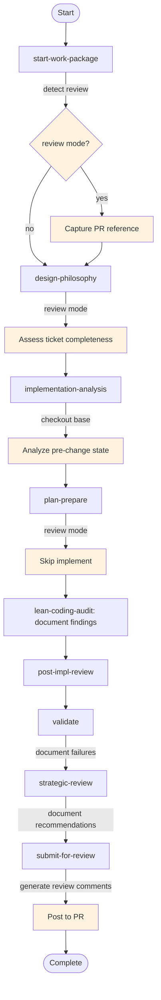

# Review Mode

Review mode adapts the work-package workflow for **reviewing existing implementations** rather than creating new ones. It is not a special schema construct — it is expressed entirely through ordinary state: a boolean `is_review_mode` variable set by a detection step early in the workflow, plus conditional steps, checkpoints, and transitions that branch on it.

---

## Overview

When activated, review mode:

- Skips requirements elicitation (requirements come from the ticket)
- Analyzes the **pre-change baseline** state from the base branch
- Skips the implement phase (code already exists)
- **Documents findings** rather than applying fixes
- Generates structured **PR review comments**

---

## How It Works

### State-Driven Activation

Review mode has no dedicated schema construct. It is driven by a single boolean variable, `is_review_mode`, declared like any other workflow variable (default `false`):

```
- name: is_review_mode
  type: boolean
  defaultValue: false
```

A detection step early in `start-work-package` (`detect-review-mode`) recognizes review intent, confirms with the user, and sets `is_review_mode = true`. Everything mode-specific downstream is a conditional step, checkpoint, or transition that reads this variable. There is no `skipActivities` list and no mode `defaults` block: activities are "skipped" only because their steps and inbound transitions are gated on `is_review_mode`, and mode-specific variable values (e.g. `needs_elicitation = false`) are set by an ordinary control step gated the same way.

### Activity-Level Behavior

Activities express review-mode behavior through standard conditions on steps, checkpoints, and transitions:

- **Review-only steps** have `condition: is_review_mode == true`
- **Create-only steps** have `condition: is_review_mode != true`
- **Review-only checkpoints** have `condition: is_review_mode == true`
- **Review-mode transitions** are conditioned on `is_review_mode == true`

Per-activity review guidance is in `resources/review-mode.md`.

### Headless After Activation

Once review mode is active, the run is **headless**: every review-reachable checkpoint either auto-resolves to its recommended option, is gated out, or is bypassed by an unconditional transition, so a review-mode run can be dispatched and left to complete without a human at each gate. Two classes of interaction remain:

- **Activation prompts** — `review-mode-detection` and `review-pr-reference` (`start-work-package`) stay interactive. They run before review mode is confirmed and identify the PR under review.
- **The single post-to-PR confirmation** — `review-summary-approval` (`submit-for-review`) stays interactive. It is the one review-mode checkpoint whose recommended option has an outward-facing side effect (posting the consolidated review as a comment on the GitHub PR), so it confirms with the user before that action.

Every other review-reachable checkpoint is headless, by one of three mechanisms:

| Mechanism | Behavior | Checkpoints |
|-----------|----------|-------------|
| **Auto-advance** (`defaultOption` + `autoAdvanceMs: 30000`) | The checkpoint occurs but auto-selects its recommended option after the timer; the option's effect is the always-correct call in review mode | `design-philosophy :: ticket-completeness` → `proceed-with-gaps` · `implementation-analysis :: analysis-confirmed` → `confirmed` · `post-impl-review :: file-index-table` → `rationale-confirmed` · `post-impl-review :: block-interview` → `issue-recorded` |
| **Gate-out** (`condition: is_review_mode != true`) | The gated construct does not run in review mode. The `implementation-analysis` assumption-interview `forEach` loop still has its assumptions collected, recorded, and reconciled by the surrounding non-interview steps. The `classification-and-path-confirmed` checkpoint is skipped entirely: with no option selected, the path variables stay at their defaults (`needs_elicitation`, `needs_research`, `skip_optional_activities` all `false`), so `codebase-comprehension` routes to `implementation-analysis` — the create-mode-only `skip-optional` default (which would jump to `plan-prepare`) never applies. A review-mode message records the classification in its place. | `classification-and-path-confirmed` checkpoint · `implementation-analysis` assumption-interview loop |
| **Transition bypass** | The checkpoint stays interactive as authored, but the enclosing activity's unconditional review-mode transition routes to the next activity without the checkpoint's outcome affecting the review-mode path | `strategic-review :: review-findings` |

The `strategic-review :: review-findings` checkpoint is **not** made to auto-advance. The `strategic-review → submit-for-review when is_review_mode == true` transition fires at the activity boundary regardless of any finding variable, so the review-mode path leaves `strategic-review` for `submit-for-review` without the checkpoint's option changing anything. It therefore stays interactive as originally authored — auto-advancing it would be inert in review mode, and because this checkpoint is not review-gated, adding an auto-advance would also change its behavior in normal (create) mode, where it is fully live.

`jira-project-selection` (`start-work-package`) is gated `issue_platform == jira` inside the issue-creation branch and never fires in review mode (which references an existing PR/issue), so it needs no review-mode treatment.

---

## Activating Review Mode

The `detect-review-mode` step in `start-work-package` recognizes review mode from user request patterns such as:

| Pattern | Example |
|---------|---------|
| "start review work package" | `Start a review work package for PR #123` |
| "review pr" | `Review PR #456` |
| "review existing implementation" | `Review the existing implementation` |

When detected, you'll be asked to confirm:

```
This appears to be a review of an existing PR. Is that correct?

- [Yes, review existing PR] - Review mode activated
- [No, new implementation] - Standard workflow
```

---

## Review Mode Flow


```mermaid
graph TD
    Start([Start]) --> IM[start-work-package]
    IM -->|detect review| DETECT{review mode?}
    
    DETECT -->|yes| CAPTURE[Capture PR reference]
    DETECT -->|no| DP
    
    CAPTURE --> DP[design-philosophy]
    DP -->|review mode| TICKET[Assess ticket completeness]
    TICKET --> IA[implementation-analysis]
    IA -->|checkout base| BASELINE[Analyze pre-change state]
    BASELINE --> PP[plan-prepare]
    
    PP -->|review mode| SKIP_IMP[Skip implement]
    SKIP_IMP --> LCA[lean-coding-audit: document findings]
    LCA --> PIR[post-impl-review]
    
    PIR --> VAL[validate]
    VAL -->|document failures| SR[strategic-review]
    
    SR -->|document recommendations| UPR[submit-for-review]
    UPR -->|generate review comments| POST[Post to PR]
    POST --> Done([Complete])
    
    style DETECT fill:#fff3e0
    style CAPTURE fill:#fff3e0
    style TICKET fill:#fff3e0
    style BASELINE fill:#fff3e0
    style SKIP_IMP fill:#fff3e0
    style POST fill:#fff3e0
```

---

## Key Differences from Standard Mode

| Phase | Standard Mode | Review Mode |
|-------|---------------|-------------|
| **Issue Management** | Create branch + PR | Extract ticket from existing PR |
| **Design Philosophy** | Full classification | + Ticket completeness assessment |
| **Elicitation** | Interactive gathering | **SKIPPED** |
| **Implementation Analysis** | Analyze current state | Analyze **pre-change** baseline |
| **Implement** | Execute tasks | **SKIPPED** |
| **Lean-Coding Audit** | Audit, then apply accepted simplifications | **Document** over-engineering/leanness findings; apply path gated out |
| **Validate** | Fix failures | **Document** failures as findings |
| **Strategic Review** | Apply cleanup | **Document** recommendations |
| **Update PR** | Push and mark ready | **Generate and post review comments** |

---

## Activity Overrides Summary

| Activity | Mode Override |
|----------|---------------|
| `start-work-package` | Detect mode, capture PR reference; the `issue-verification` and `pr-creation` checkpoints and branch/PR-creation steps are gated `is_review_mode != true` so no issue/branch/PR is created |
| `design-philosophy` | Assess ticket completeness, force skip elicitation; `ticket-completeness` auto-advances to `proceed-with-gaps`; `classification-and-path-confirmed` is gated `is_review_mode != true` so no path confirmation is prompted — a message records the classification and the run proceeds to `implementation-analysis` |
| `plan-prepare` | Plan the review approach; the `update-pr::render` (initial) step and `approach-confirmed` checkpoint are gated `is_review_mode != true` so the reviewed PR's body is never overwritten and no approach-confirmation is prompted |
| `requirements-elicitation`, `research` | **Not on the headless review path.** With the path variables at their defaults (`needs_elicitation`/`needs_research` both `false`), `codebase-comprehension` routes straight to `implementation-analysis`, so neither activity is entered. Their internal review-mode handling (e.g. `research :: research-convergence` auto-advance) is dormant unless a create-mode classification selects them. |
| `implementation-analysis` | Checkout base branch (`review-baseline-state`), document expected changes against the pre-change baseline; `analysis-confirmed` auto-advances to `confirmed`; the assumption-interview loop is gated out |
| `implement` | **SKIPPED** — `assumptions-review` carries a `is_review_mode == true → lean-coding-audit` transition that routes around the entire activity, so none of its steps or checkpoints (`switch-model-*`, assumption interview) are reached |
| `lean-coding-audit` | Run the read-only over-engineering review, debt harvest, and gain report; the findings-confirmation checkpoint and simplification-apply-cycle are gated out so no code changes — findings become PR feedback |
| `validate` | Document failures as findings, skip fix-failures |
| `strategic-review` | Document recommendations, transition to submit-for-review; `review-findings` stays interactive but is bypassed — the unconditional `is_review_mode == true → submit-for-review` transition routes past it before its outcome can affect the review-mode path |
| `submit-for-review` | Consolidate findings, generate the review summary, post it to the PR, then transition to `complete`; the create-mode tail (DCO attestation, PR-body render/verify, push, mark-ready, reviewer-feedback loop) is gated `is_review_mode != true`. `review-summary-approval` stays interactive as the single confirmation before the review is posted to the PR |
| `post-impl-review` | Compare changes against expected; `file-index-table` auto-advances to `rationale-confirmed` and `block-interview` to `issue-recorded` |

---

## Related Resources

- [review-mode.md](./resources/review-mode.md) - Detailed review mode guide with output formats
- [rust-substrate-code-review.md](./resources/rust-substrate-code-review.md) - Code review criteria
- [test-suite-review.md](./resources/test-suite-review.md) - Test quality assessment
