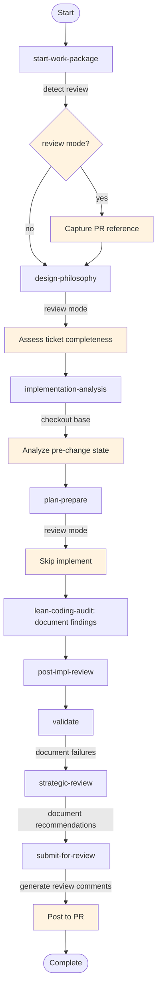

# Review Mode

Review mode adapts the work-package workflow for **reviewing existing implementations** rather than creating new ones. It is not a special schema construct — it is expressed entirely through ordinary state: a boolean `is_review_mode` variable set by a detection step early in the workflow, plus conditional steps, checkpoints, and exit predicates that branch on it.

---

## Overview

When activated, review mode:

- Skips requirements elicitation (requirements come from the ticket)
- Analyzes the **pre-change baseline** state from the base branch
- Skips the implement phase (code already exists)
- **Documents findings** rather than applying fixes
- Generates structured **PR review comments**

---

## How It Works

### State-Driven Activation

Review mode has no dedicated schema construct. It is driven by ordinary state: `is_review_mode`, plus gap flags `review_mode_ambiguous` and `review_pr_missing` when derivation cannot settle mode or PR identity.

A derive-first detection step early in `start-work-package` (`detect-review-mode`) recognizes review intent and PR identity from `{user_request}` / `{pr_reference}`. When mode and PR are clear, the run continues without activation confirms. When mode is ambiguous, `review-mode-detection` asks; when review mode is active but the PR is missing, `review-pr-reference` asks. Everything mode-specific downstream is a conditional step, checkpoint, or exit that reads `is_review_mode`. There is no mode `defaults` block: activities are "skipped" only because their steps are gated on `is_review_mode` and the exits leading to them are predicated on it, and mode-specific variable values (e.g. `needs_elicitation = false`) are set by an ordinary control step gated the same way.

### Activity-Level Behavior

Activities express review-mode behavior through standard conditions on steps and checkpoints, and predicates on exits:

- **Review-only steps** have `condition: is_review_mode == true`
- **Create-only steps** have `condition: is_review_mode != true`
- **Review-only checkpoints** have `condition: is_review_mode == true`
- **Review-mode exits** carry the predicate `is_review_mode == true`

Per-activity review guidance is in `resources/review-mode.md`.

### Headless After Activation

Once review mode is active, the run is **headless**: `{headless_mode}` is true, so a soft checkpoint takes its recommended option without reaching a person, and the rest are gated out or bypassed by an unconditional transition. A review-mode run can therefore be dispatched and left to run, pausing only at the gates below. Interaction remains for:

- **Activation gap-fills** — `review-mode-detection` (when `review_mode_ambiguous`) and `review-pr-reference` (when `review_pr_missing`) in `start-work-package`. Clear derive paths skip both.
- **The post-to-PR confirmation** — `review-summary-approval` (`submit-for-review`) is hard. Its recommended option has an outward-facing side effect, posting the consolidated review as a comment on the GitHub PR, so it confirms with the user before that action.
- **The validation-environment decision** — `local-validation-permission` (`post-impl-review`) is hard. Whether the author's suite can run in this environment is a fact about the machine, and no default option can assert it.
- **The diff provenance attestation** — `file-index-table` (`post-impl-review`) is hard. The confirmation it records is the provenance attestation for every block of the diff, and on the review path there is no author to vouch for that diff, so it is the load-bearing confirmation of the run.
- **The findings-delivery decision** — `findings-delivery` (`strategic-review`) is hard. It settles which findings the posted review carries to the author, which is what the review publishes.

Every other review-reachable checkpoint is headless, by one of three mechanisms:

| Mechanism | Behavior | Checkpoints |
|-----------|----------|-------------|
| **Soft** (`defaultOption` + `autoAdvanceMs`) | The checkpoint occurs and takes its recommended option when no person is reached; the option records a judgement the run can stand behind | `design-philosophy :: ticket-completeness` → `proceed-with-gaps` · `implementation-analysis :: analysis-confirmed` → `confirmed` · `post-impl-review :: block-interview` → `issue-recorded` |
| **Gate-out** (`condition: is_review_mode != true`) | The gated construct does not run in review mode. The `implementation-analysis` assumption-interview `forEach` loop still has its assumptions collected, recorded, and reconciled by the surrounding non-interview steps. The `classification-and-path-confirmed` checkpoint is skipped entirely: with no option selected, the path variables stay at their defaults (`needs_elicitation`, `needs_research`, `skip_optional_activities` all `false`), so `codebase-comprehension` routes to `implementation-analysis` — the create-mode-only `skip-optional` default (which would jump to `plan-prepare`) never applies. A review-mode message records the classification in its place. | `classification-and-path-confirmed` checkpoint · `implementation-analysis` assumption-interview loop · `strategic-review :: review-findings` · `post-impl-review :: review-fix-cycle` loop |

The create path and the review path each carry their own findings gate, because the decision differs. On the create path `review-findings` asks whether to fix now, fix a selection, defer, or accept — the session owns the code and can take all four actions. On the review path `findings-delivery` asks which findings the posted review carries to the author, since raising a finding is the only action a review can take on someone else's branch. Each gate is conditioned on `is_review_mode`, so a run meets exactly one of them and its options name actions that run can perform.

The same boundary gates the `review-fix-cycle` loop out of review mode. `code_findings_actionable` and `test_findings_actionable` say a finding reached the severity that warrants action; on the review path the action is raising it to the author, and no component file is edited.

`jira-project-selection` (`start-work-package`) is gated `issue_platform == jira && needs_issue_creation == true`, and a review run references an existing PR and issue, so it never fires there and needs no review-mode treatment.

---

## Activating Review Mode

The `detect-review-mode` step in `start-work-package` derives review mode from user request patterns such as:

| Pattern | Example |
|---------|---------|
| "start review work package" | `Start a review work package for PR #123` |
| "review pr" | `Review PR #456` |
| "review existing implementation" | `Review the existing implementation` |

Clear review intent with a parseable PR number or URL skips activation confirms and announces the derived mode. Confirms fire only on gaps:

- **Mode unclear** — `review_mode_ambiguous` → `review-mode-detection` (review vs new implementation)
- **PR missing** — `review_pr_missing` → `review-pr-reference` (number or URL)

When the first derive pass already checked out the PR branch, a second bind is skipped. When the PR was supplied only at the gap confirm, a follow-up `capture-pr-reference` bind completes checkout and ticket extract.

---

## Review Mode Flow

```mermaid
graph TD
    Start([Start]) --> IM[start-work-package]
    IM -->|detect review| DETECT{review mode?}
    
    DETECT -->|yes| CAPTURE[Capture PR reference]
    DETECT -->|no| DP
    
    CAPTURE --> DP[design-philosophy]
    DP -->|review mode| TICKET[Assess ticket completeness]
    TICKET --> IA[implementation-analysis]
    IA -->|checkout base| BASELINE[Analyze pre-change state]
    BASELINE --> PP[plan-prepare]
    
    PP -->|review mode| SKIP_IMP[Skip implement]
    SKIP_IMP --> LCA[lean-coding-audit: document findings]
    LCA --> PIR[post-impl-review]
    
    PIR --> VAL[validate]
    VAL -->|document failures| SR[strategic-review]
    
    SR -->|document recommendations| UPR[submit-for-review]
    UPR -->|generate review comments| POST[Post to PR]
    POST --> Done([Complete])
    
    style DETECT fill:#fff3e0
    style CAPTURE fill:#fff3e0
    style TICKET fill:#fff3e0
    style BASELINE fill:#fff3e0
    style SKIP_IMP fill:#fff3e0
    style POST fill:#fff3e0
```

---

## Key Differences from Standard Mode

| Phase | Standard Mode | Review Mode |
|-------|---------------|-------------|
| **Issue Management** | Create branch + PR | Extract ticket from existing PR |
| **Design Philosophy** | Full classification | + Ticket completeness assessment |
| **Elicitation** | Interactive gathering | **SKIPPED** |
| **Implementation Analysis** | Analyze current state | Analyze **pre-change** baseline |
| **Implement** | Execute tasks | **SKIPPED** |
| **Lean-Coding Audit** | Audit, then apply accepted simplifications | **Document** over-engineering/leanness findings; apply path gated out |
| **Validate** | Fix failures | **Document** failures as findings |
| **Strategic Review** | Apply cleanup | **Document** recommendations |
| **Update PR** | Push and mark ready | **Generate and post review comments** |

---

## Activity Overrides Summary

| Activity | Mode Override |
|----------|---------------|
| `start-work-package` | Derive mode and PR reference (gap-fill confirms only when ambiguous/missing); the `issue-verification` and `pr-creation` checkpoints and branch/PR-creation steps are gated `is_review_mode != true` so no issue/branch/PR is created |
| `design-philosophy` | Assess ticket completeness, force skip elicitation; `ticket-completeness` auto-advances to `proceed-with-gaps`; `classification-and-path-confirmed` is gated `is_review_mode != true` so no path confirmation is prompted — a message records the classification and the run proceeds to `implementation-analysis` |
| `plan-prepare` | Plan the review approach; the `update-pr::render` (initial) step and `approach-confirmed` checkpoint are gated `is_review_mode != true` so the reviewed PR's body is never overwritten and no approach-confirmation is prompted |
| `requirements-elicitation`, `research` | **Not on the headless review path.** With the path variables at their defaults (`needs_elicitation`/`needs_research` both `false`), `codebase-comprehension` routes straight to `implementation-analysis`, so neither activity is entered in review mode. Neither carries review-mode-specific handling — they are simply off the review path (create mode only). |
| `implementation-analysis` | Checkout base branch (`review-baseline-state`), document expected changes against the pre-change baseline; `analysis-confirmed` auto-advances to `confirmed`; the assumption-interview loop is gated out |
| `implement` | **SKIPPED** — `assumptions-review` carries a `is_review_mode == true → lean-coding-audit` transition that routes around the entire activity, so none of its steps or checkpoints (`switch-model-*`, assumption interview) are reached |
| `lean-coding-audit` | Run the read-only over-engineering review, debt harvest, and gain report; the findings-confirmation checkpoint and simplification-apply-cycle are gated out so no code changes — findings become PR feedback |
| `validate` | Document failures as findings; the `fix-revalidate-cycle` loop is gated `is_review_mode != true` so no fix is applied to a third party's branch |
| `strategic-review` | Document recommendations, transition to submit-for-review; `review-findings` is gated `is_review_mode != true` and `findings-delivery` takes its place, deciding which findings the posted review carries to the author. `unsigned-commits-prompt` and `resign-unsigned-commits` are gated `is_review_mode != true`: re-signing rewrites branch history, which on a third party's branch is theirs to decide |
| `submit-for-review` | Consolidate findings, generate the review summary, post it to the PR, then transition to `complete`; the create-mode tail (DCO attestation, PR-body render/verify, push, mark-ready, reviewer-feedback loop) is gated `is_review_mode != true`. `review-summary-approval` stays interactive as the single confirmation before the review is posted to the PR |
| `post-impl-review` | Compare changes against expected; `file-index-table` auto-advances to `rationale-confirmed` and `block-interview` to `issue-recorded`. The `review-fix-cycle` loop is gated `is_review_mode != true` so no component file is edited, and `local-validation-permission` stays interactive because whether the suite can run here is a fact about the environment |
| `complete` | Write the close-out, cost artifact, retrospective and session trace, verify planning-folder link integrity, then re-publish the folder so the branch the posted review links carries the close-out. `create-complete-doc` and `render-token-usage` run on both paths — a review run has a verdict to close out and a cost to report. The ADR, test-plan and docs steps stay gated `is_review_mode != true` |

---

## Related Resources

- [review-mode.md](./resources/review-mode.md) - Detailed review mode guide with output formats
- [rust-substrate-code-review.md](./resources/rust-substrate-code-review.md) - Code review criteria
- [test-suite-review.md](./resources/test-suite-review.md) - Test quality assessment
