# Work Package Activities

> Part of the [Work Package Implementation Workflow](../README.md)

Each activity section below includes its purpose, skills, steps, checkpoints, transitions, and a mermaid diagram showing its internal flow.

---

### 01. Start Work Package

**Purpose:** Initialize the work package — verify or create an issue, set up feature branch and draft PR, create planning folder. In review mode: captures PR reference and extracts associated Jira ticket.

**Skills:**

| Role | Skill ID |
|------|----------|
| primary | `create-issue` |
| supporting | `manage-git` |
| supporting | `manage-artifacts` |

**Steps:**

1. **detect-project-type** — Auto-detect project type from `Cargo.toml` (Substrate dependencies: `sp-*`, `frame-*`, `pallet-*`). Set `project_type` to `rust-substrate` if found, otherwise `other`.
2. **check-issue** — Verify whether an issue has been specified by user or in context.
3. **create-issue** — If needed, create issue in selected platform (GitHub or Jira) via platform-selection checkpoint.
4. **check-branch** — Check if already on a feature branch (not `main`/`master`).
5. **create-branch** — Create feature branch: `type/issue-number-short-description`.
6. **check-pr** — Check if PR already exists for current branch via `gh pr list --head <branch>`.
7. **create-pr** — Create draft PR linked to issue.
8. **initialize-planning-folder** — Create planning folder at `.engineering/artifacts/planning/YYYY-MM-DD-{initiative-name}/`.
9. **determine-next-activity** — Based on issue details, determine if requirements elicitation is needed.

**Checkpoints (8):**

| Checkpoint | Purpose | Blocking |
|------------|---------|----------|
| `issue-verification` | Confirm issue exists or choose to create/skip | yes |
| `branch-check` | Use existing branch or create new one | yes |
| `pr-check` | Use existing PR or create new one | yes |
| `platform-selection` | Choose GitHub or Jira for issue creation | yes |
| `jira-project-selection` | Select Jira project (if Jira chosen) | yes |
| `issue-type-selection` | Choose issue type: Feature, Bug, Task, Enhancement, Epic | yes |
| `issue-review` | Confirm drafted issue before creation | yes |
| `pr-creation` | Confirm branch and PR creation | yes |

**Transitions:** Default transition to `design-philosophy`.

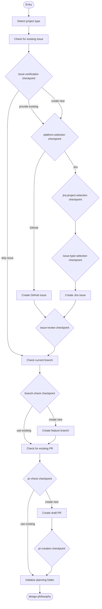

---

### 02. Design Philosophy

**Purpose:** Apply structured design framework to classify the problem, determine complexity, and decide which optional activities are needed. Sets the `complexity` variable (simple / moderate / complex) which drives ADR creation in the Complete activity. In review mode: assesses ticket completeness using the Jira Issue Creation Guide checklist.

**Skills:**

| Role | Skill ID |
|------|----------|
| primary | `classify-problem` |
| supporting | `review-assumptions` |

**Steps:**

1. **define-problem** — Create clear problem statement with system understanding, impact assessment, success criteria, and constraints.
2. **classify-problem** — Determine if this is a specific problem (cause known/unknown) or an inventive goal (improvement/prevention). Assess complexity.
3. **determine-path** — Based on problem complexity and clarity, determine which optional activities are needed.
4. **document-philosophy** — Create `design-philosophy.md` with problem statement, classification, complexity assessment, workflow path rationale, and constraints.
5. **collect-assumptions** — Identify assumptions made during problem classification and path selection.
6. **create-assumptions-log** — Create the assumptions log with initial assumptions from this activity.

**Checkpoints (4):**

| Checkpoint | Purpose | Blocking |
|------------|---------|----------|
| `problem-classified` | Confirm problem type and complexity assessment | yes |
| `workflow-path` | Select workflow path: full, elicit-only, research-only, or direct | yes |
| `design-philosophy-doc` | Confirm design philosophy document is accurate | yes |
| `assumptions-review` | Review assumptions from classification and path selection | yes |

**Transitions:**

| Condition | Target |
|-----------|--------|
| `needs_elicitation == true` | requirements-elicitation |
| `needs_elicitation == false AND needs_research == true` | research |
| `skip_to_planning == true` (default) | plan-prepare |

**Artifacts:** `design-philosophy.md`, `assumptions-log.md` (both in planning folder).

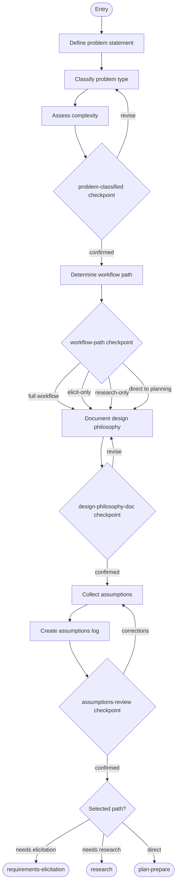

---

### 03. Requirements Elicitation (optional)

**Purpose:** Discover and clarify what the work package should accomplish through structured sequential conversation. Elicitation discovers what the user needs before planning how to implement it. Includes a stakeholder discussion phase, sequential question-domain iteration, Jira comment posting for stakeholder review, and awaiting stakeholder response.

**Skills:**

| Role | Skill ID |
|------|----------|
| primary | `elicit-requirements` |
| supporting | `manage-artifacts` |
| supporting | `review-assumptions` |

**Steps:**

1. **stakeholder-discussion** — Prompt user to initiate discussion with key stakeholders. User provides transcript or summary.
2. **elicit-requirements** — Iterate through question domains, asking one question at a time. Use stakeholder transcript as context.
3. **collect-assumptions** — Identify assumptions made when interpreting user responses.
4. **post-assumptions-to-jira** — Prepare assumptions as Jira comment, get user approval, then post to ticket (if `issue_platform` is Jira).
5. **await-stakeholder-response** — Wait for stakeholders to review the Jira comment. User returns with feedback.
6. **create-document** — Create requirements document using elicitation output template.
7. **update-assumptions-log** — Add requirements-phase assumptions to the assumptions log.

**Checkpoints (5):**

| Checkpoint | Purpose | Blocking |
|------------|---------|----------|
| `stakeholder-transcript` | Provide or skip stakeholder discussion transcript | yes |
| `domain-complete` | Continue to next domain, revisit, or finish early | yes |
| `jira-comment-review` | Review and approve Jira comment before posting | yes |
| `stakeholder-response` | Provide stakeholder feedback or confirm approval | yes |
| `document-review` | Confirm requirements document, proceed to research | yes |

**Loops:** `domain-iteration` — forEach over `question_domains` (max 5 iterations). Each iteration asks one question and records the response.

**Transitions:**

| Condition | Target |
|-----------|--------|
| `requirements_confirmed == true` (default) | research |
| `requirements_confirmed == false` | requirements-elicitation (self-loop) |

**Artifacts:** `requirements-elicitation.md` (in planning folder).

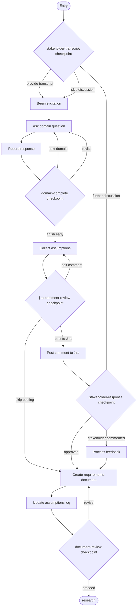

---

### 04. Research (optional)

**Purpose:** Research the knowledge base and external sources to discover best practices, patterns, and resources to inform the plan-prepare activity.

**Skills:**

| Role | Skill ID |
|------|----------|
| primary | `research-knowledge-base` |
| supporting | `review-assumptions` |

**Steps:**

1. **kb-research** — Call `get_guidance` before making concept-rag MCP tool calls. Search for relevant patterns and practices.
2. **web-research** — Search web for current information, documentation, and best practices.
3. **synthesize** — Connect findings to requirements: which patterns apply, what modifications needed, risks, success metrics.
4. **collect-assumptions** — Identify assumptions made during research synthesis.
5. **document** — Create knowledge base research document.
6. **update-assumptions-log** — Add research-phase assumptions to the assumptions log.

**Checkpoints (4):**

| Checkpoint | Purpose | Blocking |
|------------|---------|----------|
| `kb-insights` | Confirm knowledge base findings are relevant | yes |
| `web-research-confirmed` | Confirm web research is complete | yes |
| `assumptions-review` | Review pattern applicability and synthesis assumptions | yes |
| `research-complete` | Confirm research is sufficient, proceed to analysis | yes |

**Transitions:** Default to `implementation-analysis`.

**Artifacts:** `kb-research.md` (in planning folder).

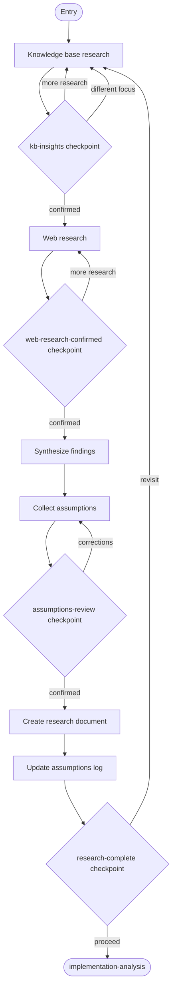

---

### 05. Implementation Analysis

**Purpose:** Analyze the current implementation to understand effectiveness, establish baselines, and identify opportunities for improvement. In review mode: checks out the base branch to analyze the pre-change state, documents expected changes, then returns to the PR branch.

**Skills:**

| Role | Skill ID |
|------|----------|
| primary | `analyze-implementation` |
| supporting | `manage-artifacts` |
| supporting | `review-assumptions` |

**Steps:**

1. **review-implementation** — Understand where and how the feature/component is used: location, usage, dependencies, architecture.
2. **evaluate-effectiveness** — Gather evidence of existing performance: logs, metrics, tests, issues, comments.
3. **establish-baselines** — Establish quantitative measurements: performance, quality, usage, reliability.
4. **collect-assumptions** — Identify assumptions made during analysis.
5. **document** — Create implementation analysis document.
6. **update-assumptions-log** — Add analysis-phase assumptions to the assumptions log.

**Checkpoints (2):**

| Checkpoint | Purpose | Blocking |
|------------|---------|----------|
| `analysis-confirmed` | Confirm analysis findings are correct | yes |
| `assumptions-review` | Review assumptions about current behavior and gaps | yes |

**Transitions:** Default to `plan-prepare`.

**Artifacts:** `implementation-analysis.md` (in planning folder).

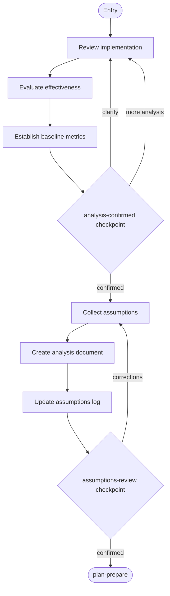

---

### 06. Plan & Prepare

**Purpose:** Design the approach, create the work package plan (task breakdown), create the test plan, and prepare for implementation. This is the convergence point for all optional paths.

**Skills:**

| Role | Skill ID |
|------|----------|
| primary | `create-plan` |
| supporting | `classify-problem` |
| supporting | `review-assumptions` |
| supporting | `create-test-plan` |

**Steps:**

1. **apply-design** — Use design framework skill to structure the approach.
2. **create-plan** — Create work package plan document with task breakdown.
3. **create-test-plan** — Create test plan document.
4. **collect-assumptions** — Identify assumptions made during planning.
5. **update-assumptions-log** — Add planning-phase assumptions to the assumptions log.
6. **sync-branch** — Ensure feature branch is up to date with `main`.
7. **update-pr** — Update PR with planning information.
8. **create-todos** — Break down plan into actionable TODO tasks.

**Checkpoints (4):**

| Checkpoint | Purpose | Blocking |
|------------|---------|----------|
| `approach-confirmed` | Confirm implementation approach | yes |
| `assumptions-review` | Review planning assumptions | yes |
| `ready-implement` | Confirm readiness to implement | yes |
| `assumptions-log-final` | Final review of accumulated assumptions before implementation | yes |

**Transitions:** Default to `implement`.

**Artifacts:** `work-package-plan.md`, `test-plan.md` (both in planning folder).

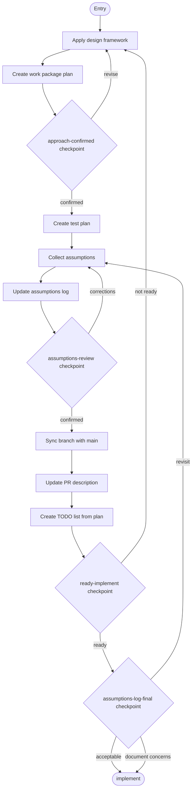

---

### 07. Implement

**Purpose:** Execute the implementation plan task by task. Each task follows a cycle of implement, test, commit, review assumptions, checkpoint. Contains two nested loops: the task implementation cycle and the assumption review cycle within each task.

**Skills:**

| Role | Skill ID |
|------|----------|
| primary | `implement-task` |
| supporting | `review-assumptions` |
| supporting | `validate-build` |
| supporting | `manage-git` |

**Entry action:** Verify on correct feature branch before any code changes.

**Loops:**

| Loop | Type | Iterates over | Max |
|------|------|---------------|-----|
| `task-cycle` | forEach | `plan.tasks` | 100 |
| `assumption-review-cycle` | forEach | `task_assumptions` | 100 |

**Task cycle steps (per task):**

1. **implement-task** — Write code for the current task.
2. **run-tests** — Execute tests to verify implementation.
3. **commit** — Commit changes.
4. **collect-assumptions** — Identify all assumptions made during this task.
5. **update-assumptions-log** — Record outcomes in assumptions log after review.

**Checkpoints (2):**

| Checkpoint | Purpose | Blocking |
|------------|---------|----------|
| `task-complete` | Confirm task implementation, proceed to assumption review | yes |
| `assumption-review` | Review each individual assumption | yes |

**Transitions:** Default to `post-impl-review`.

**Artifacts:** `assumptions-log.md` (continues from earlier phases).

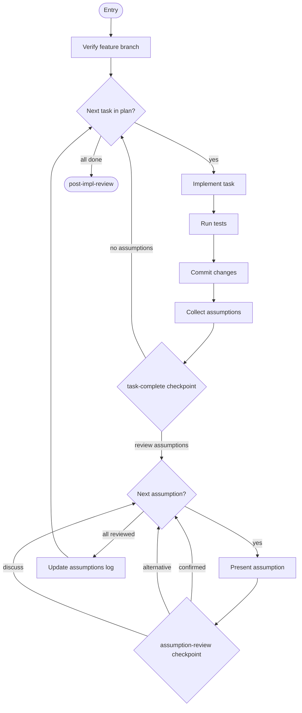

---

### 08. Post-Implementation Review

**Purpose:** Review implementation quality through manual diff review, code review, test suite review, and architecture summary. Includes a blocker gate: if a critical blocker is found, transitions back to implement for remediation.

**Artifact prefix:** `08`

**Skills:**

| Role | Skill ID |
|------|----------|
| primary | `review-diff` |
| supporting | `review-code` |
| supporting | `review-test-suite` |
| supporting | `summarize-architecture` |

**Review stages:**

1. **Manual diff review** — Pull and diff, create change-block index, present file table to user, collect flagged blocks, interview each flagged block, write report.
2. **Code review** — Comprehensive code review using Rust/Substrate criteria (if applicable).
3. **Test suite review** — Assess test quality, coverage, and anti-patterns.
4. **Architecture summary** — Create high-level architecture summary with diagrams.

**Checkpoints (5):**

| Checkpoint | Purpose | Blocking |
|------------|---------|----------|
| `file-index-table` | Present file/block index for user to flag items | yes |
| `block-interview` | Interview user on each flagged block | yes |
| `code-review` | Present code review findings | yes |
| `test-quality` | Present test suite review findings | yes |
| `architecture-summary` | Present architecture summary for confirmation | yes |

**Decision:** `blocker-gate` — If `has_critical_blocker == true`, transition back to `implement`. Otherwise proceed to `validate`.

**Artifacts (prefixed with `08-`):**

| Artifact | Description |
|----------|-------------|
| `08-change-block-index.md` | Indexed table of all changed blocks in the diff |
| `08-manual-diff-review.md` | Manual diff review findings from interview process |
| `08-code-review.md` | Comprehensive code review document |
| `08-test-suite-review.md` | Test suite quality assessment |
| `08-architecture-summary.md` | High-level architecture summary with diagrams |

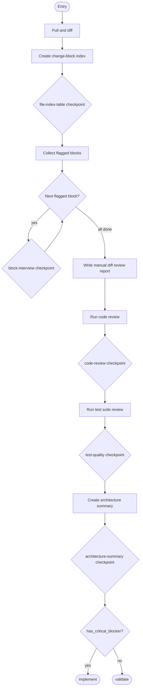

---

### 09. Validate

**Purpose:** Validate the implementation through testing, build verification, and lint checking. If failures are found, analyze root cause, fix, and re-run until all pass. In review mode: documents failures as review findings and does not attempt fixes.

**Skills:**

| Role | Skill ID |
|------|----------|
| primary | `validate-build` |

**Steps:**

1. **run-tests** — Execute unit, integration, and e2e tests. Observe and record results.
2. **verify-build** — Run build. Observe and record result.
3. **check-lint** — Run linter. Observe and record results.
4. **fix-failures** — If tests/build/lint fail, analyze root cause, fix, and re-run. Repeat until all pass. (Skipped in review mode.)

**Checkpoints (0):** This activity has no checkpoints. Test/build/lint results are observable and do not require user confirmation.

**Transitions:** Default to `strategic-review`.

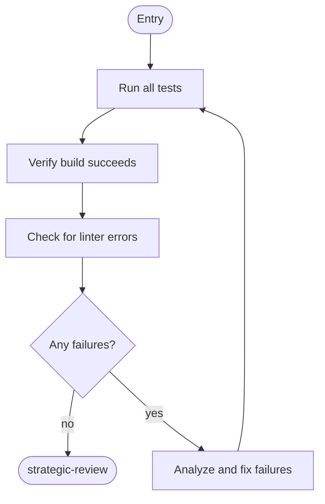

---

### 10. Strategic Review

**Purpose:** Review the implementation to ensure changes are minimal and focused. Validates that the final PR contains only the changes required for the solution. Creates strategic review document and architecture summary. In review mode: documents cleanup recommendations without applying them.

**Artifact prefix:** `10`

**Skills:**

| Role | Skill ID |
|------|----------|
| primary | `review-strategy` |

**Steps:**

1. **diff-review** — Examine all changes in the PR for scope and relevance.
2. **identify-artifacts** — Find investigation artifacts, over-engineering, orphaned infrastructure.
3. **document-findings** — Create `10-strategic-review-{n}.md` with items that should be removed or simplified.
4. **apply-cleanup** — If cleanup needed, remove identified artifacts and update review document. (Skipped in review mode.)
5. **create-architecture-summary** — Create `10-architecture-summary.md` using the architecture summary resource template.

**Checkpoints (2):**

| Checkpoint | Purpose | Blocking |
|------------|---------|----------|
| `review-findings` | Confirm strategic review findings | yes |
| `review-result` | Determine outcome: pass, cleanup, or rework | yes |

**Decision:** `review-result` — If `review_passed == true`, transition to `submit-for-review`. Otherwise loop back to `plan-prepare`.

**Artifacts (prefixed with `10-`):**

| Artifact | Description |
|----------|-------------|
| `10-strategic-review-{n}.md` | Review findings, identified artifacts, cleanup actions. `{n}` increments on successive reviews. |
| `10-architecture-summary.md` | High-level architecture summary with UML-style diagrams |

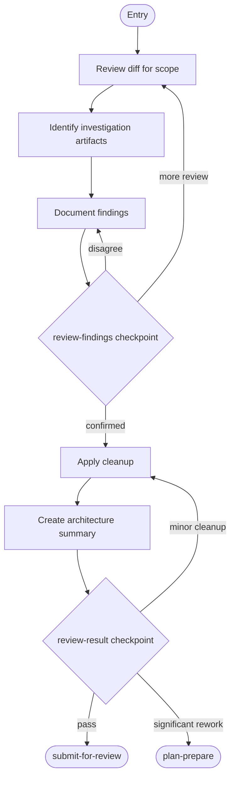

---

### 11. Submit for Review

**Purpose:** Push PR, update description with implementation details, mark ready for review, then await reviewer feedback. If significant changes are requested, loop back to plan-prepare. In review mode: consolidates all review findings and posts structured PR review comments, then ends the workflow.

**Skills:**

| Role | Skill ID |
|------|----------|
| primary | `update-pr` |
| supporting | `respond-to-pr-review` |

**Steps (standard mode):**

1. **push-commits** — Push all commits to remote.
2. **update-description** — Update PR description with final implementation details.
3. **mark-ready** — Mark PR as ready for review.
4. **await-review** — Wait for PR to receive manual review.
5. **process-review-comments** — Analyze and respond to review feedback using `respond-to-pr-review` skill.

**Checkpoints (3):**

| Checkpoint | Purpose | Blocking |
|------------|---------|----------|
| `pr-description` | Confirm PR description is accurate | yes |
| `review-received` | Confirm that review comments have been received | yes |
| `review-outcome` | Determine outcome: approved, minor changes, or significant changes | yes |

**Transitions:**

| Condition | Target |
|-----------|--------|
| `review_requires_changes == true` | plan-prepare |
| default | complete |

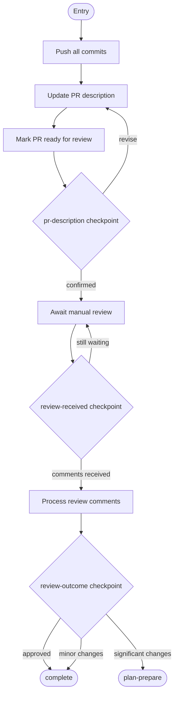

---

### 12. Complete

**Purpose:** Final activity — create Architecture Decision Record (if moderate or complex implementation), finalize documentation, conduct retrospective, capture session history, update status, and select next work package. In review mode: ends after retrospective.

**Artifact prefix:** `12`

**Skills:**

| Role | Skill ID |
|------|----------|
| primary | `finalize-documentation` |
| supporting | `create-adr` |
| supporting | `conduct-retrospective` |

**Steps:**

1. **create-adr** — Automatically create ADR based on design philosophy complexity assessment (triggered for moderate or complex implementations).
2. **update-adr-status** — If ADR exists, update status to Accepted.
3. **finalize-test-plan** — Add hyperlinks to test source locations.
4. **create-complete-doc** — Create `COMPLETE.md` completion document.
5. **ensure-docs** — Verify public APIs have inline documentation.
6. **capture-history** — If metadata repository exists (private, never committed).
7. **retrospective** — Workflow retrospective (skip if trivial session).
8. **update-status** — Update work package plan status after PR merge.
9. **select-next** — Select next work package.

**Checkpoints (1):**

| Checkpoint | Purpose | Blocking |
|------------|---------|----------|
| `retrospective-review` | Review received, confirm PR feedback has been addressed | yes |

**Transitions:** None — this is the terminal activity.

**Artifacts:**

| Artifact | Location | Description |
|----------|----------|-------------|
| `COMPLETE.md` | planning | Completion document |
| `workflow-retrospective.md` | planning | Retrospective notes |
| `NNNN-{decision-title}.md` | `.engineering/artifacts/adr` | ADR for moderate/complex implementations |
| `{YYYY-MM-DD}-pr{N}-review-analysis.md` | `.engineering/artifacts/reviews` | PR review analysis |

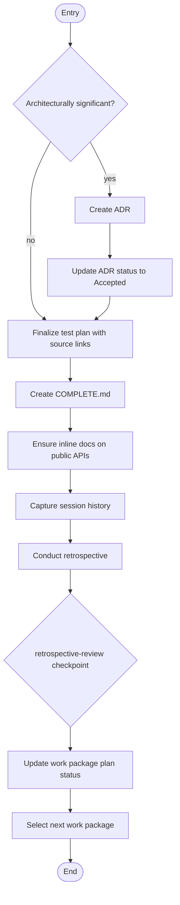

---
