# Work Package Activities

> Part of the [Work Package Implementation Workflow](../README.md)

Each activity section below includes its purpose, skills, steps, checkpoints, transitions, and a mermaid diagram showing its internal flow.

---

### 01. Start Work Package

**Purpose:** Initialize the work package — verify or create an issue, set up feature branch and draft PR, create planning folder. In review mode: captures PR reference and extracts associated Jira ticket.

**Skills:**

| Role | Skill ID |
|------|----------|
| primary | `create-issue` |
| supporting | `manage-git` |
| supporting | `manage-artifacts` |

**Steps:**

1. **resolve-target** — Read `target_path` from state variables and verify the directory exists.
2. **initialize-target** — Fetch origin and checkout the default branch inside `target_path`.
3. **detect-project-type** — Auto-detect project type from `Cargo.toml` (Substrate dependencies: `sp-*`, `frame-*`, `pallet-*`). Set `project_type` to `rust-substrate` if found, otherwise `other`.
4. **check-issue** — Verify whether an issue has been specified by user or in context. Detect platform from key format.
5. **verify-jira-issue** — Load Jira issue via Atlassian MCP (conditional: `issue_platform == jira`).
6. **verify-github-issue** — Verify GitHub issue via `gh issue view` (conditional: `issue_platform == github`).
7. **create-issue** — If needed, create issue in selected platform (GitHub or Jira) via platform-selection checkpoint.
8. **activate-issue** — Transition issue to In Progress and assign to current user.
9. **present-problem-overview** — Synthesize a plain-language problem overview for stakeholder reference.
10. **check-branch** — Check if already on a feature branch (not `main`/`master`).
11. **create-branch** — Create feature branch: `type/issue-number-short-description`.
12. **check-pr** — Check if PR already exists for current branch via `gh pr list --head <branch>`.
13. **create-pr** — Create draft PR linked to issue.
14. **initialize-planning-folder** — Create planning folder at `.engineering/artifacts/planning/YYYY-MM-DD-{initiative-name}/`.
15. **determine-next-activity** — Based on issue details, determine if requirements elicitation is needed.

**Checkpoints (8):**

| Checkpoint | Purpose | Blocking |
|------------|---------|----------|
| `issue-verification` | Confirm issue exists or choose to create/skip | yes |
| `branch-check` | Use existing branch or create new one | yes |
| `pr-check` | Use existing PR or create new one | yes |
| `platform-selection` | Choose GitHub or Jira for issue creation | yes |
| `jira-project-selection` | Select Jira project (if Jira chosen) | yes |
| `issue-type-selection` | Choose issue type: Feature, Bug, Task, Enhancement, Epic | yes |
| `issue-review` | Confirm drafted issue before creation | no (autoAdvance 30s) |
| `pr-creation` | Confirm branch and PR creation | no (autoAdvance 30s) |

**Transitions:** Default transition to `design-philosophy`.

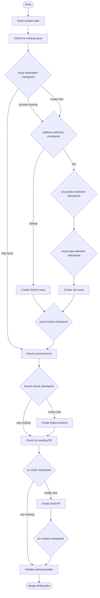
```mermaid
graph TD
    entryNode(["Entry"]) --> detectProject["Detect project type"]
    detectProject --> checkIssue["Check for existing issue"]
    checkIssue --> cpIssue{"issue-verification checkpoint"}
    cpIssue -->|"provide existing"| platformSelect
    cpIssue -->|"create new"| platformSelect{"platform-selection checkpoint"}
    cpIssue -->|"skip issue"| checkBranch

    platformSelect -->|"GitHub"| createGitHub["Create GitHub issue"]
    platformSelect -->|"Jira"| selectJiraProject{"jira-project-selection checkpoint"}
    selectJiraProject --> selectIssueType{"issue-type-selection checkpoint"}
    selectIssueType --> createJira["Create Jira issue"]

    createGitHub --> reviewIssue{"issue-review checkpoint"}
    createJira --> reviewIssue
    reviewIssue --> checkBranch["Check current branch"]

    checkBranch --> cpBranch{"branch-check checkpoint"}
    cpBranch -->|"use existing"| checkPR
    cpBranch -->|"create new"| createBranch["Create feature branch"]
    createBranch --> checkPR["Check for existing PR"]

    checkPR --> cpPR{"pr-check checkpoint"}
    cpPR -->|"use existing"| initPlanning
    cpPR -->|"create new"| createPR["Create draft PR"]
    createPR --> cpPRCreation{"pr-creation checkpoint"}
    cpPRCreation --> initPlanning["Initialize planning folder"]

    initPlanning --> exitNode(["design-philosophy"])
```

---

### 02. Design Philosophy

**Purpose:** Apply structured design framework to classify the problem, determine complexity, and decide which optional activities are needed. Sets the `complexity` variable (simple / moderate / complex) which drives ADR creation in the Complete activity. In review mode: assesses ticket completeness using the Jira Issue Creation Guide checklist.

**Skills:**

| Role | Skill ID |
|------|----------|
| primary | `classify-problem` |
| supporting | `review-assumptions` |
| supporting | `reconcile-assumptions` |

**Steps:**

1. **define-problem** — Create clear problem statement with system understanding, impact assessment, success criteria, and constraints.
2. **classify-problem** — Determine if this is a specific problem (cause known/unknown) or an inventive goal (improvement/prevention). Assess complexity.
3. **determine-path** — Based on problem complexity and clarity, determine which optional activities are needed.
4. **document-philosophy** — Create `design-philosophy.md` with problem statement, classification, complexity assessment, workflow path rationale, and constraints.
5. **collect-assumptions** — Identify assumptions made during problem classification and path selection.
6. **create-assumptions-log** — Create the assumptions log with initial assumptions from this activity.

**Checkpoints (2):**

| Checkpoint | Purpose | Blocking |
|------------|---------|----------|
| `classification-confirmed` | Confirm problem type and complexity assessment | no (autoAdvance 30s) |
| `workflow-path-selected` | Select workflow path: full, elicit-only, research-only, or skip | no (autoAdvance 30s) |

**Transitions:**

| Condition | Target |
|-----------|--------|
| default | codebase-comprehension |

Design philosophy always transitions to codebase-comprehension. Subsequent routing (to elicitation, research, or plan-prepare) is handled by codebase-comprehension's own transitions.

**Artifacts:** `design-philosophy.md`, `assumptions-log.md` (both in planning folder).

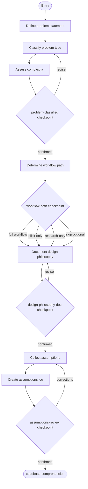
```mermaid
graph TD
    entryNode(["Entry"]) --> defineProblem["Define problem statement"]
    defineProblem --> classifyProblem["Classify problem type"]
    classifyProblem --> assessComplexity["Assess complexity"]
    assessComplexity --> cpClassified{"problem-classified checkpoint"}
    cpClassified -->|"confirmed"| determinePath["Determine workflow path"]
    cpClassified -->|"revise"| classifyProblem

    determinePath --> cpPath{"workflow-path checkpoint"}
    cpPath -->|"full workflow"| docPhilosophy
    cpPath -->|"elicit-only"| docPhilosophy
    cpPath -->|"research-only"| docPhilosophy
    cpPath -->|"skip optional"| docPhilosophy

    docPhilosophy["Document design philosophy"] --> cpDoc{"design-philosophy-doc checkpoint"}
    cpDoc -->|"confirmed"| collectAssumptions["Collect assumptions"]
    cpDoc -->|"revise"| docPhilosophy

    collectAssumptions --> createLog["Create assumptions log"]
    createLog --> cpAssumptions{"assumptions-review checkpoint"}
    cpAssumptions -->|"confirmed"| exitComprehension(["codebase-comprehension"])
    cpAssumptions -->|"corrections"| collectAssumptions
```

---

### Codebase Comprehension

**Purpose:** Build or augment a mental model of the codebase sufficient to qualify design assumptions presented in later activities. Produces persistent knowledge artifacts in `.engineering/artifacts/comprehension/` that grow across successive tasks, forming a reusable knowledge base. Always runs after design-philosophy.

**Skills:**

| Role | Skill ID |
|------|----------|
| primary | `build-comprehension` |
| supporting | `manage-artifacts` |

**Steps:**

1. **check-existing-artifacts** — Search `.engineering/artifacts/comprehension/` for existing artifacts related to this codebase area.
2. **recommend-existing** — Present relevant existing comprehension artifacts to the user. Summarize coverage and suggest reviewing them.
3. **architecture-survey** — Top-down survey: project structure, key modules, dependency graph, entry points, design patterns. Uses hypothesis-driven approach.
4. **key-abstractions** — Identify core types, traits, interfaces, data structures, error handling, and state management. Document domain meaning.
5. **design-rationale** — Infer likely rationale for significant design choices. Document as hypotheses for user validation.
6. **domain-concept-mapping** — Map technical constructs to domain concepts. Create glossary of domain-specific terminology.
7. **create-comprehension-artifact** — Write/augment artifact to `.engineering/artifacts/comprehension/{codebase-area}.md`.
8. **deep-dive-loop** — Interactive loop: present areas for deeper exploration, perform targeted analysis, append to artifact.

**Checkpoints (2):**

| Checkpoint | Purpose | Blocking |
|------------|---------|----------|
| `architecture-confirmed` | Confirm architecture survey and key abstractions are correct | no (autoAdvance 30s) |
| `comprehension-sufficient` | Confirm understanding is sufficient or select area for deeper exploration (conditional: has_open_questions) | no (autoAdvance 30s) |

**Loops:** `deep-dive-iteration` — while `needs_comprehension == true`. Each iteration explores a selected area, performs targeted analysis, and updates the artifact.

**Transitions:**

| Condition | Target |
|-----------|--------|
| `needs_elicitation == true` | requirements-elicitation |
| `needs_elicitation == false AND needs_research == true` | research |
| `skip_optional_activities == true` (default) | plan-prepare |

**Artifacts:** `{codebase-area}.md` (in comprehension folder — persistent, not gitignored).

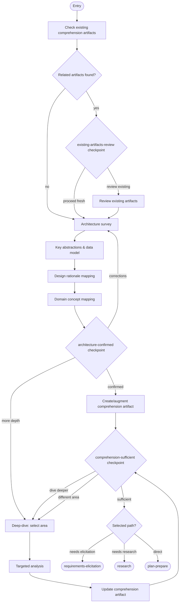
```mermaid
graph TD
    entryNode(["Entry"]) --> checkExisting["Check existing comprehension artifacts"]
    checkExisting --> hasExisting{"Related artifacts found?"}
    hasExisting -->|"yes"| cpExisting{"existing-artifacts-review checkpoint"}
    hasExisting -->|"no"| archSurvey

    cpExisting -->|"review existing"| reviewArtifacts["Review existing artifacts"]
    cpExisting -->|"proceed fresh"| archSurvey
    reviewArtifacts --> archSurvey

    archSurvey["Architecture survey"] --> keyAbstractions["Key abstractions & data model"]
    keyAbstractions --> designRationale["Design rationale mapping"]
    designRationale --> domainMapping["Domain concept mapping"]
    domainMapping --> cpArch{"architecture-confirmed checkpoint"}
    cpArch -->|"confirmed"| createArtifact["Create/augment comprehension artifact"]
    cpArch -->|"corrections"| archSurvey
    cpArch -->|"more depth"| deepDive

    createArtifact --> cpSufficient{"comprehension-sufficient checkpoint"}
    cpSufficient -->|"sufficient"| pathBranch{"Selected path?"}
    cpSufficient -->|"dive deeper"| deepDive["Deep-dive: select area"]
    cpSufficient -->|"different area"| deepDive

    deepDive --> targetedAnalysis["Targeted analysis"]
    targetedAnalysis --> updateArtifact["Update comprehension artifact"]
    updateArtifact --> cpSufficient

    pathBranch -->|"needs elicitation"| exitElicit(["requirements-elicitation"])
    pathBranch -->|"needs research"| exitResearch(["research"])
    pathBranch -->|"direct"| exitPlan(["plan-prepare"])
```

---

### 03. Requirements Elicitation (optional)

**Purpose:** Discover and clarify what the work package should accomplish through structured sequential conversation. Elicitation discovers what the user needs before planning how to implement it. Includes a stakeholder discussion phase and sequential question-domain iteration.

**Skills:**

| Role | Skill ID |
|------|----------|
| primary | `elicit-requirements` |
| supporting | `manage-artifacts` |
| supporting | `review-assumptions` |
| supporting | `reconcile-assumptions` |

**Steps:**

1. **stakeholder-discussion** — Prompt user to initiate discussion with key stakeholders. User provides transcript or summary.
2. **elicit-requirements** — Iterate through question domains, asking one question at a time. Use stakeholder transcript as context.
3. **collect-assumptions** — Identify assumptions made when interpreting user responses.
4. **create-document** — Create requirements document using elicitation output template.
5. **update-assumptions-log** — Add requirements-phase assumptions to the assumptions log.
6. **reconcile-assumptions** — Classify and iteratively resolve code-analyzable assumptions through targeted codebase analysis.

**Checkpoints (2):**

| Checkpoint | Purpose | Blocking |
|------------|---------|----------|
| `stakeholder-transcript` | Provide or skip stakeholder discussion transcript | yes |
| `elicitation-complete` | Confirm elicitation is complete | no (autoAdvance 30s) |

**Loops:**
- `assumption-reconciliation` — while `has_resolvable_assumptions == true`. Each cycle analyzes code-resolvable assumptions, updates the log, and reclassifies.
- `domain-iteration` — forEach over `question_domains` (max 5 iterations). Each iteration asks one question and records the response.

**Transitions:**

| Condition | Target |
|-----------|--------|
| `elicitation_complete == true` (default) | research |
| `elicitation_complete == false` | requirements-elicitation (self-loop) |

**Artifacts:** `requirements-elicitation.md` (in planning folder).

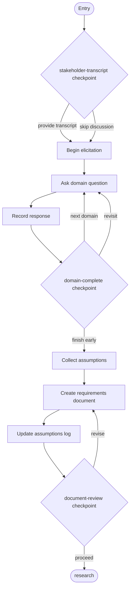
```mermaid
graph TD
    entryNode(["Entry"]) --> cpStakeholder{"stakeholder-transcript checkpoint"}
    cpStakeholder -->|"provide transcript"| startElicit["Begin elicitation"]
    cpStakeholder -->|"skip discussion"| startElicit

    startElicit --> askQuestion["Ask domain question"]
    askQuestion --> recordResponse["Record response"]
    recordResponse --> cpDomain{"domain-complete checkpoint"}
    cpDomain -->|"next domain"| askQuestion
    cpDomain -->|"revisit"| askQuestion
    cpDomain -->|"finish early"| collectAssumptions

    collectAssumptions["Collect assumptions"] --> createDoc["Create requirements document"]
    createDoc --> updateLog["Update assumptions log"]
    updateLog --> cpDocReview{"document-review checkpoint"}
    cpDocReview -->|"proceed"| exitNode(["research"])
    cpDocReview -->|"revise"| createDoc
```

---

### 04. Research (optional)

**Purpose:** Research the knowledge base and external sources to discover best practices, patterns, and resources to inform the plan-prepare activity.

**Skills:**

| Role | Skill ID |
|------|----------|
| primary | `research-knowledge-base` |
| supporting | `review-assumptions` |
| supporting | `reconcile-assumptions` |

**Steps:**

1. **kb-research** — Call `get_guidance` before making concept-rag MCP tool calls. Search for relevant patterns and practices.
2. **web-research** — Search web for current information, documentation, and best practices.
3. **synthesize** — Connect findings to requirements: which patterns apply, what modifications needed, risks, success metrics.
4. **collect-assumptions** — Identify assumptions made during research synthesis.
5. **document** — Create knowledge base research document.
6. **update-assumptions-log** — Add research-phase assumptions to the assumptions log.
7. **reconcile-assumptions** — Classify and iteratively resolve code-analyzable assumptions through targeted codebase analysis.

**Loops:** `assumption-reconciliation` — while `has_resolvable_assumptions == true`. Each cycle analyzes code-resolvable assumptions, updates the log, and reclassifies.

**Checkpoints (3):**

| Checkpoint | Purpose | Blocking |
|------------|---------|----------|
| `research-findings` | Confirm research findings | no (autoAdvance 30s) |
| `research-focus` | Specify additional research focus (conditional: `needs_further_research`) | yes |
| `research-assumption-interview` | Resolve or defer open assumptions (conditional: `has_open_assumptions`) | yes |

**Transitions:** Default to `implementation-analysis`.

**Artifacts:** `kb-research.md` (in planning folder).

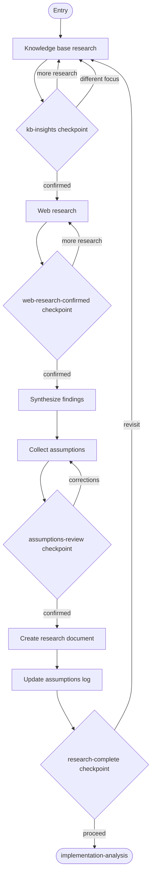
```mermaid
graph TD
    entryNode(["Entry"]) --> kbResearch["Knowledge base research"]
    kbResearch --> cpKB{"kb-insights checkpoint"}
    cpKB -->|"confirmed"| webResearch["Web research"]
    cpKB -->|"more research"| kbResearch
    cpKB -->|"different focus"| kbResearch

    webResearch --> cpWeb{"web-research-confirmed checkpoint"}
    cpWeb -->|"confirmed"| synthesize["Synthesize findings"]
    cpWeb -->|"more research"| webResearch

    synthesize --> collectAssumptions["Collect assumptions"]
    collectAssumptions --> cpAssumptions{"assumptions-review checkpoint"}
    cpAssumptions -->|"confirmed"| createDoc["Create research document"]
    cpAssumptions -->|"corrections"| collectAssumptions

    createDoc --> updateLog["Update assumptions log"]
    updateLog --> cpComplete{"research-complete checkpoint"}
    cpComplete -->|"proceed"| exitNode(["implementation-analysis"])
    cpComplete -->|"revisit"| kbResearch
```

---

### 05. Implementation Analysis

**Purpose:** Analyze the current implementation to understand effectiveness, establish baselines, and identify opportunities for improvement. In review mode: checks out the base branch to analyze the pre-change state, documents expected changes, then returns to the PR branch.

**Skills:**

| Role | Skill ID |
|------|----------|
| primary | `analyze-implementation` |
| supporting | `manage-artifacts` |
| supporting | `review-assumptions` |
| supporting | `reconcile-assumptions` |

**Steps:**

1. **review-implementation** — Understand where and how the feature/component is used: location, usage, dependencies, architecture.
2. **evaluate-effectiveness** — Gather evidence of existing performance: logs, metrics, tests, issues, comments.
3. **establish-baselines** — Establish quantitative measurements: performance, quality, usage, reliability.
4. **collect-assumptions** — Identify assumptions made during analysis.
5. **document** — Create implementation analysis document.
6. **update-assumptions-log** — Add analysis-phase assumptions to the assumptions log.
7. **reconcile-assumptions** — Classify and iteratively resolve code-analyzable assumptions through targeted codebase analysis.

**Loops:** `assumption-reconciliation` — while `has_resolvable_assumptions == true`. Each cycle analyzes code-resolvable assumptions, updates the log, and reclassifies.

**Checkpoints (2):**

| Checkpoint | Purpose | Blocking |
|------------|---------|----------|
| `analysis-confirmed` | Confirm analysis findings are correct | no (autoAdvance 30s) |
| `analysis-assumption-interview` | Resolve or defer open assumptions (conditional: `has_open_assumptions`) | yes |

**Transitions:** Default to `plan-prepare`.

**Artifacts:** `implementation-analysis.md` (in planning folder).

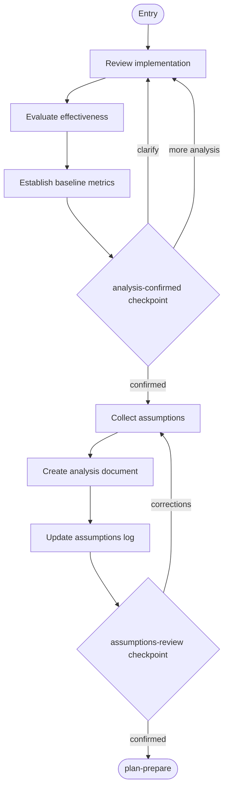
```mermaid
graph TD
    entryNode(["Entry"]) --> reviewImpl["Review implementation"]
    reviewImpl --> evalEffectiveness["Evaluate effectiveness"]
    evalEffectiveness --> establishBaselines["Establish baseline metrics"]
    establishBaselines --> cpAnalysis{"analysis-confirmed checkpoint"}
    cpAnalysis -->|"confirmed"| collectAssumptions["Collect assumptions"]
    cpAnalysis -->|"clarify"| reviewImpl
    cpAnalysis -->|"more analysis"| reviewImpl

    collectAssumptions --> createDoc["Create analysis document"]
    createDoc --> updateLog["Update assumptions log"]
    updateLog --> cpAssumptions{"assumptions-review checkpoint"}
    cpAssumptions -->|"confirmed"| exitNode(["plan-prepare"])
    cpAssumptions -->|"corrections"| collectAssumptions
```

---

### 06. Plan & Prepare

**Purpose:** Design the approach, create the work package plan (task breakdown), create the test plan, and prepare for implementation. This is the convergence point for all optional paths.

**Skills:**

| Role | Skill ID |
|------|----------|
| primary | `create-plan` |
| supporting | `classify-problem` |
| supporting | `review-assumptions` |
| supporting | `create-test-plan` |

**Steps:**

1. **apply-design** — Use design framework skill to structure the approach.
2. **create-plan** — Create work package plan document with task breakdown.
3. **create-test-plan** — Create test plan document.
4. **collect-assumptions** — Identify assumptions made during planning.
5. **update-assumptions-log** — Add planning-phase assumptions to the assumptions log.
6. **create-todos** — Break down plan into actionable tasks and add to assumptions log for review.
7. **sync-branch** — Ensure feature branch is up to date with `main`.
8. **update-pr** — Update PR with planning information.

**Checkpoints (1):**

| Checkpoint | Purpose | Blocking |
|------------|---------|----------|
| `approach-confirmed` | Confirm implementation approach | no (autoAdvance 30s) |

**Transitions:** Default to `assumptions-review`.

**Artifacts:** `work-package-plan.md`, `test-plan.md` (both in planning folder).

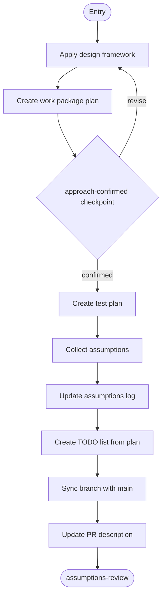
```mermaid
graph TD
    entryNode(["Entry"]) --> applyDesign["Apply design framework"]
    applyDesign --> createPlan["Create work package plan"]
    createPlan --> cpApproach{"approach-confirmed checkpoint"}
    cpApproach -->|"confirmed"| createTestPlan["Create test plan"]
    cpApproach -->|"revise"| applyDesign

    createTestPlan --> collectAssumptions["Collect assumptions"]
    collectAssumptions --> updateLog["Update assumptions log"]
    updateLog --> createTodos["Create TODO list from plan"]
    createTodos --> syncBranch["Sync branch with main"]

    syncBranch --> updatePR["Update PR description"]
    updatePR --> exitNode(["assumptions-review"])
```

---

### 07. Assumptions Review

**Purpose:** Post accumulated assumptions from all prior phases (design, requirements, research, analysis, planning) to the issue tracker for stakeholder review. Supports both Jira and GitHub platforms. Awaits stakeholder feedback and iterates if further discussion is needed.

**Skills:**

| Role | Skill ID |
|------|----------|
| primary | `review-assumptions` |
| supporting | `manage-artifacts` |

**Steps:**

1. **prepare-assumptions-summary** — Compile all accumulated assumptions from prior phases into an issue comment.
2. **post-assumptions-comment** — Post comment to issue tracker (conditional on `issue_platform` being set).
3. **await-stakeholder-response** — Wait for stakeholder feedback on posted comment.
4. **update-assumptions-log** — Update assumptions log with stakeholder review outcomes.

**Checkpoints (2):**

| Checkpoint | Purpose | Blocking |
|------------|---------|----------|
| `assumption-decision` | Accept, reject, or defer each assumption in the interview loop | yes |
| `post-summary-review` | Confirm posting deferred-assumption summary to issue tracker (conditional: `issue_platform` set and `has_deferred_assumptions`) | no (autoAdvance 30s) |

**Transitions:**

| Condition | Target |
|-----------|--------|
| `needs_comprehension == true` | codebase-comprehension |
| `needs_plan_revision == true` | plan-prepare |
| `needs_further_discussion == true` | assumptions-review (self-loop) |
| default | implement |

**Artifacts:** `assumptions-log.md` (update, in planning folder).

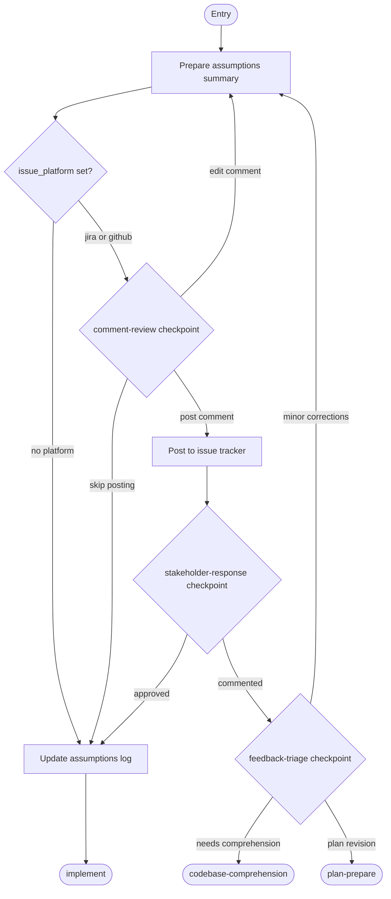
```mermaid
graph TD
    entryNode(["Entry"]) --> prepSummary["Prepare assumptions summary"]
    prepSummary --> checkPlatform{"issue_platform set?"}
    checkPlatform -->|"jira or github"| cpComment{"comment-review checkpoint"}
    checkPlatform -->|"no platform"| updateLog["Update assumptions log"]

    cpComment -->|"post comment"| postComment["Post to issue tracker"]
    cpComment -->|"edit comment"| prepSummary
    cpComment -->|"skip posting"| updateLog

    postComment --> cpResponse{"stakeholder-response checkpoint"}
    cpResponse -->|"approved"| updateLog
    cpResponse -->|"commented"| cpTriage{"feedback-triage checkpoint"}

    cpTriage -->|"minor corrections"| prepSummary
    cpTriage -->|"needs comprehension"| exitComprehension(["codebase-comprehension"])
    cpTriage -->|"plan revision"| exitPlan(["plan-prepare"])

    updateLog --> exitNode(["implement"])
```

---

### 08. Implement

**Purpose:** Execute the implementation plan task by task. Each task follows a cycle of implement, test, commit, review assumptions, checkpoint. Contains two nested loops: the task implementation cycle and the assumption review cycle within each task.

**Skills:**

| Role | Skill ID |
|------|----------|
| primary | `implement-task` |
| supporting | `review-assumptions` |
| supporting | `validate-build` |
| supporting | `manage-git` |

**Entry action:** Verify on correct feature branch before any code changes.

**Loops:**

| Loop | Type | Iterates over | Max |
|------|------|---------------|-----|
| `task-cycle` | forEach | `plan.tasks` | 100 |
| `assumption-review-cycle` | forEach | `task_assumptions` | 100 |

**Task cycle steps (per task):**

1. **implement-task** — Write code for the current task.
2. **run-tests** — Execute tests to verify implementation.
3. **commit** — Commit changes.
4. **collect-assumptions** — Identify all assumptions made during this task.
5. **update-assumptions-log** — Record outcomes in assumptions log after review.

**Checkpoints (4):**

| Checkpoint | Purpose | Blocking |
|------------|---------|----------|
| `switch-model-pre-impl` | Switch model before implementation | no (autoAdvance 10s) |
| `confirm-implementation` | Confirm start of implementation (all tasks) | no (autoAdvance 30s) |
| `implementation-assumption-interview` | Resolve or defer open assumptions (conditional: `has_open_assumptions`) | yes |
| `switch-model-post-impl` | Switch model after implementation | no (autoAdvance 10s) |

**Transitions:** Default to `post-impl-review`.

**Artifacts:** `assumptions-log.md` (continues from earlier phases).

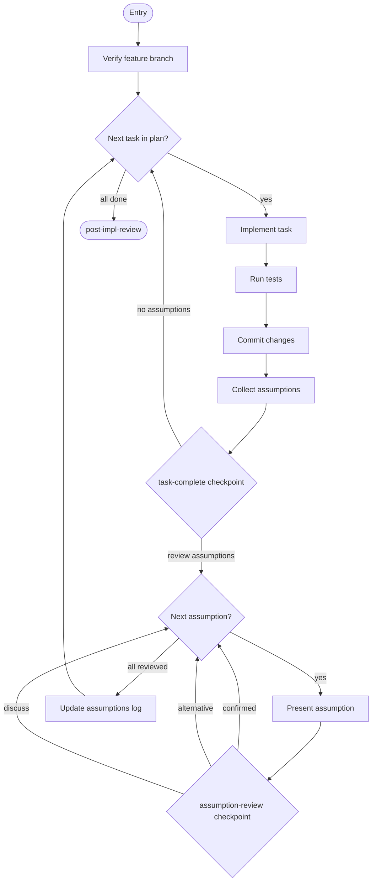
```mermaid
graph TD
    entryNode(["Entry"]) --> verifyBranch["Verify feature branch"]
    verifyBranch --> nextTask{"Next task in plan?"}
    nextTask -->|"yes"| implementTask["Implement task"]
    nextTask -->|"all done"| exitNode(["post-impl-review"])

    implementTask --> runTests["Run tests"]
    runTests --> commitChanges["Commit changes"]
    commitChanges --> collectAssumptions["Collect assumptions"]
    collectAssumptions --> cpTask{"task-complete checkpoint"}
    cpTask -->|"review assumptions"| nextAssumption{"Next assumption?"}
    cpTask -->|"no assumptions"| nextTask

    nextAssumption -->|"yes"| presentAssumption["Present assumption"]
    nextAssumption -->|"all reviewed"| updateLog["Update assumptions log"]
    presentAssumption --> cpAssumption{"assumption-review checkpoint"}
    cpAssumption -->|"confirmed"| nextAssumption
    cpAssumption -->|"alternative"| nextAssumption
    cpAssumption -->|"discuss"| nextAssumption

    updateLog --> nextTask
```

---

### 09. Post-Implementation Review

**Purpose:** Review implementation quality through manual diff review, code review, test suite review, and architecture summary. Includes a blocker gate: if a critical blocker is found, transitions back to implement for remediation.

**Artifact prefix:** `09`

**Skills:**

| Role | Skill ID |
|------|----------|
| primary | `review-diff` |
| supporting | `review-code` |
| supporting | `review-test-suite` |
| supporting | `summarize-architecture` |

**Review stages:**

1. **Manual diff review** — Pull and diff, create change-block index, present file table to user, collect flagged blocks, interview each flagged block, write report.
2. **Code review** — Comprehensive code review using Rust/Substrate criteria (if applicable).
3. **Test suite review** — Assess test quality, coverage, and anti-patterns.
4. **Architecture summary** — Create high-level architecture summary with diagrams.

**Checkpoints (3):**

| Checkpoint | Purpose | Blocking |
|------------|---------|----------|
| `file-index-table` | Present file/block index for user to flag items | yes |
| `block-interview` | Interview user on each flagged block (conditional: has_flagged_blocks) | yes |
| `review-findings` | Confirm review findings | no (autoAdvance 30s) |

**Decision:** `blocker-gate` — If `has_critical_blocker == true`, transition back to `implement`. Otherwise proceed to `validate`.

**Artifacts (prefixed with `09-`):**

| Artifact | Description |
|----------|-------------|
| `09-change-block-index.md` | Indexed table of all changed blocks in the diff |
| `09-manual-diff-review.md` | Manual diff review findings from interview process |
| `09-code-review.md` | Comprehensive code review document |
| `09-test-suite-review.md` | Test suite quality assessment |
| `09-architecture-summary.md` | High-level architecture summary with diagrams |

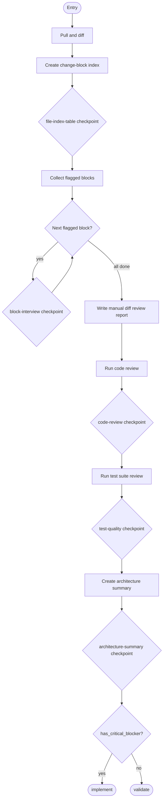
```mermaid
graph TD
    entryNode(["Entry"]) --> pullDiff["Pull and diff"]
    pullDiff --> createIndex["Create change-block index"]
    createIndex --> cpFileIndex{"file-index-table checkpoint"}
    cpFileIndex --> collectFlagged["Collect flagged blocks"]
    collectFlagged --> interviewLoop{"Next flagged block?"}
    interviewLoop -->|"yes"| cpInterview{"block-interview checkpoint"}
    cpInterview --> interviewLoop
    interviewLoop -->|"all done"| writeReport["Write manual diff review report"]

    writeReport --> codeReview["Run code review"]
    codeReview --> cpCodeReview{"code-review checkpoint"}
    cpCodeReview --> testReview["Run test suite review"]
    testReview --> cpTestQuality{"test-quality checkpoint"}
    cpTestQuality --> archSummary["Create architecture summary"]
    archSummary --> cpArch{"architecture-summary checkpoint"}

    cpArch --> blockerGate{"has_critical_blocker?"}
    blockerGate -->|"yes"| exitImplement(["implement"])
    blockerGate -->|"no"| exitValidate(["validate"])
```

---

### 10. Validate

**Purpose:** Validate the implementation through testing, build verification, and lint checking. If failures are found, analyze root cause, fix, and re-run until all pass. In review mode: documents failures as review findings and does not attempt fixes.

**Skills:**

| Role | Skill ID |
|------|----------|
| primary | `validate-build` |

**Steps:**

1. **run-tests** — Execute unit, integration, and e2e tests. Observe and record results.
2. **verify-build** — Run build. Observe and record result.
3. **check-lint** — Run linter. Observe and record results.
4. **evaluate-results** — Set `has_failures` and `validation_passed` from observed outcomes.
5. **document-failures** / **assess-test-coverage** — Review mode only: document failures and assess coverage.
6. **fix-failures** — If tests/build/lint fail, analyze root cause, fix, and re-run. Repeat until all pass. (Skipped in review mode.)
7. **scan-commit-signatures-for-strategic** — Preflight GPG scan for `merge-base..HEAD`; sets `unsigned_commits_in_pr` and `unsigned_commit_list_summary` for strategic review.

**Supporting skill:** `manage-git` (signature scan step).

**Checkpoints (0):** This activity has no checkpoints. Test/build/lint results are observable and do not require user confirmation.

**Transitions:** Default to `strategic-review`.

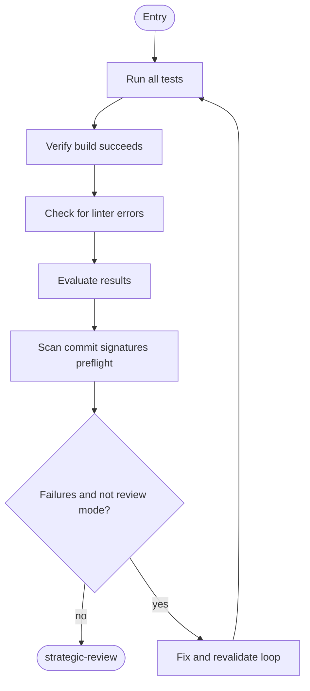
```mermaid
graph TD
    entryNode(["Entry"]) --> runTests["Run all tests"]
    runTests --> verifyBuild["Verify build succeeds"]
    verifyBuild --> checkLint["Check for linter errors"]
    checkLint --> evaluateResults["Evaluate results"]
    evaluateResults --> scanSigs["Scan commit signatures preflight"]
    scanSigs --> fixBranch{"Failures and not review mode?"}
    fixBranch -->|"no"| exitNode(["strategic-review"])
    fixBranch -->|"yes"| fixFailures["Fix and revalidate loop"]
    fixFailures --> runTests
```

---

### 11. Strategic Review

**Purpose:** Review the implementation to ensure changes are minimal and focused. Validates that the final PR contains only the changes required for the solution. GPG signature preflight runs in validate; if unsigned commits exist, a checkpoint asks whether to re-sign before the worker continues. When the target repo has a root-level `changes/` directory, ensures a matching changelog fragment exists. Creates strategic review document and architecture summary. In review mode: documents cleanup recommendations without applying them.

**Artifact prefix:** `11`

**Skills:**

| Role | Skill ID |
|------|----------|
| primary | `review-strategy` |
| supporting | `manage-git` (re-sign step when user opts in) |

**Steps:**

1. **diff-review** — Examine all changes in the PR for scope and relevance.
2. **resign-unsigned-pr-commits** — Only if `resign_unsigned_commits_requested`: GPG re-sign via rebase in `target_path`, re-verify, force-with-lease push if needed.
3. **identify-artifacts** — Find investigation artifacts, over-engineering, orphaned infrastructure.
4. **ensure-changes-folder-entry** — If `changes/` exists at repo root, add a fragment matching existing conventions when none exists for this work.
5. **document-findings** — Create `11-strategic-review-{n}.md` with items that should be removed or simplified.
6. **document-cleanup-recommendations** — Review mode only.
7. **apply-cleanup** — Remove identified artifacts when not in review mode.
8. **create-architecture-summary** — Create `11-architecture-summary.md` using the architecture summary resource template.
9. **analyze-strategic-findings** — Set `recommended_strategic_option`.

**Checkpoints (2):**

| Checkpoint | Purpose | Blocking |
|------------|---------|----------|
| `unsigned-commits-prompt` | Ask whether to re-sign unsigned PR commits (conditional on `unsigned_commits_in_pr`) | yes |
| `review-findings` | Confirm strategic review findings | no (autoAdvance 30s) |

**Transitions:** To `submit-for-review` when `is_review_mode` or `review_passed`; default to `plan-prepare`.

**Artifacts (prefixed with `11-`):**

| Artifact | Description |
|----------|-------------|
| `11-strategic-review-{n}.md` | Review findings, identified artifacts, cleanup actions. `{n}` increments on successive reviews. |
| `11-architecture-summary.md` | High-level architecture summary with UML-style diagrams |

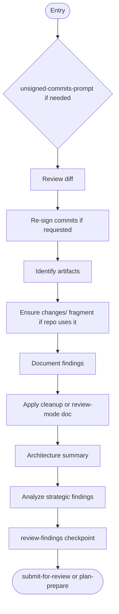
```mermaid
graph TD
    entryNode(["Entry"]) --> cpUnsigned{"unsigned-commits-prompt if needed"}
    cpUnsigned --> diffReview["Review diff"]
    diffReview --> resign["Re-sign commits if requested"]
    resign --> identifyArtifacts["Identify artifacts"]
    identifyArtifacts --> changesFrag["Ensure changes/ fragment if repo uses it"]
    changesFrag --> documentFindings["Document findings"]
    documentFindings --> applyCleanup["Apply cleanup or review-mode doc"]
    applyCleanup --> createArchSummary["Architecture summary"]
    createArchSummary --> analyze["Analyze strategic findings"]
    analyze --> cpFindings["review-findings checkpoint"]
    cpFindings --> exitSubmit(["submit-for-review or plan-prepare"])
```

---

### 12. Submit for Review

**Purpose:** Push PR, update description with implementation details, mark ready for review, then await reviewer feedback. If significant changes are requested, loop back to plan-prepare. In review mode: consolidates all review findings and posts structured PR review comments, then ends the workflow.

**Skills:**

| Role | Skill ID |
|------|----------|
| primary | `update-pr` |
| supporting | `respond-to-pr-review` |

**Steps (standard mode):**

1. **push-commits** — Push all commits to remote.
2. **update-description** — Update PR description with final implementation details.
3. **mark-ready** — Mark PR as ready for review.
4. **await-review** — Wait for PR to receive manual review.
5. **process-review-comments** — Analyze and respond to review feedback using `respond-to-pr-review` skill.

**Checkpoints (3):**

| Checkpoint | Purpose | Blocking |
|------------|---------|----------|
| `review-received` | Confirm that review comments have been received | yes |
| `review-outcome` | Determine outcome: approved, minor changes, or significant changes | no (autoAdvance 30s) |
| `review-ready` | Confirm human review feedback is available before processing comments | yes |

**Transitions:**

| Condition | Target |
|-----------|--------|
| `review_requires_changes == true` | plan-prepare |
| default | complete |

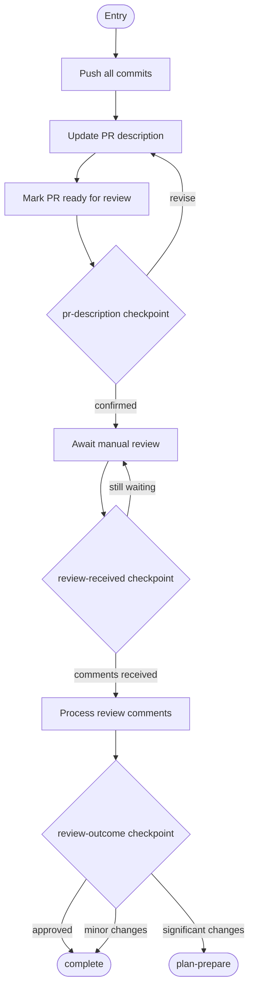
```mermaid
graph TD
    entryNode(["Entry"]) --> pushCommits["Push all commits"]
    pushCommits --> updateDesc["Update PR description"]
    updateDesc --> markReady["Mark PR ready for review"]
    markReady --> cpPRDesc{"pr-description checkpoint"}
    cpPRDesc -->|"confirmed"| awaitReview["Await manual review"]
    cpPRDesc -->|"revise"| updateDesc

    awaitReview --> cpReview{"review-received checkpoint"}
    cpReview -->|"comments received"| processComments["Process review comments"]
    cpReview -->|"still waiting"| awaitReview

    processComments --> cpOutcome{"review-outcome checkpoint"}
    cpOutcome -->|"approved"| exitComplete(["complete"])
    cpOutcome -->|"minor changes"| exitComplete
    cpOutcome -->|"significant changes"| exitPlan(["plan-prepare"])
```

---

### 13. Complete

**Purpose:** Final activity — create Architecture Decision Record (if moderate or complex implementation), finalize documentation, conduct retrospective, capture session history, update status, and select next work package. In review mode: ends after retrospective.

**Artifact prefix:** `13`

**Skills:**

| Role | Skill ID |
|------|----------|
| primary | `finalize-documentation` |
| supporting | `create-adr` |
| supporting | `conduct-retrospective` |

**Steps:**

1. **create-adr** — Automatically create ADR based on design philosophy complexity assessment (triggered for moderate or complex implementations).
2. **update-adr-status** — If ADR exists, update status to Accepted.
3. **finalize-test-plan** — Add hyperlinks to test source locations.
4. **create-complete-doc** — Create `COMPLETE.md` completion document.
5. **ensure-docs** — Verify public APIs have inline documentation.
6. **capture-history** — If metadata repository exists (private, never committed).
7. **retrospective** — Workflow retrospective (skip if trivial session).
8. **update-status** — Update work package plan status after PR merge.
9. **select-next** — Select next work package.

**Checkpoints (0):** This activity has no checkpoints.

**Transitions:** None — this is the terminal activity.

**Artifacts:**

| Artifact | Location | Description |
|----------|----------|-------------|
| `COMPLETE.md` | planning | Completion document |
| `workflow-retrospective.md` | planning | Retrospective notes |
| `NNNN-{decision-title}.md` | `.engineering/artifacts/adr` | ADR for moderate/complex implementations |
| `{YYYY-MM-DD}-pr{N}-review-analysis.md` | `.engineering/artifacts/reviews` | PR review analysis |

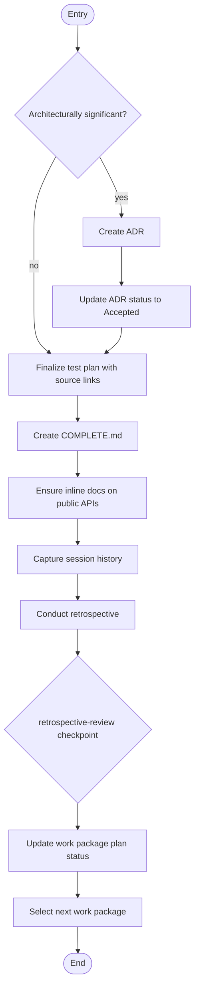
```mermaid
graph TD
    entryNode(["Entry"]) --> checkADR{"Architecturally significant?"}
    checkADR -->|"yes"| createADR["Create ADR"]
    checkADR -->|"no"| finalizeTestPlan

    createADR --> updateADR["Update ADR status to Accepted"]
    updateADR --> finalizeTestPlan["Finalize test plan with source links"]

    finalizeTestPlan --> createComplete["Create COMPLETE.md"]
    createComplete --> ensureDocs["Ensure inline docs on public APIs"]
    ensureDocs --> captureHistory["Capture session history"]
    captureHistory --> retrospective["Conduct retrospective"]
    retrospective --> cpRetro{"retrospective-review checkpoint"}
    cpRetro --> updateStatus["Update work package plan status"]
    updateStatus --> selectNext["Select next work package"]
    selectNext --> doneNode(["End"])
```

---
