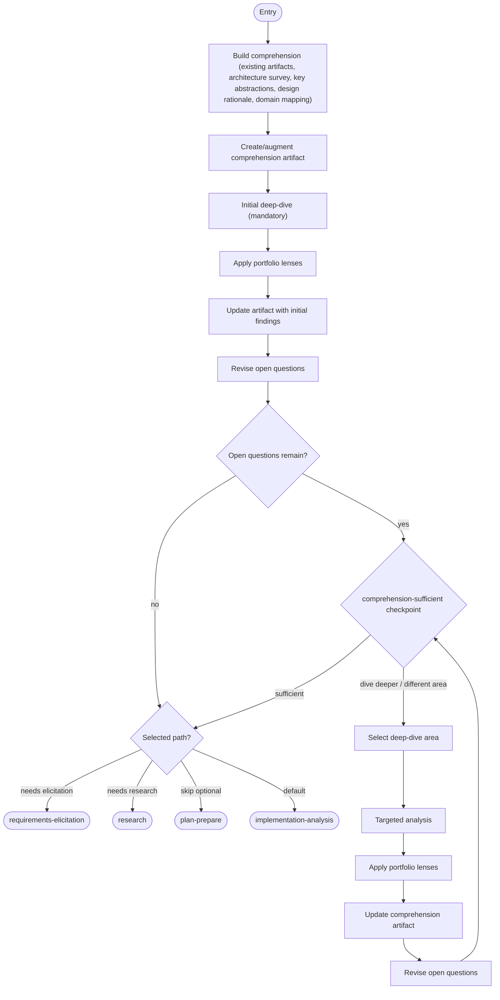
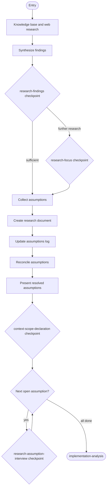
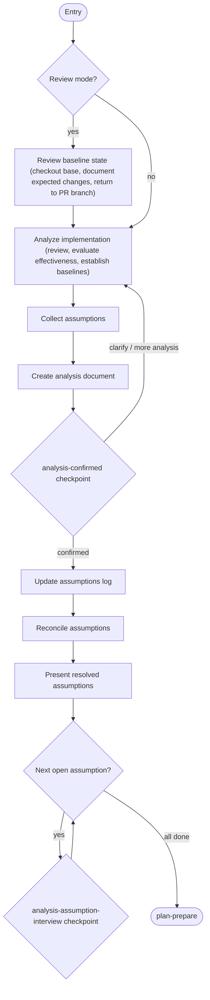
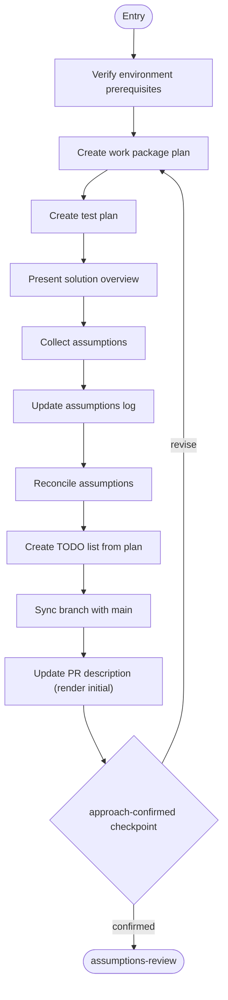
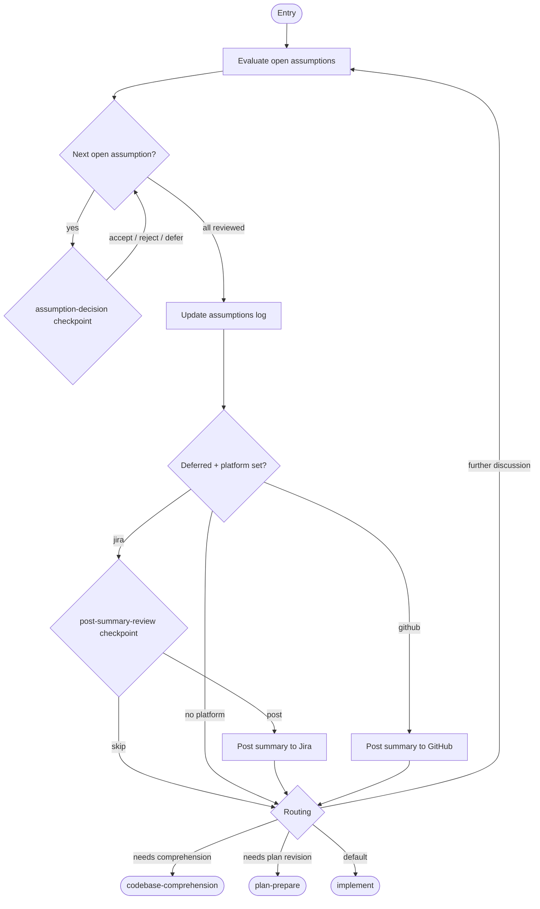
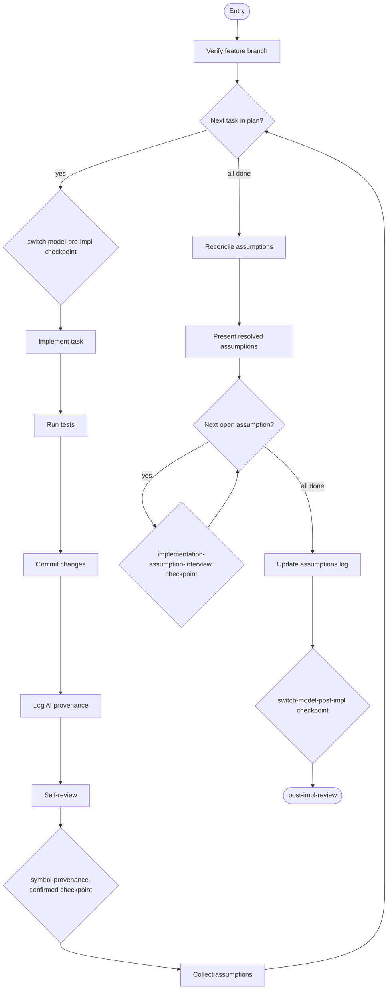
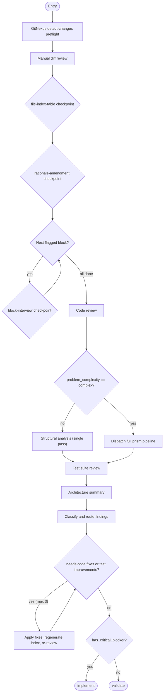
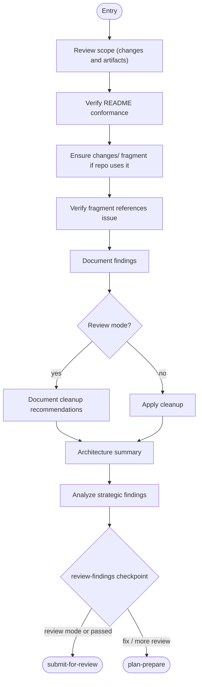
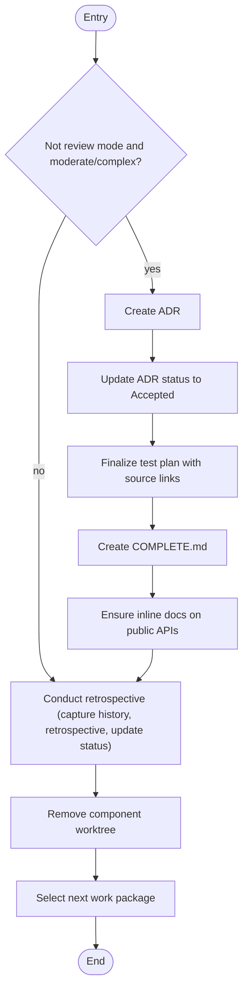

# Work Package Activities

> Part of the [Work Package Implementation Workflow](../README.md)

This is the per-activity orientation map: each entry gives the activity's purpose, the value it delivers, how it connects to the rest of the workflow, and a link to its authoritative definition. The structured definition of each activity — its steps, checkpoints, loops, decisions, transitions, and artifacts — lives in the corresponding `NN-<id>.toon` file and is served by `get_activity`; it is not duplicated here.

For the activity-to-activity flow diagram, the feedback loops, and review-mode behaviour, see the [workflow README](../README.md). Each activity section below also includes a mermaid diagram showing its internal flow.

---

### 01. Start Work Package

Initializes the work package: detects monorepo vs standalone reference, refreshes the reference (submodules + GitNexus), verifies or creates a tracker issue, materializes a dedicated git worktree of the component at `~/projects/work/{component_name}/{wp-slug}/`, sets up the feature branch and draft PR inside that worktree, and binds the server-resolved planning folder. In review mode it instead captures the existing PR reference and checks out the PR's branch. Entry activity; leads to design-philosophy.

Definition: [`01-start-work-package.toon`](./01-start-work-package.toon)

```mermaid
graph TD
    entryNode(["Entry"]) --> detectReview["Detect review mode"]
    detectReview --> resolveRef["Resolve reference: monorepo or standalone"]
    resolveRef --> updateSubs["Update reference submodules to HEAD"]
    updateSubs --> analyze["GitNexus analyze (reference)"]
    analyze --> verifySigning["Verify commit-signing pre-conditions"]
    verifySigning --> detectMerge["Detect merge strategy"]
    detectMerge --> detectProject["Detect project type"]
    detectProject --> checkIssue["Check for existing issue"]
    checkIssue --> cpIssue{"issue-verification checkpoint"}
    cpIssue -->|"provide existing"| platformSelect
    cpIssue -->|"create new"| platformSelect{"platform-selection checkpoint"}
    cpIssue -->|"skip issue"| bindPlanning

    platformSelect -->|"GitHub"| createGitHub["Create GitHub issue"]
    platformSelect -->|"Jira"| selectJiraProject{"jira-project-selection checkpoint"}
    selectJiraProject --> selectIssueType{"issue-type-selection checkpoint"}
    selectIssueType --> createJira["Create Jira issue"]

    createGitHub --> reviewIssue{"issue-review checkpoint"}
    createJira --> reviewIssue
    reviewIssue --> assignIssue["Assign and transition issue"]
    assignIssue --> bindPlanning["Bind planning folder path"]

    bindPlanning --> initPlanning["Initialize planning folder README"]
    initPlanning --> problemOverview["Present problem overview"]
    problemOverview --> deriveBranch["Derive feature branch name"]
    deriveBranch --> computePath["Compute canonical target_path"]
    computePath --> createWorktree["Create component worktree (branch + worktree in one step)"]
    createWorktree --> checkBranch["Check current branch"]
    checkBranch --> checkPR["Check for existing PR (inside worktree)"]

    checkPR --> cpPR{"pr-check checkpoint"}
    cpPR -->|"use existing"| linkPR
    cpPR -->|"create new"| createPR["Create draft PR"]
    createPR --> cpPRCreation{"pr-creation checkpoint"}
    cpPRCreation --> linkPR["Link PR to issue"]

    linkPR --> exitNode(["design-philosophy"])
```

---

### 02. Design Philosophy

Applies a structured design framework to classify the problem (type and complexity), reconcile early assumptions, and decide which optional discovery activities are needed. The complexity it sets drives ADR creation later in Complete. In review mode it also assesses ticket completeness. Always transitions to codebase-comprehension, which then routes onward.

Definition: [`02-design-philosophy.toon`](./02-design-philosophy.toon)

```mermaid
graph TD
    entryNode(["Entry"]) --> defineProblem["Define problem statement"]
    defineProblem --> classifyProblem["Classify problem type and complexity"]
    classifyProblem --> cpClassified{"classification-confirmed checkpoint"}
    cpClassified -->|"confirmed"| determinePath["Determine workflow path"]
    cpClassified -->|"revise"| classifyProblem

    determinePath --> cpPath{"workflow-path-selected checkpoint"}
    cpPath --> docPhilosophy["Document design philosophy"]
    docPhilosophy --> collectAssumptions["Collect assumptions"]
    collectAssumptions --> createLog["Create assumptions log"]
    createLog --> reconcile["Reconcile assumptions"]
    reconcile --> reviewMode{"Review mode?"}
    reviewMode -->|"yes"| ticketCompleteness{"ticket-completeness checkpoint"}
    reviewMode -->|"no"| exitComprehension(["codebase-comprehension"])
    ticketCompleteness --> exitComprehension
```

---

### Codebase Comprehension (optional)

Builds or augments a durable mental model of the codebase sufficient to qualify the design assumptions raised in later activities. Produces persistent knowledge artifacts under `.engineering/artifacts/comprehension/` that grow across successive work packages. Runs after design-philosophy and routes to elicitation, research, analysis, or plan-prepare depending on the chosen path.

Definition: [`14-codebase-comprehension.toon`](./14-codebase-comprehension.toon)

```mermaid
graph TD
    entryNode(["Entry"]) --> buildComprehension["Build comprehension (existing artifacts, architecture survey, key abstractions, design rationale, domain mapping)"]
    buildComprehension --> createArtifact["Create/augment comprehension artifact"]

    createArtifact --> initialDeepDive["Initial deep-dive (mandatory)"]
    initialDeepDive --> initialLens["Apply portfolio lenses"]
    initialLens --> updateInitial["Update artifact with initial findings"]
    updateInitial --> reviseQuestions["Revise open questions"]
    reviseQuestions --> hasOpen{"Open questions remain?"}
    hasOpen -->|"no"| pathBranch
    hasOpen -->|"yes"| cpSufficient{"comprehension-sufficient checkpoint"}
    cpSufficient -->|"sufficient"| pathBranch{"Selected path?"}
    cpSufficient -->|"dive deeper / different area"| selectArea["Select deep-dive area"]

    selectArea --> targetedAnalysis["Targeted analysis"]
    targetedAnalysis --> lensPass["Apply portfolio lenses"]
    lensPass --> updateArtifact["Update comprehension artifact"]
    updateArtifact --> reviseOpen["Revise open questions"]
    reviseOpen --> cpSufficient

    pathBranch -->|"needs elicitation"| exitElicit(["requirements-elicitation"])
    pathBranch -->|"needs research"| exitResearch(["research"])
    pathBranch -->|"skip optional"| exitPlan(["plan-prepare"])
    pathBranch -->|"default"| exitAnalysis(["implementation-analysis"])
```

---

### 03. Requirements Elicitation (optional)

Discovers and clarifies what the work package should accomplish through a structured stakeholder conversation, so that planning starts from agreed requirements rather than guesses. Skipped in review mode (requirements come from the ticket). Leads to research or directly to implementation-analysis.

Definition: [`03-requirements-elicitation.toon`](./03-requirements-elicitation.toon)

```mermaid
graph TD
    entryNode(["Entry"]) --> cpStakeholder{"stakeholder-transcript checkpoint"}
    cpStakeholder -->|"provide transcript"| elicit["Elicit requirements"]
    cpStakeholder -->|"skip discussion"| elicit

    elicit --> askQuestion["Ask domain question"]
    askQuestion --> recordResponse["Record response"]
    recordResponse --> userIntent{"user-intent decision"}
    userIntent -->|"continue"| askQuestion
    userIntent -->|"done"| collectAssumptions["Collect assumptions"]

    collectAssumptions --> createDoc["Create requirements document"]
    createDoc --> updateLog["Update assumptions log"]
    updateLog --> reconcile["Reconcile assumptions"]
    reconcile --> cpComplete{"elicitation-complete checkpoint"}
    cpComplete -->|"complete + research"| exitResearch(["research"])
    cpComplete -->|"complete, no research"| exitAnalysis(["implementation-analysis"])
    cpComplete -->|"revisit / add"| askQuestion
```

---

### 04. Research (optional)

Gathers best practices, patterns, and reference material from the knowledge base and external sources to inform the plan, and reconciles or interviews any open assumptions surfaced along the way. Leads to implementation-analysis.

Definition: [`04-research.toon`](./04-research.toon)

```mermaid
graph TD
    entryNode(["Entry"]) --> kbResearch["Knowledge base and web research"]
    kbResearch --> synthesize["Synthesize findings"]
    synthesize --> cpFindings{"research-findings checkpoint"}
    cpFindings -->|"sufficient"| collectAssumptions["Collect assumptions"]
    cpFindings -->|"further research"| cpFocus{"research-focus checkpoint"}
    cpFocus --> collectAssumptions

    collectAssumptions --> createDoc["Create research document"]
    createDoc --> updateLog["Update assumptions log"]
    updateLog --> reconcile["Reconcile assumptions"]
    reconcile --> presentResolved["Present resolved assumptions"]
    presentResolved --> cpScope{"context-scope-declaration checkpoint"}
    cpScope --> interviewLoop{"Next open assumption?"}
    interviewLoop -->|"yes"| cpInterview{"research-assumption-interview checkpoint"}
    cpInterview --> interviewLoop
    interviewLoop -->|"all done"| exitNode(["implementation-analysis"])
```

---

### 05. Implementation Analysis (optional)

Analyzes the current implementation to understand effectiveness, establish baselines, and identify improvement opportunities — giving planning a grounded starting point. In review mode it analyzes the pre-change baseline from the base branch and documents the expected changes. Leads to plan-prepare.

Definition: [`05-implementation-analysis.toon`](./05-implementation-analysis.toon)

```mermaid
graph TD
    entryNode(["Entry"]) --> reviewMode{"Review mode?"}
    reviewMode -->|"yes"| reviewBaseline["Review baseline state (checkout base, document expected changes, return to PR branch)"]
    reviewBaseline --> reviewImpl
    reviewMode -->|"no"| reviewImpl["Analyze implementation (review, evaluate effectiveness, establish baselines)"]

    reviewImpl --> collectAssumptions["Collect assumptions"]
    collectAssumptions --> createDoc["Create analysis document"]
    createDoc --> cpAnalysis{"analysis-confirmed checkpoint"}
    cpAnalysis -->|"confirmed"| updateLog["Update assumptions log"]
    cpAnalysis -->|"clarify / more analysis"| reviewImpl

    updateLog --> reconcile["Reconcile assumptions"]
    reconcile --> presentResolved["Present resolved assumptions"]
    presentResolved --> interviewLoop{"Next open assumption?"}
    interviewLoop -->|"yes"| cpInterview{"analysis-assumption-interview checkpoint"}
    cpInterview --> interviewLoop
    interviewLoop -->|"all done"| exitNode(["plan-prepare"])
```

---

### 06. Plan & Prepare

Designs the approach and produces the work-package plan (task breakdown) and test plan, then prepares the branch and PR for implementation. This is the convergence point for all optional discovery paths, and the target that rework loops return to. Leads to assumptions-review.

Definition: [`06-plan-prepare.toon`](./06-plan-prepare.toon)

```mermaid
graph TD
    entryNode(["Entry"]) --> envPrereqs["Verify environment prerequisites"]
    envPrereqs --> createPlan["Create work package plan"]
    createPlan --> createTestPlan["Create test plan"]
    createTestPlan --> solutionOverview["Present solution overview"]
    solutionOverview --> collectAssumptions["Collect assumptions"]
    collectAssumptions --> updateLog["Update assumptions log"]
    updateLog --> reconcile["Reconcile assumptions"]
    reconcile --> createTodos["Create TODO list from plan"]
    createTodos --> syncBranch["Sync branch with main"]
    syncBranch --> updatePR["Update PR description (render initial)"]
    updatePR --> cpApproach{"approach-confirmed checkpoint"}
    cpApproach -->|"confirmed"| exitNode(["assumptions-review"])
    cpApproach -->|"revise"| createPlan
```

---

### 07. Assumptions Review

Reviews each open assumption with the user and posts deferred assumptions to the issue tracker for stakeholder attention, ensuring the plan rests on confirmed ground before code is written. May loop back for further discussion, deeper comprehension, or plan revision; otherwise leads to implement.

Definition: [`07-assumptions-review.toon`](./07-assumptions-review.toon)

```mermaid
graph TD
    entryNode(["Entry"]) --> evalOpen["Evaluate open assumptions"]
    evalOpen --> interviewLoop{"Next open assumption?"}
    interviewLoop -->|"yes"| cpDecision{"assumption-decision checkpoint"}
    cpDecision -->|"accept / reject / defer"| interviewLoop
    interviewLoop -->|"all reviewed"| updateLog["Update assumptions log"]

    updateLog --> checkPlatform{"Deferred + platform set?"}
    checkPlatform -->|"jira"| cpSummary{"post-summary-review checkpoint"}
    cpSummary -->|"post"| postJira["Post summary to Jira"]
    cpSummary -->|"skip"| route
    checkPlatform -->|"github"| postGithub["Post summary to GitHub"]
    checkPlatform -->|"no platform"| route

    postJira --> route{"Routing"}
    postGithub --> route
    route -->|"needs comprehension"| exitComprehension(["codebase-comprehension"])
    route -->|"needs plan revision"| exitPlan(["plan-prepare"])
    route -->|"further discussion"| evalOpen
    route -->|"default"| exitImplement(["implement"])
```

---

### 08. Implement

Executes the implementation plan task by task, each task following an implement-test-commit-log-self-review cycle and accumulating per-task outputs across the work. Skipped in review mode (the code already exists). Leads to post-impl-review.

Definition: [`08-implement.toon`](./08-implement.toon)

```mermaid
graph TD
    entryNode(["Entry"]) --> verifyBranch["Verify feature branch"]
    verifyBranch --> nextTask{"Next task in plan?"}
    nextTask -->|"yes"| cpPreImpl{"switch-model-pre-impl checkpoint"}
    cpPreImpl --> implementTask["Implement task"]
    implementTask --> runTests["Run tests"]
    runTests --> commitChanges["Commit changes"]
    commitChanges --> logProvenance["Log AI provenance"]
    logProvenance --> selfReview["Self-review"]
    selfReview --> cpSymbol{"symbol-provenance-confirmed checkpoint"}
    cpSymbol --> collectAssumptions["Collect assumptions"]
    collectAssumptions --> nextTask

    nextTask -->|"all done"| reconcile["Reconcile assumptions"]
    reconcile --> presentResolved["Present resolved assumptions"]
    presentResolved --> interviewLoop{"Next open assumption?"}
    interviewLoop -->|"yes"| cpInterview{"implementation-assumption-interview checkpoint"}
    cpInterview --> interviewLoop
    interviewLoop -->|"all done"| updateLog["Update assumptions log"]
    updateLog --> cpPostImpl{"switch-model-post-impl checkpoint"}
    cpPostImpl --> exitNode(["post-impl-review"])
```

---

### 09. Post-Implementation Review

Reviews implementation quality through manual diff review, code review, structural analysis, test-suite review, and an architecture summary, catching issues before validation. If a critical blocker is found it routes back to implement for remediation; otherwise leads to validate.

Definition: [`09-post-impl-review.toon`](./09-post-impl-review.toon)

```mermaid
graph TD
    entryNode(["Entry"]) --> preflight["GitNexus detect-changes preflight"]
    preflight --> manualDiff["Manual diff review"]
    manualDiff --> cpFileIndex{"file-index-table checkpoint"}
    cpFileIndex --> cpRationale{"rationale-amendment checkpoint"}
    cpRationale --> interviewLoop{"Next flagged block?"}
    interviewLoop -->|"yes"| cpInterview{"block-interview checkpoint"}
    cpInterview --> interviewLoop
    interviewLoop -->|"all done"| codeReview["Code review"]

    codeReview --> structural{"problem_complexity == complex?"}
    structural -->|"no"| structuralInline["Structural analysis (single pass)"]
    structural -->|"yes"| dispatchPrism["Dispatch full prism pipeline"]
    structuralInline --> testReview["Test suite review"]
    dispatchPrism --> testReview
    testReview --> archSummary["Architecture summary"]
    archSummary --> classify["Classify and route findings"]

    classify --> fixCycle{"needs code fixes or test improvements?"}
    fixCycle -->|"yes (max 3)"| applyFixes["Apply fixes, regenerate index, re-review"]
    applyFixes --> fixCycle
    fixCycle -->|"no"| blockerGate{"has_critical_blocker?"}
    blockerGate -->|"yes"| exitImplement(["implement"])
    blockerGate -->|"no"| exitValidate(["validate"])
```

---

### 10. Validate

Validates the implementation against tests, build, format, and lint checks, fixing and re-running until everything passes. In review mode it documents failures as findings and assesses coverage rather than fixing. Leads to strategic-review.

Definition: [`10-validate.toon`](./10-validate.toon)

```mermaid
graph TD
    entryNode(["Entry"]) --> preflight["Toolchain preflight"]
    preflight --> runSuite["Run validation suite (check + clippy + test + fmt-check)"]
    runSuite --> reviewMode{"Review mode?"}
    reviewMode -->|"yes"| documentFailures["Document failures as findings"]
    documentFailures --> assessCoverage["Assess test coverage"]
    assessCoverage --> exitNode(["strategic-review"])
    reviewMode -->|"no"| fixBranch{"validation_results.validation_passed == false?"}
    fixBranch -->|"no"| exitNode
    fixBranch -->|"yes"| analyzeFailure["Analyze failure root cause"]
    analyzeFailure --> applyFix["Apply fix"]
    applyFix --> revalidate["Re-run validation"]
    revalidate --> fixBranch
```

---

### 11. Strategic Review

Reviews the change set to ensure it is minimal and focused — that the PR contains only what the solution requires — and produces the strategic review document and architecture summary. In review mode it documents cleanup recommendations without applying them. Leads to submit-for-review when the review passes, otherwise back to plan-prepare for rework.

Definition: [`11-strategic-review.toon`](./11-strategic-review.toon)

```mermaid
graph TD
    entryNode(["Entry"]) --> reviewScope["Review scope (changes and artifacts)"]
    reviewScope --> verifyReadme["Verify README conformance"]
    verifyReadme --> changesFrag["Ensure changes/ fragment if repo uses it"]
    changesFrag --> verifyFragment["Verify fragment references issue"]
    verifyFragment --> documentFindings["Document findings"]
    documentFindings --> cleanupBranch{"Review mode?"}
    cleanupBranch -->|"yes"| docCleanup["Document cleanup recommendations"]
    cleanupBranch -->|"no"| applyCleanup["Apply cleanup"]
    docCleanup --> createArchSummary
    applyCleanup --> createArchSummary["Architecture summary"]
    createArchSummary --> analyze["Analyze strategic findings"]
    analyze --> cpFindings{"review-findings checkpoint"}
    cpFindings -->|"review mode or passed"| exitSubmit(["submit-for-review"])
    cpFindings -->|"fix / more review"| exitPlan(["plan-prepare"])
```

---

### 12. Submit for Review

Gates submission on a human DCO sign-off, then pushes the branch, finalizes the PR description, marks the PR ready, and handles reviewer feedback. In review mode it instead consolidates all findings, posts structured PR review comments, and ends the workflow. Significant requested changes loop back to plan-prepare; otherwise leads to complete.

Definition: [`12-submit-for-review.toon`](./12-submit-for-review.toon)

```mermaid
graph TD
    entryNode(["Entry"]) --> reviewMode{"Review mode?"}
    reviewMode -->|"yes"| consolidate["Consolidate review findings"]
    consolidate --> genSummary["Generate review summary"]
    genSummary --> cpSummaryApproval{"review-summary-approval checkpoint"}
    cpSummaryApproval --> postReview["Post PR review"]
    postReview --> awaitReview

    reviewMode -->|"no"| cpDco{"dco-sign-off checkpoint"}
    cpDco --> pushCommits["Push all commits"]
    pushCommits --> updateDesc["Update PR description"]
    updateDesc --> cpMerge{"merge-strategy-reminder checkpoint"}
    cpMerge --> markReady["Mark PR ready for review"]
    markReady --> awaitReview["Await manual review"]

    awaitReview --> cpReceived{"review-received checkpoint"}
    cpReceived -->|"comments received"| processComments["Process review comments"]
    cpReceived -->|"still waiting"| awaitReview

    processComments --> analyzeOutcome["Analyze review outcome"]
    analyzeOutcome --> cpOutcome{"review-outcome checkpoint"}
    cpOutcome -->|"approved / minor"| exitComplete(["complete"])
    cpOutcome -->|"significant changes"| exitPlan(["plan-prepare"])
```

---

### 13. Complete

The terminal activity: creates an ADR for moderate or complex work, finalizes documentation, conducts a retrospective, removes the component worktree, and selects the next work package. In review mode it skips the documentation steps and ends after the retrospective and worktree removal.

Definition: [`13-complete.toon`](./13-complete.toon)

```mermaid
graph TD
    entryNode(["Entry"]) --> checkADR{"Not review mode and moderate/complex?"}
    checkADR -->|"yes"| createADR["Create ADR"]
    createADR --> updateADR["Update ADR status to Accepted"]
    updateADR --> finalizeTestPlan
    checkADR -->|"no"| retrospective

    finalizeTestPlan["Finalize test plan with source links"] --> createComplete["Create COMPLETE.md"]
    createComplete --> ensureDocs["Ensure inline docs on public APIs"]
    ensureDocs --> retrospective["Conduct retrospective (capture history, retrospective, update status)"]
    retrospective --> removeWorktree["Remove component worktree"]
    removeWorktree --> selectNext["Select next work package"]
    selectNext --> doneNode(["End"])
```

---
