# Work Package Activities

> Part of the [Work Package Implementation Workflow](../README.md)

Each activity section below includes its purpose, techniques, steps, checkpoints, transitions, and a mermaid diagram showing its internal flow. Steps bind to techniques as `group::operation` or a technique id; control and action steps carry no technique and instead set variables or validate preconditions.

---

### 01. Start Work Package

**Purpose:** Initialize the work package — detect monorepo vs standalone reference, refresh the reference (submodules + GitNexus), verify or create an issue, materialize a dedicated git worktree of the component at `~/projects/work/{component_name}/{wp-slug}/`, set up the feature branch + draft PR inside that worktree, and bind the server-resolved planning folder (created by the server under its workspace `.engineering` root, never inside the worktree). In review mode: captures the PR reference and checks out the PR's branch in the worktree.

**Techniques:**

| Role | Technique ID |
|------|----------|
| supporting | `variable-binding` |

**Steps:**

1. **detect-review-mode** — `review-mode-detection`; presents `review-mode-detection` checkpoint when `is_review_mode == true`.
2. **capture-pr-reference** — `review-mode-detection`; presents `review-pr-reference` checkpoint when `is_review_mode == true`.
3. **resolve-reference** — `reference-resolution`.
4. **update-reference-submodules** — `manage-git::update-reference-submodules` (when `reference_path` exists).
5. **analyze-reference-with-gitnexus** — `gitnexus-operations::analyze` against `reference_path`; sets `gitnexus_indexed = true` so downstream gitnexus-gated steps become enabled.
6. **verify-signing-precondition** — control step; validates that commit signing is configured.
7. **detect-merge-strategy** — `manage-git::detect-merge-strategy`.
8. **detect-project-type** — `project-type-detection`.
9. **check-issue** — control step; presents `issue-verification` checkpoint and sets `issue_platform` (`github` or `jira`) from the key format.
10. **verify-jira-issue** — `atlassian-operations::get-jira-issue` (when `issue_platform == jira`); validates `jira_cloud_id` is set.
11. **verify-github-issue** — `github-cli-protocol::view-issue` (when `issue_platform == github`).
12. **search-github-issue** — `github-cli-protocol::list-issues` (when `issue_platform == jira`); sets `github_issue_found` and `github_issue_number`.
13. **check-github-issue** — control step; presents `github-issue-missing` checkpoint when a Jira ticket has no paired GitHub issue.
14. **create-github-issue-for-jira** — `create-issue` with `issue_platform: github` (when `needs_github_issue_creation == true`).
15. **create-issue** — `create-issue`; presents `platform-selection` checkpoint (when `needs_issue_creation == true`).
16. **assign-issue-jira** — `atlassian-operations::edit-jira-issue` assigns the issue to the current user (when not skipped and `issue_platform == jira`).
17. **transition-issue-jira** — `atlassian-operations::transition-jira-issue` to In Progress (when not skipped and `issue_platform == jira`).
18. **assign-issue-github** — `github-cli-protocol::assign-issue` to `@me` (when not skipped and `issue_platform == github`).
19. **bind-planning-folder-path** — control step; sets `planning_folder_path` to the canonical absolute path returned by the server (under the server's workspace `.engineering` root).
20. **initialize-planning-folder** — `manage-artifacts::create-readme`.
21. **present-problem-overview** — `stakeholder-overview`; writes a plain-language problem overview to the planning README.
22. **derive-branch-name** — `naming-conventions` (when not review mode).
23. **compute-canonical-target-path** — `naming-conventions`; computes `target_path = ~/projects/work/{component_name}/{wp-slug}/`.
24. **create-component-worktree** — `manage-git::create-worktree` (when not review mode); materializes the worktree and feature branch in one step.
25. **create-review-worktree** — `manage-git::create-worktree` with `create_branch: false` (when review mode).
26. **check-branch** — control step; inside the worktree, checks that the current branch is a feature branch (not main/master).
27. **check-pr** — control step; inside the worktree, presents `pr-check` checkpoint and sets `pr_exists` when a PR is found for the branch (when not review mode).
28. **create-pr** — `manage-git::create-pr`; presents `pr-creation` checkpoint and sets `pr_number`, `pr_url`, `pr_exists = true` (when not review mode and `use_existing_pr == false`).
29. **link-pr-to-ticket-jira** — `atlassian-operations::comment-jira-issue` records the PR reference (when not review mode, `pr_number` exists, not skipped, `issue_platform == jira`).
30. **link-pr-to-ticket-github** — `github-cli-protocol::view-issue` verifies the PR cross-link (when not review mode, `pr_number` exists, not skipped, `issue_platform == github`).
31. **determine-next-activity** — control step; decides whether requirements elicitation is needed from issue details.

**Checkpoints (10):**

| Checkpoint | Purpose | Blocking |
|------------|---------|----------|
| `issue-verification` | Confirm issue exists or choose to create/skip | yes |
| `pr-check` | Use existing PR or create new one | yes |
| `platform-selection` | Choose GitHub or Jira for issue creation | yes |
| `jira-project-selection` | Select Jira project (if Jira chosen) | yes |
| `issue-type-selection` | Choose issue type: Feature, Bug, Task, Enhancement, Epic | yes |
| `issue-review` | Confirm drafted issue before creation | no (autoAdvance 30s) |
| `pr-creation` | Confirm branch and PR creation | no (autoAdvance 30s) |
| `github-issue-missing` | Offer to create GitHub issue paired with Jira ticket | no (autoAdvance 30s) |
| `review-mode-detection` | Confirm review mode (when detected from request) | yes |
| `review-pr-reference` | Capture PR reference in review mode | yes |

**Transitions:** Default transition to `design-philosophy`.

```mermaid
graph TD
    entryNode(["Entry"]) --> detectReview["Detect review mode"]
    detectReview --> resolveRef["Resolve reference: monorepo or standalone"]
    resolveRef --> updateSubs["Update reference submodules to HEAD"]
    updateSubs --> analyze["GitNexus analyze (reference)"]
    analyze --> verifySigning["Verify commit-signing pre-conditions"]
    verifySigning --> detectMerge["Detect merge strategy"]
    detectMerge --> detectProject["Detect project type"]
    detectProject --> checkIssue["Check for existing issue"]
    checkIssue --> cpIssue{"issue-verification checkpoint"}
    cpIssue -->|"provide existing"| platformSelect
    cpIssue -->|"create new"| platformSelect{"platform-selection checkpoint"}
    cpIssue -->|"skip issue"| bindPlanning

    platformSelect -->|"GitHub"| createGitHub["Create GitHub issue"]
    platformSelect -->|"Jira"| selectJiraProject{"jira-project-selection checkpoint"}
    selectJiraProject --> selectIssueType{"issue-type-selection checkpoint"}
    selectIssueType --> createJira["Create Jira issue"]

    createGitHub --> reviewIssue{"issue-review checkpoint"}
    createJira --> reviewIssue
    reviewIssue --> assignIssue["Assign and transition issue"]
    assignIssue --> bindPlanning["Bind planning folder path"]

    bindPlanning --> initPlanning["Initialize planning folder README"]
    initPlanning --> problemOverview["Present problem overview"]
    problemOverview --> deriveBranch["Derive feature branch name"]
    deriveBranch --> computePath["Compute canonical target_path"]
    computePath --> createWorktree["Create component worktree (branch + worktree in one step)"]
    createWorktree --> checkBranch["Check current branch"]
    checkBranch --> checkPR["Check for existing PR (inside worktree)"]

    checkPR --> cpPR{"pr-check checkpoint"}
    cpPR -->|"use existing"| linkPR
    cpPR -->|"create new"| createPR["Create draft PR"]
    createPR --> cpPRCreation{"pr-creation checkpoint"}
    cpPRCreation --> linkPR["Link PR to issue"]

    linkPR --> determineNext["Determine next activity"]
    determineNext --> exitNode(["design-philosophy"])
```

---

### 02. Design Philosophy

**Purpose:** Apply structured design framework to classify the problem, determine complexity, and decide which optional activities are needed. Sets the `complexity` variable (simple / moderate / complex) which drives ADR creation in the Complete activity. In review mode: assesses ticket completeness against the ticket-completeness checklist.

**Techniques:**

| Role | Technique ID |
|------|----------|
| primary | `classify-problem` |
| supporting | `variable-binding` |

**Steps:**

1. **define-problem** — `classify-problem`.
2. **classify-problem** — `classify-problem`; presents `classification-confirmed` checkpoint and sets `problem_type` and `complexity`.
3. **determine-path** — `classify-problem`; presents `workflow-path-selected` checkpoint and sets `needs_comprehension = true`.
4. **document-philosophy** — `classify-problem`; writes `design-philosophy.md`.
5. **collect-assumptions** — `review-assumptions`.
6. **create-assumptions-log** — `review-assumptions`.
7. **reconcile-assumptions** — `reconcile-assumptions`.
8. **assess-ticket-completeness** — `assess-ticket-completeness`; presents `ticket-completeness` checkpoint (when `is_review_mode == true`).
9. **set-review-mode-path** — control step; sets `needs_elicitation = false` (when `is_review_mode == true`).

**Loops:** `assumption-reconciliation` — while `has_resolvable_assumptions == true`. Each iteration runs `reconcile-assumptions` to resolve code-analyzable assumptions.

**Checkpoints (3):**

| Checkpoint | Purpose | Blocking |
|------------|---------|----------|
| `classification-confirmed` | Confirm problem type and complexity assessment | no (autoAdvance 30s) |
| `workflow-path-selected` | Select workflow path: full, elicit-only, research-only, or skip | no (autoAdvance 30s) |
| `ticket-completeness` | Refactor ticket, proceed with gaps noted, or confirm complete (review mode) | yes |

**Transitions:**

| Condition | Target |
|-----------|--------|
| default | codebase-comprehension |

Design philosophy always transitions to codebase-comprehension. Subsequent routing (to elicitation, research, analysis, or plan-prepare) is handled by codebase-comprehension's own transitions.

**Artifacts:** `design-philosophy.md`, `assumptions-log.md` (both in planning folder).

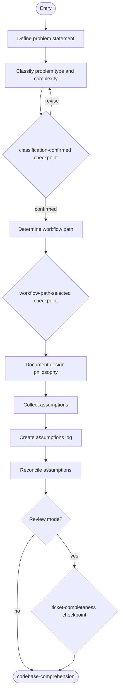
```mermaid
graph TD
    entryNode(["Entry"]) --> defineProblem["Define problem statement"]
    defineProblem --> classifyProblem["Classify problem type and complexity"]
    classifyProblem --> cpClassified{"classification-confirmed checkpoint"}
    cpClassified -->|"confirmed"| determinePath["Determine workflow path"]
    cpClassified -->|"revise"| classifyProblem

    determinePath --> cpPath{"workflow-path-selected checkpoint"}
    cpPath --> docPhilosophy["Document design philosophy"]
    docPhilosophy --> collectAssumptions["Collect assumptions"]
    collectAssumptions --> createLog["Create assumptions log"]
    createLog --> reconcile["Reconcile assumptions"]
    reconcile --> reviewMode{"Review mode?"}
    reviewMode -->|"yes"| ticketCompleteness{"ticket-completeness checkpoint"}
    reviewMode -->|"no"| exitComprehension(["codebase-comprehension"])
    ticketCompleteness --> exitComprehension
```

---

### 03. Requirements Elicitation (optional)

**Purpose:** Discover and clarify what the work package should accomplish through structured sequential conversation. Includes a stakeholder discussion phase and sequential question-domain iteration before planning how to implement.

**Techniques:**

| Role | Technique ID |
|------|----------|
| primary | `elicit-requirements` |
| supporting | `variable-binding` |

**Steps:**

1. **stakeholder-discussion** — `elicit-requirements`; presents `stakeholder-transcript` checkpoint.
2. **elicit-requirements** — `elicit-requirements`; drives the `domain-iteration` loop.
3. **collect-assumptions** — `review-assumptions`.
4. **create-document** — `elicit-requirements`; writes `requirements-elicitation.md`.
5. **update-assumptions-log** — `review-assumptions`.
6. **reconcile-assumptions** — `reconcile-assumptions`; presents `elicitation-complete` checkpoint.

**Loops:**
- `assumption-reconciliation` — while `has_resolvable_assumptions == true`. Each iteration runs `reconcile-assumptions`.
- `domain-iteration` — forEach over `question_domains` (max 5). Each iteration asks one question and records the response.

**Decision:** `user-intent` — evaluates the user response within `domain-iteration`; default branch continues elicitation, the `done` branch fires when `elicitation_complete == true`.

**Checkpoints (2):**

| Checkpoint | Purpose | Blocking |
|------------|---------|----------|
| `stakeholder-transcript` | Provide or skip stakeholder discussion transcript | yes |
| `elicitation-complete` | Confirm elicitation is complete, revisit a domain, or add requirements | no (autoAdvance 30s) |

**Transitions:**

| Condition | Target |
|-----------|--------|
| `elicitation_complete == true AND needs_research == true` (default) | research |
| `elicitation_complete == true AND needs_research == false` | implementation-analysis |
| `elicitation_complete == false` | requirements-elicitation (self-loop) |

**Artifacts:** `requirements-elicitation.md` (in planning folder).

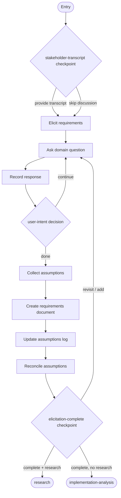
```mermaid
graph TD
    entryNode(["Entry"]) --> cpStakeholder{"stakeholder-transcript checkpoint"}
    cpStakeholder -->|"provide transcript"| elicit["Elicit requirements"]
    cpStakeholder -->|"skip discussion"| elicit

    elicit --> askQuestion["Ask domain question"]
    askQuestion --> recordResponse["Record response"]
    recordResponse --> userIntent{"user-intent decision"}
    userIntent -->|"continue"| askQuestion
    userIntent -->|"done"| collectAssumptions["Collect assumptions"]

    collectAssumptions --> createDoc["Create requirements document"]
    createDoc --> updateLog["Update assumptions log"]
    updateLog --> reconcile["Reconcile assumptions"]
    reconcile --> cpComplete{"elicitation-complete checkpoint"}
    cpComplete -->|"complete + research"| exitResearch(["research"])
    cpComplete -->|"complete, no research"| exitAnalysis(["implementation-analysis"])
    cpComplete -->|"revisit / add"| askQuestion
```

---

### 04. Research (optional)

**Purpose:** Research the knowledge base and external sources to discover best practices, patterns, and resources to inform the plan-prepare activity.

**Techniques:**

| Role | Technique ID |
|------|----------|
| primary | `research-knowledge-base` |
| supporting | `variable-binding` |

**Steps:**

1. **kb-research** — `research-knowledge-base`; search the knowledge base for relevant patterns and practices.
2. **web-research** — `research-knowledge-base`; search the web for current information and best practices.
3. **synthesize** — `research-knowledge-base`; presents `research-findings` checkpoint.
4. **collect-assumptions** — `review-assumptions`; presents `research-focus` checkpoint.
5. **document** — `research-knowledge-base`; writes `kb-research.md`.
6. **update-assumptions-log** — `review-assumptions`.
7. **reconcile-assumptions** — `reconcile-assumptions`.
8. **present-resolved-assumptions** — `review-assumptions`; displays code-resolved assumptions (non-interactive).
9. **declare-context-scope** — control step; presents `context-scope-declaration` checkpoint and sets `context_scope` (`repo-only` | `web-retrieval` | `mixed`).
10. **interview-open-assumptions** — `review-assumptions`; drives the `assumption-interview` loop.

**Loops:**
- `assumption-reconciliation` — while `has_resolvable_assumptions == true`. Each iteration runs `reconcile-assumptions`.
- `assumption-interview` — forEach over `open_assumptions` (max 20). Presents `research-assumption-interview` for each open assumption; the user resolves inline or defers.

**Checkpoints (4):**

| Checkpoint | Purpose | Blocking |
|------------|---------|----------|
| `research-findings` | Confirm combined knowledge-base and web findings | no (autoAdvance 30s) |
| `research-focus` | Specify additional research focus (conditional: `needs_further_research`) | yes |
| `research-assumption-interview` | Resolve or defer open assumptions (conditional: `has_open_assumptions`) | yes |
| `context-scope-declaration` | Classify provenance scope of research sources | no (autoAdvance 15s) |

**Transitions:** Default to `implementation-analysis`.

**Artifacts:** `kb-research.md` (in planning folder).

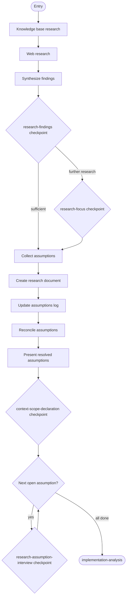
```mermaid
graph TD
    entryNode(["Entry"]) --> kbResearch["Knowledge base research"]
    kbResearch --> webResearch["Web research"]
    webResearch --> synthesize["Synthesize findings"]
    synthesize --> cpFindings{"research-findings checkpoint"}
    cpFindings -->|"sufficient"| collectAssumptions["Collect assumptions"]
    cpFindings -->|"further research"| cpFocus{"research-focus checkpoint"}
    cpFocus --> collectAssumptions

    collectAssumptions --> createDoc["Create research document"]
    createDoc --> updateLog["Update assumptions log"]
    updateLog --> reconcile["Reconcile assumptions"]
    reconcile --> presentResolved["Present resolved assumptions"]
    presentResolved --> cpScope{"context-scope-declaration checkpoint"}
    cpScope --> interviewLoop{"Next open assumption?"}
    interviewLoop -->|"yes"| cpInterview{"research-assumption-interview checkpoint"}
    cpInterview --> interviewLoop
    interviewLoop -->|"all done"| exitNode(["implementation-analysis"])
```

---

### 05. Implementation Analysis (optional)

**Purpose:** Analyze the current implementation to understand effectiveness, establish baselines, and identify opportunities for improvement. In review mode: checks out the base branch to analyze the pre-change state, documents expected changes, then returns to the PR branch.

**Techniques:**

| Role | Technique ID |
|------|----------|
| primary | `analyze-implementation` |
| supporting | `variable-binding` |
| supporting | `scatter-gather` |

**Steps:**

1. **checkout-baseline** — `review-baseline-state` (when `is_review_mode == true`).
2. **document-expected-changes** — `review-baseline-state` (when `is_review_mode == true`).
3. **return-to-pr-branch** — `review-baseline-state` (when `is_review_mode == true`).
4. **review-implementation** — `analyze-implementation`.
5. **evaluate-effectiveness** — `analyze-implementation`.
6. **establish-baselines** — `analyze-implementation`.
7. **collect-assumptions** — `review-assumptions`.
8. **document** — `analyze-implementation`; presents `analysis-confirmed` checkpoint; writes `implementation-analysis.md`.
9. **update-assumptions-log** — `review-assumptions`.
10. **reconcile-assumptions** — `reconcile-assumptions`.
11. **present-resolved-assumptions** — `review-assumptions`; displays code-resolved assumptions (non-interactive).
12. **interview-open-assumptions** — `review-assumptions`; drives the `assumption-interview` loop.

**Loops:**
- `assumption-reconciliation` — while `has_resolvable_assumptions == true`. Each iteration runs `reconcile-assumptions`.
- `assumption-interview` — forEach over `open_assumptions` (max 20). Presents `analysis-assumption-interview` for each open assumption.

**Checkpoints (2):**

| Checkpoint | Purpose | Blocking |
|------------|---------|----------|
| `analysis-confirmed` | Confirm analysis findings (confirm, clarify, or more analysis) | no (autoAdvance 30s) |
| `analysis-assumption-interview` | Resolve or defer open assumptions (conditional: `has_open_assumptions`) | yes |

**Transitions:** Default to `plan-prepare`.

**Artifacts:** `implementation-analysis.md` (in planning folder).

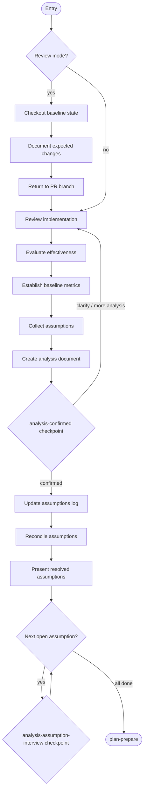
```mermaid
graph TD
    entryNode(["Entry"]) --> reviewMode{"Review mode?"}
    reviewMode -->|"yes"| checkoutBaseline["Checkout baseline state"]
    checkoutBaseline --> documentExpected["Document expected changes"]
    documentExpected --> returnBranch["Return to PR branch"]
    returnBranch --> reviewImpl
    reviewMode -->|"no"| reviewImpl["Review implementation"]

    reviewImpl --> evalEffectiveness["Evaluate effectiveness"]
    evalEffectiveness --> establishBaselines["Establish baseline metrics"]
    establishBaselines --> collectAssumptions["Collect assumptions"]
    collectAssumptions --> createDoc["Create analysis document"]
    createDoc --> cpAnalysis{"analysis-confirmed checkpoint"}
    cpAnalysis -->|"confirmed"| updateLog["Update assumptions log"]
    cpAnalysis -->|"clarify / more analysis"| reviewImpl

    updateLog --> reconcile["Reconcile assumptions"]
    reconcile --> presentResolved["Present resolved assumptions"]
    presentResolved --> interviewLoop{"Next open assumption?"}
    interviewLoop -->|"yes"| cpInterview{"analysis-assumption-interview checkpoint"}
    cpInterview --> interviewLoop
    interviewLoop -->|"all done"| exitNode(["plan-prepare"])
```

---

### 06. Plan & Prepare

**Purpose:** Design the approach, create the work package plan (task breakdown), create the test plan, and prepare for implementation. This is the convergence point for all optional paths.

**Techniques:**

| Role | Technique ID |
|------|----------|
| primary | `create-plan` |
| supporting | `variable-binding` |

**Steps:**

1. **env-prerequisites** — control step; validates environment prerequisites (workflows worktree present, `target_path`, `reference_path`, writable planning folder, `gh` auth, GPG agent).
2. **apply-design** — `create-plan`.
3. **create-plan** — `create-plan`; writes `work-package-plan.md`.
4. **create-test-plan** — `create-test-plan`; writes `test-plan.md`.
5. **present-solution-overview** — `stakeholder-overview`; writes a plain-language solution overview to the planning README.
6. **collect-assumptions** — `review-assumptions`.
7. **update-assumptions-log** — `review-assumptions`.
8. **reconcile-assumptions** — `reconcile-assumptions`.
9. **create-todos** — `create-plan`; breaks the plan into actionable tasks.
10. **sync-branch** — `manage-git::sync-branch`; brings the feature branch up to date with `main`.
11. **update-pr** — `update-pr::render` with `template: initial`; presents `approach-confirmed` checkpoint.

**Loops:** `assumption-reconciliation` — while `has_resolvable_assumptions == true`. Each iteration runs `reconcile-assumptions`.

**Checkpoints (1):**

| Checkpoint | Purpose | Blocking |
|------------|---------|----------|
| `approach-confirmed` | Confirm implementation approach | no (autoAdvance 30s) |

**Transitions:** Default to `assumptions-review`.

**Artifacts:** `work-package-plan.md`, `test-plan.md` (both in planning folder).

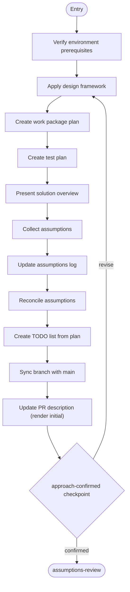
```mermaid
graph TD
    entryNode(["Entry"]) --> envPrereqs["Verify environment prerequisites"]
    envPrereqs --> applyDesign["Apply design framework"]
    applyDesign --> createPlan["Create work package plan"]
    createPlan --> createTestPlan["Create test plan"]
    createTestPlan --> solutionOverview["Present solution overview"]
    solutionOverview --> collectAssumptions["Collect assumptions"]
    collectAssumptions --> updateLog["Update assumptions log"]
    updateLog --> reconcile["Reconcile assumptions"]
    reconcile --> createTodos["Create TODO list from plan"]
    createTodos --> syncBranch["Sync branch with main"]
    syncBranch --> updatePR["Update PR description (render initial)"]
    updatePR --> cpApproach{"approach-confirmed checkpoint"}
    cpApproach -->|"confirmed"| exitNode(["assumptions-review"])
    cpApproach -->|"revise"| applyDesign
```

---

### 07. Assumptions Review

**Purpose:** Review each open assumption with the user and post deferred assumptions to the issue tracker for stakeholder attention. Supports both Jira and GitHub platforms. Iterates if further discussion is needed before implementation begins.

**Techniques:**

| Role | Technique ID |
|------|----------|
| primary | `review-assumptions` |
| supporting | `variable-binding` |
| supporting | `scatter-gather` |

**Steps:**

1. **evaluate-open-assumptions** — `review-assumptions`; determine which assumptions are open.
2. **interview-assumptions** — `review-assumptions`; drives the `assumption-interview-loop` (when not review mode and `has_open_assumptions == true`).
3. **update-assumptions-log** — `review-assumptions`; record accept/reject/defer decisions.
4. **post-summary-jira** — `atlassian-operations::comment-jira-issue`; presents `post-summary-review` checkpoint (when not review mode, `issue_platform == jira`, `has_deferred_assumptions == true`, `post_jira_comment != false`).
5. **post-summary-github** — `github-cli-protocol::comment-issue` (when not review mode, `issue_platform == github`, `has_deferred_assumptions == true`).

**Loops:** `assumption-interview-loop` — forEach over `open_assumptions`. Presents `assumption-decision` for each and records the user decision.

**Checkpoints (2):**

| Checkpoint | Purpose | Blocking |
|------------|---------|----------|
| `assumption-decision` | Accept, reject, or defer each assumption in the interview loop | yes |
| `post-summary-review` | Confirm posting deferred-assumption summary to issue tracker (conditional: review mode off, `issue_platform` set, `has_deferred_assumptions`) | no (autoAdvance 30s) |

**Transitions:**

| Condition | Target |
|-----------|--------|
| `needs_comprehension == true` | codebase-comprehension |
| `needs_plan_revision == true` | plan-prepare |
| `needs_further_discussion == true` | assumptions-review (self-loop) |
| default | implement |

**Artifacts:** `assumptions-log.md` (update, in planning folder).

```mermaid
graph TD
    entryNode(["Entry"]) --> evalOpen["Evaluate open assumptions"]
    evalOpen --> interviewLoop{"Next open assumption?"}
    interviewLoop -->|"yes"| cpDecision{"assumption-decision checkpoint"}
    cpDecision -->|"accept / reject / defer"| interviewLoop
    interviewLoop -->|"all reviewed"| updateLog["Update assumptions log"]

    updateLog --> checkPlatform{"Deferred + platform set?"}
    checkPlatform -->|"jira"| cpSummary{"post-summary-review checkpoint"}
    cpSummary -->|"post"| postJira["Post summary to Jira"]
    cpSummary -->|"skip"| route
    checkPlatform -->|"github"| postGithub["Post summary to GitHub"]
    checkPlatform -->|"no platform"| route

    postJira --> route{"Routing"}
    postGithub --> route
    route -->|"needs comprehension"| exitComprehension(["codebase-comprehension"])
    route -->|"needs plan revision"| exitPlan(["plan-prepare"])
    route -->|"further discussion"| evalOpen
    route -->|"default"| exitImplement(["implement"])
```

---

### 08. Implement

**Purpose:** Execute the implementation plan task by task. Each task follows a cycle of implement, test, commit, log provenance, self-review, and collect assumptions. Contains the task implementation cycle plus assumption-reconciliation and assumption-interview loops.

**Techniques:**

| Role | Technique ID |
|------|----------|
| primary | `implement-task` |
| supporting | `variable-binding` |
| supporting | `scatter-gather` |

**Entry action:** Verify on correct feature branch before any code changes.

**Loops:**

| Loop | Type | Iterates over | Max |
|------|------|---------------|-----|
| `task-cycle` | forEach | `plan.tasks` | (default) |
| `assumption-reconciliation` | while | `has_resolvable_assumptions` | — |
| `assumption-interview` | forEach | `open_assumptions` | 20 |

**Task cycle steps (per task):**

1. **implement-task** — `implement-task` (scatter mode sequential, gathers into `completed_tasks` / `commits`); presents `switch-model-pre-impl` checkpoint.
2. **run-tests** — `cargo-operations::test` scoped to `-p {current_task.crate}`.
3. **commit** — `manage-git::artifact-commits`.
4. **log-provenance** — `dco-provenance::append-task-row`; appends a task row to `provenance-log.md`.
5. **self-review** — `task-completion-review`; presents `symbol-provenance-confirmed` checkpoint when symbols are uncertain.
6. **collect-assumptions** — `review-assumptions`.

**Post-loop steps:**

1. **reconcile-assumptions** — `reconcile-assumptions` (drives `assumption-reconciliation`).
2. **present-resolved-assumptions** — `review-assumptions`; displays code-resolved assumptions (non-interactive).
3. **interview-open-assumptions** — `review-assumptions` (drives `assumption-interview`).
4. **update-assumptions-log** — `review-assumptions`; presents `switch-model-post-impl` checkpoint.

**Checkpoints (4):**

| Checkpoint | Purpose | Blocking |
|------------|---------|----------|
| `symbol-provenance-confirmed` | Investigate or confirm symbols flagged during self-review (conditional: `has_uncertain_symbols`) | yes |
| `switch-model-pre-impl` | Switch model before implementation | no (autoAdvance 10s) |
| `implementation-assumption-interview` | Resolve or defer open assumptions (conditional: `has_open_assumptions`) | yes |
| `switch-model-post-impl` | Switch model after implementation | no (autoAdvance 10s) |

**Transitions:** Default to `post-impl-review`.

**Artifacts:** `assumptions-log.md` (continues from earlier phases); `provenance-log.md` (created on first task, appended per task — one row per task with task ID, model ID, prompt class, `context_scope`, and a short description; linked from PR description).

```mermaid
graph TD
    entryNode(["Entry"]) --> verifyBranch["Verify feature branch"]
    verifyBranch --> nextTask{"Next task in plan?"}
    nextTask -->|"yes"| cpPreImpl{"switch-model-pre-impl checkpoint"}
    cpPreImpl --> implementTask["Implement task"]
    implementTask --> runTests["Run tests"]
    runTests --> commitChanges["Commit changes"]
    commitChanges --> logProvenance["Log AI provenance"]
    logProvenance --> selfReview["Self-review"]
    selfReview --> cpSymbol{"symbol-provenance-confirmed checkpoint"}
    cpSymbol --> collectAssumptions["Collect assumptions"]
    collectAssumptions --> nextTask

    nextTask -->|"all done"| reconcile["Reconcile assumptions"]
    reconcile --> presentResolved["Present resolved assumptions"]
    presentResolved --> interviewLoop{"Next open assumption?"}
    interviewLoop -->|"yes"| cpInterview{"implementation-assumption-interview checkpoint"}
    cpInterview --> interviewLoop
    interviewLoop -->|"all done"| updateLog["Update assumptions log"]
    updateLog --> cpPostImpl{"switch-model-post-impl checkpoint"}
    cpPostImpl --> exitNode(["post-impl-review"])
```

---

### 09. Post-Implementation Review

**Purpose:** Review implementation quality through manual diff review, code review, structural analysis, test suite review, and architecture summary. Includes a blocker gate: if a critical blocker is found, transition back to implement for remediation; and a review-fix cycle that re-runs the reviews after applying fixes.

**Techniques:**

| Role | Technique ID |
|------|----------|
| supporting | `variable-binding` |

**Steps:**

1. **gitnexus-detect-changes-preflight** — `gitnexus-operations::detect-changes` (when `gitnexus_indexed == true`); captures affected processes and the changed-symbol set.
2. **manual-diff-review** — `review-diff`; presents `file-index-table` checkpoint.
3. **code-review** — `review-code`.
4. **structural-analysis-inline** — `prism/structural-analysis` single-pass (when `complexity != complex`).
5. **dispatch-prism** — control step; triggers the `prism` workflow for the full 3-pass pipeline (when `complexity == complex`), passing `target`, `output_path`, `pipeline_mode`.
6. **test-suite-review** — `review-test-suite`.
7. **architecture-summary** — `summarize-architecture` (when `skip_architecture_summary != true`).
8. **classify-and-route-findings** — `findings-classification`.

**Checkpoints (3):**

| Checkpoint | Purpose | Blocking |
|------------|---------|----------|
| `file-index-table` | Present file/block index with per-block rationale paragraphs; user confirms rationale and flags blocks with issues. Confirmation serves as the human's per-block provenance attestation. | yes |
| `rationale-amendment` | Provide corrections to specific rationale paragraphs (conditional: `rationale_confirmed == true`); corrections recorded in `manual-diff-review.md` | no (autoAdvance 20s) |
| `block-interview` | Interview user on each flagged block (conditional: `has_flagged_blocks`) | yes |

**Loops:** `review-fix-cycle` — doWhile `needs_code_fixes == true OR needs_test_improvements == true` (max 3). Applies fixes, resets the fix flags, regenerates the change-block index, and re-runs manual diff, code, and test-suite reviews.

**Decision:** `blocker-gate` — if `has_critical_blocker == true`, transition back to `implement`; otherwise proceed to `validate`.

**Transitions:** Default to `validate`.

**Artifacts:**

| Artifact | Description |
|----------|-------------|
| `change-block-index.md` | Indexed table of all change blocks with per-block rationale paragraphs |
| `manual-diff-review.md` | Manual diff review findings from the interview process |
| `code-review.md` | Code review document organized by severity |
| `test-suite-review.md` | Test suite quality assessment |
| `architecture-summary.md` | High-level architecture summary with Mermaid C4 diagrams |
| `structural-findings.md` | Prism structural analysis findings (conservation law, meta-law, classified bug table) |

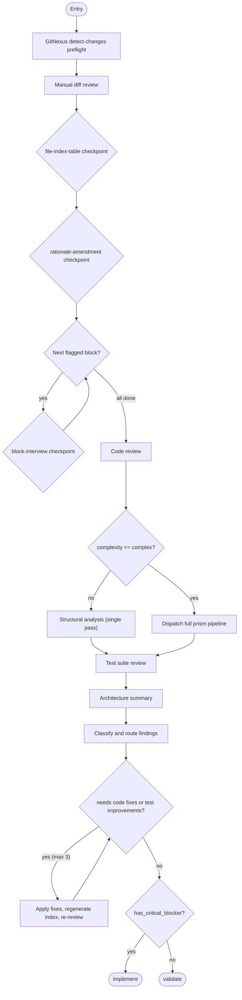
```mermaid
graph TD
    entryNode(["Entry"]) --> preflight["GitNexus detect-changes preflight"]
    preflight --> manualDiff["Manual diff review"]
    manualDiff --> cpFileIndex{"file-index-table checkpoint"}
    cpFileIndex --> cpRationale{"rationale-amendment checkpoint"}
    cpRationale --> interviewLoop{"Next flagged block?"}
    interviewLoop -->|"yes"| cpInterview{"block-interview checkpoint"}
    cpInterview --> interviewLoop
    interviewLoop -->|"all done"| codeReview["Code review"]

    codeReview --> structural{"complexity == complex?"}
    structural -->|"no"| structuralInline["Structural analysis (single pass)"]
    structural -->|"yes"| dispatchPrism["Dispatch full prism pipeline"]
    structuralInline --> testReview["Test suite review"]
    dispatchPrism --> testReview
    testReview --> archSummary["Architecture summary"]
    archSummary --> classify["Classify and route findings"]

    classify --> fixCycle{"needs code fixes or test improvements?"}
    fixCycle -->|"yes (max 3)"| applyFixes["Apply fixes, regenerate index, re-review"]
    applyFixes --> fixCycle
    fixCycle -->|"no"| blockerGate{"has_critical_blocker?"}
    blockerGate -->|"yes"| exitImplement(["implement"])
    blockerGate -->|"no"| exitValidate(["validate"])
```

---

### 10. Validate

**Purpose:** Validate the implementation against tests, build, format, and lint checks. If failures are found, analyze root cause, fix, and re-run until all pass. In review mode: documents failures as review findings and assesses coverage rather than fixing.

**Techniques:**

| Role | Technique ID |
|------|----------|
| supporting | `variable-binding` |

**Steps:**

1. **preflight** — `cargo-operations::preflight` (when `project_type == 'rust-substrate'`); validates that no toolchain prerequisites are missing.
2. **run-suite** — `cargo-operations::run-suite` scoped `--workspace` (when `project_type == 'rust-substrate'`); runs check, clippy, test, and fmt-check concurrently and emits a single `validation_results` envelope.
3. **document-failures** — `findings-classification` (when `is_review_mode == true`).
4. **assess-test-coverage** — `review-test-suite` (when `is_review_mode == true`).
5. **fix-failures** — control step (when not review mode and `validation_results.validation_passed == false`); enters the `fix-revalidate-cycle` loop.

**Loops:** `fix-revalidate-cycle` — doWhile `validation_results.validation_passed == false` (max 10). Each iteration analyzes the first failure (`validate-build::analyze-failure`), applies a fix (`validate-build::apply-fix`), and re-runs the suite (`cargo-operations::run-suite`).

**Checkpoints (0):** This activity has no checkpoints. Test/build/lint results are observable and do not require user confirmation.

**Transitions:** Default to `strategic-review`.

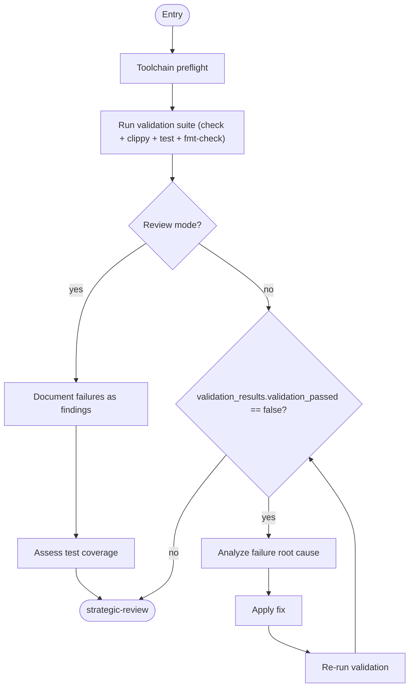
```mermaid
graph TD
    entryNode(["Entry"]) --> preflight["Toolchain preflight"]
    preflight --> runSuite["Run validation suite (check + clippy + test + fmt-check)"]
    runSuite --> reviewMode{"Review mode?"}
    reviewMode -->|"yes"| documentFailures["Document failures as findings"]
    documentFailures --> assessCoverage["Assess test coverage"]
    assessCoverage --> exitNode(["strategic-review"])
    reviewMode -->|"no"| fixBranch{"validation_results.validation_passed == false?"}
    fixBranch -->|"no"| exitNode
    fixBranch -->|"yes"| analyzeFailure["Analyze failure root cause"]
    analyzeFailure --> applyFix["Apply fix"]
    applyFix --> revalidate["Re-run validation"]
    revalidate --> fixBranch
```

---

### 11. Strategic Review

**Purpose:** Review the implementation to ensure changes are minimal and focused. Validates that the final PR contains only the changes required for the solution. When the target repo has a root-level `changes/` directory, ensures a matching changelog fragment exists. Creates strategic review document and architecture summary. In review mode: documents cleanup recommendations without applying them.

**Techniques:**

| Role | Technique ID |
|------|----------|
| primary | `review-strategy` |
| supporting | `variable-binding` |

**Steps:**

1. **diff-review** — `review-strategy`; examine all changes for scope and relevance.
2. **identify-artifacts** — `review-strategy`; find investigation artifacts, over-engineering, orphaned infrastructure.
3. **verify-readme** — `manage-artifacts::verify-readme-conforms`; surface drift as an informational finding.
4. **ensure-changes-folder-entry** — `review-strategy`; add a `changes/` fragment when the repo uses one and none exists for this work.
5. **verify-change-fragment** — `review-strategy`; sets `fragment_references_issue` and validates the fragment references `issue_url`.
6. **document-findings** — `review-strategy`; writes the strategic review document.
7. **document-cleanup-recommendations** — `review-strategy` (when `is_review_mode == true`).
8. **apply-cleanup** — `review-strategy` (when not review mode).
9. **create-architecture-summary** — `summarize-architecture`.
10. **analyze-strategic-findings** — control step; presents `review-findings` checkpoint; sets `recommended_strategic_option` and `strategic_findings_summary`.

**Checkpoints (1):**

| Checkpoint | Purpose | Blocking |
|------------|---------|----------|
| `review-findings` | Confirm strategic review findings (acceptable, fix, defer, or more review) | no (autoAdvance 30s) |

**Transitions:**

| Condition | Target |
|-----------|--------|
| `is_review_mode == true` | submit-for-review |
| `review_passed == true` | submit-for-review |
| default | plan-prepare |

**Artifacts:**

| Artifact | Description |
|----------|-------------|
| `strategic-review-{n}.md` | Review findings, identified artifacts, cleanup actions. `{n}` increments on successive reviews. |
| `architecture-summary.md` | High-level architecture summary with UML-style diagrams |

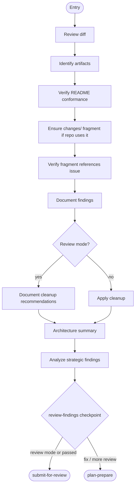
```mermaid
graph TD
    entryNode(["Entry"]) --> diffReview["Review diff"]
    diffReview --> identifyArtifacts["Identify artifacts"]
    identifyArtifacts --> verifyReadme["Verify README conformance"]
    verifyReadme --> changesFrag["Ensure changes/ fragment if repo uses it"]
    changesFrag --> verifyFragment["Verify fragment references issue"]
    verifyFragment --> documentFindings["Document findings"]
    documentFindings --> cleanupBranch{"Review mode?"}
    cleanupBranch -->|"yes"| docCleanup["Document cleanup recommendations"]
    cleanupBranch -->|"no"| applyCleanup["Apply cleanup"]
    docCleanup --> createArchSummary
    applyCleanup --> createArchSummary["Architecture summary"]
    createArchSummary --> analyze["Analyze strategic findings"]
    analyze --> cpFindings{"review-findings checkpoint"}
    cpFindings -->|"review mode or passed"| exitSubmit(["submit-for-review"])
    cpFindings -->|"fix / more review"| exitPlan(["plan-prepare"])
```

---

### 12. Submit for Review

**Purpose:** Gate PR submission on a human DCO sign-off, push the branch, update the PR description, present the merge-strategy reminder, mark the PR ready, and await reviewer feedback. If significant changes are requested, loop back to plan-prepare. In review mode: consolidates all review findings and posts structured PR review comments, then ends the workflow.

**Techniques:**

| Role | Technique ID |
|------|----------|
| primary | `update-pr` |
| supporting | `variable-binding` |

**Steps:**

1. **consolidate-review-findings** — control step (review mode); gather findings from code, test, validation, and strategic review.
2. **generate-review-summary** — control step (review mode); build a structured review summary.
3. **present-summary-to-user** — control step (review mode); presents `review-summary-approval` checkpoint.
4. **post-pr-review** — `update-pr::render` (review mode); post the review.
5. **dco-sign-off** — `dco-provenance::record-attestation` (when not review mode); presents `dco-sign-off` checkpoint; records the attestation to `provenance-log.md`.
6. **push-commits** — `manage-git::push-commits` (when not review mode).
7. **update-description** — `update-pr::render` (when not review mode).
8. **instruct-merge-strategy** — `manage-git::instruct-merge-strategy` (when not review mode); presents `merge-strategy-reminder` checkpoint.
9. **mark-ready** — `update-pr::mark-ready` (when not review mode).
10. **await-review** — control step; presents `review-received` checkpoint.
11. **process-review-comments** — `respond-to-pr-review`.
12. **determine-review-outcome** — control step; decide whether changes are needed from review feedback.
13. **analyze-review-outcome** — control step; presents `review-outcome` checkpoint; sets `recommended_outcome` and `review_comments_summary`.

**Loops:** `verify-pr-body-rerender` — while `body_conforms == false` (max 2). Re-renders the PR body (`update-pr::render`, `template: final`) and verifies it (`update-pr::verify-body`).

**Checkpoints (6):**

| Checkpoint | Purpose | Blocking |
|------------|---------|----------|
| `dco-sign-off` | Human DCO certification (6-item attestation); records attestation in `provenance-log.md` | yes |
| `merge-strategy-reminder` | Walk the human through the local squash-merge-with-`-s -S` flow (conditional: `squash_merge_supported`) | no (autoAdvance 20s) |
| `review-received` | Confirm that review comments have been received | yes |
| `review-outcome` | Determine outcome: approved, minor changes, or significant changes | no (autoAdvance 30s) |
| `review-summary-approval` | Confirm consolidated review summary before posting (review mode) | yes |
| `body-non-conformant` | Resolve PR body conformance violations after the re-render loop exhausts (conditional: `body_conforms == false`) | yes |

**Transitions:**

| Condition | Target |
|-----------|--------|
| `is_review_mode == true` | complete |
| `review_requires_changes == false` (default) | complete |
| `review_requires_changes == true` | plan-prepare |

**Artifacts:** updates `provenance-log.md` with the DCO attestation entry; PR description re-rendered to conform to `update-pr` body rules.

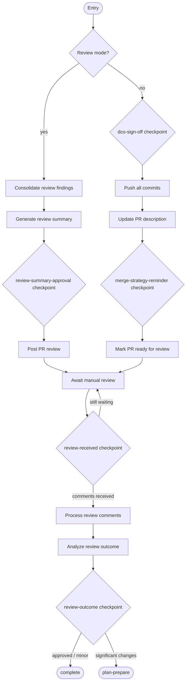
```mermaid
graph TD
    entryNode(["Entry"]) --> reviewMode{"Review mode?"}
    reviewMode -->|"yes"| consolidate["Consolidate review findings"]
    consolidate --> genSummary["Generate review summary"]
    genSummary --> cpSummaryApproval{"review-summary-approval checkpoint"}
    cpSummaryApproval --> postReview["Post PR review"]
    postReview --> awaitReview

    reviewMode -->|"no"| cpDco{"dco-sign-off checkpoint"}
    cpDco --> pushCommits["Push all commits"]
    pushCommits --> updateDesc["Update PR description"]
    updateDesc --> cpMerge{"merge-strategy-reminder checkpoint"}
    cpMerge --> markReady["Mark PR ready for review"]
    markReady --> awaitReview["Await manual review"]

    awaitReview --> cpReceived{"review-received checkpoint"}
    cpReceived -->|"comments received"| processComments["Process review comments"]
    cpReceived -->|"still waiting"| awaitReview

    processComments --> analyzeOutcome["Analyze review outcome"]
    analyzeOutcome --> cpOutcome{"review-outcome checkpoint"}
    cpOutcome -->|"approved / minor"| exitComplete(["complete"])
    cpOutcome -->|"significant changes"| exitPlan(["plan-prepare"])
```

---

### 13. Complete

**Purpose:** Final activity — create Architecture Decision Record (if moderate or complex implementation), finalize documentation, conduct retrospective, capture session history, update status, remove the component worktree, and select the next work package. In review mode: skips the documentation steps and ends after retrospective and worktree removal.

**Techniques:**

| Role | Technique ID |
|------|----------|
| primary | `finalize-documentation` |
| supporting | `variable-binding` |

**Steps:**

1. **create-adr** — `create-adr` (when not review mode and `complexity` is moderate or complex).
2. **update-adr-status** — `finalize-documentation`; set ADR status to Accepted (when not review mode and `complexity` is moderate or complex).
3. **finalize-test-plan** — `finalize-documentation`; add hyperlinks to test source locations (when not review mode).
4. **create-complete-doc** — `finalize-documentation`; writes `COMPLETE.md` (when not review mode).
5. **ensure-docs** — `finalize-documentation`; verify public APIs have inline documentation (when not review mode).
6. **capture-history** — `conduct-retrospective`; capture session history.
7. **retrospective** — `conduct-retrospective`; workflow retrospective.
8. **update-status** — `conduct-retrospective`; update work package plan status.
9. **remove-worktree** — `manage-git::remove-worktree` (when `worktree_created == true`).
10. **select-next** — `conduct-retrospective`; select the next work package.

**Checkpoints (0):** This activity has no checkpoints.

**Transitions:** None — this is the terminal activity.

**Artifacts:**

| Artifact | Location | Description |
|----------|----------|-------------|
| `NNNN-{decision-title}.md` | `.engineering/artifacts/adr` | ADR for moderate/complex implementations |
| `COMPLETE.md` | planning | Completion summary |
| `workflow-retrospective.md` | planning | Retrospective notes |
| `{YYYY-MM-DD}-pr{pr_number}-review-analysis.md` | reviews | PR review analysis |

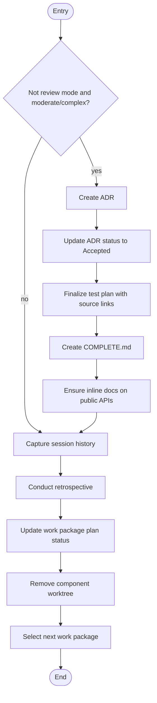
```mermaid
graph TD
    entryNode(["Entry"]) --> checkADR{"Not review mode and moderate/complex?"}
    checkADR -->|"yes"| createADR["Create ADR"]
    createADR --> updateADR["Update ADR status to Accepted"]
    updateADR --> finalizeTestPlan
    checkADR -->|"no"| captureHistory

    finalizeTestPlan["Finalize test plan with source links"] --> createComplete["Create COMPLETE.md"]
    createComplete --> ensureDocs["Ensure inline docs on public APIs"]
    ensureDocs --> captureHistory["Capture session history"]
    captureHistory --> retrospective["Conduct retrospective"]
    retrospective --> updateStatus["Update work package plan status"]
    updateStatus --> removeWorktree["Remove component worktree"]
    removeWorktree --> selectNext["Select next work package"]
    selectNext --> doneNode(["End"])
```

---

### 14. Codebase Comprehension (optional)

**Purpose:** Build or augment a mental model of the codebase sufficient to qualify design assumptions presented in later activities. Produces persistent knowledge artifacts in `.engineering/artifacts/comprehension/` that grow across successive work packages. Runs after design-philosophy.

**Techniques:**

| Role | Technique ID |
|------|----------|
| primary | `build-comprehension` |
| supporting | `variable-binding` |

**Steps:**

1. **check-existing-artifacts** — `build-comprehension`; search the comprehension folder for related artifacts.
2. **review-existing** — `build-comprehension`; present relevant existing artifacts.
3. **architecture-survey** — `build-comprehension`; top-down survey of structure, modules, dependencies, entry points, patterns.
4. **key-abstractions** — `build-comprehension`; identify core types, traits, interfaces, data structures.
5. **design-rationale** — `build-comprehension`; infer rationale for significant design choices.
6. **domain-concept-mapping** — `build-comprehension`; map technical constructs to domain concepts.
7. **create-comprehension-artifact** — `manage-artifacts::write-artifact`; write or augment the comprehension artifact.
8. **initial-deep-dive** — `build-comprehension`; mandatory pass that attempts to resolve every open question.
9. **initial-lens-pass** — `prism/portfolio-analysis` with lenses `pedagogy`, `rejected-paths`.
10. **update-artifact-initial** — `manage-artifacts::write-artifact`; record initial deep-dive findings.
11. **revise-initial-questions** — `build-comprehension`; revise the Open Questions section.
12. **deep-dive-loop** — `build-comprehension`; optional further exploration via the `deep-dive-iteration` loop.

**Loops:** `deep-dive-iteration` — while `needs_comprehension == true`. Each iteration selects an area (`build-comprehension`), performs targeted analysis (`build-comprehension`), applies portfolio lenses (`prism/portfolio-analysis`), updates the artifact (`manage-artifacts::write-artifact`), and revises open questions (`build-comprehension`), presenting `comprehension-sufficient`.

**Checkpoints (1):**

| Checkpoint | Purpose | Blocking |
|------------|---------|----------|
| `comprehension-sufficient` | Accept remaining gaps, dive deeper, or explore a different area (conditional: `has_open_questions`) | no (autoAdvance 30s) |

**Transitions:**

| Condition | Target |
|-----------|--------|
| `needs_elicitation == true` | requirements-elicitation |
| `needs_elicitation == false AND needs_research == true` | research |
| `skip_optional_activities == true` | plan-prepare |
| default | implementation-analysis |

**Artifacts:** `{codebase-area}.md` (in comprehension folder — persistent, augmented across work packages).

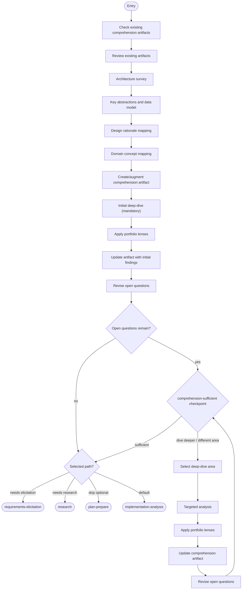
```mermaid
graph TD
    entryNode(["Entry"]) --> checkExisting["Check existing comprehension artifacts"]
    checkExisting --> reviewExisting["Review existing artifacts"]
    reviewExisting --> archSurvey["Architecture survey"]
    archSurvey --> keyAbstractions["Key abstractions and data model"]
    keyAbstractions --> designRationale["Design rationale mapping"]
    designRationale --> domainMapping["Domain concept mapping"]
    domainMapping --> createArtifact["Create/augment comprehension artifact"]

    createArtifact --> initialDeepDive["Initial deep-dive (mandatory)"]
    initialDeepDive --> initialLens["Apply portfolio lenses"]
    initialLens --> updateInitial["Update artifact with initial findings"]
    updateInitial --> reviseQuestions["Revise open questions"]
    reviseQuestions --> hasOpen{"Open questions remain?"}
    hasOpen -->|"no"| pathBranch
    hasOpen -->|"yes"| cpSufficient{"comprehension-sufficient checkpoint"}
    cpSufficient -->|"sufficient"| pathBranch{"Selected path?"}
    cpSufficient -->|"dive deeper / different area"| selectArea["Select deep-dive area"]

    selectArea --> targetedAnalysis["Targeted analysis"]
    targetedAnalysis --> lensPass["Apply portfolio lenses"]
    lensPass --> updateArtifact["Update comprehension artifact"]
    updateArtifact --> reviseOpen["Revise open questions"]
    reviseOpen --> cpSufficient

    pathBranch -->|"needs elicitation"| exitElicit(["requirements-elicitation"])
    pathBranch -->|"needs research"| exitResearch(["research"])
    pathBranch -->|"skip optional"| exitPlan(["plan-prepare"])
    pathBranch -->|"default"| exitAnalysis(["implementation-analysis"])
```

---
