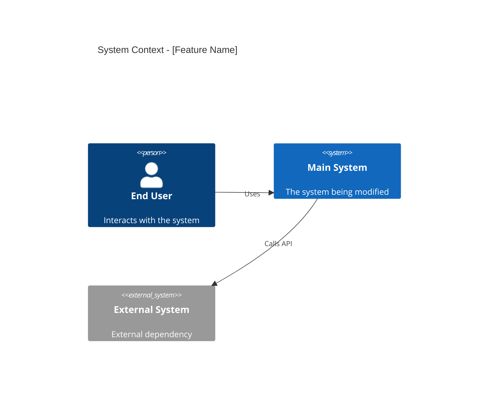
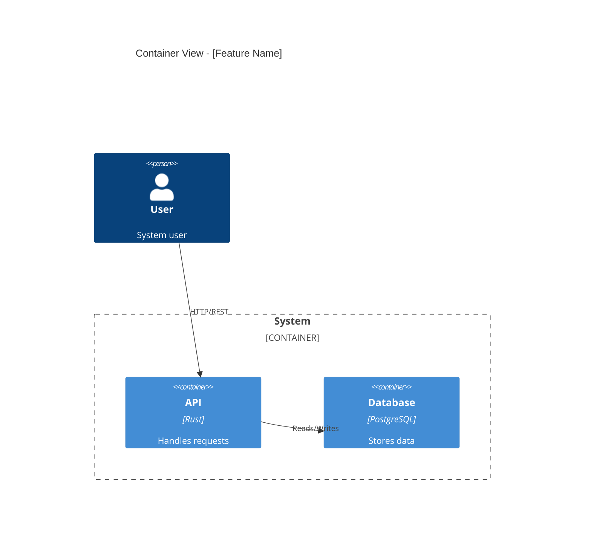
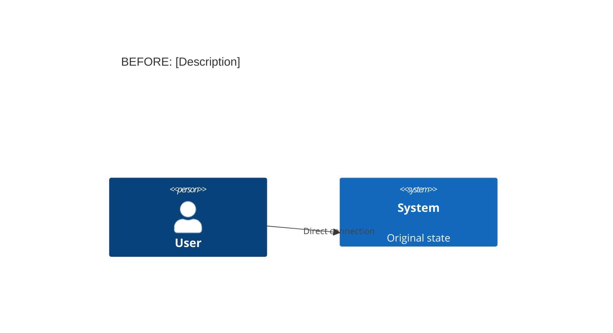
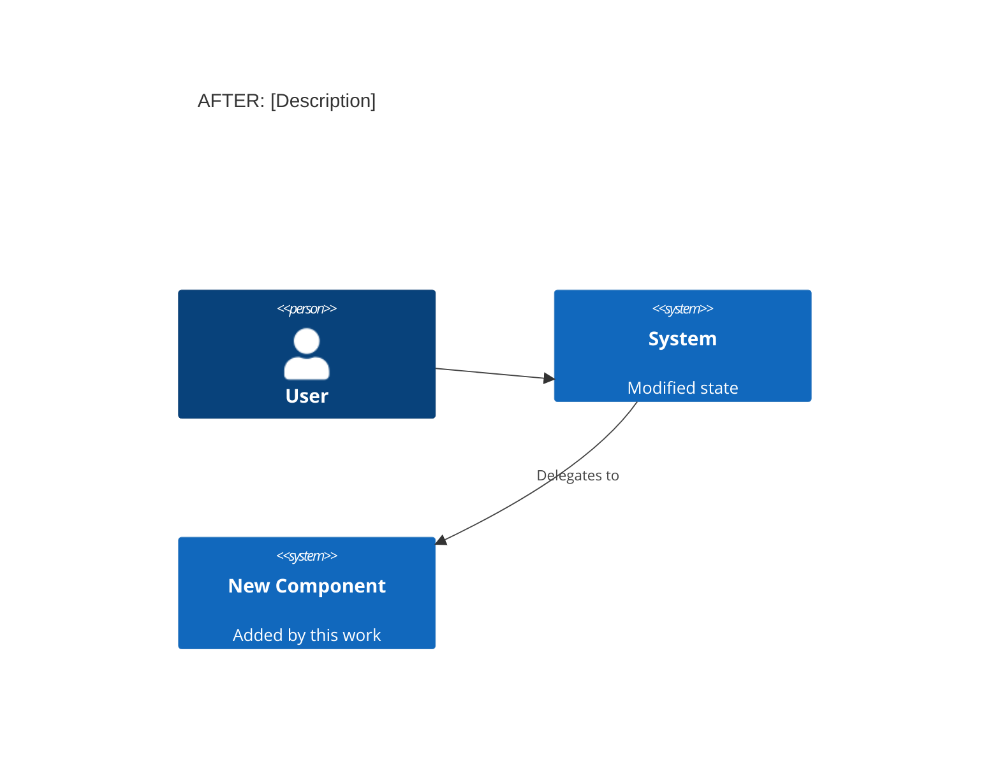
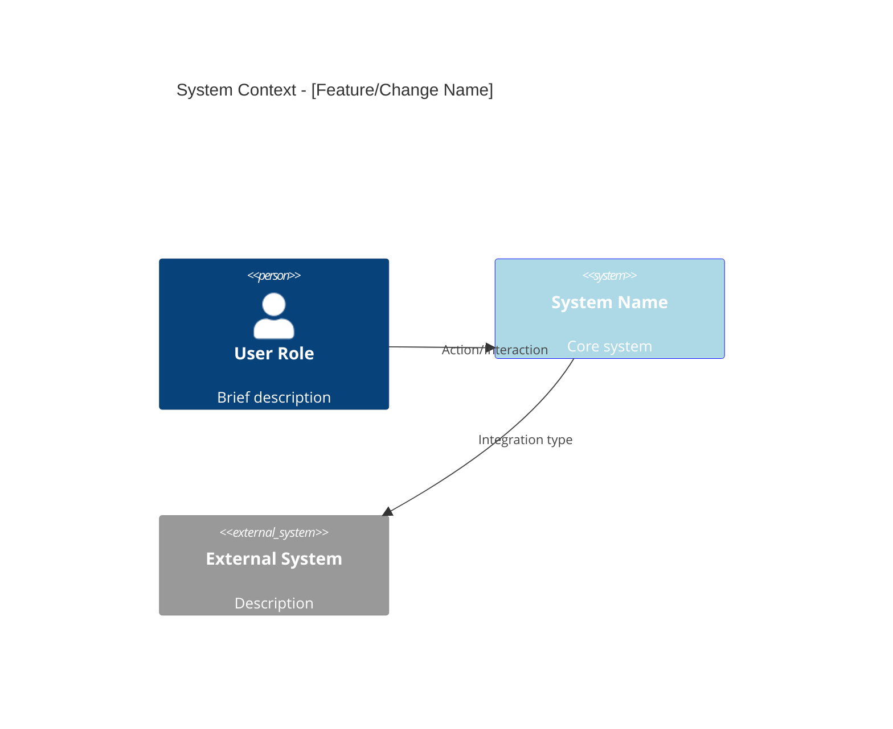

# Architecture Summary Guide

**Purpose:** Create an architecture summary document at the end of implementation that allows management-level stakeholders with superficial system familiarity to understand the changes made. Uses Mermaid diagrams to visualize how changes relate to the existing system.

---

## Overview

The architecture summary is a high-level visual document that answers:

1. **What changed?** - Summary of the implementation in non-technical terms
2. **Where does it fit?** - How the changes relate to the broader system
3. **Why does it matter?** - Business impact and value delivered
4. **What's next?** - Dependencies, follow-up work, or considerations

This document uses the **C4 Model System Context** level of abstraction—showing the system as a whole, its users, and external dependencies. This is the appropriate level for stakeholders who need to understand impact without implementation details.

---

## Target Audience

| Audience | What They Need |
|----------|----------------|
| Engineering Managers | Impact on team, dependencies, risks |
| Product Managers | Feature delivery, user impact |
| Technical Directors | Architectural direction, system evolution |
| Non-technical Stakeholders | Business value, timeline, status |

**Writing Principle:** If someone unfamiliar with the codebase can't understand the document in 5 minutes, it's too technical.

---

## When to Create

Create an architecture summary when:

- Implementation involves changes to system boundaries or integrations
- Multiple components or services are affected
- The change has business-visible impact
- Stakeholders need to understand what was delivered

Skip for:

- Bug fixes with no architectural impact
- Internal refactoring invisible to stakeholders
- Documentation-only changes

---

## C4 Model Context Level

The **System Context diagram** is the highest abstraction level in the C4 model:

| Element | Description | Example |
|---------|-------------|---------|
| **Person** | Users of the system | "End User", "Administrator" |
| **System** | The system being changed | "Midnight Node" |
| **External System** | Systems that interact | "Cardano Mainchain", "Indexer" |
| **Relationship** | How elements communicate | "Submits transactions", "Queries state" |

**Key Principle:** Show the forest, not the trees. Management doesn't need to see individual functions or modules.

---

## Mermaid C4 Diagram Syntax

### System Context Diagram



### Container Diagram (if more detail needed)



### Before/After Comparison

For changes that modify existing architecture, show both states:





---

## Document Structure

### Required Sections

1. **Executive Summary** - 2-3 sentences on what was done and why
2. **System Context Diagram** - Visual showing where changes fit
3. **What Changed** - Bullet points of key changes
4. **Impact** - Who/what is affected

### Optional Sections

- **Before/After Diagrams** - If the change modifies existing flows
- **Dependencies** - Upstream/downstream systems affected
- **Risks & Mitigations** - Key risks and how they're addressed
- **Future Considerations** - Known follow-up work

---

## Writing Guidelines

### Do

- ✅ Use business language, not code terminology
- ✅ Keep diagrams simple (5-10 elements maximum)
- ✅ Show relationships between systems, not internal details
- ✅ Include a clear "why" for the changes
- ✅ Use consistent naming across diagrams

### Don't

- ❌ Include file paths, function names, or code
- ❌ Use technical jargon without explanation
- ❌ Create overly complex diagrams
- ❌ Focus on "how" instead of "what" and "why"
- ❌ Assume reader knows the codebase

---

## Architecture Summary Artifact Template

Create `{NN}-architecture-summary-{n}.md` in the planning folder using this template (NN follows artifact sequence, n increments on successive versions):

```markdown
# Architecture Summary

**Work Package:** [Name]
**Issue:** #[number] - [Title]
**Date:** YYYY-MM-DD
**Author:** [Name/Agent]

---

## Executive Summary

[2-3 sentences describing what was implemented and why it matters. Write for someone unfamiliar with the codebase.]

---

## System Context

[Brief description of the system and its environment]



*[Optional: Add note explaining the diagram if needed]*

---

## What Changed

### Components Added/Modified

| Component | Change Type | Description |
|-----------|-------------|-------------|
| [Name] | Added/Modified/Removed | [Brief description] |
| [Name] | Added/Modified/Removed | [Brief description] |

### Key Changes

- **[Change 1]:** [Description in business terms]
- **[Change 2]:** [Description in business terms]
- **[Change 3]:** [Description in business terms]

---

## Before & After

*[Include this section if the change modifies existing architecture]*

### Before

```mermaid
C4Context
    title Before: [Description]
    
    %% Show original state
```

### After

```mermaid
C4Context
    title After: [Description]
    
    %% Show new state with changes highlighted
    UpdateElementStyle(newComponent, $bgColor="lightgreen", $borderColor="green")
```

---

## Impact

### Who Is Affected

| Stakeholder | Impact | Notes |
|-------------|--------|-------|
| [Role/Team] | [High/Medium/Low] | [Brief description] |
| [Role/Team] | [High/Medium/Low] | [Brief description] |

### System Dependencies

| System | Relationship | Impact |
|--------|--------------|--------|
| [System] | Upstream/Downstream | [Description] |
| [System] | Upstream/Downstream | [Description] |

---

## Risks & Mitigations

| Risk | Likelihood | Impact | Mitigation |
|------|------------|--------|------------|
| [Risk description] | Low/Medium/High | Low/Medium/High | [How addressed] |

---

## Future Considerations

- [Known follow-up work or enhancements]
- [Technical debt introduced]
- [Potential future improvements]

---

## Related Documents

- [Link to ADR if created]
- [Link to work package plan]
- [Link to relevant documentation]
```

---

## Examples

### Good Executive Summary

> "This implementation adds payment processing support to the Order Service, enabling automatic invoice generation when orders are confirmed. This is required for the upcoming e-commerce launch where customer billing will be automated."

### Good System Context Description

> "The Order Service is a microservice that handles order lifecycle management and integrates with the Payment Gateway and Inventory System. This change affects the order confirmation flow and adds a new integration with the Billing Service."

### Good What Changed Entry

| Component | Change Type | Description |
|-----------|-------------|-------------|
| Order Service | Modified | Order confirmation now triggers invoice generation |
| Billing Integration | Added | New integration with external billing provider |

---

## Diagram Best Practices

### Keep It Simple

- **5-10 elements** per diagram maximum
- **One concept** per diagram
- **Clear labels** that don't require code knowledge

### Use Color Strategically

- **Highlight changes** with distinct colors
- **Grey out** unchanged components for context
- **Use consistent colors** across diagrams

### Show Relationships Clearly

- **Label all arrows** with the type of interaction
- **Direction matters** - show data/control flow direction
- **Avoid crossing lines** where possible

---

## Checklist

Before completing the architecture summary:

- [ ] Executive summary is understandable by non-technical stakeholders
- [ ] Diagrams use C4 System Context level (not too detailed)
- [ ] Each diagram has ≤10 elements
- [ ] All relationships are labeled
- [ ] Changes are highlighted visually
- [ ] No code, file paths, or function names
- [ ] Impact on stakeholders is documented
- [ ] Document can be understood in 5 minutes

---

## Related Guides

- [Architecture Review Guide](15-architecture-review.md) - For ADRs documenting decisions
- [Strategic Review Guide](18-strategic-review.md) - For reviewing implementation focus
- [Design Framework Guide](09-design-framework.md) - For design approach
