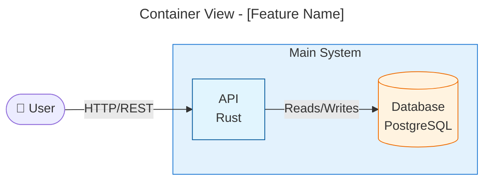
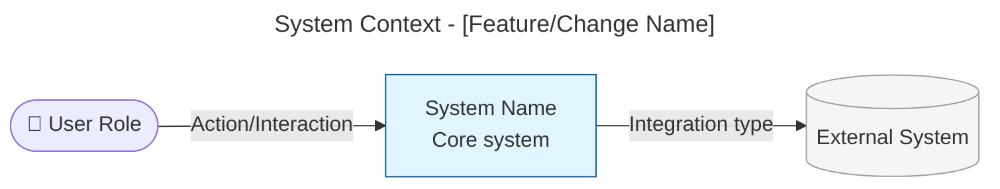
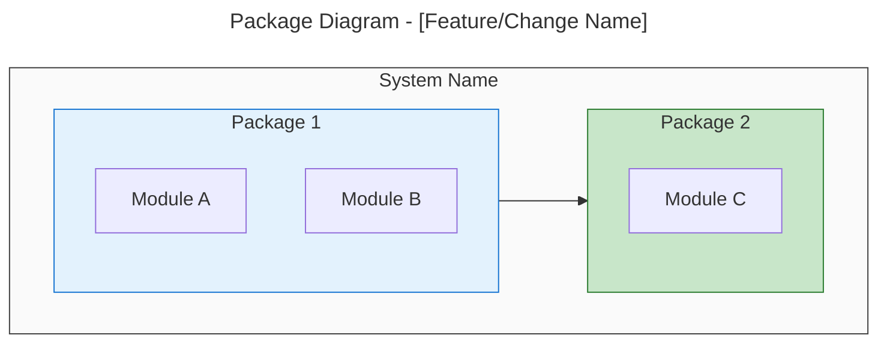
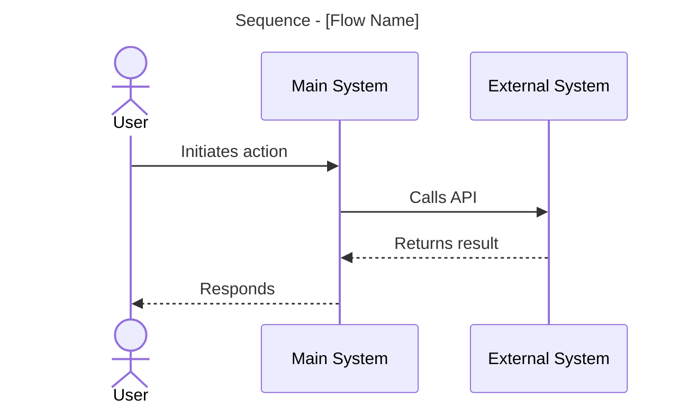
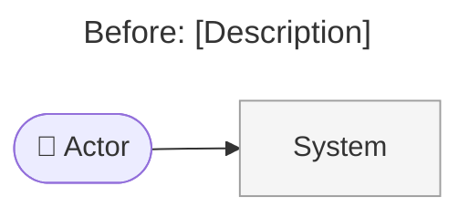
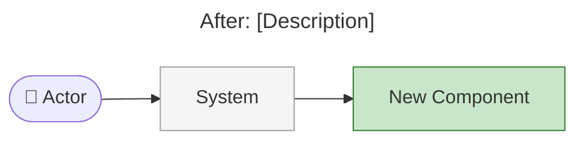

# Architecture Summary Guide

High-level visual document for management-level stakeholders (engineering/product managers, technical directors, non-technical stakeholders) answering: what changed, where it fits, why it matters, what's next. Uses UML-style Mermaid diagrams at whole-system abstraction. Test: a reader unfamiliar with the codebase must understand it in 5 minutes.

## When to Create

Create when: changes touch system boundaries or integrations, multiple components/services are affected, the change has business-visible impact, or stakeholders need to understand what was delivered.

Skip for: bug fixes with no architectural impact, internal refactoring invisible to stakeholders, documentation-only changes.

## Diagram Selection

| Diagram | Shows | Use when |
|---------|-------|----------|
| System Context (flowchart) | Actors, the system, external systems, labeled relationships | Always (required) |
| Package (flowchart + subgraphs) | Logical module groupings and dependencies | Changes affect module organization, cross-cutting concerns, or new packages/crates |
| Container (flowchart + subgraphs) | Runtime containers/services and interactions | Changes affect deployment topology, infrastructure, or service boundaries |
| Sequence | Ordered interactions between components | Key flows are affected and ordering clarifies behavior |
| Before/After (paired flowcharts) | Original vs modified state | Change modifies existing architecture/flows |

Mermaid node shapes: `([text])` actor, `[text]` internal system, `[(text)]` database, `[[text]]` external service.

Container diagram example (the artifact template below embeds examples for the other types):



## Rules

- Business language only: no file paths, function names, code, or unexplained jargon. Focus on *what* and *why*, not *how*. Assume the reader does not know the codebase.
- 5-10 elements per diagram, one concept per diagram; show relationships between systems, not internal detail (the forest, not the trees).
- Label every arrow with the interaction type; direction shows data/control flow; avoid crossing lines.
- Highlight new/modified elements with distinct colors; grey out unchanged context; keep names and colors consistent across diagrams.
- Include a clear "why" for the changes.

## Architecture Summary Artifact Template

Create `architecture-summary-{n}.md` in the planning folder using this template (the activity's `artifactPrefix` is prepended at write time; n increments on successive versions):

```markdown
# Architecture Summary

> architecture-summary · [work package name] · #[issue number] [title] · YYYY-MM-DD · [author/agent]

## Executive Summary

[2-3 sentences describing what was implemented and why it matters. Write for someone unfamiliar with the codebase.]

## System Context

[Brief description of the system and its environment]



*[Optional: note explaining the diagram if needed]*

## Package Structure

*[Omit this section unless changes affect module organization or dependencies. Highlight new/modified packages with distinct colors.]*



## Key Flows

*[Omit this section unless key flows between components are affected]*



## What Changed

### Components Added/Modified

| Component | Change Type | Description |
|-----------|-------------|-------------|
| [Name] | Added/Modified/Removed | [Brief description] |

### Key Changes

- **[Change 1]:** [Description in business terms]
- **[Change 2]:** [Description in business terms]

## Before & After

*[Omit this section unless the change modifies existing architecture]*

### Before



### After



## Impact

### Who Is Affected

| Stakeholder | Impact | Notes |
|-------------|--------|-------|
| [Role/Team] | [High/Medium/Low] | [Brief description] |

### System Dependencies

*[Omit if no upstream/downstream systems are affected]*

| System | Relationship | Impact |
|--------|--------------|--------|
| [System] | Upstream/Downstream | [Description] |

## Risks & Mitigations

*[Omit this section if none]*

| Risk | Likelihood | Impact | Mitigation |
|------|------------|--------|------------|
| [Risk description] | Low/Medium/High | Low/Medium/High | [How addressed] |

## Future Considerations

*[Omit this section if none. Known follow-up work, technical debt introduced, potential improvements.]*

## Related Documents

*[Omit this section if none. Link (don't copy) the ADR, work package plan, and relevant documentation.]*
```
