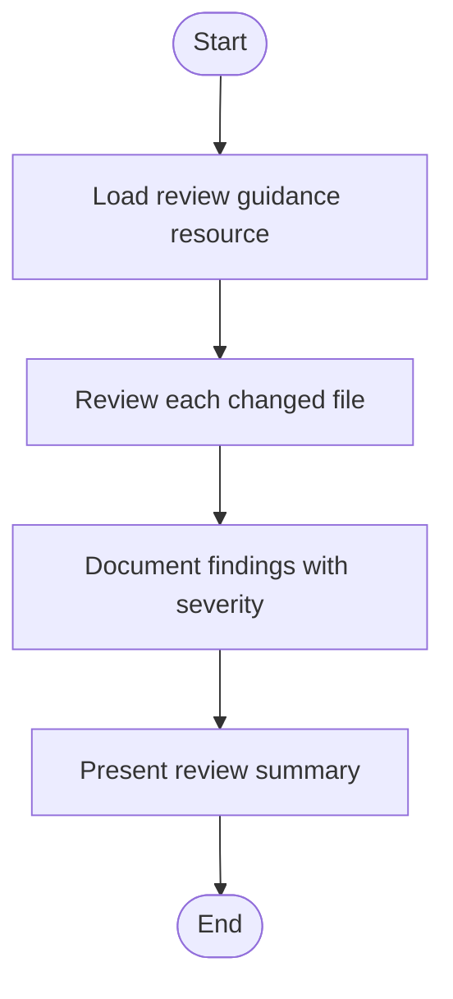
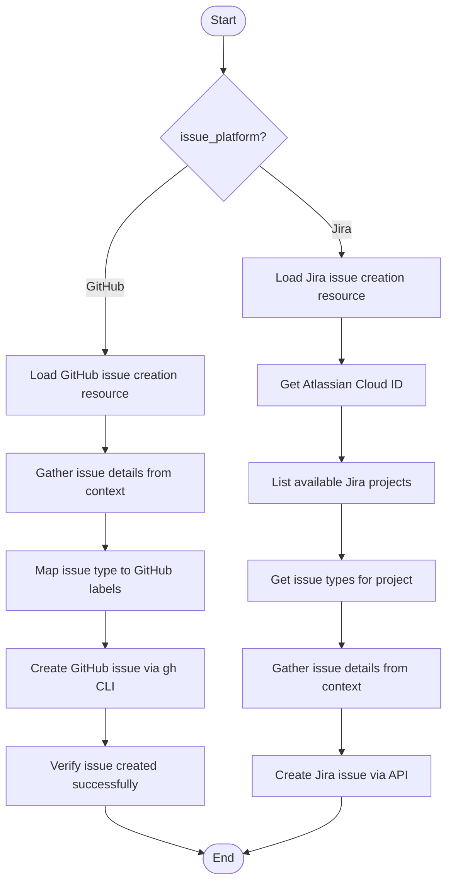
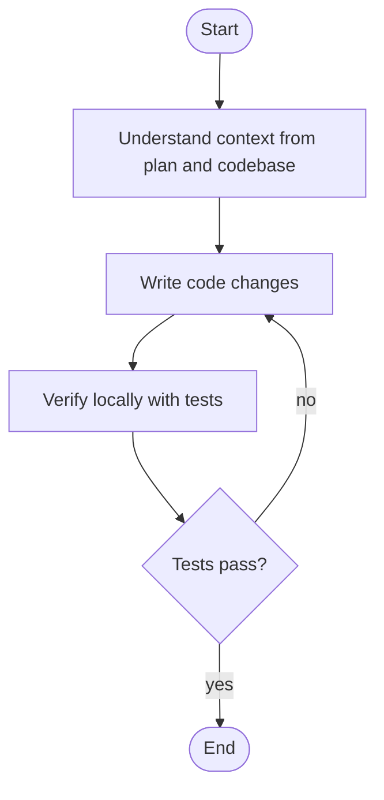
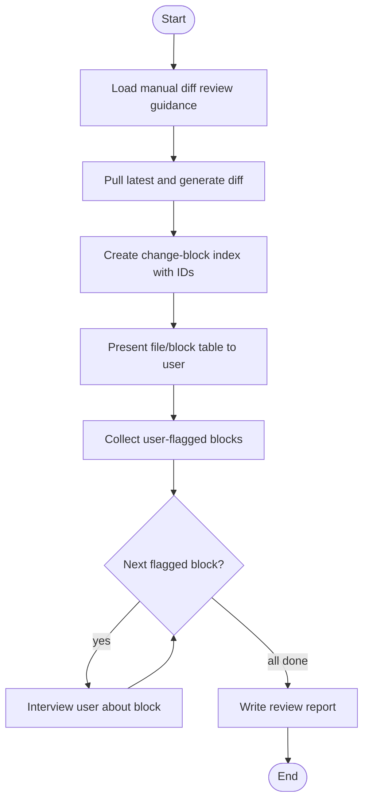

# Work Package Skills

> Part of the [Work Package Implementation Workflow](../README.md)

## Skills (24)

The workflow uses 24 skills organized by capability. Skills are referenced by activities through `primary` and `supporting` roles. The primary skill defines the main competency for the activity; supporting skills provide supplementary capabilities invoked within the activity flow. Skills 22-23 define the orchestrator/worker execution model.

| # | Skill ID | Capability | Used By |
|---|----------|------------|---------|
| 00 | `review-code` | Comprehensive Rust/Substrate code review with severity ratings | Post-Implementation Review |
| 01 | `review-test-suite` | Test suite quality, coverage gaps, and anti-pattern detection | Post-Implementation Review |
| 02 | `respond-to-pr-review` | Analyze and respond to PR review comments systematically | Submit for Review |
| 03 | `create-issue` | Create GitHub or Jira issues with platform-specific type mapping | Start Work Package |
| 04 | `classify-problem` | Problem classification, complexity assessment, and workflow path selection | Design Philosophy, Plan and Prepare |
| 05 | `elicit-requirements` | Requirements discovery through sequential domain-based conversation | Requirements Elicitation |
| 06 | `research-knowledge-base` | Knowledge base search and web research with synthesis | Research |
| 07 | `analyze-implementation` | Implementation analysis, baseline establishment, gap identification | Implementation Analysis |
| 08 | `create-plan` | Work package plan with task breakdown and dependencies | Plan and Prepare |
| 09 | `create-test-plan` | Test strategy, acceptance criteria, and test case definition | Plan and Prepare |
| 10 | `implement-task` | Single task code implementation with test and commit cycle | Implement |
| 11 | `review-diff` | Manual diff review with indexed block references and interview loop | Post-Implementation Review |
| 12 | `review-strategy` | Strategic review ensuring minimal and focused changes | Strategic Review |
| 13 | `review-assumptions` | Assumption collection, classification, and structured review | All planning and implementation activities |
| 14 | `manage-artifacts` | Planning folder creation and artifact numbering management | Start Work Package, Requirements Elicitation, Implementation Analysis |
| 15 | `manage-git` | Git branching, PR lifecycle, branch sync operations | Start Work Package, Implement |
| 16 | `validate-build` | Test execution, build verification, lint checking | Validate, Implement |
| 17 | `finalize-documentation` | ADR updates, test plan finalization, COMPLETE.md creation | Complete |
| 18 | `update-pr` | PR description update, push commits, mark ready for review | Submit for Review |
| 19 | `conduct-retrospective` | Workflow retrospective and lessons learned capture | Complete |
| 20 | `summarize-architecture` | Architecture summary with UML-style diagrams for stakeholders | Post-Implementation Review, Strategic Review |
| 21 | `create-adr` | Architecture Decision Record creation for significant decisions | Complete |
| 22 | `orchestrate-workflow` | Orchestrate workflow execution using a persistent worker sub-agent | Orchestrator agent |
| 23 | `execute-activity` | Bootstrap and execute a single workflow activity as a worker sub-agent | Worker agent |

---

### Skill Protocol: `review-code` (00)

Comprehensive code review following Rust/Substrate-specific criteria. Loads review guidance resource, reviews each changed file, documents findings with severity, and presents a summary.

**Protocol steps:**

| Step Key | Action |
|----------|--------|
| `load-guidance` | Load `16-rust-substrate-code-review.md` resource for criteria |
| `review-files` | Iterate over changed files, assess against criteria |
| `document-findings` | Record each finding: file, line, severity, description |
| `present-summary` | Aggregate findings by severity, present to user |

---

### Skill Protocol: `create-issue` (03)

Creates issues in either GitHub or Jira based on the `issue_platform` variable. Each platform follows a distinct protocol path.

**GitHub protocol:**

| Step Key | Action |
|----------|--------|
| `load-resource` | Load `03-github-issue-creation.md` resource |
| `gather-details` | Extract title, description, acceptance criteria from context |
| `map-labels` | Map issue type (feature, bug, task, enhancement) to GitHub labels |
| `create` | Run `gh issue create` with title, body, labels |
| `verify` | Confirm issue was created and capture issue number |

**Jira protocol:**

| Step Key | Action |
|----------|--------|
| `load-resource` | Load `04-jira-issue-creation.md` resource |
| `get-cloud-id` | Call `getAccessibleAtlassianResources` for Cloud ID |
| `list-projects` | Call `getVisibleJiraProjects` to enumerate available projects |
| `get-types` | Call `getJiraProjectIssueTypesMetadata` for the selected project |
| `gather-details` | Map issue type to Jira issue type, gather fields |
| `create` | Call `createJiraIssue` with mapped fields |

---

### Skill Protocol: `implement-task` (10)

Implements a single task from the work package plan following a three-phase approach: understand context, write code, verify locally.

**Protocol steps:**

| Step Key | Action |
|----------|--------|
| `understand-context` | Read task description from plan, examine relevant source files, understand dependencies |
| `write-code` | Implement the task following existing code patterns and conventions |
| `verify-locally` | Run relevant tests, check for compilation errors, verify behavior |

---

### Skill Protocol: `review-diff` (11)

Manual diff review with indexed block references. Creates a structured change-block index, presents it to the user for flagging, then conducts an interview for each flagged block. Produces a comprehensive review report.

**Protocol steps:**

| Step Key | Action |
|----------|--------|
| `load-guidance` | Load `22-manual-diff-review.md` resource for format and criteria |
| `pull-and-diff` | Generate diff between feature branch and base |
| `create-index` | Parse diff into numbered change blocks with file, line range, and description |
| `present-to-user` | Display indexed table for user to flag items of concern |
| `collect-flagged` | Record which blocks the user wants to discuss |
| `interview-each` | For each flagged block, ask targeted questions and record responses |
| `write-report` | Compile all findings into `08-manual-diff-review.md` |

---
