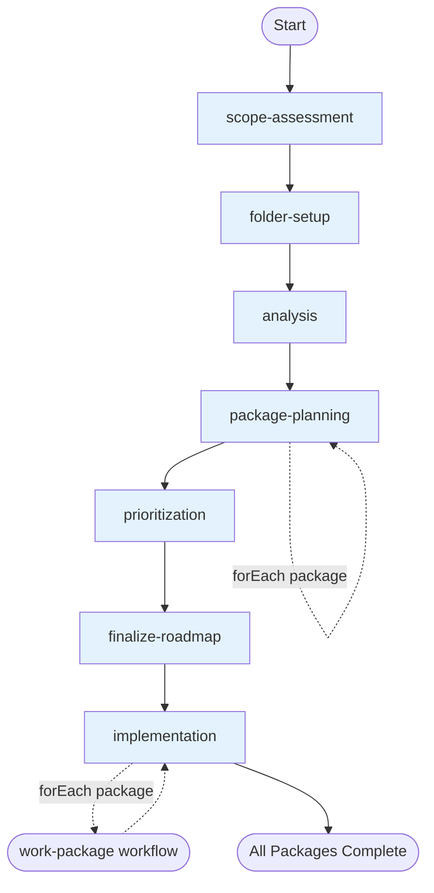
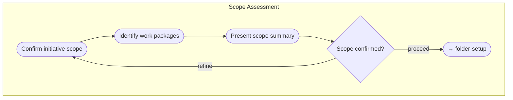
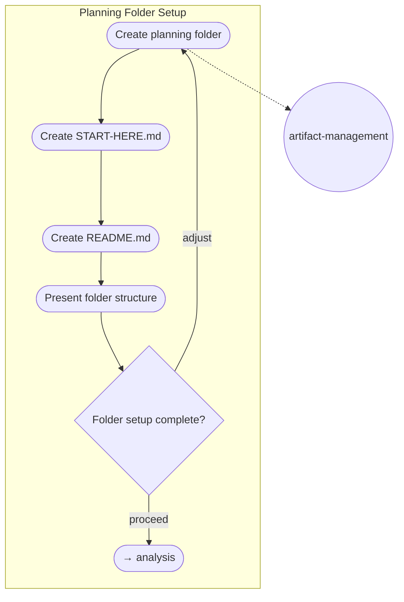
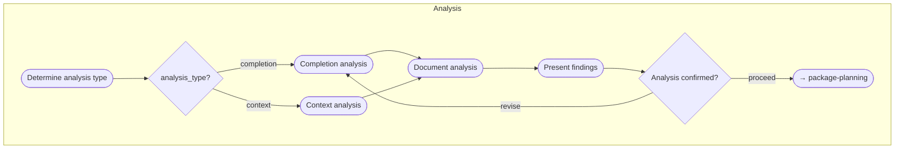
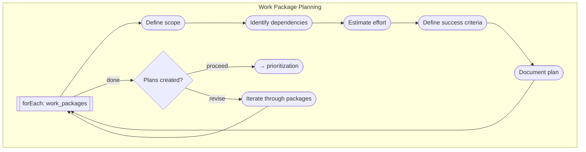
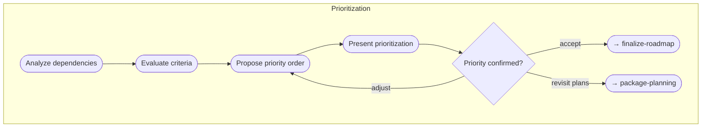
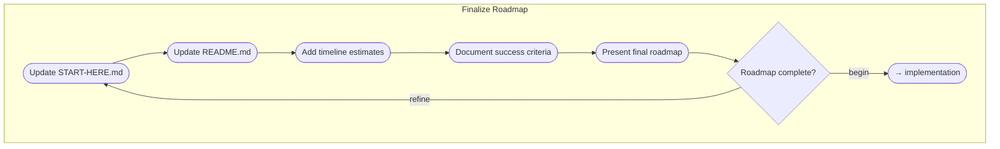
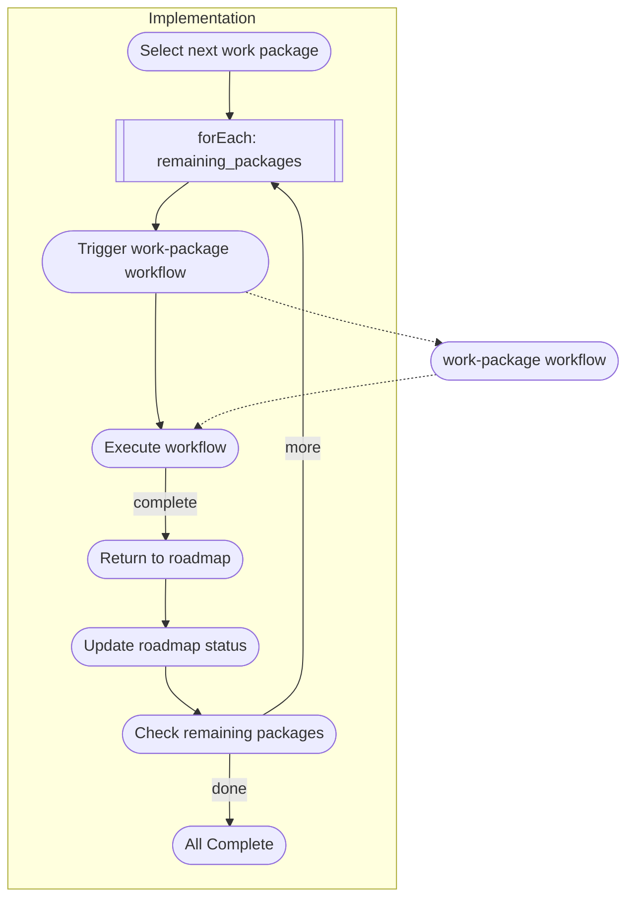

# Work Packages Workflow

> Plan and coordinate multiple related work packages, then execute each in turn by triggering the work-package workflow. Use when you have multiple related features, a roadmap spanning several weeks/months, or features with shared context.

## Overview

The Work Packages workflow handles **planning and prioritization** of multiple related work items. Once planned, it triggers the `work-package` workflow for each package in priority order.

**Use this workflow when:**
- You have multiple features to implement
- Planning a roadmap spanning several weeks/months
- Features share context and need coordination

**Key characteristics:**
- Sequential flow with clear progression
- Creates planning folder with documentation
- Loops through packages for planning and implementation
- Triggers `work-package` workflow for each package

## Workflow Flow



## Activities

### 1. Scope Assessment

**Purpose:** Confirm multi-work-package initiative and identify work packages to be planned.

**Primary Skill:** `assess-initiative-scope`



| Step | Description |
|------|-------------|
| Confirm initiative scope | Verify this is a multi-work-package initiative |
| Identify work packages | List all work packages to be planned |
| Present scope summary | Summarize identified work packages for confirmation |

**Checkpoint:** "I've identified N work packages. Proceed with planning?"

---

### 2. Folder Setup

**Purpose:** Create planning folder structure with initial documentation skeletons.

**Primary Skill:** `workflow-execution`  
**Supporting Skill:** `artifact-management`



| Step | Description |
|------|-------------|
| Create planning folder | Create folder at `.engineering/artifacts/planning/YYYY-MM-DD-initiative-name/` |
| Create START-HERE.md | Create initial skeleton with header and placeholders |
| Create README.md | Create skeleton for navigation |
| Present folder structure | Show user the created structure |

**Artifacts:** START-HERE.md (create), README.md (create)

**Checkpoint:** "Planning folder created. Proceed with analysis?"

---

### 3. Analysis

**Purpose:** Perform completion or context analysis depending on whether continuing previous work or starting new.

**Primary Skill:** `analyze-initiative-context`



| Step | Description |
|------|-------------|
| Determine analysis type | Ask: Is this continuing previous work or new initiative? |
| Perform analysis | Execute completion or context analysis based on decision |
| Document analysis | Create analysis document using resource template |
| Present findings | Summarize analysis findings for review |

**Artifacts:** analysis.md (create)

**Checkpoint:** "Analysis complete. Does this context look correct?"

---

### 4. Package Planning

**Purpose:** Define scope, dependencies, effort, and success criteria for each work package.

**Primary Skill:** `plan-work-package-scope`



| Step | Description |
|------|-------------|
| Iterate through packages | For each identified work package |
| Define scope | Identify in scope and out of scope |
| Identify dependencies | Document dependencies on other packages or external factors |
| Estimate effort | Provide rough effort estimate |
| Define success criteria | Establish measurable success criteria |
| Document plan | Create NN-package-name-plan.md |

**Artifacts:** {package-name}-plan.md (create, per package)

**Checkpoint:** "Work package plans created. Ready for prioritization?"

---

### 5. Prioritization

**Purpose:** Prioritize work packages based on dependencies, value, risk, and effort.

**Primary Skill:** `prioritize-packages`



| Step | Description |
|------|-------------|
| Analyze dependencies | Create dependency graph showing blockers |
| Evaluate criteria | Assess each package on: business value, risk, effort |
| Propose priority order | Generate recommended execution order |
| Present prioritization | Show dependency graph and proposed order |

**Artifacts:** priority-ranking.md (create)

**Checkpoint:** "Here's the proposed priority order. Adjust as needed?"

---

### 6. Finalize Roadmap

**Purpose:** Complete roadmap documentation with timeline, navigation, and success criteria.

**Primary Skill:** `document-roadmap`



| Step | Description |
|------|-------------|
| Update START-HERE.md | Complete with executive summary, status table, success criteria |
| Update README.md | Add navigation links to all planning documents |
| Add timeline estimates | Include timeline based on effort and dependencies |
| Document success criteria | Define how initiative completion will be measured |
| Present final roadmap | Show completed roadmap for final approval |

**Artifacts:** START-HERE.md (update), README.md (update)

**Checkpoint:** "Roadmap complete. Ready to begin implementation?"

---

### 7. Implementation

**Purpose:** Execute each planned work package in priority order by triggering the work-package workflow.

**Primary Skill:** `orchestrate-package-execution`



| Step | Description |
|------|-------------|
| Select next work package | Choose highest priority unstarted package |
| Trigger work-package workflow | Load `work-package` workflow and start |
| Execute workflow | Follow work-package workflow through all activities |
| Return to roadmap | After workflow completes, return context |
| Update roadmap status | Mark completed package, update progress |
| Check remaining packages | Determine if more packages remain |

**Artifacts:** START-HERE.md (update, progress tracking)

**Outcome:**
- All planned work packages implemented via work-package workflow
- Each package has merged PR
- Roadmap status reflects completion

---

## Skills Summary

| Skill | Type | Capability | Used By |
|-------|------|------------|---------|
| `assess-initiative-scope` | Workflow-specific | Identify and categorize work packages | Scope Assessment |
| `analyze-initiative-context` | Workflow-specific | Completion or context analysis | Analysis |
| `plan-work-package-scope` | Workflow-specific | Scope, dependencies, effort, success criteria per package | Package Planning |
| `prioritize-packages` | Workflow-specific | Evaluate and order packages | Prioritization |
| `document-roadmap` | Workflow-specific | Produce finalized roadmap documentation | Finalize Roadmap |
| `orchestrate-package-execution` | Workflow-specific | Trigger and manage work-package workflow instances | Implementation |
| `workflow-execution` | Universal | Execute workflows following schema patterns | All activities (supporting) |
| `artifact-management` | Universal | Manage planning artifacts folder structure | Folder Setup |

## Resources

| # | Resource | Purpose |
|---|----------|---------|
| 00 | Planning Folder Template | Templates for START-HERE.md and README.md skeletons |
| 01 | Completion Analysis Guide | Procedure for analyzing continuing initiatives |
| 02 | Context Analysis Guide | Procedure for analyzing new initiatives |
| 03 | Package Plan Template | Template for individual work package plans |
| 04 | Prioritization Framework | Framework for evaluating and ordering packages |
| 05 | Roadmap Template | Templates for finalized roadmap documentation |
| 06 | Workflow Triggering Protocol | How to trigger and manage work-package workflow instances |

---

## Context Preserved

| Variable | Description |
|----------|-------------|
| `initiative_name` | Name of the overall initiative |
| `work_packages` | List of identified work packages |
| `planning_folder_path` | Path to the created planning folder |
| `analysis_type` | Completion or context |
| `package_plans` | List of created plan document paths |
| `priority_order` | Ordered list of work packages |
| `completed_packages` | List of completed work packages |
| `remaining_packages` | List of remaining work packages |
| `overall_progress` | Progress indicator |

## File Structure

```
work-packages/
├── workflow.toon
├── README.md
├── activities/
│   ├── README.md
│   ├── 01-scope-assessment.toon
│   ├── 02-folder-setup.toon
│   ├── 03-analysis.toon
│   ├── 04-package-planning.toon
│   ├── 05-prioritization.toon
│   ├── 06-finalize-roadmap.toon
│   └── 07-implementation.toon
├── skills/
│   ├── README.md
│   ├── 00-assess-initiative-scope.toon
│   ├── 01-analyze-initiative-context.toon
│   ├── 02-plan-work-package-scope.toon
│   ├── 03-prioritize-packages.toon
│   ├── 04-document-roadmap.toon
│   └── 05-orchestrate-package-execution.toon
└── resources/
    ├── README.md
    ├── 00-planning-folder-template.md
    ├── 01-completion-analysis-guide.md
    ├── 02-context-analysis-guide.md
    ├── 03-package-plan-template.md
    ├── 04-prioritization-framework.md
    ├── 05-roadmap-template.md
    └── 06-workflow-triggering-protocol.md
```
