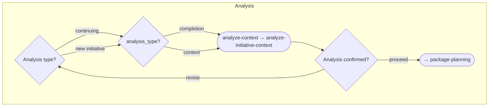
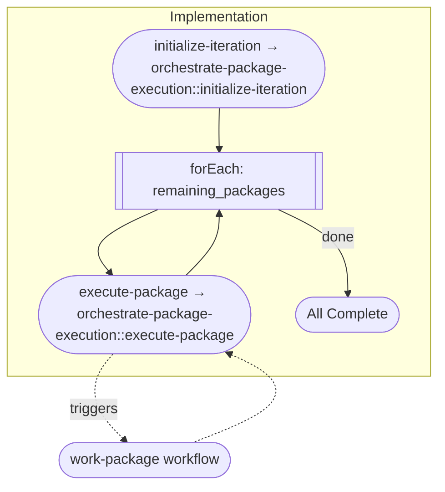

# Work Packages Workflow

> Plan and coordinate multiple related work packages, then execute each in turn by triggering the work-package workflow. Use when you have multiple related features, a roadmap spanning several weeks/months, or features with shared context.

## Overview

The Work Packages workflow handles **planning and prioritization** of multiple related work items. Once planned, it triggers the `work-package` workflow for each package in priority order.

**Use this workflow when:**
- You have multiple features to implement
- Planning a roadmap spanning several weeks/months
- Features share context and need coordination

**Key characteristics:**
- Sequential flow with clear progression
- Creates planning folder with documentation
- Loops through packages for planning and implementation
- Triggers `work-package` workflow for each package

## Workflow Flow


## Activities

### 1. Scope Assessment

**Purpose:** Confirm multi-work-package initiative and identify work packages to be planned.

**Step Technique:** `assess-initiative-scope` · **Supporting:** `variable-binding`


| Step | Technique |
|------|-----------|
| `assess-scope` | `assess-initiative-scope` |

**Checkpoint:** "I've identified N work packages. Proceed with planning?"

---

### 2. Folder Setup

**Purpose:** Create planning folder structure with initial documentation skeletons.

**Step Techniques:** `version-control::initialize-folder`, `setup-planning-folder` · **Supporting:** `variable-binding`


| Step | Technique |
|------|-----------|
| `create-folder` | `version-control::initialize-folder` |
| `setup-planning-folder` | `setup-planning-folder` |

**Artifacts:** START-HERE.md (create), README.md (create)

**Checkpoint:** "Planning folder created. Proceed with analysis?"

---

### 3. Analysis

**Purpose:** Perform completion or context analysis depending on whether continuing previous work or starting new.

**Step Technique:** `analyze-initiative-context` · **Supporting:** `variable-binding`



| Step | Technique |
|------|-----------|
| `analyze-context` | `analyze-initiative-context` |

The analysis type is chosen at the **Analysis Type Selection** checkpoint (`continuing` or `new initiative`), which routes the **Analysis Method Selection** decision to completion or context analysis.

**Artifacts:** `01-COMPLETION-ANALYSIS.md` / `02-CONTEXT-ANALYSIS.md` (create)

**Checkpoint:** "Analysis complete. Does this context look correct?"

---

### 4. Package Planning

**Purpose:** Define scope, dependencies, effort, and success criteria for each work package.

**Step Techniques:** `plan-work-package-scope::present-overview`, `plan-work-package-scope::plan-package` (loop) · **Supporting:** `variable-binding`, `scatter-gather`


| Step | Technique | Scope |
|------|-----------|-------|
| `present-planning-overview` | `plan-work-package-scope::present-overview` | activity |
| `plan-package` | `plan-work-package-scope::plan-package` | `forEach` loop over `work_packages` |

**Artifacts:** `{package_name}-plan.md` (create, per package)

**Checkpoint:** "Work package plans created. Ready for prioritization?"

---

### 5. Prioritization

**Purpose:** Prioritize work packages based on dependencies, value, risk, and effort.

**Step Technique:** `prioritize-packages` · **Supporting:** `variable-binding`


| Step | Technique |
|------|-----------|
| `prioritize` | `prioritize-packages` |

**Artifacts:** priority-ranking.md (create)

**Checkpoint:** "Here's the proposed priority order. Adjust as needed?"

---

### 6. Finalize Roadmap

**Purpose:** Complete roadmap documentation with timeline, navigation, and success criteria.

**Step Technique:** `document-roadmap` · **Supporting:** `variable-binding`


| Step | Technique |
|------|-----------|
| `finalize-roadmap-docs` | `document-roadmap` |

**Artifacts:** START-HERE.md (update), README.md (update)

**Checkpoint:** "Roadmap complete. Ready to begin implementation?"

---

### 7. Implementation

**Purpose:** Execute each planned work package in priority order by triggering the work-package workflow.

**Step Techniques:** `orchestrate-package-execution::initialize-iteration`, `orchestrate-package-execution::execute-package` (loop) · **Supporting:** `variable-binding`, `scatter-gather`



| Step | Technique | Scope |
|------|-----------|-------|
| `initialize-iteration` | `orchestrate-package-execution::initialize-iteration` | activity |
| `execute-package` | `orchestrate-package-execution::execute-package` | `forEach` loop over `remaining_packages` |

The `execute-package` step triggers the `work-package` workflow for each package in the loop.

**Artifacts:** START-HERE.md (update, progress tracking)

**Outcome:**
- All planned work packages implemented via work-package workflow
- Each package has merged PR
- Roadmap status reflects completion

---

## Techniques Summary

Workflow-specific techniques live under `techniques/`. Two are **operation groups** (a `TECHNIQUE.md` contract plus one file per operation, referenced as `<group>::<op>`); the rest are standalone techniques. All share the base contract in `techniques/TECHNIQUE.md`.

| Technique / Operation | Type | Capability | Used By |
|-----------------------|------|------------|---------|
| `assess-initiative-scope` | Standalone | Identify and categorize work packages | Scope Assessment |
| `setup-planning-folder` | Standalone | Create START-HERE.md and README.md skeletons | Folder Setup |
| `analyze-initiative-context` | Standalone | Completion or context analysis | Analysis |
| `plan-work-package-scope` | Group | Scope, dependencies, effort, success criteria per package | Package Planning |
| `plan-work-package-scope::present-overview` | Group op | Present packages and the per-package planning approach | Package Planning |
| `plan-work-package-scope::plan-package` | Group op | Plan and document one package (scope, deps, effort, success) | Package Planning (loop) |
| `prioritize-packages` | Standalone | Evaluate and order packages | Prioritization |
| `document-roadmap` | Standalone | Produce finalized roadmap documentation | Finalize Roadmap |
| `orchestrate-package-execution` | Group | Trigger and manage work-package workflow instances | Implementation |
| `orchestrate-package-execution::initialize-iteration` | Group op | Build the remaining-packages list and progress indicator | Implementation |
| `orchestrate-package-execution::execute-package` | Group op | Execute one package via the work-package workflow, update status | Implementation (loop) |
| `version-control::initialize-folder` | Meta | Derive the canonical planning-folder slug | Folder Setup |
| `variable-binding` | Meta | Bind step operations to the workflow variable bag | All activities (supporting) |
| `scatter-gather` | Meta | Fan out and aggregate forEach iterations | Package Planning, Implementation (supporting) |

## Resources

| # | Resource | Purpose |
|---|----------|---------|
| 00 | Planning Folder Template | Templates for START-HERE.md and README.md skeletons |
| 01 | Completion Analysis Guide | Procedure for analyzing continuing initiatives |
| 02 | Context Analysis Guide | Procedure for analyzing new initiatives |
| 03 | Package Plan Template | Template for individual work package plans |
| 04 | Prioritization Framework | Framework for evaluating and ordering packages |
| 05 | Roadmap Template | Templates for finalized roadmap documentation |
| 06 | Workflow Triggering Protocol | How to trigger and manage work-package workflow instances |

---

## Context Preserved

The workflow declares its variables in [`workflow.toon`](workflow.toon). Key variables include:

| Variable | Description |
|----------|-------------|
| `initiative_name` | Name of the overall initiative |
| `work_packages` | List of identified work packages |
| `planning_folder_path` | Path to the created planning folder |
| `analysis_type` | Completion or context |
| `package_plans` | List of created plan document paths |
| `priority_order` | Ordered list of work packages |
| `completed_packages` | List of completed work packages |
| `remaining_packages` | List of remaining work packages |
| `overall_progress` | Progress indicator |

## File Structure

```
work-packages/
├── workflow.toon
├── README.md
├── activities/
│   ├── README.md
│   ├── 01-scope-assessment.toon
│   ├── 02-folder-setup.toon
│   ├── 03-analysis.toon
│   ├── 04-package-planning.toon
│   ├── 05-prioritization.toon
│   ├── 06-finalize-roadmap.toon
│   └── 07-implementation.toon
├── techniques/
│   ├── TECHNIQUE.md
│   ├── assess-initiative-scope.md
│   ├── setup-planning-folder.md
│   ├── analyze-initiative-context.md
│   ├── prioritize-packages.md
│   ├── document-roadmap.md
│   ├── plan-work-package-scope/
│   │   ├── TECHNIQUE.md
│   │   ├── present-overview.md
│   │   └── plan-package.md
│   └── orchestrate-package-execution/
│       ├── TECHNIQUE.md
│       ├── initialize-iteration.md
│       └── execute-package.md
└── resources/
    ├── README.md
    ├── planning-folder-template.md
    ├── completion-analysis-guide.md
    ├── context-analysis-guide.md
    ├── package-plan-template.md
    ├── prioritization-framework.md
    ├── roadmap-template.md
    └── workflow-triggering-protocol.md
```
