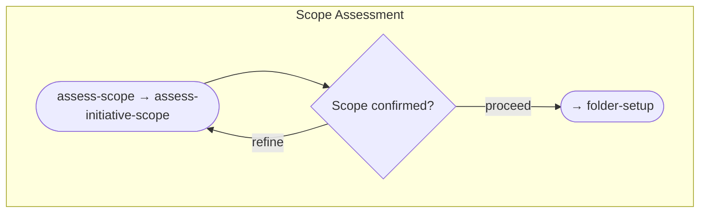
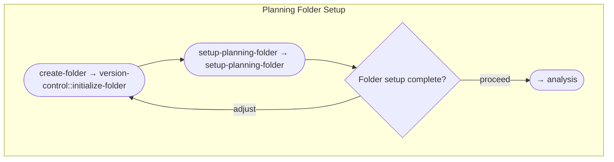
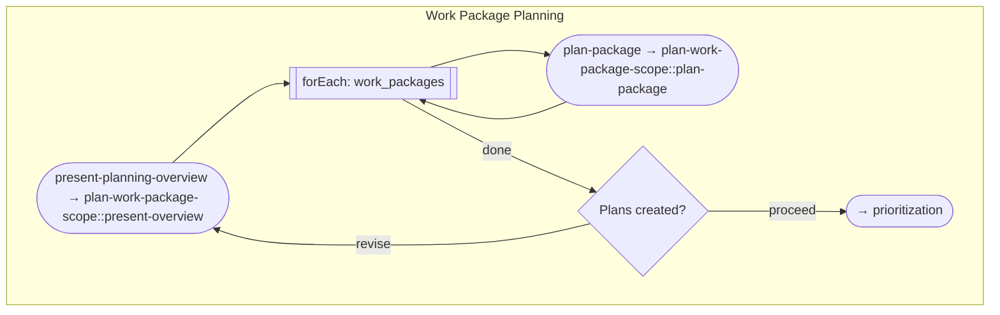
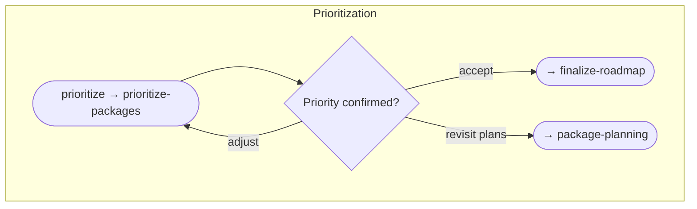
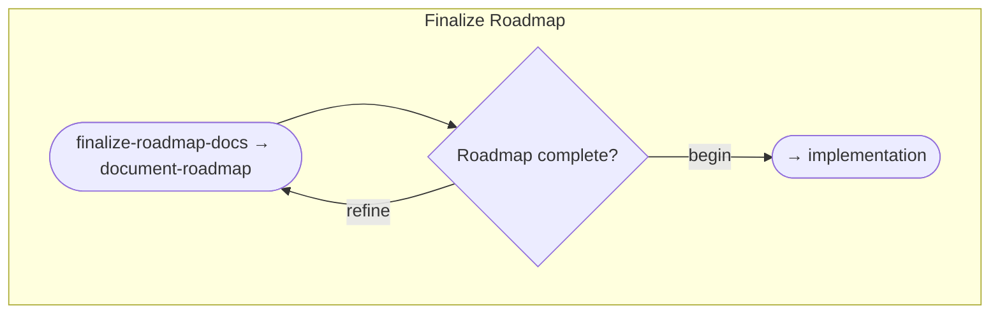

# Work Packages Workflow

> Plan and coordinate multiple related work packages, then execute each in turn by triggering the work-package workflow. Use when you have multiple related features, a roadmap spanning several weeks/months, or features with shared context.

## Overview

The Work Packages workflow handles **planning and prioritization** of multiple related work items. Once planned, it triggers the `work-package` workflow for each package in priority order.

**Use this workflow when:**
- You have multiple features to implement
- Planning a roadmap spanning several weeks/months
- Features share context and need coordination

**Key characteristics:**
- Sequential flow with clear progression
- Creates planning folder with documentation
- Loops through packages for planning and implementation
- Triggers `work-package` workflow for each package

## Workflow Flow


## Activities

The seven activities run as a sequential chain (see the flow diagram above). Each links to its authoritative definition — steps, checkpoints, decisions, loops, and transitions live in the activity TOON and are served by `get_activity`.

### 1. [Scope Assessment](activities/01-scope-assessment.toon)

Confirms this is a genuine multi-package initiative and produces an agreed inventory of distinct work packages, so planning can proceed package-by-package without scope drift. Ends at a user checkpoint before moving on to folder setup.



### 2. [Folder Setup](activities/02-folder-setup.toon)

Creates the planning folder and its initial documentation skeletons (START-HERE.md and README.md), giving the initiative a canonical home before analysis begins.



### 3. [Analysis](activities/03-analysis.toon)

Establishes a validated understanding of the initiative's starting point — either completion analysis of existing progress when continuing previous work, or context analysis for a fresh start. The path is chosen at a user checkpoint so later planning rests on confirmed context.


### 4. [Package Planning](activities/04-package-planning.toon)

Defines scope, dependencies, effort, and success criteria for each package, fanning out over the identified work packages so every one is detailed enough to be prioritized and executed independently.



### 5. [Prioritization](activities/05-prioritization.toon)

Orders the packages by dependencies, value, risk, and effort, producing a priority ranking the user accepts (or sends back to planning) before the roadmap is finalized.



### 6. [Finalize Roadmap](activities/06-finalize-roadmap.toon)

Completes the roadmap documentation — timeline, navigation, and success criteria — so the initiative has a single source of truth before implementation begins.



### 7. [Implementation](activities/07-implementation.toon)

Executes each planned package in priority order, triggering the `work-package` workflow for each one in turn and tracking progress until the whole initiative is delivered as merged, reviewed work.


## Artifacts

The workflow produces planning documentation under the planning folder: START-HERE.md and README.md skeletons (created at setup, finalized at roadmap), a completion or context analysis document, a plan per work package, a priority ranking, and progress tracking updated as packages complete. See the activity TOONs for the precise artifact each activity reads or writes.

## Techniques Summary

Workflow-specific techniques live under `techniques/`. Two are **operation groups** (a `TECHNIQUE.md` contract plus one file per operation, referenced as `<group>::<op>`); the rest are standalone techniques. All share the base contract in `techniques/TECHNIQUE.md`.

| Technique / Operation | Type | Capability | Used By |
|-----------------------|------|------------|---------|
| `assess-initiative-scope` | Standalone | Identify and categorize work packages | Scope Assessment |
| `setup-planning-folder` | Standalone | Create START-HERE.md and README.md skeletons | Folder Setup |
| `analyze-initiative-context` | Standalone | Completion or context analysis | Analysis |
| `plan-work-package-scope` | Group | Scope, dependencies, effort, success criteria per package | Package Planning |
| `plan-work-package-scope::present-overview` | Group op | Present packages and the per-package planning approach | Package Planning |
| `plan-work-package-scope::plan-package` | Group op | Plan and document one package (scope, deps, effort, success) | Package Planning (loop) |
| `prioritize-packages` | Standalone | Evaluate and order packages | Prioritization |
| `document-roadmap` | Standalone | Produce finalized roadmap documentation | Finalize Roadmap |
| `orchestrate-package-execution` | Group | Trigger and manage work-package workflow instances | Implementation |
| `orchestrate-package-execution::initialize-iteration` | Group op | Build the remaining-packages list and progress indicator | Implementation |
| `orchestrate-package-execution::execute-package` | Group op | Execute one package via the work-package workflow, update status | Implementation (loop) |
| `version-control::initialize-folder` | Meta | Derive the canonical planning-folder slug | Folder Setup |
| `variable-binding` | Meta | Bind step operations to the workflow variable bag | Inherited by every activity (declared at `workflow.techniques.activity`) |
| `scatter-gather` | Meta | Fan out and aggregate forEach iterations | Package Planning, Implementation (supporting) |

## Resources

| # | Resource | Purpose |
|---|----------|---------|
| 00 | Planning Folder Template | Templates for START-HERE.md and README.md skeletons |
| 01 | Completion Analysis Guide | Procedure for analyzing continuing initiatives |
| 02 | Context Analysis Guide | Procedure for analyzing new initiatives |
| 03 | Package Plan Template | Template for individual work package plans |
| 04 | Prioritization Framework | Framework for evaluating and ordering packages |
| 05 | Roadmap Template | Templates for finalized roadmap documentation |
| 06 | Workflow Triggering Protocol | How to trigger and manage work-package workflow instances |

---

## File Structure

```
work-packages/
├── workflow.toon
├── README.md
├── activities/
│   ├── README.md
│   ├── 01-scope-assessment.toon
│   ├── 02-folder-setup.toon
│   ├── 03-analysis.toon
│   ├── 04-package-planning.toon
│   ├── 05-prioritization.toon
│   ├── 06-finalize-roadmap.toon
│   └── 07-implementation.toon
├── techniques/
│   ├── TECHNIQUE.md
│   ├── assess-initiative-scope.md
│   ├── setup-planning-folder.md
│   ├── analyze-initiative-context.md
│   ├── prioritize-packages.md
│   ├── document-roadmap.md
│   ├── plan-work-package-scope/
│   │   ├── TECHNIQUE.md
│   │   ├── present-overview.md
│   │   └── plan-package.md
│   └── orchestrate-package-execution/
│       ├── TECHNIQUE.md
│       ├── initialize-iteration.md
│       └── execute-package.md
└── resources/
    ├── README.md
    ├── planning-folder-template.md
    ├── completion-analysis-guide.md
    ├── context-analysis-guide.md
    ├── package-plan-template.md
    ├── prioritization-framework.md
    ├── roadmap-template.md
    └── workflow-triggering-protocol.md
```
