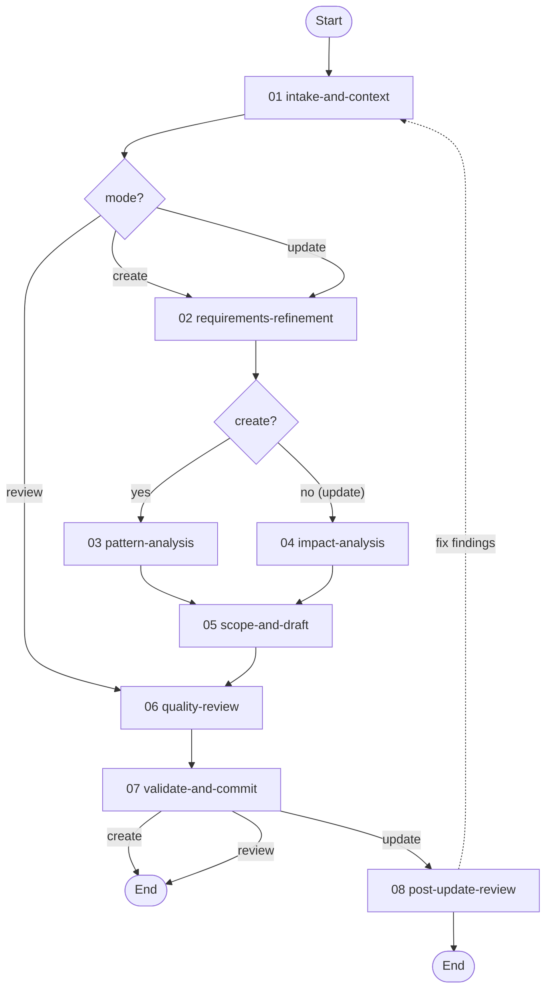

# Workflow Design Workflow

> v1.2.1 — Guides agents through creating, updating, or reviewing workflow definitions. In create/update modes, accepts a free-form user description and systematically elicits design details through sequential checkpoints. In review mode, audits an existing workflow against the 14 design principles and produces a compliance report.

---

## Overview

This workflow manages the complete lifecycle of workflow definition authoring through eight activities, with three modes (create, update, review) that control which activities execute. All modes enforce schema expressiveness, convention conformance, and structural enforcement of critical constraints.

| # | Activity | Mode | Est. Time | Purpose |
|---|----------|------|-----------|---------|
| 01 | [**Intake and Context**](./activities/README.md#01-intake-and-context) | All | 10-20m | Classify create/update/review, set mode + target, internalize schemas and TOON format |
| 02 | [**Requirements Refinement**](./activities/README.md#02-requirements-refinement) | Create, Update | 15-30m | Elicit design details one question at a time (8 checkpoints) |
| 03 | [**Pattern Analysis**](./activities/README.md#03-pattern-analysis) | Create only | 10-15m | Audit 2+ reference workflows for reusable patterns |
| 04 | [**Impact Analysis**](./activities/README.md#04-impact-analysis) | Update only | 10-20m | Enumerate affected files, check integrity, flag removals |
| 05 | [**Scope and Draft**](./activities/README.md#05-scope-and-draft) | Create, Update | 40-80m | Define file manifest, then draft and validate each file per-file |
| 06 | [**Quality Review**](./activities/README.md#06-quality-review) | All | 15-25m | Expressiveness, conformance, rule-hygiene, and rule-enforcement audits (full compliance audit in review mode) |
| 07 | [**Validate and Commit**](./activities/README.md#07-validate-and-commit) | All | 10-15m | Schema validation and commit (create/update) or save compliance report (review) |
| 08 | [**Post-Update Review**](./activities/README.md#08-post-update-review) | Update only | 10-15m | Automatic post-commit compliance audit of the updated workflow |

**Detailed documentation:**

- **Activities:** See [activities/README.md](./activities/README.md) for detailed per-activity documentation including steps, checkpoints, transitions, and mode overrides.
- **Techniques:** See [techniques/](techniques/) for the full technique library (workflow-local standalone techniques plus the shared `TECHNIQUE.md` base contract) with protocol flows and rules.
- **Resources:** See [resources/README.md](./resources/README.md) for the resource index (5 resources) with usage context and cross-workflow access.

---

## Modes

| Mode | Activation | Description |
|------|------------|-------------|
| **Create** (default) | "create a workflow", "new workflow" | Build a new workflow from a free-form description |
| **Update** | "update workflow", "modify workflow" | Modify an existing workflow with content preservation checks; automatic post-commit compliance review |
| **Review** | "review workflow", "audit workflow" | Audit an existing workflow against design principles; produce compliance report |

---

## Workflow Flow



---

## Review Mode

Review mode audits an existing workflow against:

1. **Schema expressiveness** — flags prose that should be formal constructs
2. **Convention conformance** — checks naming, structure, and field ordering
3. **Rule-to-structure enforcement** — identifies critical rules lacking structural backing
4. **Anti-pattern scan** — checks all 64 prohibited patterns
5. **Schema validation** — validates every TOON file

The output is a severity-rated compliance report saved to `.engineering/artifacts/reviews/`. After review, the user can opt to fix issues (transitions to update mode) or accept the report as-is.

---

## Design Principles

This workflow encodes 14 design principles derived from analysis of 175+ historical workflow creation sessions. Each principle is backed by structural enforcement (checkpoints, conditions, validate actions) rather than relying on rule text alone.

| # | Principle | Enforcement |
|---|-----------|-------------|
| 1 | Internalize before producing | [Intake and Context](./activities/README.md#01-intake-and-context) gate checkpoints |
| 2 | Define complete scope before execution | [Scope and Draft](./activities/README.md#05-scope-and-draft) `scope-and-structure-confirmed` checkpoint |
| 3 | One question at a time | [Requirements Refinement](./activities/README.md#02-requirements-refinement) — 8 separate checkpoints |
| 4 | Maximize schema expressiveness | [Quality Review](./activities/README.md#06-quality-review) `expressiveness-confirmed` checkpoint |
| 5 | Convention over invention | [Quality Review](./activities/README.md#06-quality-review) `conformance-confirmed` checkpoint |
| 6 | Never modify upward | Schema validation on every TOON file |
| 7 | Confirm before irreversible changes | [Impact Analysis](./activities/README.md#04-impact-analysis) checkpoints (update mode) |
| 8 | Corrections must persist | Cross-cutting: tracked throughout all activities |
| 9 | Modular over inline | [Quality Review](./activities/README.md#06-quality-review) conformance check |
| 10 | Encode constraints as structure | [Quality Review](./activities/README.md#06-quality-review) `enforcement-confirmed` checkpoint |
| 11 | Plan before acting | [Scope and Draft](./activities/README.md#05-scope-and-draft) `file-approach-confirmed` checkpoint |
| 12 | Non-destructive updates | [Scope and Draft](./activities/README.md#05-scope-and-draft) `preservation-check` checkpoint (update mode) |
| 13 | Format literacy before content | [Intake and Context](./activities/README.md#01-intake-and-context) `format-literacy` checkpoint |
| 14 | Complete documentation structure | [Validate and Commit](./activities/README.md#07-validate-and-commit) README generation/update |

---

## Techniques

The `techniques/` directory is a flat library of workflow-local standalone techniques (no group folders), plus a [`TECHNIQUE.md`](./techniques/TECHNIQUE.md) shared base contract inherited by all of them. There is no single primary technique; each activity step binds exactly one operation. Activity-wide strategy is supplied by the meta [`variable-binding`](../meta/techniques/variable-binding.md) technique (listed as `supporting` on every activity), and commits go through meta [`version-control::commit-regular-files`](../meta/techniques/version-control/commit-regular-files.md).

| Technique | Capability | Bound by |
|-----------|------------|----------|
| [`intake-classification`](./techniques/intake-classification.md) | Classify the request as create/update/review and set mode + target | Intake and Context |
| [`context-loading`](./techniques/context-loading.md) | Load schemas and survey existing workflows to internalize conventions | Intake and Context |
| [`elicitation`](./techniques/elicitation.md) | Guided one-question-at-a-time elicitation across design dimensions | Requirements Refinement |
| [`pattern-analysis`](./techniques/pattern-analysis.md) | Extract reusable structural and content patterns from reference workflows | Pattern Analysis |
| [`impact-analysis`](./techniques/impact-analysis.md) | Assess change impact on files, transitions, and references | Impact Analysis |
| [`scope-definition`](./techniques/scope-definition.md) | Enumerate the complete file manifest and structural design | Scope and Draft |
| [`content-drafting`](./techniques/content-drafting.md) | Present per-file approach and drafted content for review | Scope and Draft |
| [`toon-authoring`](./techniques/toon-authoring.md) | Author syntactically valid TOON files that pass schema validation | Scope and Draft |
| [`audit-expressiveness`](./techniques/audit-expressiveness.md) | Flag prose that maps to formal schema constructs | Quality Review |
| [`audit-conformance`](./techniques/audit-conformance.md) | Check convention conformance against reference workflows | Quality Review |
| [`audit-rule-hygiene`](./techniques/audit-rule-hygiene.md) | Detect rule restatements, contradictions, duplications, prefix patterns | Quality Review |
| [`audit-rule-enforcement`](./techniques/audit-rule-enforcement.md) | Flag critical rules lacking structural enforcement | Quality Review |
| [`audit-principles`](./techniques/audit-principles.md) | Audit against the design principles (review mode) | Quality Review |
| [`audit-anti-patterns`](./techniques/audit-anti-patterns.md) | Scan for all prohibited patterns (review mode) | Quality Review |
| [`audit-schema-validation`](./techniques/audit-schema-validation.md) | Validate every TOON file against its schema | Quality Review, Validate and Commit |
| [`audit-consistency`](./techniques/audit-consistency.md) | Audit tool/technique/doc consistency (review mode) | Quality Review |
| [`compile-report`](./techniques/compile-report.md) | Compile the severity-rated compliance report (review mode) | Quality Review |
| [`reload-workflow`](./techniques/reload-workflow.md) | Reload the committed workflow from the server | Quality Review, Post-Update Review |
| [`scope-verification`](./techniques/scope-verification.md) | Verify every scope-manifest item is addressed | Validate and Commit |
| [`readme-authoring`](./techniques/readme-authoring.md) | Generate or update the workflow README set | Validate and Commit |
| [`commit-verification`](./techniques/commit-verification.md) | Verify the commit landed correctly | Validate and Commit |
| [`persist-report`](./techniques/persist-report.md) | Persist the compliance/review report as an artifact | Validate and Commit, Post-Update Review |
| [`run-audit-passes`](./techniques/run-audit-passes.md) | Run all audit passes against the committed workflow | Post-Update Review |
| [`summarize-findings`](./techniques/summarize-findings.md) | Produce a severity-rated findings summary | Post-Update Review |

---

## Resources

| Order | Resource | Purpose | Used By |
|---|----------|---------|---------|
| 00 | [Design Principles](./resources/design-principles.md) | Condensed reference of all 14 principles | All activities |
| 01 | [Schema Construct Inventory](./resources/schema-construct-inventory.md) | Prose-to-formal construct mapping tables | Quality Review, Scope and Draft |
| 02 | [Anti-Patterns](./resources/anti-patterns.md) | 64 prohibited patterns by category | Quality Review, Review Mode |
| 03 | [Update Mode Guide](./resources/update-mode-guide.md) | Content preservation and impact analysis procedures | Update mode activities |
| 04 | [Review Mode Guide](./resources/review-mode-guide.md) | Compliance audit procedure and report structure | Review mode activities |

---

## Variables

| Variable | Type | Description |
|----------|------|-------------|
| `planning_folder_path` | string | Path to the unique planning folder for this workflow execution |
| `is_update_mode` | boolean | Whether update mode is active |
| `is_review_mode` | boolean | Whether review mode is active |
| `review_scope_confirmed` | boolean | Review mode: user confirmed audit target in intake; gates transition to quality-review |
| `target_workflow_id` | string | Update/review: existing workflow ID |
| `workflow_id` | string | ID of the workflow being created/updated |
| `format_literacy_confirmed` | boolean | Gates content drafting |
| `schema_constructs_confirmed` | boolean | Gates content drafting |
| `approach_confirmed` | boolean | Gates content drafting |
| `scope_manifest_confirmed` | boolean | Gates content drafting |
| `all_files_validated` | boolean | Gates commit |
| `review_findings_count` | number | Total compliance findings (review mode) |
| `user_wants_fixes` | boolean | Whether to fix issues after review |
| `scope_manifest` | array | Files to create/modify/remove |
| `requirements_confirmed` | boolean | Gates transition from requirements-refinement |
| `current_file` | object | Current file in drafting loop |

---

## Outputs

**Create mode:** A complete workflow file set in the `workflows/` worktree.

**Update mode:** Modified workflow files in the `workflows/` worktree, plus a post-update compliance snapshot in `.engineering/artifacts/reviews/`.

**Review mode:** A compliance report in `.engineering/artifacts/reviews/`.

---

## File Structure

```
workflows/workflow-design/
├── workflow.toon                          # Workflow definition (3 modes, 17 variables, 19 rules)
├── README.md                             # This file
├── activities/
│   ├── README.md                         # Per-activity documentation
│   ├── 01-intake-and-context.toon        # Classify mode + target, internalize schemas/format
│   ├── 03-requirements-refinement.toon   # Elicit design details (8 checkpoints)
│   ├── 04-pattern-analysis.toon          # Audit reference workflows (create only)
│   ├── 05-impact-analysis.toon           # Impact analysis (update mode)
│   ├── 06-scope-and-draft.toon           # Define file manifest, then draft/validate per file
│   ├── 08-quality-review.toon            # Audit passes (full compliance audit in review mode)
│   ├── 09-validate-and-commit.toon       # Validate and commit
│   └── 10-post-update-review.toon        # Post-commit compliance audit (update mode)
├── techniques/                           # Flat library of workflow-local standalone techniques
│   ├── TECHNIQUE.md                      # Workflow-root base contract (inherited by all techniques)
│   ├── intake-classification.md
│   ├── context-loading.md
│   ├── elicitation.md
│   ├── pattern-analysis.md
│   ├── impact-analysis.md
│   ├── scope-definition.md
│   ├── content-drafting.md
│   ├── toon-authoring.md
│   ├── scope-verification.md
│   ├── readme-authoring.md
│   ├── commit-verification.md
│   ├── reload-workflow.md
│   ├── persist-report.md
│   ├── compile-report.md
│   ├── run-audit-passes.md
│   ├── summarize-findings.md
│   ├── audit-principles.md
│   ├── audit-anti-patterns.md
│   ├── audit-schema-validation.md
│   ├── audit-consistency.md
│   ├── audit-expressiveness.md
│   ├── audit-conformance.md
│   ├── audit-rule-hygiene.md
│   └── audit-rule-enforcement.md
└── resources/
    ├── README.md                         # Resource index
    ├── design-principles.md              # 14 principles reference
    ├── schema-construct-inventory.md     # Construct mapping tables
    ├── anti-patterns.md                  # 64 anti-patterns
    ├── update-mode-guide.md              # Update mode guide
    └── review-mode-guide.md              # Review mode guide
```
