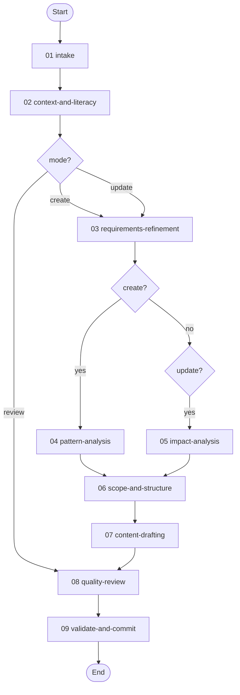

# Workflow Design Workflow

> v1.2.0 — Guides agents through creating, updating, or reviewing workflow definitions. In create/update modes, accepts a free-form user description and systematically elicits design details through sequential checkpoints. In review mode, audits an existing workflow against the 14 design principles and produces a compliance report.

---

## Overview

This workflow manages the complete lifecycle of workflow definition authoring through nine sequential activities, with three modes (create, update, review) that control which activities execute. All modes enforce schema expressiveness, convention conformance, and structural enforcement of critical constraints.

| # | Activity | Mode | Est. Time | Purpose |
|---|----------|------|-----------|---------|
| 01 | [**Intake**](activities/README.md#01-intake) | All | 5-10m | Accept description, classify mode, load target workflow |
| 02 | [**Context and Literacy**](activities/README.md#02-context-and-literacy) | All | 10-15m | Load schemas, read existing workflows, verify TOON format understanding |
| 03 | [**Requirements Refinement**](activities/README.md#03-requirements-refinement) | Create, Update | 15-30m | Elicit design details one question at a time (8 checkpoints) |
| 04 | [**Pattern Analysis**](activities/README.md#04-pattern-analysis) | Create only | 10-15m | Audit 2+ reference workflows for reusable patterns |
| 05 | [**Impact Analysis**](activities/README.md#05-impact-analysis) | Update only | 10-20m | Enumerate affected files, check integrity, flag removals |
| 06 | [**Scope and Structure**](activities/README.md#06-scope-and-structure) | Create, Update | 10-20m | Define file manifest, folder structure, implementation order |
| 07 | [**Content Drafting**](activities/README.md#07-content-drafting) | Create, Update | 30-60m | Draft each file with per-file approach and review checkpoints |
| 08 | [**Quality Review**](activities/README.md#08-quality-review) | All | 15-25m | Expressiveness, conformance, rule-to-structure, and anti-pattern audits |
| 09 | [**Validate and Commit**](activities/README.md#09-validate-and-commit) | All | 10-15m | Schema validation and commit (create/update) or save compliance report (review) |

**Detailed documentation:**

- **Activities:** See [activities/README.md](activities/README.md) for detailed per-activity documentation including steps, checkpoints, transitions, and mode overrides.
- **Skills:** See [skills/README.md](skills/README.md) for the full skill inventory (2 skills) with protocol flows and rules.
- **Resources:** See [resources/README.md](resources/README.md) for the resource index (5 resources) with usage context and cross-workflow access.

---

## Modes

| Mode | Activation | Description |
|------|------------|-------------|
| **Create** (default) | "create a workflow", "new workflow" | Build a new workflow from a free-form description |
| **Update** | "update workflow", "modify workflow" | Modify an existing workflow with content preservation checks |
| **Review** | "review workflow", "audit workflow" | Audit an existing workflow against design principles; produce compliance report |

---

## Workflow Flow



---

## Review Mode

Review mode audits an existing workflow against:

1. **Schema expressiveness** — flags prose that should be formal constructs
2. **Convention conformance** — checks naming, structure, and field ordering
3. **Rule-to-structure enforcement** — identifies critical rules lacking structural backing
4. **Anti-pattern scan** — checks all 23 prohibited patterns
5. **Schema validation** — validates every TOON file

The output is a severity-rated compliance report saved to `.engineering/artifacts/reviews/`. After review, the user can opt to fix issues (transitions to update mode) or accept the report as-is.

---

## Design Principles

This workflow encodes 14 design principles derived from analysis of 175+ historical workflow creation sessions. Each principle is backed by structural enforcement (checkpoints, conditions, validate actions) rather than relying on rule text alone.

| # | Principle | Enforcement |
|---|-----------|-------------|
| 1 | Internalize before producing | [Context and Literacy](activities/README.md#02-context-and-literacy) gate checkpoints |
| 2 | Define complete scope before execution | [Scope and Structure](activities/README.md#06-scope-and-structure) `scope-confirmed` checkpoint |
| 3 | One question at a time | [Requirements Refinement](activities/README.md#03-requirements-refinement) — 8 separate checkpoints |
| 4 | Maximize schema expressiveness | [Quality Review](activities/README.md#08-quality-review) `expressiveness-confirmed` checkpoint |
| 5 | Convention over invention | [Quality Review](activities/README.md#08-quality-review) `conformance-confirmed` checkpoint |
| 6 | Never modify upward | Schema validation on every TOON file |
| 7 | Confirm before irreversible changes | [Impact Analysis](activities/README.md#05-impact-analysis) checkpoints (update mode) |
| 8 | Corrections must persist | Cross-cutting: tracked throughout all activities |
| 9 | Modular over inline | [Quality Review](activities/README.md#08-quality-review) conformance check |
| 10 | Encode constraints as structure | [Quality Review](activities/README.md#08-quality-review) `enforcement-confirmed` checkpoint |
| 11 | Plan before acting | [Content Drafting](activities/README.md#07-content-drafting) `file-approach-confirmed` checkpoint |
| 12 | Non-destructive updates | [Content Drafting](activities/README.md#07-content-drafting) `preservation-check` checkpoint (update mode) |
| 13 | Format literacy before content | [Context and Literacy](activities/README.md#02-context-and-literacy) `format-literacy` checkpoint |
| 14 | Complete documentation structure | [Validate and Commit](activities/README.md#09-validate-and-commit) README generation/update |

---

## Skills

| # | Skill | Capability | Used By |
|---|-------|------------|---------|
| 00 | [`workflow-design`](skills/README.md#skill-protocol-workflow-design-00) | Design and draft workflow definitions maximizing schema expressiveness | All activities (primary) |
| 01 | [`toon-authoring`](skills/README.md#skill-protocol-toon-authoring-01) | Author syntactically valid TOON files that pass schema validation | Context and Literacy, Content Drafting, Validate and Commit (supporting) |

---

## Resources

| # | Resource | Purpose | Used By |
|---|----------|---------|---------|
| 00 | [Design Principles](resources/README.md#00--design-principles) | Condensed reference of all 14 principles | All activities |
| 01 | [Schema Construct Inventory](resources/README.md#01--schema-construct-inventory) | Prose-to-formal construct mapping tables | Quality Review, Content Drafting |
| 02 | [Anti-Patterns](resources/README.md#02--anti-patterns) | 23 prohibited patterns by category | Quality Review, Review Mode |
| 03 | [Update Mode Guide](resources/README.md#03--update-mode-guide) | Content preservation and impact analysis procedures | Update mode activities |
| 04 | [Review Mode Guide](resources/README.md#04--review-mode-guide) | Compliance audit procedure and report structure | Review mode activities |

---

## Variables

| Variable | Type | Description |
|----------|------|-------------|
| `planning_folder_path` | string | Path to the unique planning folder for this workflow execution |
| `is_update_mode` | boolean | Whether update mode is active |
| `is_review_mode` | boolean | Whether review mode is active |
| `target_workflow_id` | string | For update/review: existing workflow ID |
| `workflow_id` | string | ID of the workflow being created/updated |
| `format_literacy_confirmed` | boolean | Gates content drafting |
| `schema_constructs_confirmed` | boolean | Gates content drafting |
| `approach_confirmed` | boolean | Gates content drafting |
| `scope_manifest_confirmed` | boolean | Gates content drafting |
| `all_files_validated` | boolean | Gates commit |
| `review_findings_count` | number | Total compliance findings (review mode) |
| `user_wants_fixes` | boolean | Whether to fix issues after review |
| `scope_manifest` | array | Files to create/modify/remove |
| `current_file` | object | Current file in drafting loop |

---

## Output

**Create/Update modes:** A complete workflow file set in the `workflows/` worktree.

**Review mode:** A compliance report in `.engineering/artifacts/reviews/`.

---

## File Structure

```
workflows/workflow-design/
├── workflow.toon                          # Workflow definition (3 modes, 14 variables, 14 rules)
├── README.md                             # This file
├── activities/
│   ├── README.md                         # Per-activity documentation
│   ├── 01-intake.toon                    # Accept description, classify mode
│   ├── 02-context-and-literacy.toon      # Load schemas, verify format literacy
│   ├── 03-requirements-refinement.toon   # Elicit design details (8 checkpoints)
│   ├── 04-pattern-analysis.toon          # Audit reference workflows
│   ├── 05-impact-analysis.toon           # Impact analysis (update mode)
│   ├── 06-scope-and-structure.toon       # Define file manifest
│   ├── 07-content-drafting.toon          # Draft/modify files
│   ├── 08-quality-review.toon            # Three review passes
│   └── 09-validate-and-commit.toon       # Validate and commit
├── skills/
│   ├── README.md                         # Skill protocols and rules
│   ├── 00-workflow-design.toon           # Primary skill
│   └── 01-toon-authoring.toon            # Supporting skill
└── resources/
    ├── README.md                         # Resource index
    ├── 00-design-principles.md           # 14 principles reference
    ├── 01-schema-construct-inventory.md  # Construct mapping tables
    ├── 02-anti-patterns.md               # 23 anti-patterns
    ├── 03-update-mode-guide.md           # Update mode guide
    └── 04-review-mode-guide.md           # Review mode guide
```
