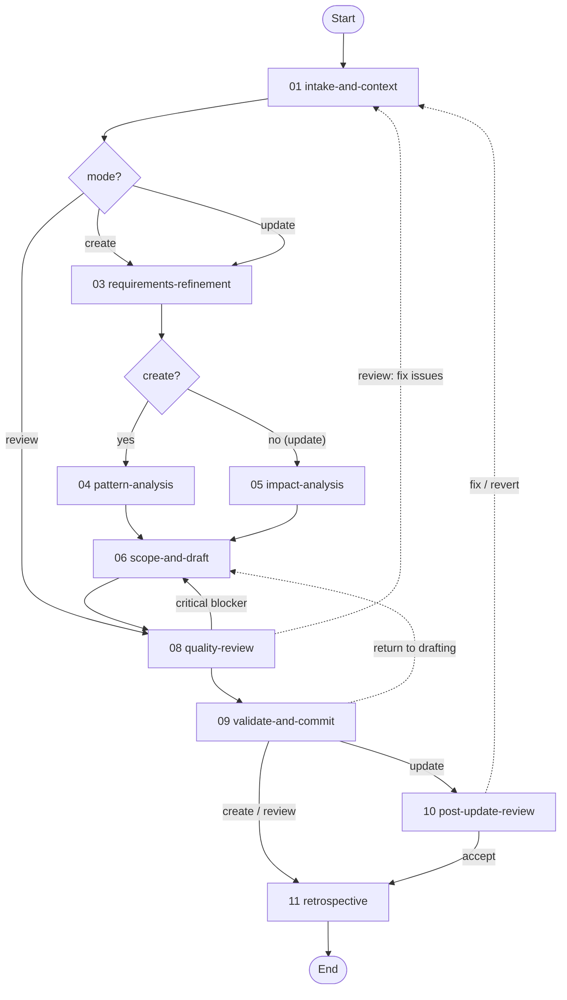

# Workflow Design Workflow

> v1.12.0 — Guides agents through creating, updating, or reviewing workflow definitions. In create/update modes, accepts a free-form user description and systematically elicits design details through sequential checkpoints. In review mode, audits one or more existing workflows against the 15 design principles and produces a compliance report.

---

## Overview

This workflow manages the complete lifecycle of workflow definition authoring through nine activities, with three modes (create, update, review) that control which activities execute. All modes enforce schema expressiveness, convention conformance, and structural enforcement of critical constraints. Activity `#` columns below match on-disk `NN-` file prefixes (gaps at 02/07 are intentional).

| # | Activity | Mode | Purpose |
|---|----------|------|---------|
| 01 | [**Intake and Context**](./activities/README.md#01-intake-and-context) | All | Classify create/update/review, set mode + target, internalize schemas and YAML format |
| 03 | [**Requirements Refinement**](./activities/README.md#03-requirements-refinement) | Create, Update | Elicit the spec one dimension at a time (forEach over the design dimensions), then surface, reconcile, and review the design assumptions |
| 04 | [**Pattern Analysis**](./activities/README.md#04-pattern-analysis) | Create only | Audit 2+ reference workflows for reusable patterns |
| 05 | [**Impact Analysis**](./activities/README.md#05-impact-analysis) | Update only | Enumerate affected files, check integrity, flag removals |
| 06 | [**Scope and Draft**](./activities/README.md#06-scope-and-draft) | Create, Update | Define file manifest, then draft and validate each file per-file |
| 08 | [**Quality Review**](./activities/README.md#08-quality-review) | All | Expressiveness, conformance, rule-hygiene, and rule-enforcement audits, then a bounded fix-revalidate loop (max 3) with a critical-blocker gate (full compliance audit in review mode; forEach over `target_workflow_ids`) |
| 09 | [**Validate and Commit**](./activities/README.md#09-validate-and-commit) | All | Schema validation, then commit on a feature branch + open a PR against `workflows` (create/update) or save the compliance report (review) |
| 10 | [**Post-Update Review**](./activities/README.md#10-post-update-review) | Update only | Automatic post-commit compliance audit of the updated workflow |
| 11 | [**Retrospective**](./activities/README.md#11-retrospective) | All | Record a completion summary (create/update) and conduct a session retrospective |

**Detailed documentation:**

- **Activities:** See [activities/README.md](./activities/README.md) for the per-activity orientation map (purpose, value, and how each activity connects in the flow), with links to the authoritative activity YAML files. The full step/checkpoint/transition definitions are served by `get_activity`.
- **Techniques:** See [techniques/](techniques/) for the full technique library (workflow-local standalone techniques plus the shared `TECHNIQUE.md` base contract) with protocol flows and rules.
- **Resources:** See [resources/README.md](./resources/README.md) for the resource index (10 resources) with usage context and cross-workflow access.

---

## Modes

| Mode | Activation | Description |
|------|------------|-------------|
| **Create** (default) | "create a workflow", "new workflow" | Build a new workflow from a free-form description |
| **Update** | "update workflow", "modify workflow" | Modify an existing workflow with content preservation checks; automatic post-commit compliance review |
| **Review** | "review workflow", "audit workflow" | Audit an existing workflow against design principles; produce compliance report |

---

## Workflow Flow



---

## Orchestration Model

Like the other workflows in this library, workflow-design runs under the **orchestrator/worker two-agent pattern** defined in the `meta` layer. An orchestrator loads the definition, initializes state, and dispatches one activity at a time to a worker, which executes the activity's steps, handles its checkpoints, and reports variable changes back; the orchestrator then evaluates transitions and dispatches the next activity. The worker persists across activities, carrying the accumulated design context (schemas internalized, patterns adopted, scope manifest, drafted files) rather than re-deriving it each step.

The roles, the dispatch protocol, and the checkpoint protocol are defined once in the `meta` layer — the [workflow-orchestrator-prompt](../meta/resources/workflow-orchestrator-prompt.md) and [activity-worker-prompt](../meta/resources/activity-worker-prompt.md) resources and the [workflow-engine](../meta/techniques/workflow-engine/TECHNIQUE.md) technique — and workflow-design inherits them unchanged.

---

## Review Mode

Review mode audits one or more existing workflows (`target_workflow_ids`, with each iteration binding `target_workflow_id`) against:

1. **Schema expressiveness** — flags prose that should be formal constructs
2. **Convention conformance** — checks naming, structure, and field ordering
3. **Rule-to-structure enforcement** — identifies critical rules lacking structural backing
4. **Anti-pattern scan** — checks all 82 prohibited patterns
5. **Schema validation** — validates every YAML file

The output is a severity-rated compliance report saved to the session's planning folder. After review, the user can opt to fix issues (transitions to update mode) or accept the report as-is.

---

## Design Principles

This workflow encodes 15 design principles derived from analysis of 175+ historical workflow creation sessions. Each principle is backed by structural enforcement (checkpoints, conditions, validate actions) rather than relying on rule text alone.

| # | Principle | Enforcement |
|---|-----------|-------------|
| 1 | Internalize before producing | [Intake and Context](./activities/README.md#01-intake-and-context) gate checkpoints |
| 2 | Define complete scope before execution | [Scope and Draft](./activities/README.md#06-scope-and-draft) `scope-and-structure-confirmed` checkpoint |
| 3 | One question at a time | [Requirements Refinement](./activities/README.md#03-requirements-refinement) — per-dimension elicitation, one batch `spec-confirmed` |
| 4 | Maximize schema expressiveness | [Quality Review](./activities/README.md#08-quality-review) `expressiveness-confirmed` checkpoint |
| 5 | Convention over invention | [Quality Review](./activities/README.md#08-quality-review) `conformance-confirmed` checkpoint |
| 6 | Never modify upward | Schema validation on every YAML file |
| 7 | Confirm before irreversible changes | [Impact Analysis](./activities/README.md#05-impact-analysis) `impact-and-preservation-confirmed` when removals are flagged (update mode) |
| 8 | Corrections must persist | Cross-cutting: tracked throughout all activities |
| 9 | Modular over inline | [Quality Review](./activities/README.md#08-quality-review) conformance check |
| 10 | Encode constraints as structure | [Quality Review](./activities/README.md#08-quality-review) `enforcement-confirmed` checkpoint |
| 11 | Plan before acting | [Scope and Draft](./activities/README.md#06-scope-and-draft) `file-approach-confirmed` checkpoint |
| 12 | Non-destructive updates | [Scope and Draft](./activities/README.md#06-scope-and-draft) `preservation-check` checkpoint (update mode) |
| 13 | Format literacy before content | [Intake and Context](./activities/README.md#01-intake-and-context) `format-literacy` checkpoint |
| 14 | Complete documentation structure | [Validate and Commit](./activities/README.md#09-validate-and-commit) README generation/update |
| 15 | Output economy | Single terminal `COMPLETE.md`; single-row logs; no vestigial marker steps |

---

## Techniques

The `techniques/` directory is a flat library of workflow-local standalone techniques (no group folders), plus a [`TECHNIQUE.md`](./techniques/TECHNIQUE.md) shared base contract inherited by all of them. Each activity step binds exactly one operation via `step.technique`. The cross-cutting meta [`variable-binding`](../meta/techniques/variable-binding.md) strategy technique is declared once at `workflow.techniques.activity` and inherited by every activity (injected into every `get_activity`), and commits go through meta [`version-control::commit-regular-files`](../meta/techniques/version-control/commit-regular-files.md). Planning-folder artifacts are managed cross-workflow through [`work-package::manage-artifacts`](../work-package/techniques/manage-artifacts/TECHNIQUE.md) — `create-readme` (seed the planning README at intake), `write-artifact` (numbered report artifacts), and `verify-readme-conforms` (drift check before commit). The design-assumption lifecycle reuses [`work-package::review-assumptions`](../work-package/techniques/review-assumptions/TECHNIQUE.md) cross-workflow (`collect`, `interview`, `record`), with a workflow-local `reconcile-design-assumptions` (audit-backed) in place of work-package's code-analysis reconcile, and a workflow-local `conduct-retrospective` for the session retrospective.

| Technique | Capability | Bound by |
|-----------|------------|----------|
| [`intake-classification`](./techniques/intake-classification.md) | Classify the request as create/update/review and set mode + target | Intake and Context |
| [`context-loading`](./techniques/context-loading.md) | Load schemas and survey existing workflows to internalize conventions | Intake and Context |
| [`derive-design-dimensions`](./techniques/derive-design-dimensions.md) | Derive the ordered design dimensions to elicit, per mode | Requirements Refinement |
| [`elicitation`](./techniques/elicitation.md) | Elicit a single design dimension — the per-iteration unit of the dimension-elicitation loop | Requirements Refinement |
| [`persist-design-specification`](./techniques/persist-design-specification.md) | Persist the elicited design specification for linked review at `spec-confirmed` | Requirements Refinement |
| [`reconcile-design-assumptions`](./techniques/reconcile-design-assumptions.md) | Autonomously resolve audit-resolvable design assumptions, leaving only genuine judgements open | Requirements Refinement |
| [`pattern-analysis`](./techniques/pattern-analysis.md) | Extract reusable structural and content patterns from reference workflows | Pattern Analysis |
| [`impact-analysis`](./techniques/impact-analysis.md) | Assess change impact on files, transitions, and references | Impact Analysis |
| [`scope-definition`](./techniques/scope-definition.md) | Enumerate the complete file manifest and structural design | Scope and Draft |
| [`present-file-approach`](./techniques/present-file-approach.md) | Present the per-file drafting approach before a file is written | Scope and Draft |
| [`present-for-review`](./techniques/present-for-review.md) | Present a drafted file for review and surface any unflagged removals | Scope and Draft |
| [`yaml-authoring`](./techniques/yaml-authoring.md) | Author syntactically valid YAML files that pass schema validation | Scope and Draft |
| [`audit-expressiveness`](./techniques/audit-expressiveness.md) | Flag prose that maps to formal schema constructs | Quality Review |
| [`audit-conformance`](./techniques/audit-conformance.md) | Check convention conformance against reference workflows | Quality Review |
| [`audit-rule-hygiene`](./techniques/audit-rule-hygiene.md) | Detect rule restatements, contradictions, duplications, prefix patterns | Quality Review |
| [`audit-rule-enforcement`](./techniques/audit-rule-enforcement.md) | Flag critical rules lacking structural enforcement | Quality Review |
| [`verify-high-findings`](./techniques/verify-high-findings.md) | Adversarially verify High findings and recalibrate severity before remediation | Quality Review |
| [`audit-principles`](./techniques/audit-principles.md) | Audit against the design principles (review mode) | Quality Review |
| [`audit-anti-patterns`](./techniques/audit-anti-patterns.md) | Scan for all prohibited patterns (review mode) | Quality Review |
| [`audit-schema-validation`](./techniques/audit-schema-validation.md) | Validate every YAML file against its schema | Quality Review, Validate and Commit |
| [`audit-consistency`](./techniques/audit-consistency.md) | Audit tool/technique/doc consistency (review mode) | Quality Review |
| [`compile-report`](./techniques/compile-report.md) | Compile the severity-rated compliance report (review mode) | Quality Review |
| [`reload-workflow`](./techniques/reload-workflow.md) | Reload the committed workflow from the server | Quality Review, Post-Update Review |
| [`scope-verification`](./techniques/scope-verification.md) | Verify every scope-manifest item is addressed | Validate and Commit |
| [`readme-authoring`](./techniques/readme-authoring.md) | Generate or update the workflow README set | Validate and Commit |
| [`commit-verification`](./techniques/commit-verification.md) | Verify the commit landed correctly | Validate and Commit |
| [`prepare-workflow-branch`](./techniques/prepare-workflow-branch.md) | Create/checkout the feature branch in the workflows repo before committing | Validate and Commit |
| [`publish-workflow-pr`](./techniques/publish-workflow-pr.md) | Push the branch and open/mark-ready a PR against the `workflows` branch | Validate and Commit |
| [`persist-report`](./techniques/persist-report.md) | Persist the compliance/review report as an artifact | Quality Review (review mode), Validate and Commit, Post-Update Review |
| [`run-audit-passes`](./techniques/run-audit-passes.md) | Run all audit passes against the committed workflow | Post-Update Review |
| [`summarize-findings`](./techniques/summarize-findings.md) | Produce a severity-rated findings summary | Post-Update Review |
| [`review-draft-yaml`](./techniques/review-draft-yaml.md) | Block-indexed review of the drafted YAML, capturing a draft attestation before the audit passes | Scope and Draft |
| [`apply-audit-fixes`](./techniques/apply-audit-fixes.md) | Apply selected audit findings via `yaml-authoring`, re-validating each changed file | Quality Review |
| [`scope-audit`](./techniques/scope-audit.md) | Audit the committed change set against the scope manifest for drift | Post-Update Review |
| [`create-completion-doc`](./techniques/create-completion-doc.md) | Record the `COMPLETE.md` completion summary in the planning folder | Retrospective |
| [`conduct-retrospective`](./techniques/conduct-retrospective.md) | Analyse non-checkpoint interactions and record a prioritized session retrospective | Retrospective |

---

## Resources

| Order | Resource | Purpose |
|---|----------|---------|
| 00 | [Design Principles](./resources/design-principles.md) | Condensed reference of all 15 principles |
| 01 | [Schema Construct Inventory](./resources/schema-construct-inventory.md) | Prose-to-formal construct mapping tables |
| 02 | [Anti-Patterns](./resources/anti-patterns.md) | 90 prohibited patterns by category |
| 03 | [Update Mode Guide](./resources/update-mode-guide.md) | Update-mode activation and key differences from create mode |
| 04 | [Review Mode Guide](./resources/review-mode-guide.md) | Compliance audit procedure and report structure |
| 05 | [Design Context README](./resources/design-context-readme.md) | Planning-folder README template seeded at intake |
| 06 | [Completion Artifact](./resources/completion-artifact.md) | `COMPLETE.md` completion-summary template |
| 07 | [Design Assumptions](./resources/design-assumptions.md) | Assumption categories + log template for the design-assumption lifecycle |
| 08 | [Design Assumption Reconciliation](./resources/design-assumption-reconciliation.md) | How audit passes reconcile design assumptions (vs code analysis) |
| 09 | [Elicitation Guide](./resources/elicitation-guide.md) | Per-dimension question bank for one-dimension-at-a-time elicitation |

---

## Outputs

In create and update modes the workflow seeds and maintains a **planning folder** under `.engineering/artifacts/planning/`: a `README.md` (from the [design-context-readme](./resources/design-context-readme.md) template) whose progress tracker is updated on completing each activity. In all modes, report artifacts are written into the planning folder as numbered files via [`work-package::manage-artifacts::write-artifact`](../work-package/techniques/manage-artifacts/write-artifact.md).

**Create mode:** A complete workflow file set committed on a feature branch in the workflows repo, with a pull request opened against the `workflows` branch, plus a planning folder.

**Update mode:** Modified workflow files committed on a feature branch with a pull request against the `workflows` branch, plus a post-update compliance snapshot in the planning folder.

**Review mode:** A compliance report committed in the planning folder.

Every mode ends with the [Retrospective](./activities/README.md#11-retrospective) activity, which records a session retrospective in the planning folder; create and update modes also produce a `COMPLETE.md` completion summary there.

---

## File Structure

```
workflows/workflow-design/
├── workflow.yaml                          # Workflow definition (variables, rules, inherited techniques)
├── README.md                             # This file
├── activities/
│   ├── README.md                         # Per-activity documentation
│   ├── 01-intake-and-context.yaml        # Classify mode + target, internalize schemas/format
│   ├── 03-requirements-refinement.yaml   # Elicit design details one question at a time
│   ├── 04-pattern-analysis.yaml          # Audit reference workflows (create only)
│   ├── 05-impact-analysis.yaml           # Impact analysis (update mode)
│   ├── 06-scope-and-draft.yaml           # Define file manifest, then draft/validate per file
│   ├── 08-quality-review.yaml            # Audit passes (full compliance audit in review mode)
│   ├── 09-validate-and-commit.yaml       # Validate and commit
│   ├── 10-post-update-review.yaml        # Post-commit compliance audit (update mode)
│   └── 11-retrospective.yaml             # Completion summary + session retrospective (terminal)
├── techniques/                           # Flat library of workflow-local standalone techniques
│   ├── TECHNIQUE.md                      # Workflow-root base contract (inherited by all techniques)
│   ├── intake-classification.md
│   ├── context-loading.md
│   ├── derive-design-dimensions.md
│   ├── elicitation.md
│   ├── pattern-analysis.md
│   ├── impact-analysis.md
│   ├── scope-definition.md
│   ├── present-file-approach.md
│   ├── present-for-review.md
│   ├── yaml-authoring.md
│   ├── scope-verification.md
│   ├── readme-authoring.md
│   ├── commit-verification.md
│   ├── reload-workflow.md
│   ├── persist-report.md
│   ├── compile-report.md
│   ├── run-audit-passes.md
│   ├── summarize-findings.md
│   ├── audit-principles.md
│   ├── audit-anti-patterns.md
│   ├── audit-schema-validation.md
│   ├── audit-consistency.md
│   ├── audit-expressiveness.md
│   ├── audit-conformance.md
│   ├── audit-rule-hygiene.md
│   ├── audit-rule-enforcement.md
│   ├── verify-high-findings.md
│   ├── review-draft-yaml.md
│   ├── apply-audit-fixes.md
│   ├── scope-audit.md
│   ├── create-completion-doc.md
│   ├── conduct-retrospective.md
│   ├── reconcile-design-assumptions.md
│   ├── prepare-workflow-branch.md
│   └── publish-workflow-pr.md
└── resources/
    ├── README.md                         # Resource index
    ├── design-principles.md              # 15 principles reference
    ├── schema-construct-inventory.md     # Construct mapping tables
    ├── anti-patterns.md                  # 90 anti-patterns
    ├── update-mode-guide.md              # Update mode guide
    ├── review-mode-guide.md              # Review mode guide
    ├── design-context-readme.md          # Planning-folder README template
    ├── completion-artifact.md            # COMPLETE.md completion-summary template
    ├── design-assumptions.md             # Assumption categories + log template
    ├── design-assumption-reconciliation.md  # Audit-based reconciliation guide
    └── elicitation-guide.md              # Per-dimension question bank
```
