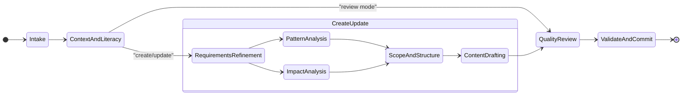

# Workflow Design Workflow

Guides agents through creating, updating, or reviewing workflow definitions. In create/update modes, accepts a free-form user description and systematically elicits design details through sequential checkpoints. In review mode, audits an existing workflow against the 13 design principles and produces a compliance report. All modes enforce schema expressiveness, convention conformance, and structural enforcement of critical constraints.

## Modes

| Mode | Activation | Description |
|------|------------|-------------|
| **Create** (default) | "create a workflow", "new workflow" | Build a new workflow from a free-form description |
| **Update** | "update workflow", "modify workflow" | Modify an existing workflow with content preservation checks |
| **Review** | "review workflow", "audit workflow" | Audit an existing workflow against design principles; produce compliance report |

## Activity Sequence

| # | Activity | Mode | Est. Time | Purpose |
|---|----------|------|-----------|---------|
| 01 | Intake | All | 5-10m | Accept description, classify mode, load target workflow |
| 02 | Context and Literacy | All | 10-15m | Load schemas, read existing workflows, verify TOON format understanding |
| 03 | Requirements Refinement | Create, Update | 15-30m | Elicit design details one question at a time (8 checkpoints) |
| 04 | Pattern Analysis | Create only | 10-15m | Audit 2+ reference workflows for reusable patterns |
| 05 | Impact Analysis | Update only | 10-20m | Enumerate affected files, check integrity, flag removals |
| 06 | Scope and Structure | Create, Update | 10-20m | Define file manifest, folder structure, implementation order |
| 07 | Content Drafting | Create, Update | 30-60m | Draft each file with per-file approach and review checkpoints |
| 08 | Quality Review | All | 15-25m | Expressiveness, conformance, rule-to-structure, and anti-pattern audits |
| 09 | Validate and Commit | All | 10-15m | Schema validation and commit (create/update) or save compliance report (review) |

## Review Mode

Review mode audits an existing workflow against:

1. **Schema expressiveness** — flags prose that should be formal constructs
2. **Convention conformance** — checks naming, structure, and field ordering
3. **Rule-to-structure enforcement** — identifies critical rules lacking structural backing
4. **Anti-pattern scan** — checks all 23 prohibited patterns
5. **Schema validation** — validates every TOON file

The output is a severity-rated compliance report saved to `.engineering/artifacts/reviews/`. After review, the user can opt to fix issues (transitions to update mode) or accept the report as-is.

## Design Principles

This workflow encodes 13 design principles derived from analysis of 175+ historical workflow creation sessions. Each principle is backed by structural enforcement (checkpoints, conditions, validate actions) rather than relying on rule text alone.

| # | Principle | Enforcement |
|---|-----------|-------------|
| 1 | Internalize before producing | Context-and-literacy gate checkpoints |
| 2 | Define complete scope before execution | Scope-confirmed checkpoint gates content drafting |
| 3 | One question at a time | 8 separate checkpoints in requirements refinement |
| 4 | Maximize schema expressiveness | Expressiveness review in quality review |
| 5 | Convention over invention | Conformance review in quality review |
| 6 | Never modify upward | Schema validation on every TOON file |
| 7 | Confirm before irreversible changes | Impact analysis checkpoints (update mode) |
| 8 | Corrections must persist | Cross-cutting: tracked throughout all activities |
| 9 | Modular over inline | Conformance check flags inline content |
| 10 | Encode constraints as structure | Rule-to-structure audit in quality review |
| 11 | Plan before acting | Approach checkpoint before each file |
| 12 | Non-destructive updates | Preservation checkpoints (update mode) |
| 13 | Format literacy before content | Format-literacy checkpoint gates content drafting |

## Resources

| # | Resource | Purpose |
|---|----------|---------|
| 00 | Design principles | Condensed reference of all 13 principles |
| 01 | Schema construct inventory | Prose-to-formal construct mapping tables |
| 02 | Anti-patterns | 23 prohibited patterns by category |
| 03 | Update mode guide | Content preservation and impact analysis procedures |
| 04 | Review mode guide | Compliance audit procedure and report structure |

## Skills

| # | Skill | Purpose |
|---|-------|---------|
| 00 | workflow-design | Primary: design principles, construct inventory, quality checklist |
| 01 | toon-authoring | Supporting: TOON format rules, validation patterns |

## Output

**Create/Update modes:** A complete workflow file set in the `workflows/` worktree.

**Review mode:** A compliance report in `.engineering/artifacts/reviews/`.
